# R 版 6：模型选择与偏差-方差权衡 📊

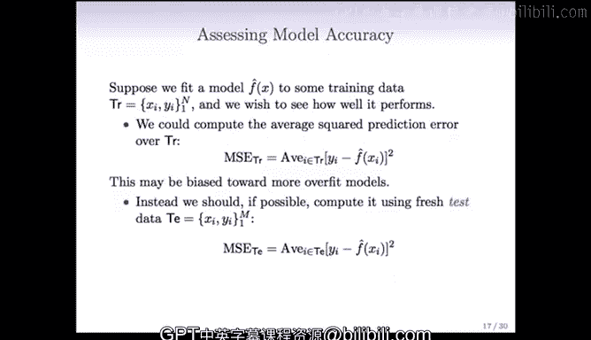

在本节课中，我们将要学习如何评估和选择统计学习模型。我们将探讨模型准确性的衡量方法，并深入理解一个核心概念：**偏差-方差权衡**。这是决定模型复杂度的关键。

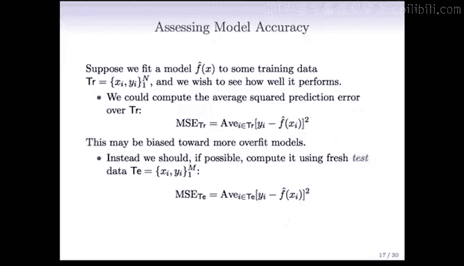

---


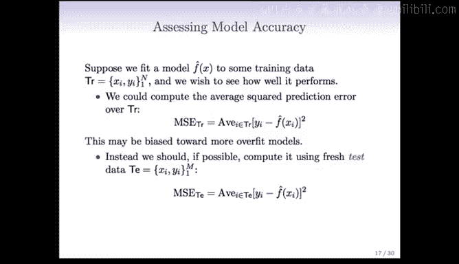

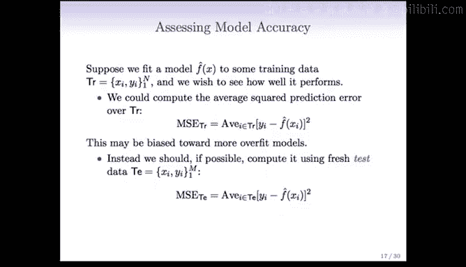

## 概述：为何需要模型选择？

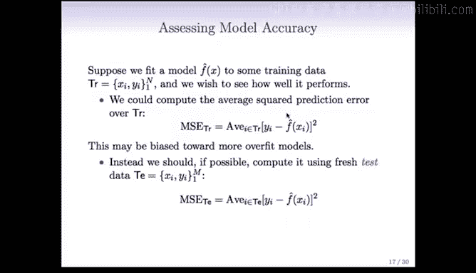

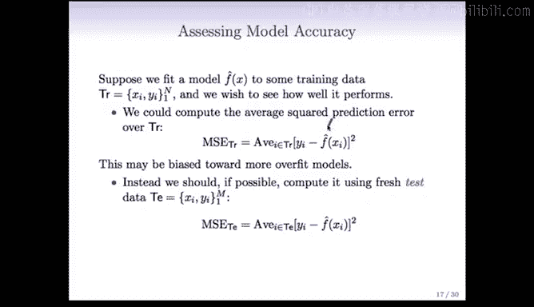

我们已经见过多种模型，从简单易解释的线性模型，到更复杂的模型如K近邻和薄板样条。我们需要一种方法来评估这些模型的准确性，判断模型是否足够好，以及是否有改进空间。

上一节我们介绍了不同的模型类型，本节中我们来看看如何评估它们的性能。

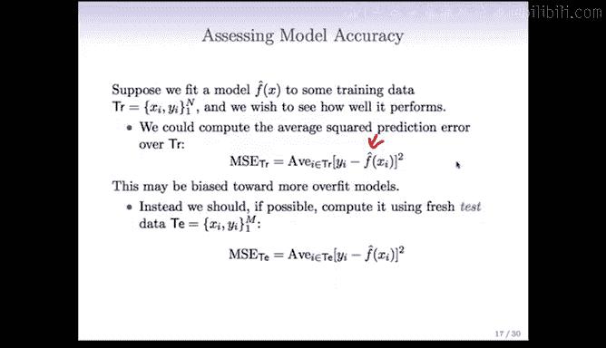

---

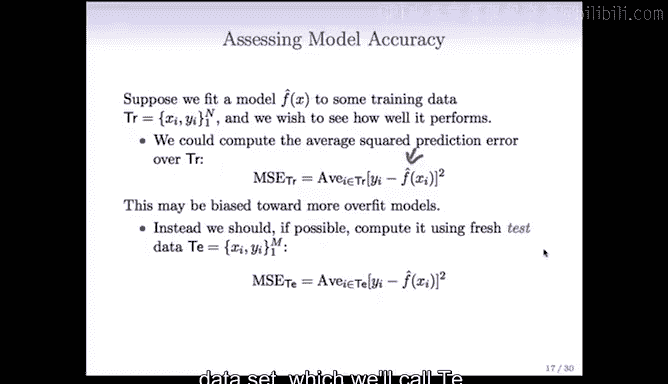

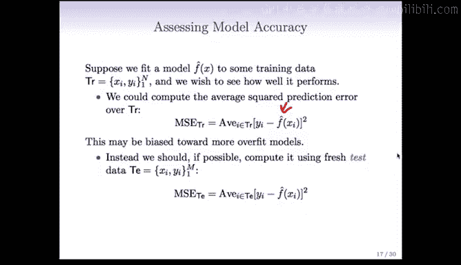

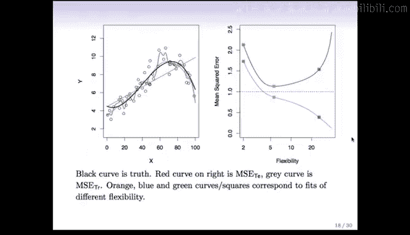

## 模型准确性评估

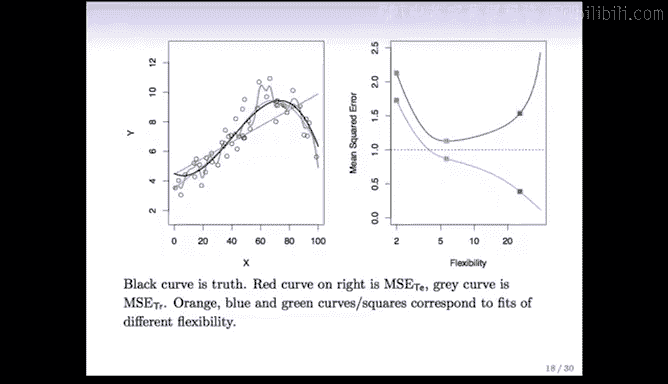

假设我们有一个模型 `F_hat(x)`，它是基于训练数据 `TR` 拟合得到的。训练数据包含 `n` 个数据对 `(X_i, Y_i)`，其中 `X_i` 是第 `i` 个观测值（可能是一个向量），`Y_i` 通常是标量响应值。

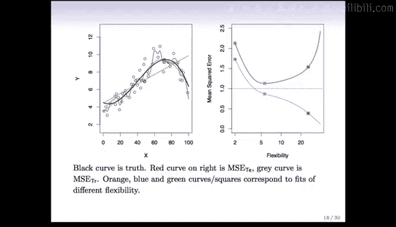

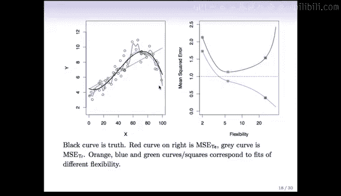

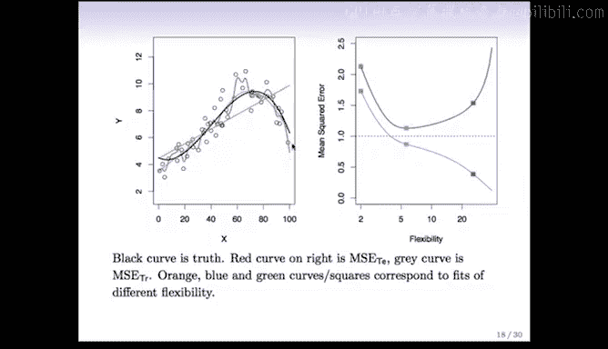

### 训练误差与测试误差

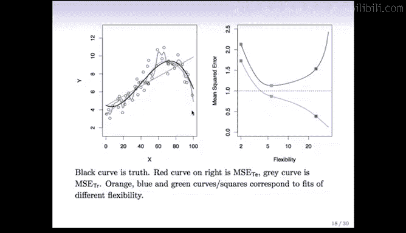

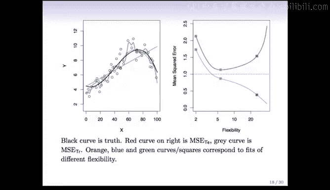

评估模型性能的一个直接想法是计算模型在训练数据上的平均预测误差。

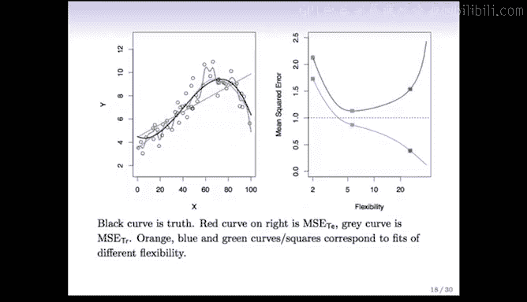

**训练均方误差** 公式如下：
```
MSE_train = (1/n) * Σ (Y_i - F_hat(X_i))^2
```

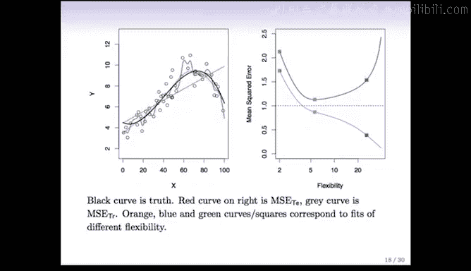

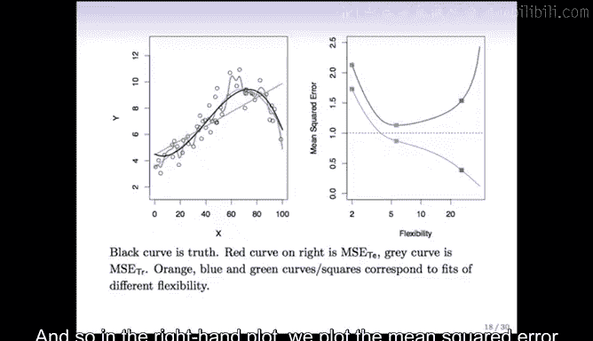

然而，这个指标可能偏向于更复杂的过拟合模型。例如，一个足够灵活的样条模型可以使训练误差降为0，但这并不意味着它在未见过的数据上表现良好。

因此，更好的做法是使用一个独立的**测试数据集** `TE`（包含 `m` 个数据对）来计算**测试均方误差**：
```
MSE_test = (1/m) * Σ (Y_i - F_hat(X_i))^2
```
测试误差能更好地反映模型的泛化性能。

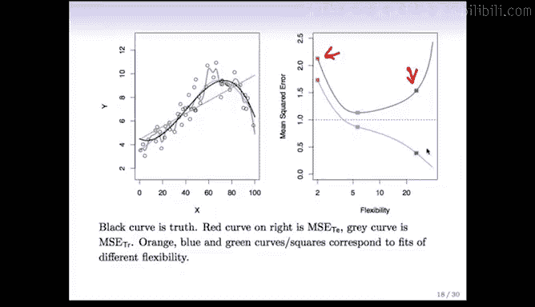

---

## 模型复杂度与误差的直观演示

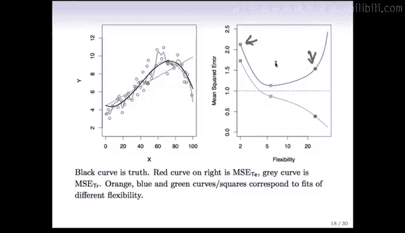

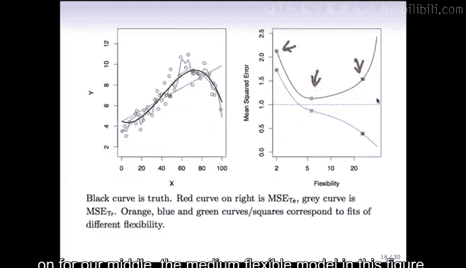

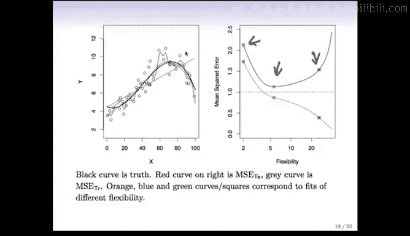

为了更直观地理解，我们来看几个一维函数拟合的例子。以下是三个不同复杂度模型在模拟数据上的表现：

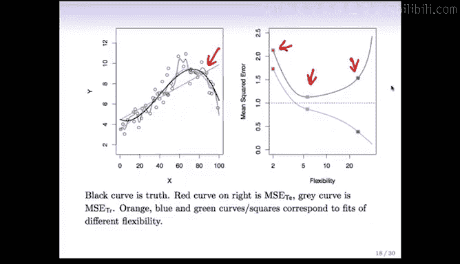

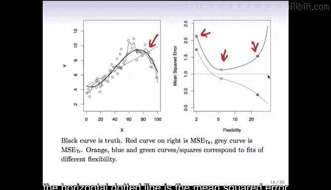

*   **左图**：展示了真实的生成函数（黑色曲线）、带有噪声的数据点，以及三个拟合模型（橙色-线性、蓝色-中等灵活样条、绿色-高度灵活样条）。
*   **右图**：绘制了模型复杂度增加时，训练误差（灰色曲线）和测试误差（红色曲线）的变化。

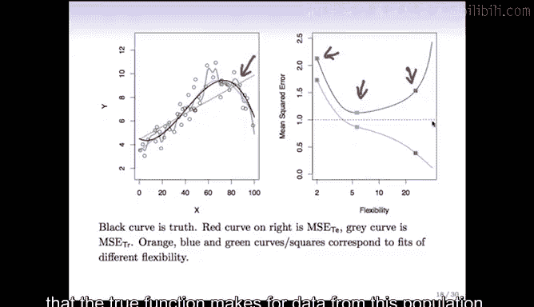

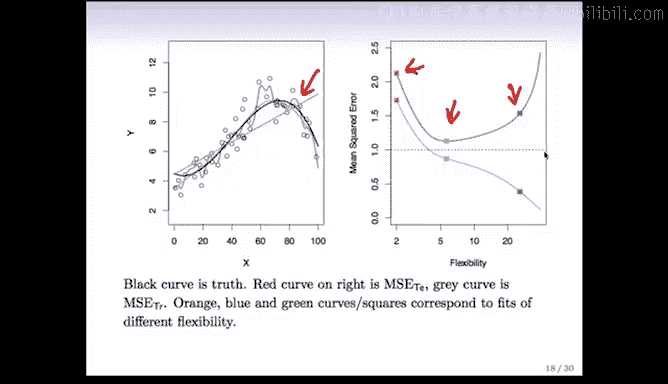

以下是关键观察结果：

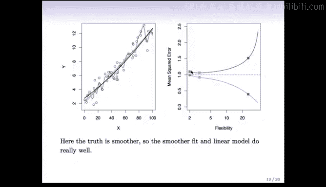

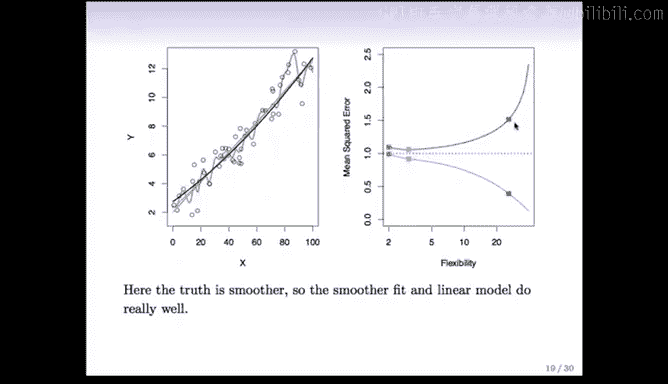

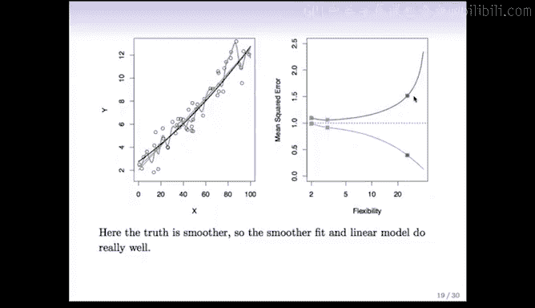

1.  **训练误差**：随着模型复杂度增加，训练误差持续下降。最灵活的模型可以几乎完美拟合训练数据。
2.  **测试误差**：呈现U形曲线。开始时，随着模型复杂度增加，测试误差下降；但超过某个“最佳点”后，测试误差反而开始上升，这是因为模型开始过度拟合训练数据中的噪声。
3.  **最佳模型**：测试误差曲线的最低点对应着泛化能力最佳的模型复杂度。在上述第一个例子中，中等灵活的蓝色模型接近这个最佳点。
4.  **不可约误差**：图中水平虚线代表了即使使用真实函数进行预测也会产生的误差，这被称为**不可约误差**，来源于数据本身的随机噪声 `ε` 的方差 `Var(ε)`。

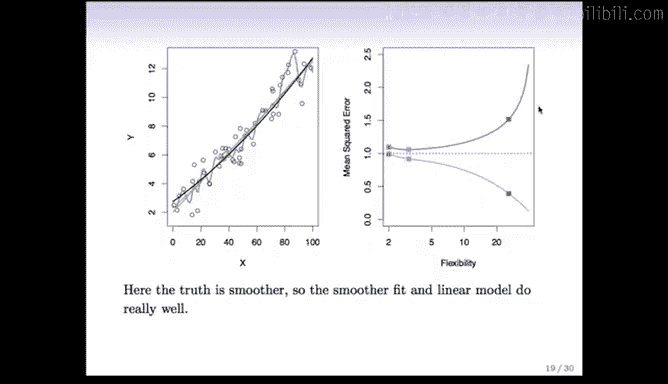

另外两个例子进一步说明了这一点：当真函数非常平滑时，简单线性模型表现就很好；当真函数本身波动很大时，则需要更灵活的模型来捕捉其结构。但无论如何，训练误差都会持续下降，而测试误差总会呈现U形。


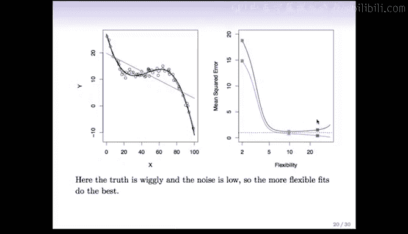

---

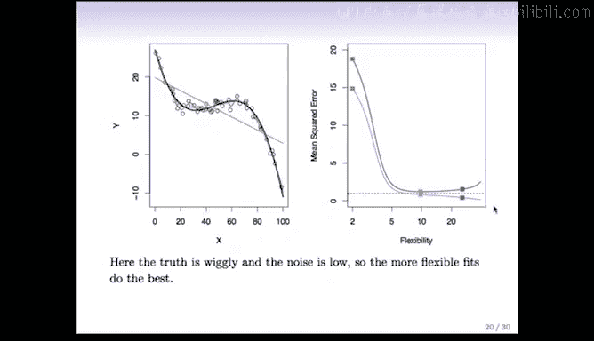

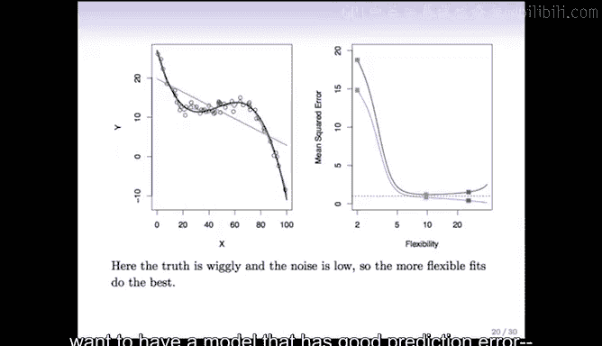

## 偏差-方差分解：理解U形曲线的根源

测试误差的U形曲线行为可以通过**偏差-方差分解**来从理论上解释。这有助于我们理解模型选择背后的权衡。

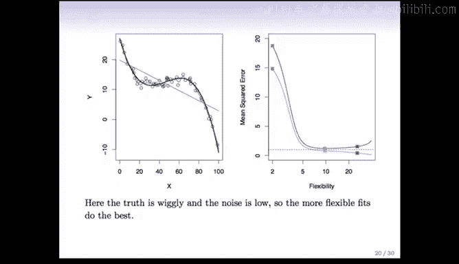

考虑在一个新的测试点 `(x0, y0)` 上评估我们的模型 `F_hat`。假设真实模型是 `f(x)`。我们关心的是模型在 `x0` 处的预测 `F_hat(x0)` 与真实观测值 `y0` 之间的期望平方误差。这个期望同时考虑了新测试点 `y0` 的随机性，以及用于构建 `F_hat` 的训练数据的随机性。

可以证明，这个**期望测试均方误差**可以精确地分解为以下三项之和：
```
E[(y0 - F_hat(x0))^2] = Var(ε) + [Bias(F_hat(x0))]^2 + Var(F_hat(x0))
```

让我们来理解这三个部分：

1.  **`Var(ε)`**：**不可约误差**。这是数据中固有噪声的方差，无论模型多好都无法消除。
2.  **`[Bias(F_hat(x0))]^2`**：**偏差的平方**。偏差衡量的是模型 `F_hat` 的平均预测（在所有可能训练集上的平均）与真实值 `f(x0)` 之间的差异。高偏差意味着模型过于简单，无法捕捉数据的基本结构（欠拟合）。
3.  **`Var(F_hat(x0))`**：**方差**。方差衡量的是模型 `F_hat` 的预测对于不同训练集的敏感程度。高方差意味着模型过于复杂，过度拟合了训练数据中的随机噪声（过拟合）。

### 偏差-方差权衡

模型复杂度直接影响偏差和方差：
*   当模型**灵活性低（简单）**时，**偏差高，方差低**。模型预测变化不大，但系统性偏离真实值。
*   当模型**灵活性高（复杂）**时，**偏差低，方差高**。模型平均上更接近真实值，但对训练数据的具体细节非常敏感，预测波动大。

**选择模型复杂度，本质上就是在偏差和方差之间进行权衡**。我们的目标是找到使总误差（偏差² + 方差）最小的“甜蜜点”，这对应着测试误差U形曲线的最低点。

课程中展示的分解图清晰地印证了这一点：测试误差（红色曲线）是偏差平方（下降部分）和方差（上升部分）之和，共同形成了U形。

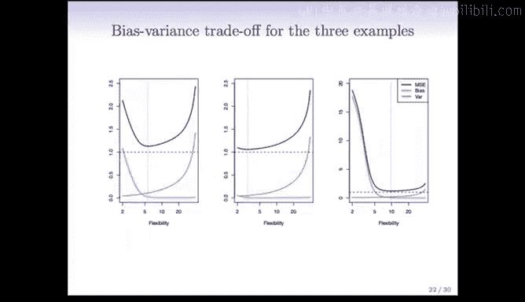

---

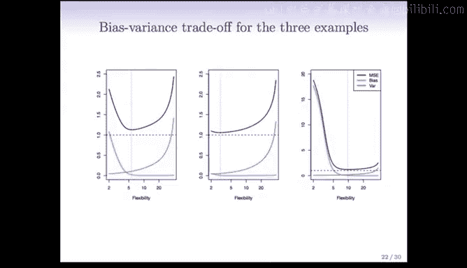

## 总结与过渡

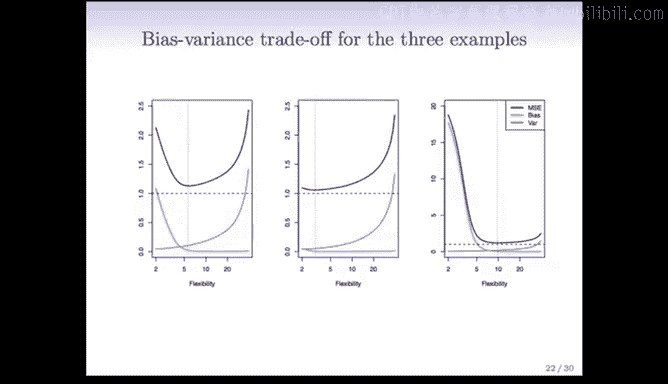

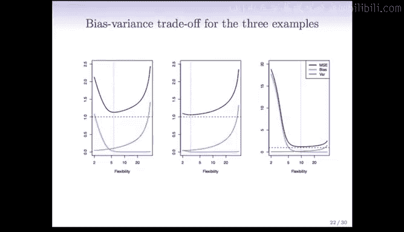

本节课中我们一起学习了模型评估与选择的核心思想。

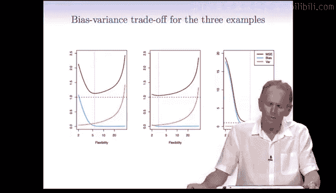

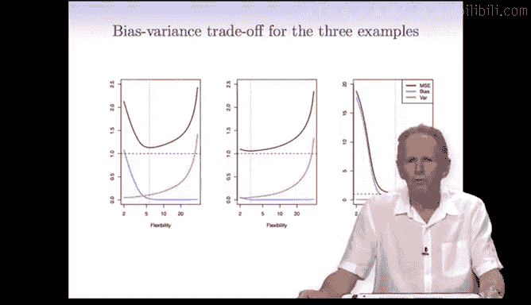

我们了解到，仅依赖训练误差选择模型会导致过拟合。使用独立的测试误差是评估模型泛化能力的更好标准。测试误差随模型复杂度变化呈现U形曲线，其理论根源在于**偏差-方差权衡**：简单模型偏差高、方差低；复杂模型偏差低、方差高。最优模型复杂度是两者之和最小的平衡点。


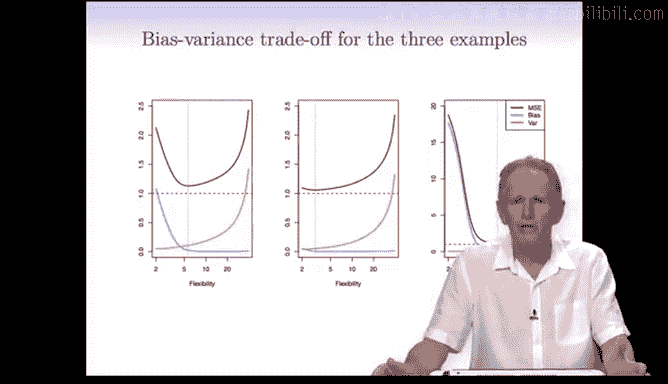

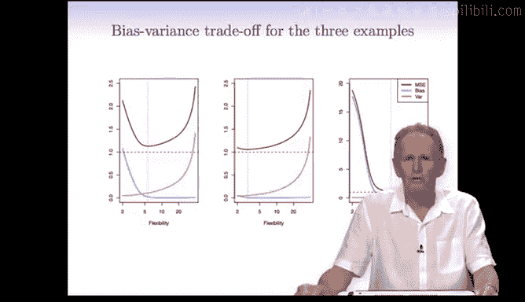

为了在实践中进行模型选择，我们需要方法来估计这个测试误差曲线，例如使用验证集或交叉验证，这将在后续课程中讨论。

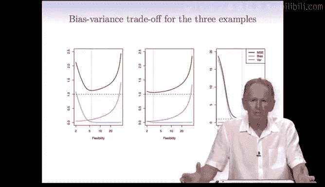

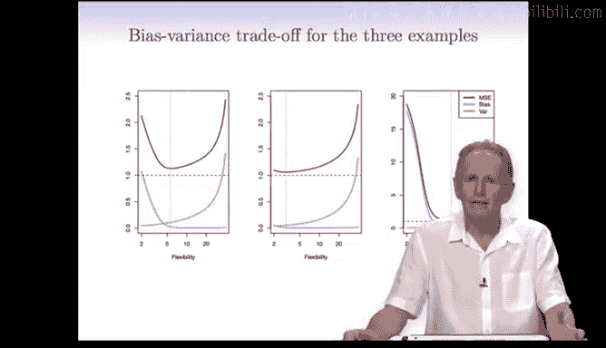

现在，我们一直在回归问题的背景下讨论这些概念。在下一节中，我们将看看所有这些原理如何应用于分类问题。