# R 版 7：2.4 分类问题 📊

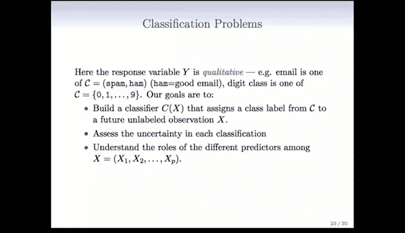

在本节课中，我们将要学习统计学习中的分类问题。我们将从回归问题转向分类问题，了解定性响应变量的处理方法，并重点介绍一种强大的分类工具——K最近邻分类器。

---

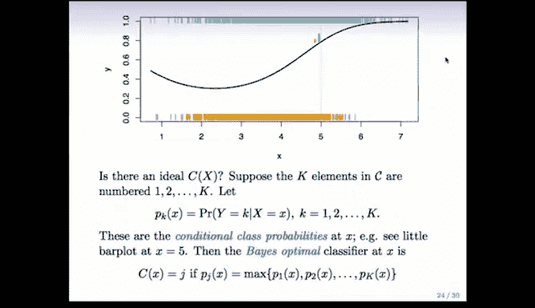

## 从回归到分类 🔄

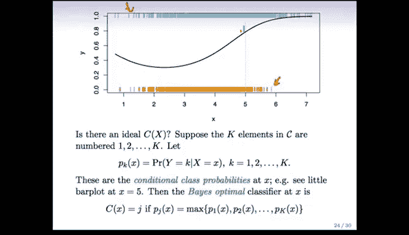

上一节我们介绍了如何为定量响应变量估计回归函数并进行模型选择。本节中，我们来看看分类问题。分类问题的响应变量是**定性变量**，例如：
*   电子邮件属于“垃圾邮件”或“正常邮件”两类。
*   手写数字识别属于0到9这十个类别之一。

我们的目标也因此有所不同。在分类中，我们的目标是：
1.  构建一个分类器 **C(X)**，为新的、未标记的观测值 **X**（一个特征向量）分配一个来自类别集合 **C** 的类别标签。
2.  评估每次分类的不确定性。
3.  理解不同预测变量 **X** 在构建分类器中的作用。

---

## 一个模拟示例 📈

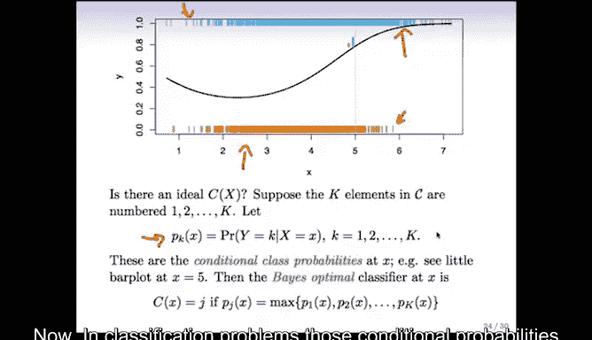

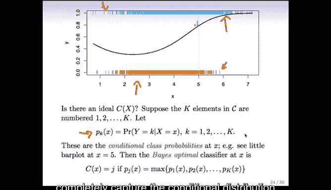

为了与定量响应问题的讨论并行，我们构建一个简单的模拟示例。

我们有一个预测变量 **X** 和一个响应变量 **Y**。**Y** 取两个值，在本例中编码为0和1。我们从总体中抽取了大量样本。

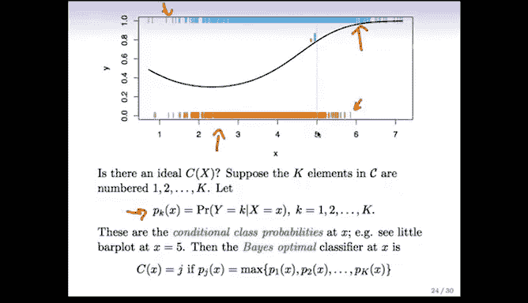

下图展示了数据分布，每个垂直条代表一个观测值（橙色为0，蓝色为1）。图中还绘制了一条黑色曲线，它代表了生成这些数据时，**Y=1** 的真实条件概率 **P(Y=1|X)**。在高 **X** 值区域，**Y=1** 的概率接近90%，因此我们看到更多的蓝色点（1）；在低 **X** 值区域，**Y=1** 的概率较低，因此橙色点（0）更密集。

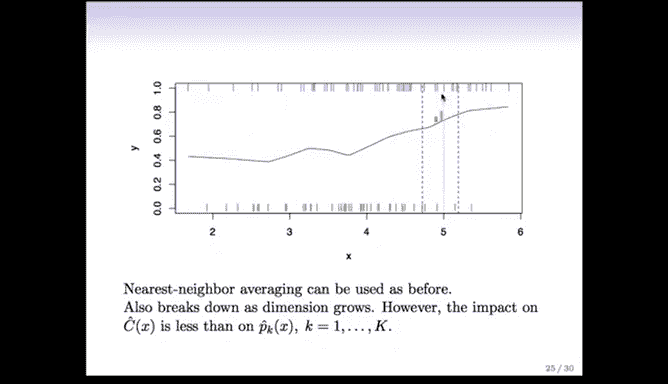

---

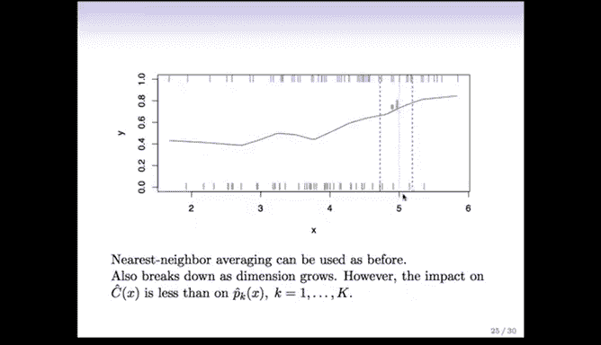

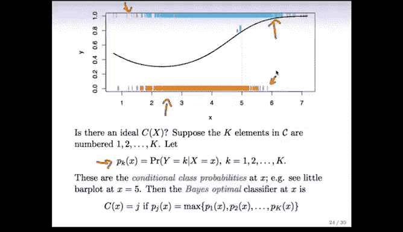

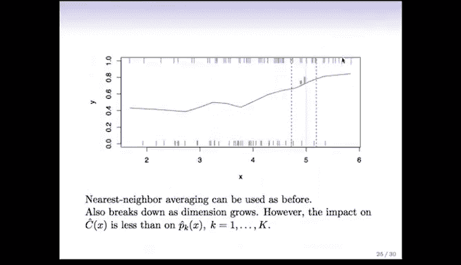

## 理想分类器：贝叶斯分类器 🏆

我们首先定义条件概率 **p_k(x)**：
**p_k(x) = P(Y = k | X = x)**
对于有 **K** 个类别的问题，就有 **K** 个这样的条件概率。这些概率完全刻画了给定 **X** 时 **Y** 的条件分布。

这些条件概率也引出了**理想分类器**，即**贝叶斯最优分类器**。它的规则是：在给定点 **x** 处，将观测值分类到条件概率最大的那个类别。
**C(x) = argmax_k p_k(x)**
这很直观：在任何一个点，我们都应该将其分到“大多数”样本所属的类别，以最小化错误。

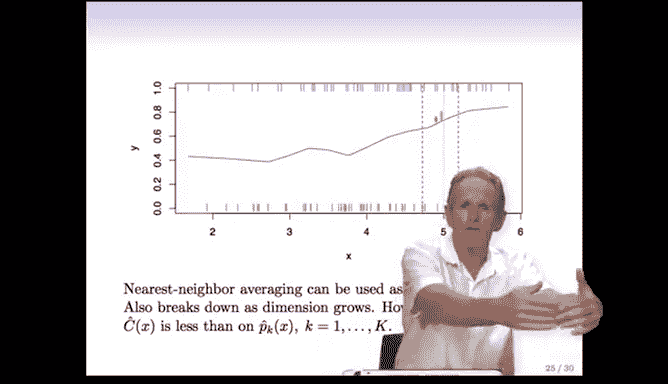

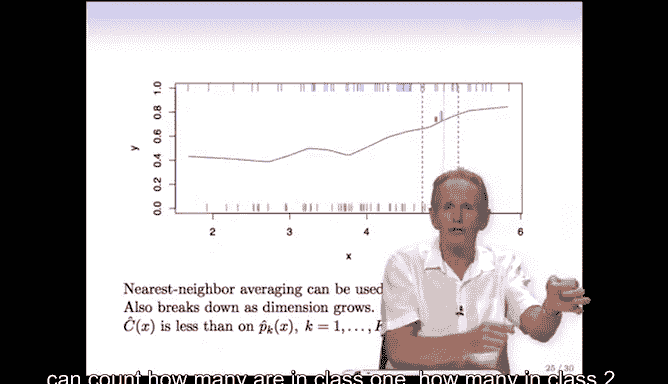

在下图中，在 **X=0.5** 处，**Y=1** 的概率约为80%，**Y=0** 的概率约为20%。因此，贝叶斯分类器会将该点分类为1。

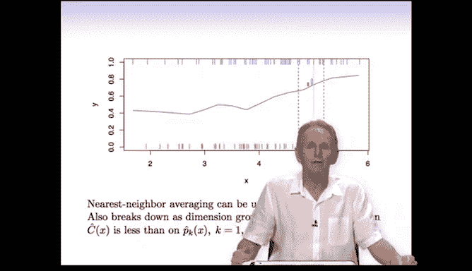

---

## 从理论到实践：K最近邻方法 🛠️

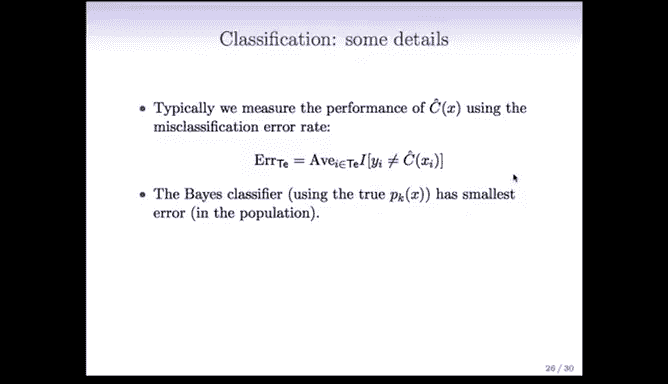

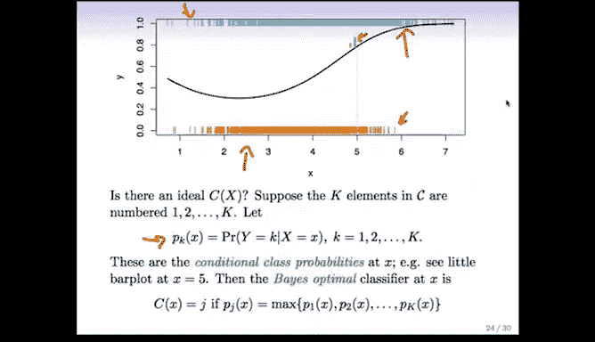

在实际中，我们无法获知真实的总体概率。与回归问题类似，我们可以使用**K最近邻**方法来估计这些概率。

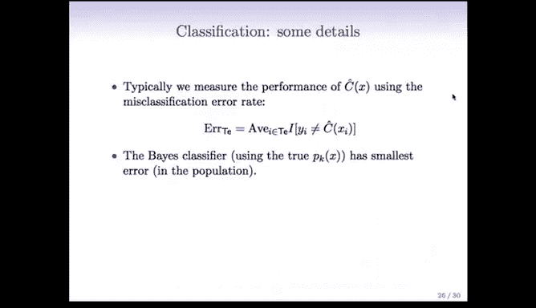

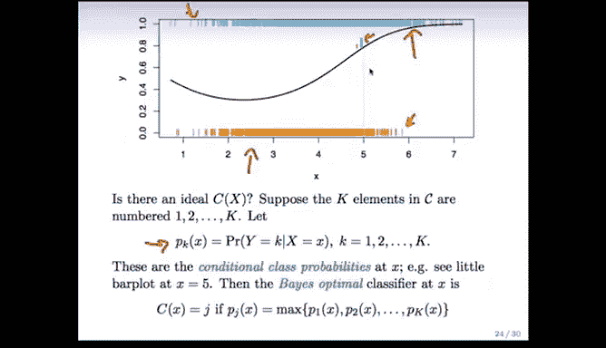

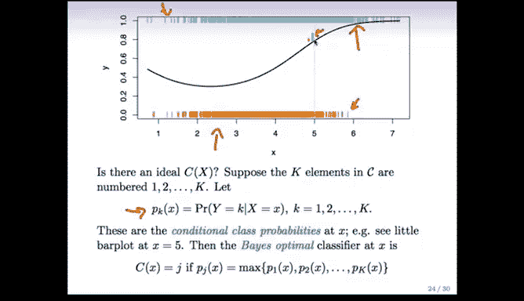

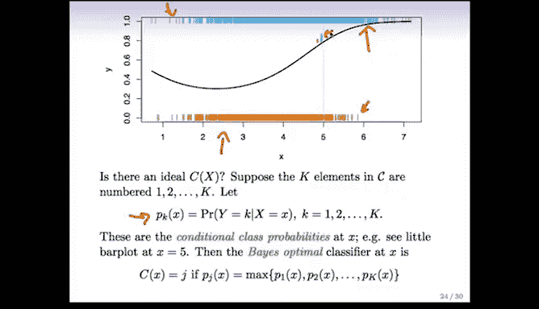

假设我们只有100个数据点（如下图）。在 **X=0.5** 处，我们可能只有一个观测值。为了估计该点的条件概率，我们设定一个邻域（例如包含10%的数据点），然后计算该邻域内属于各个类别的样本比例，以此作为条件概率的估计。

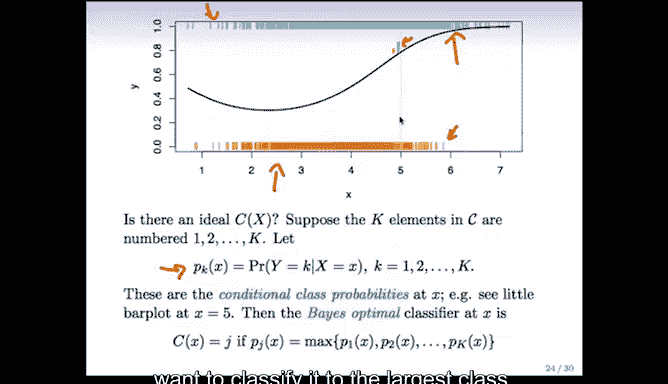

这个过程可以自然地推广到多维空间。例如，有两个预测变量 **X1** 和 **X2**。对于一个需要分类的新观测点，我们在其特征空间中划定一个圆形（或超球形）邻域，收集落在该邻域内的训练样本，然后根据这些邻居中多数样本的类别来进行分类。

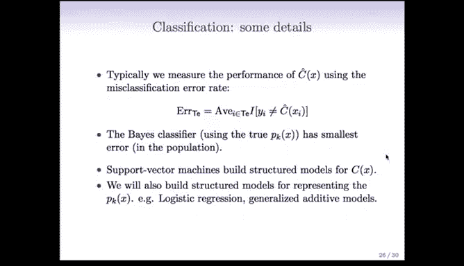

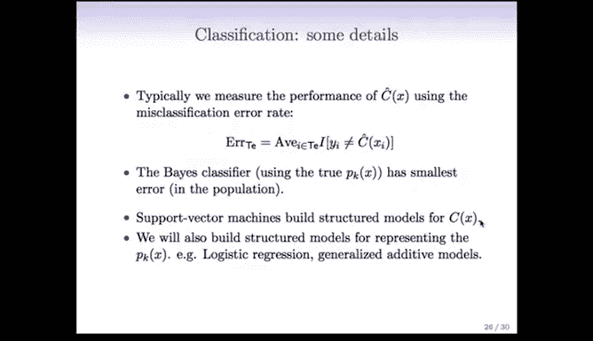

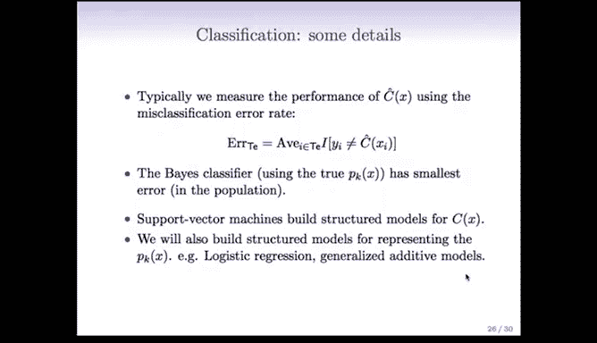

然而，K最近邻方法同样面临**维数灾难**的挑战。当特征维度很高时，为了捕捉到足够多的邻居点，邻域半径必须变得非常大，导致估计不再具有“局部”性，效果变差。

---

## 评估分类器：误分类误差率 📉

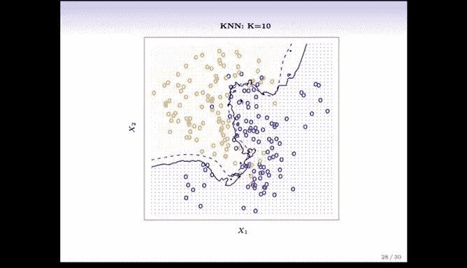

我们通常使用**误分类误差率**来评估分类器的性能。在测试数据集上，误差率就是平均犯错的次数：
**Test Error = (1/n_test) * Σ I(Ĉ(x_i) ≠ y_i)**
其中 **I(·)** 是指示函数，当预测类别 **Ĉ(x_i)** 不等于真实类别 **y_i** 时取值为1。

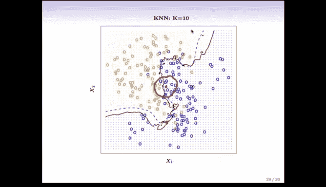

贝叶斯最优分类器在总体中具有最小的误分类误差率。在我们之前的例子中，在 **X=0.5** 处，由于真实概率是80% vs 20%，分类到类别1将在80%的情况下正确，错误率为20%，这是可能达到的最佳水平。

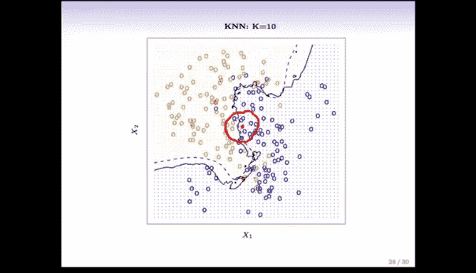

---

## 二维示例与K值的选择 🎯

让我们看一个二维空间的K最近邻分类示例。下图展示了数据的真实分布和**贝叶斯决策边界**（紫色虚线），这条边界是两类条件概率相等的点的集合。

当我们使用 **K=10** 的最近邻方法时，通过在每个点估计邻域内的类别比例，我们可以得到一条估计的决策边界（黑色曲线）。尽管有些波动，但它能较好地逼近真实的贝叶斯边界。

**K值的选择是一个关键的调优参数：**
*   **K=1（最近邻分类器）**：决策边界非常复杂、锯齿状，甚至会产生孤立的分类区域（如下图）。它对训练数据拟合得非常好（训练误差低），但容易过拟合，对噪声敏感。
    
*   **K值很大（例如K=100）**：决策边界变得非常平滑，近乎线性。它可能无法捕捉到数据中复杂的模式，导致欠拟合。
*   **K值适中（例如K=10）**：通常能在偏差和方差之间取得较好的平衡，较好地近似真实决策边界。

下图展示了误分类误差率随 **1/K**（复杂度指标，值越大表示K越小，模型越复杂）变化的典型曲线：
*   **训练误差**（黑色）：随着模型复杂度增加（K减小），训练误差持续下降。
*   **测试误差**（红色）：呈现U形。当K太小（模型太复杂）时，过拟合导致测试误差很高；当K太大（模型太简单）时，欠拟合导致测试误差也很高；存在一个最优的K值使得测试误差最小。
*   **贝叶斯误差**（水平虚线）：这是理论上可能达到的最低误差，我们的模型目标就是尽可能接近它。

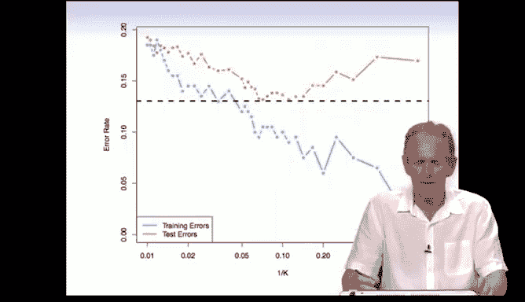

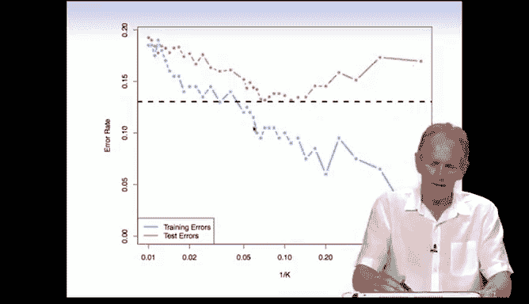

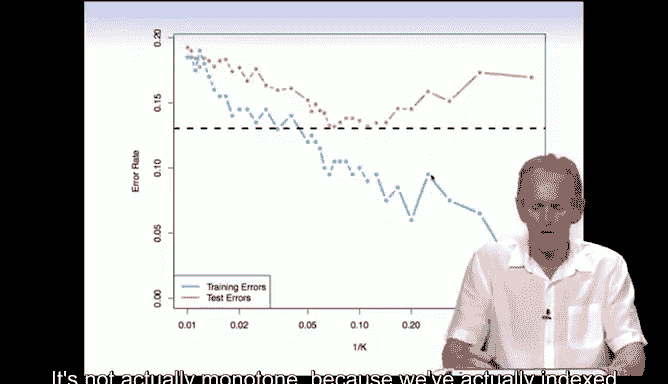

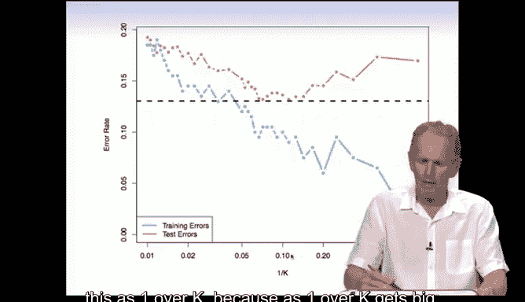

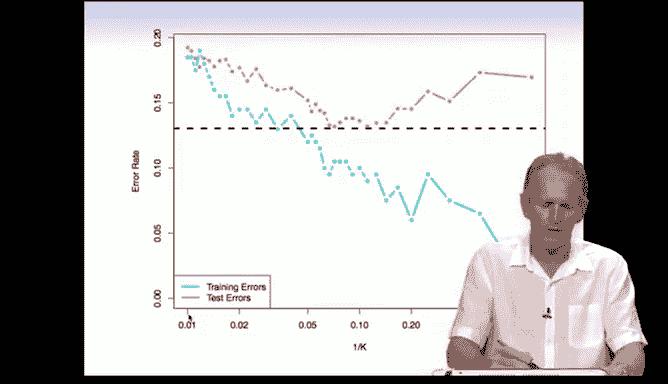

因此，我们需要通过**验证集**或**交叉验证**来选择使测试误差最小的K值。

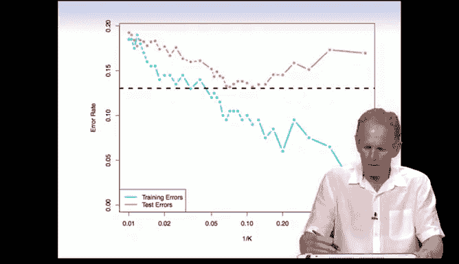

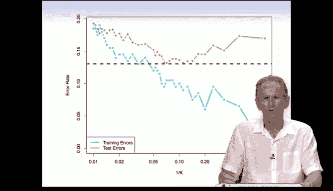

---

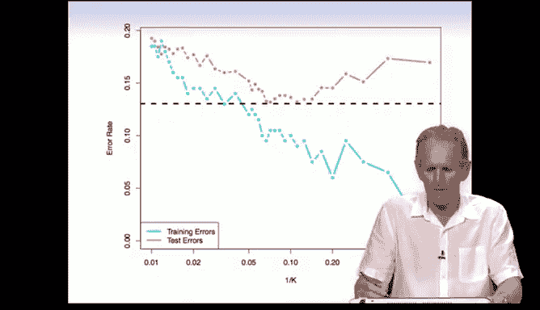

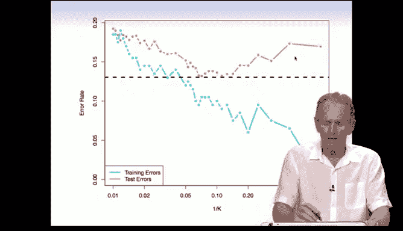

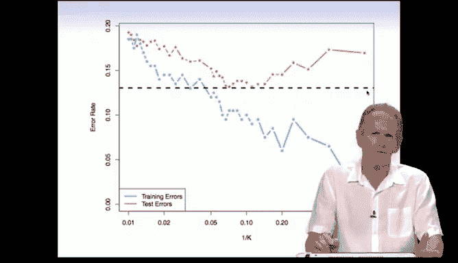

## 总结 📝

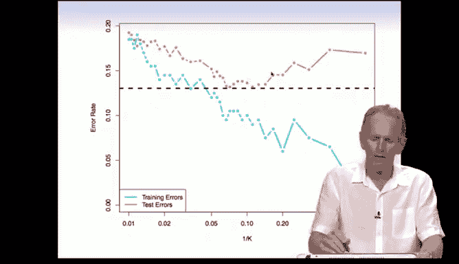

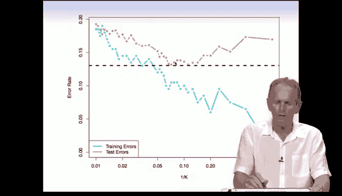

本节课中我们一起学习了统计学习中的分类问题：

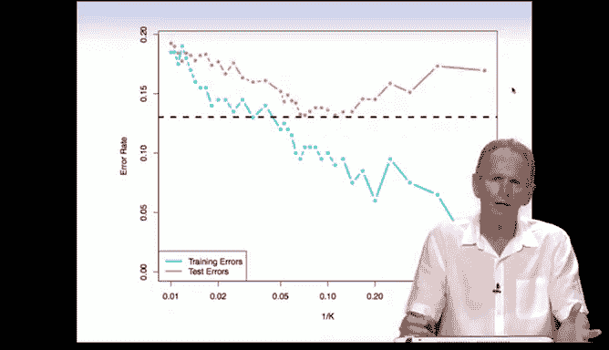

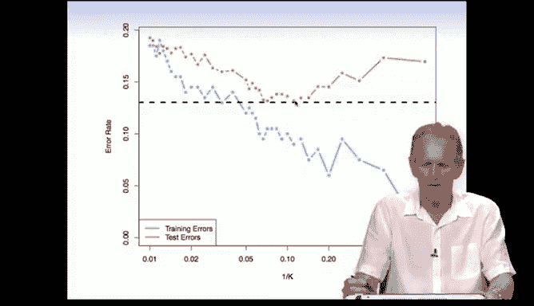

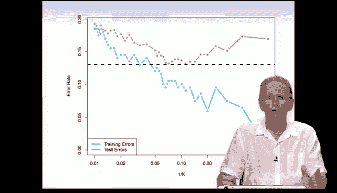

1.  **问题定义**：分类处理的是定性响应变量，目标是构建分类器 **C(X)** 来预测类别标签。
2.  **理想目标**：贝叶斯最优分类器通过选择条件概率最大的类别来实现最小化误分类误差。
3.  **实用方法**：**K最近邻分类器**是一种简单而强大的非参数方法，它通过查询特征空间中最近邻的K个训练样本的多数类别来进行预测。
4.  **关键考量**：邻域大小 **K** 是一个关键参数，控制着模型的复杂度。**K值过小会导致过拟合和高方差；K值过大会导致欠拟合和高偏差。** 需要通过验证技术来选择最优K值。
5.  **地位与局限**：K最近邻是分类工具箱中的重要工具，在大约三分之一的分类问题中表现最佳（例如手写邮政编码识别）。但它也受维数灾难影响。在后续课程中，我们将学习支持向量机、逻辑回归和线性判别分析等其他分类技术。

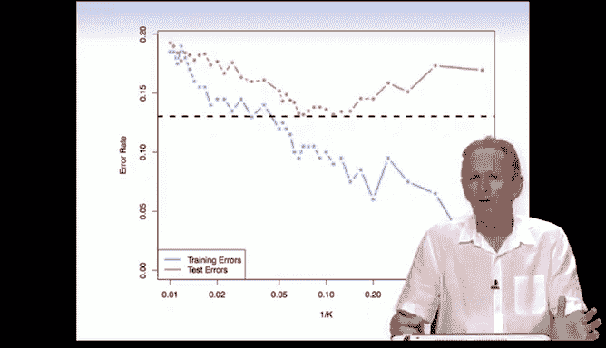

---

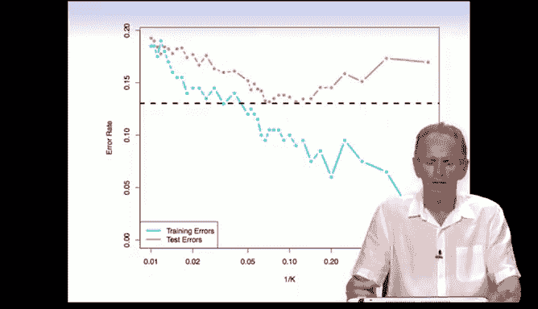

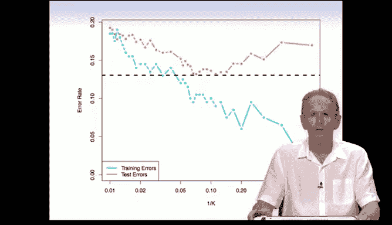

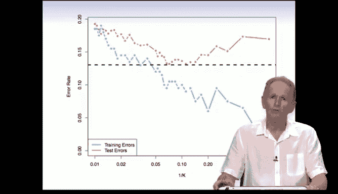

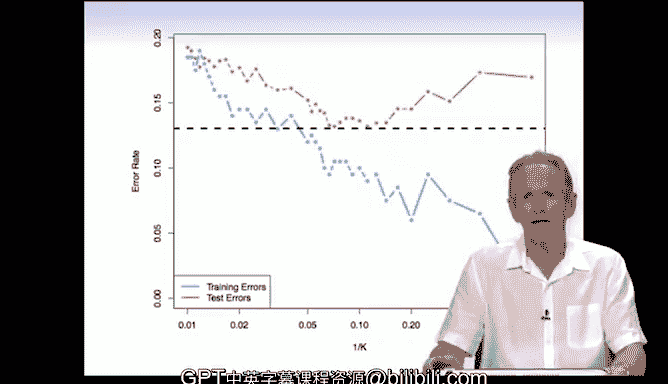

*注：本教程根据斯坦福大学《统计学习导论》课程视频内容整理，旨在用简洁直白的语言解释核心概念，并遵循指定的格式要求。*