# R 版 10：假设检验与置信区间 📊

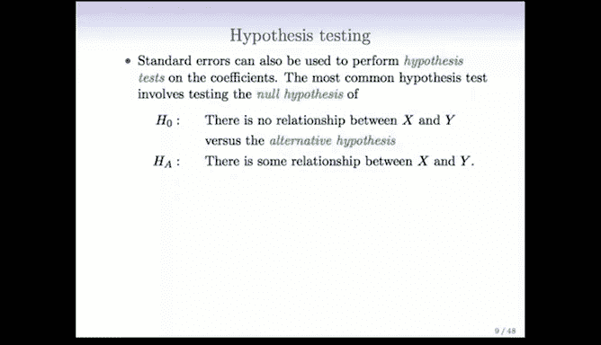

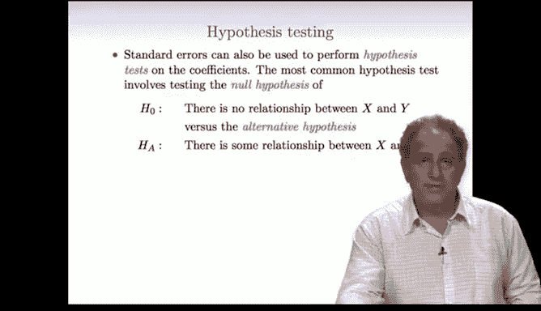

在本节课中，我们将学习统计学习中的两个核心概念：**假设检验**与**置信区间**。我们将探讨如何检验预测变量与响应变量之间是否存在关系，以及如何量化这种关系的不确定性。

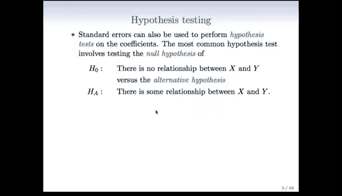

---

## 概述

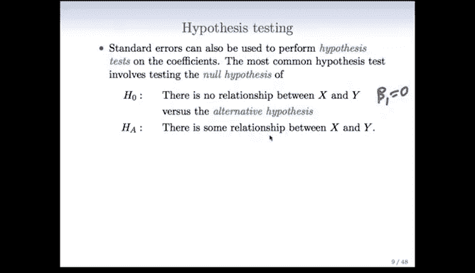

上一节我们介绍了**置信区间**，它用于估计模型参数（如斜率）的可能取值范围。本节中，我们将探讨一个紧密相关的概念——**假设检验**。假设检验用于回答关于参数特定值的问题，例如“某个预测变量的系数是否为零？”。

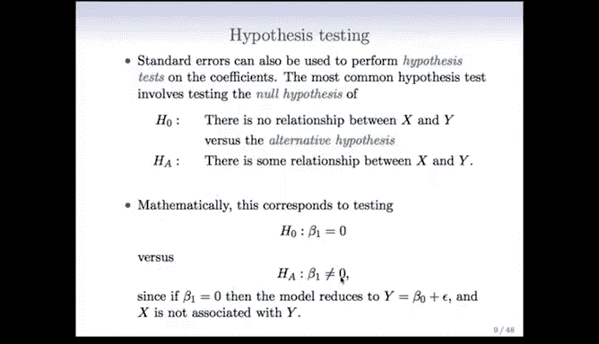

---

## 假设检验

假设检验的核心是检验某个参数（例如回归斜率）是否等于一个特定值。在简单线性回归中，我们最常检验的问题是：预测变量 `X` 与响应变量 `Y` 之间是否存在线性关系？这等价于检验斜率 `β1` 是否为零。

*   **零假设 (H₀)**：`X` 与 `Y` 之间**没有**关系。用公式表示为：`β1 = 0`。
*   **备择假设 (Hₐ)**：`X` 与 `Y` 之间**存在**关系。用公式表示为：`β1 ≠ 0`。

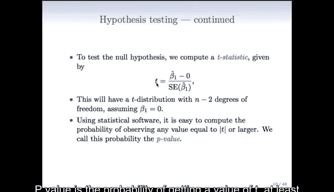

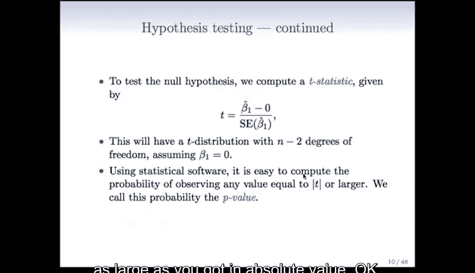

为了进行检验，我们计算一个 **T 统计量**。其计算公式为：

`T = (估计的斜率 β̂₁) / (β̂₁ 的标准误)`

在零假设成立的前提下，这个 T 统计量近似服从自由度为 `n-2` 的 **T 分布**。我们无需手动计算 T 分布的具体形态，统计软件会帮助我们完成。

基于计算出的 T 统计量，软件会给出一个 **P 值**。P 值的定义是：在零假设为真的前提下，观察到当前数据（或更极端数据）的概率。

以下是解读 P 值的标准：
*   如果 P 值很小（例如小于 0.05），意味着在“没有关系”的假设下，观察到当前数据是非常不可能的事件。因此，我们有证据**拒绝零假设**，认为关系存在。
*   如果 P 值较大，则我们没有足够的证据拒绝零假设。

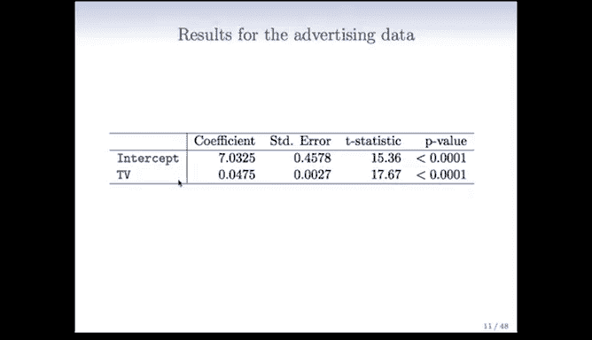

---

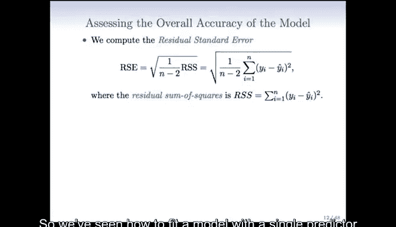

## 广告数据示例

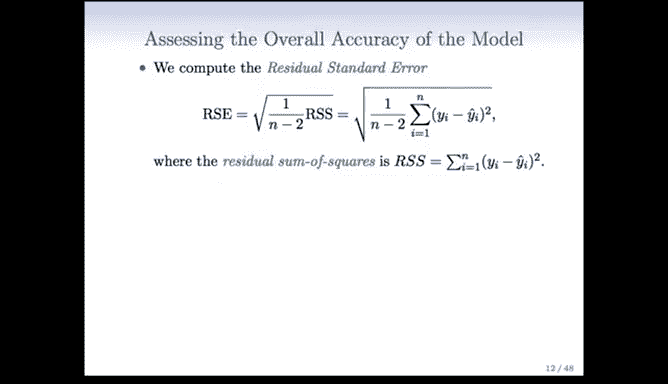

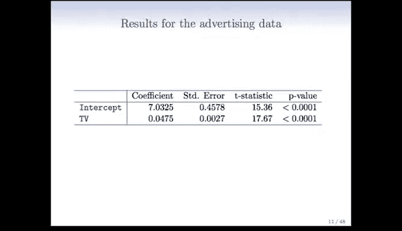

让我们再次使用仅包含电视广告 (`TV`) 的简单线性回归模型。

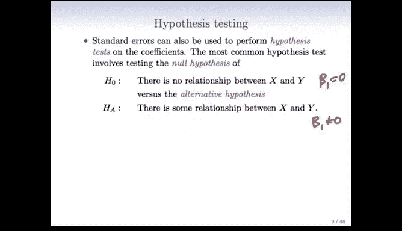

以下是模型的主要输出结果：

| 项 | 系数估计 | 标准误 | T 统计量 |
| :--- | :--- | :--- | :--- |
| 截距 (β₀) | 7.0325 | 0.4578 | 15.36 |
| 电视广告 (β₁) | 0.0475 | 0.0027 | 17.67 |

我们最关心的是电视广告的斜率 `β₁`。其 T 统计量高达 17.67。通常，T 统计量的绝对值大于 2 时，P 值就会小于 0.05，表明结果显著。这里的 17.67 远大于 2，因此对应的 P 值极小（远小于 0.0001）。

**如何解释**：这意味着，如果电视广告对销售额真的没有影响（零假设成立），那么我们观察到当前数据的概率极低（小于万分之一）。因此，我们**拒绝零假设**，得出结论：电视广告对销售额有显著影响。

---

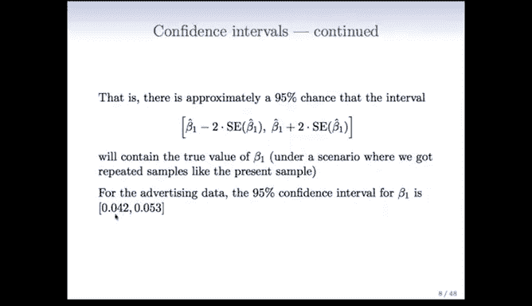

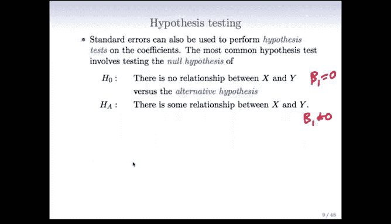

## 假设检验与置信区间的联系

假设检验和置信区间是同一枚硬币的两面，它们提供了等价的信息。

它们之间的对应关系如下：
*   如果假设检验**拒绝**了 `β₁ = 0` 的零假设（如电视广告的例子），那么 `β₁` 的 95% 置信区间**将不包含 0**。
*   反之，如果假设检验**未能拒绝**零假设，那么相应的 95% 置信区间**将包含 0**。

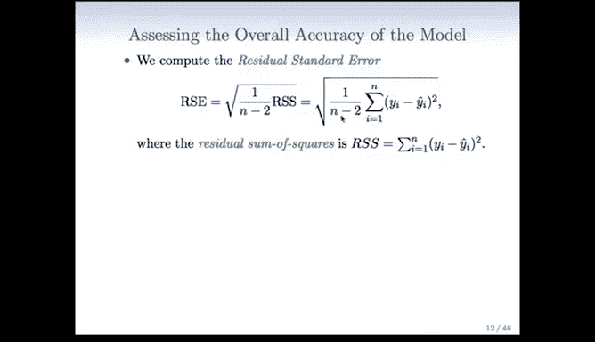

因此，置信区间本身就在进行假设检验。此外，它还能告诉我们效应大小的可能范围，提供了比单纯的“是/否”更丰富的信息。以电视广告为例，其斜率的 95% 置信区间为 `(0.042, 0.053)`。这个区间不包含 0，再次证实了效应的显著性。同时，我们可以解读为：电视广告预算每增加 1000 美元，销售额预计将增加 42 到 53 个单位。

---

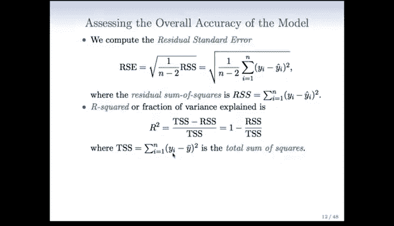

## 评估模型整体拟合优度

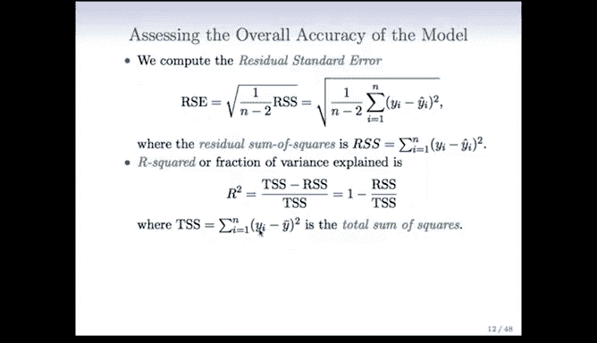

在评估了单个预测变量的显著性之后，我们还需要评估模型的整体拟合质量。以下是两个常用指标：

**1. 残差标准误 (RSE)**
RSE 是模型预测误差的平均度量。计算公式为：
`RSE = sqrt(RSS / (n-2))`
其中，`RSS` 是**残差平方和**，即我们最小化以获得回归线的那个量。RSE 越小，说明模型对数据的拟合越好。

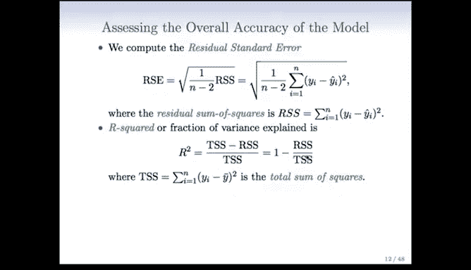

**2. R² 统计量 (可决系数)**
R² 衡量了模型所解释的响应变量方差的比例。其计算公式为：
`R² = (TSS - RSS) / TSS = 1 - (RSS/TSS)`
其中，`TSS` 是**总平方和**，代表仅用 `Y` 的均值进行预测时的总误差。

*   `R²` 的取值范围在 0 到 1 之间。
*   `R² = 0` 意味着模型不比简单的均值模型好。
*   `R² = 1` 意味着模型完美拟合了所有数据点。
*   在简单线性回归中，`R²` 实际上等于预测变量 `X` 与响应变量 `Y` 之间**相关系数的平方**：`R² = (Cor(X, Y))²`。

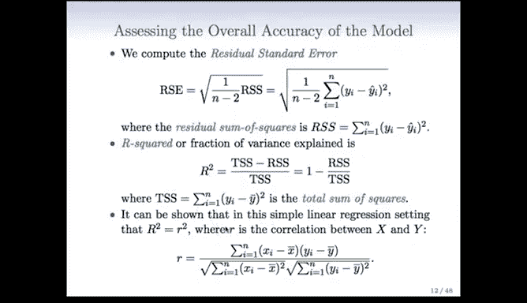

对于我们的广告数据，仅使用 `TV` 的模型 `R² = 0.61`。这意味着电视广告预算解释了销售额中约 61% 的方差，这是一个非常强的预测能力。不过，`R²` 的高低需要结合具体领域来判断。

---

## 总结

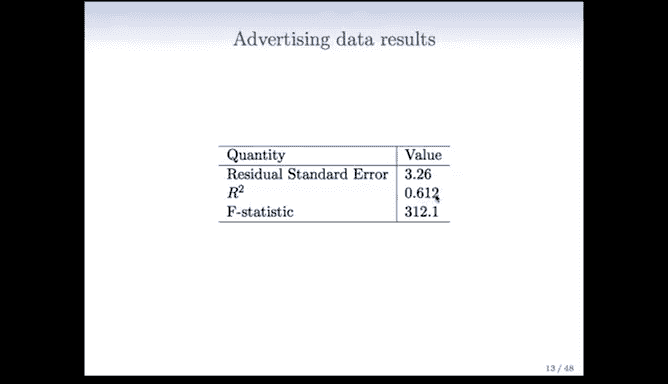

本节课中我们一起学习了：
1.  **假设检验**：我们学习了如何通过设立零假设和备择假设，并计算 T 统计量与 P 值，来判断一个预测变量是否与响应变量显著相关。
2.  **与置信区间的联系**：我们了解到假设检验的结果与置信区间是否包含 0 是等价的，置信区间提供了更多关于效应大小的信息。
3.  **模型评估**：我们引入了 **RSE** 和 **R²** 两个指标，用于量化模型的整体预测精度和解释方差的能力。

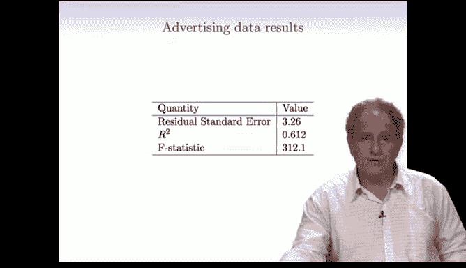

下一节，我们将把问题扩展到包含多个预测变量的情况，进入**多元线性回归**的学习。