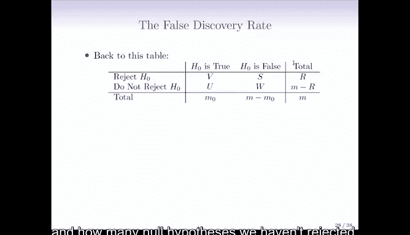
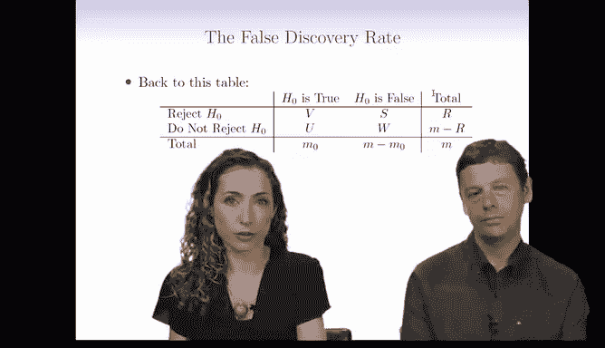
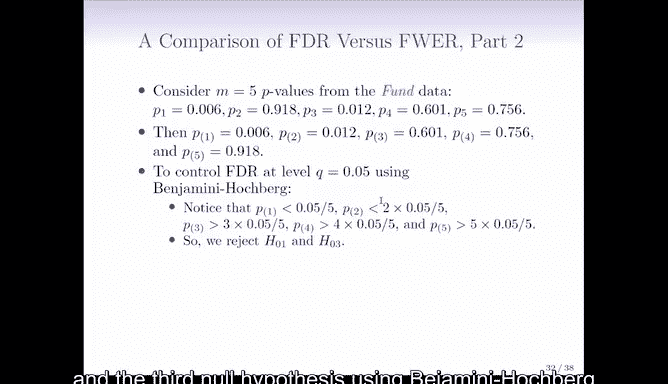

# R 版 100：错误发现率与Benjamini-Hochberg方法 🧪

## 概述
在本节课中，我们将学习多重假设检验中的另一个重要概念——**错误发现率**，并介绍用于控制它的**Benjamini-Hochberg方法**。我们将了解FDR与之前学习的族错误率有何不同，以及在不同应用场景中如何选择合适的方法。

---

## 从族错误率到错误发现率
上一节我们介绍了**族错误率**，它关注的是控制至少犯一次第一类错误的概率。现在，我们来看看一个更现代的多重检验方法——**错误发现率**。

FWER的控制基于以下表格，它总结了进行**m**次假设检验时可能的结果：

| 决策 \ 真实情况 | 原假设为真 | 备择假设为真 | 总计 |
| :--- | :--- | :--- | :--- |
| 拒绝原假设 | **V** (错误发现) | **S** (正确发现) | **R** |
| 不拒绝原假设 | **U** (正确保留) | **T** (错误保留) | **m - R** |
| 总计 | **m₀** | **m - m₀** | **m** |

我们通过控制**V > 0**的概率来控制FWER。这类似于在法庭审判中，我们极度不希望错误定罪任何一个无辜的被告。

然而，在许多科学研究的场景中，我们或许可以容忍偶尔出现的第一类错误。因为当检验次数**m**非常大时，严格控制FWER可能导致我们几乎无法拒绝任何原假设，从而错过许多有意义的发现。

---

## 什么是错误发现率？
这就引出了**错误发现率**的概念。FDR关注的是在所有**被拒绝的原假设**中，**错误拒绝**的比例的期望值。

其定义公式为：
**FDR = E[ V / R ]**，其中规定当**R = 0**时，**V/R = 0**。

换句话说，如果我们拒绝了**R**个假设，FDR告诉我们，其中平均有多少比例是实际上为真却被我们错误拒绝的（即“假发现”）。

以下是FDR适用与不适用的场景对比：
*   **适用场景**：例如，在药物研发中筛选上万个潜在靶点。我们愿意接受一定比例的假阳性靶点（例如FDR控制在20%），以换取一批值得后续深入验证的候选目标。资源可以集中在这些“发现”上进行跟进。
*   **不适用场景**：在刑事审判或某些高风险的医疗诊断中，任何一个假阳性（错误定罪或误诊）的代价都极其高昂，此时应严格控制FWER。

---

## Benjamini-Hochberg 方法
那么，如何在实际操作中控制FDR呢？一个经典且明确的方法是**Benjamini-Hochberg程序**。

该方法通过调整p值的阈值来控制FDR。以下是其具体步骤：

1.  设定你想要控制的**FDR水平**，记为 **q**（例如，0.05或0.1）。
2.  对全部 **m** 个假设检验，计算得到 **m** 个p值。
3.  将这些p值从小到大排序，记为 **p_(1) ≤ p_(2) ≤ ... ≤ p_(m)**。
4.  找到最大的索引 **j**，使得 **p_(j) ≤ (q * j) / m**。这个 **j** 记为 **L**。
5.  拒绝所有满足 **p_(i) ≤ p_(L)** 的原假设（即拒绝对应前 **L** 个最小p值的假设）。

根据统计理论，执行此程序可以保证：**FDR ≤ q**。

---

## FDR与FWER的直观对比
为了更直观地理解FDR与FWER的差异，我们来看一个例子。假设我们对**m=2000**个假设进行了检验，并得到了对应的p值。

下图展示了两种方法下的决策差异（想象一个散点图，X轴是排序后的p值索引，Y轴是对数尺度下的p值大小）：
*   如果使用**Bonferroni校正**来控制**FWER**（α=0.1），拒绝阈值是一条**水平的绿线**，位于 **α/m = 0.1/2000** 处。在这个例子中，可能没有任何p值低于这条线，导致我们无法做出任何发现。
*   如果使用**Benjamini-Hochberg方法**来控制**FDR**（q=0.1），拒绝阈值是一条**斜率为 q/m 的红线**。我们会拒绝所有p值落在这条线下方的假设（图中标记为蓝色的点）。通常，这能让我们拒绝数量可观的原假设。

这个对比清晰地表明：当检验数量**m**很大时，FDR方法通常比FWER方法更“有力”，能做出更多发现，但代价是允许一定比例的发现是错误。

---

## 实例演示
让我们回到之前关于基金经理的例子，我们有5个p值。现在我们应用BH方法来控制FDR（设q=0.05）。

首先，将p值排序并计算阈值：
*   p_(1) = 0.006， 阈值 = 0.05 * 1 / 5 = 0.010
*   p_(2) = 0.009， 阈值 = 0.05 * 2 / 5 = 0.020
*   p_(3) = 0.165， 阈值 = 0.05 * 3 / 5 = 0.030
*   p_(4) = 0.205， 阈值 = 0.05 * 4 / 5 = 0.040
*   p_(5) = 0.918， 阈值 = 0.05 * 5 / 5 = 0.050

接着，找到最大的索引 **j**，使得 **p_(j) ≤ 阈值**。这里，**p_(2)** 满足条件，但 **p_(3)** 不满足（0.165 > 0.030）。因此，**L = 2**。

最后，我们拒绝前两个p值对应的原假设（即第一位和第三位基金经理）。在这个**m**较小的例子中，BH方法的结果可能与某些FWER控制方法相同。但当**m**非常大时，BH方法的优势会更加明显。

---

## 总结
本节课我们一起学习了多重假设检验中的两个核心概念：
1.  **错误发现率**：衡量在所有“阳性发现”中，假阳性所占比例的期望值。它适用于那些可以容忍部分假阳性以换取更多发现的研究场景（如大规模筛选）。
2.  **Benjamini-Hochberg方法**：一种用于控制FDR的具体步骤。它通过一条斜率为 **q/m** 的直线来动态调整p值拒绝阈值，通常比控制FWER的方法更具检验力。

关键要点在于，**FWER**致力于“避免任何错误”，而**FDR**致力于“控制错误发现的比例”。研究人员应根据研究目标、领域惯例以及对第一类错误与第二类错误的容忍度，来选择合适的多重检验校正方法。