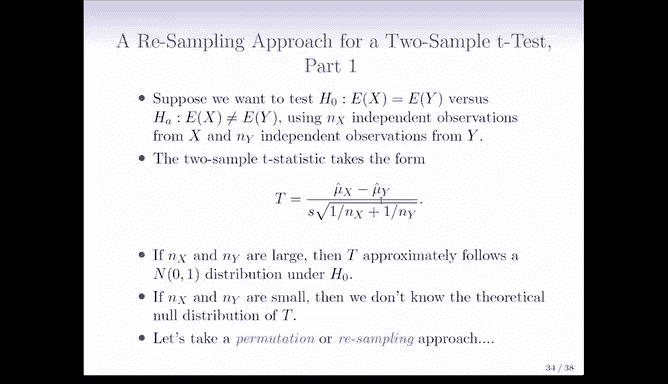

# R 版 101：重抽样方法 🧪


## 概述

在本节课中，我们将要学习一种称为“重抽样方法”的强大工具。这种方法为我们提供了一种进行假设检验的方式，无论是单个假设检验还是多个假设检验，其过程相对较少依赖于严格的统计假设。

## 重抽样方法的核心思想

上一节我们介绍了基于理论分布的假设检验。本节中我们来看看当理论分布未知或假设难以满足时，我们该如何处理。

在之前的讲座中，我们假设我们处于一个可以检验某个零假设 H₀ 的场景。我们有一个检验统计量 T，并且最重要的是，我们知道或可以假设 T 在零假设下的分布。我们正是通过了解检验统计量在零假设下的分布来计算 P 值的。

然而，这个理论上的零分布实际上可能是未知的。我们可能不知道它是什么样子，或者我们可能对做出某些假设感到不安，因为我们不确定这些假设是否成立。重抽样方法提供了一种更少依赖假设的途径。

需要说明的是，重抽样方法是一个非常通用的框架，需要根据您检验的假设类型和使用的检验统计量进行具体化。今天我们将讨论在进行双样本 T 检验时，重抽样方法会是什么样子。但一般来说，如果您检验的是不同类型的零假设，或者使用的不是双样本 T 检验统计量，您需要思考是否存在适合的重抽样方法以及该方法的具体形式。

## 双样本 T 检验的重抽样方法

假设我们想检验零假设：一组数据的均值等于另一组数据的均值，备择假设是它们不相等。我们分别有来自 X 组的 n_x 个独立观测值和来自 Y 组的 n_y 个独立观测值。

正如我们今天已经看到的，双样本 T 统计量的形式是：X 组的样本均值减去 Y 组的样本均值，再除以 μ_x - μ_y 的标准差的估计值。公式如下：

**T = (mean(X) - mean(Y)) / SE(mean(X) - mean(Y))**

如果 n_x 和 n_y 很大，那么 T 在零假设下近似服从标准正态分布 N(0,1)。但如果 n_x 和 n_y 很小，那么除非我们对数据（X 和 Y 的分布）做出进一步的假设，否则我们实际上并不知道 T 的理论零分布。

我们可以尝试采用重抽样方法。重抽样方法背后的思想是，我们不让计算机去查教科书或推导 T 的理论零分布，而是让计算机模拟在零假设下 T 的分布会是什么样子。

以下是进行重抽样的基本步骤：

1.  **合并数据**：将来自 X 组和 Y 组的所有观测值合并到一个数据池中。
2.  **随机重抽样**：从合并后的数据池中，随机抽取（放回或不放回，通常是不放回） n_x 个观测值作为“新 X 组”，再抽取 n_y 个观测值作为“新 Y 组”。这模拟了在零假设（两组均值相同，来自同一总体）下生成新样本的过程。
3.  **计算统计量**：对这个重抽样的“新 X 组”和“新 Y 组”计算相同的 T 统计量。
4.  **重复模拟**：将步骤 2 和 3 重复很多次（例如 1000 次或 10000 次）。这样就得到了在零假设下 T 统计量的一个经验分布（也称为“自助分布”或“置换分布”）。
5.  **计算 P 值**：将实际观测到的 T 统计量（来自原始数据）与这个模拟出的零分布进行比较。P 值就是模拟出的 T 统计量绝对值大于或等于实际观测到的 T 统计量绝对值的比例。用代码可以表示为：

```r
# 假设 t_obs 是实际观测到的 T 统计量
# 假设 t_sim 是模拟出的 T 统计量向量
p_value <- mean(abs(t_sim) >= abs(t_obs))
```

通过这种方式，我们无需依赖数据服从正态分布等理论假设，就能得到一个近似的 P 值。

## 总结



本节课中我们一起学习了重抽样方法。这是一种强大的、相对无假设的统计工具，特别适用于理论分布未知或假设条件难以满足的情况。我们以双样本 T 检验为例，详细介绍了其核心思想与实施步骤：通过计算机模拟在零假设下生成数据并计算检验统计量，从而构建一个经验分布，并据此计算 P 值。记住，这种方法需要根据具体的检验问题进行调整，并非简单的“即插即用”。