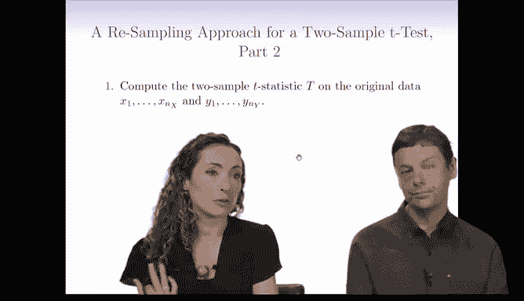
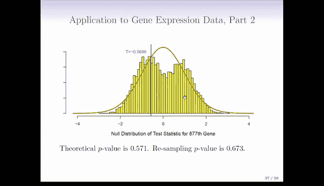
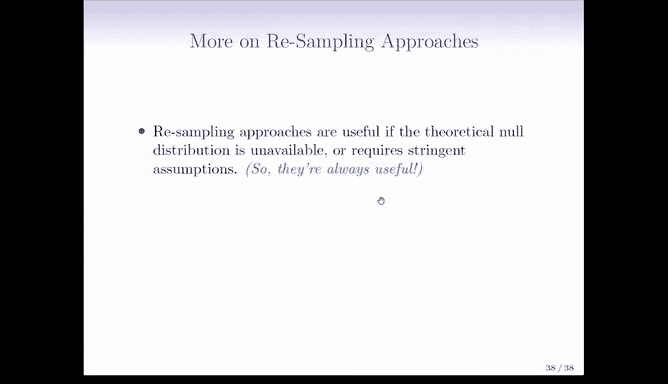
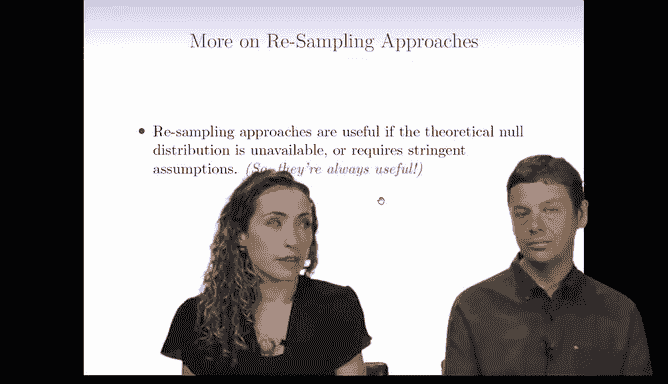
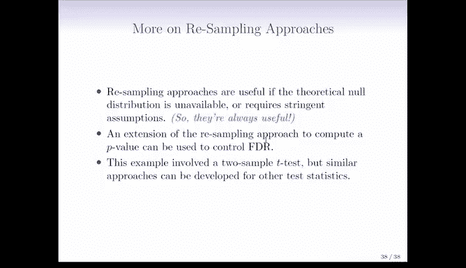

# R 版 102：重抽样方法 II 🔄

在本节课中，我们将学习如何使用重抽样（或置换）方法来模拟零分布，并计算假设检验的P值。我们将通过一个两样本T检验的例子，详细讲解置换检验的步骤和原理。

---

## 概述

上一节我们介绍了重抽样的基本概念。本节中，我们将具体探讨如何通过**置换（Permutation）** 方法来模拟零分布，并计算检验统计量的P值。这种方法的核心思想是：在零假设下，数据可以任意重新排列，因为组间没有差异。

---

## 置换检验的原理

在零假设下，X组和Y组的数据来自同一个总体，均值没有差异。因此，我们可以将所有观测值混合在一起，然后随机地重新分配给两个组，这个过程称为“置换”或“洗牌”。

通过多次重复这个过程，并每次计算检验统计量（如T统计量），我们就可以模拟出在零假设成立时，这个统计量可能出现的分布，即**置换零分布**。

---

## 置换检验的步骤

以下是执行置换检验的具体步骤：

1.  **计算原始数据的检验统计量**  
    首先，在原始数据上计算你关心的检验统计量，例如两样本T统计量。我们将其记为 `T_obs`。

2.  **多次重复置换与计算**  
    接下来，我们将重复以下操作 `B` 次（`B` 是一个很大的数，例如10000次）：
    *   将所有观测值（X组和Y组合并）随机打乱顺序。
    *   将前 `n_X` 个打乱后的观测值作为新的“X* 组”，剩余 `n_Y` 个作为新的“Y* 组”。
    *   在这个新生成的“置换数据集”上，计算同样的检验统计量，记为 `T*_b`（`b` 表示第 `b` 次置换）。

3.  **计算P值**  
    完成所有 `B` 次置换后，我们通过比较置换统计量与原始统计量来计算P值。公式如下：

    **P值 = (1/B) * Σ [ I( |T*_b| > |T_obs| ) ]**

    其中，`I(·)` 是指示函数，当括号内条件为真时值为1，否则为0。这个公式计算的是，在模拟的零分布中，统计量的绝对值超过原始观测值绝对值的比例。

---

## 实例分析

我们来看一个基因表达数据的例子，比较对照组和处理组。

*   **基因A**：  
    原始数据的T统计量 `T_obs = -2.09`。  
    通过置换得到的零分布（黄色直方图）与理论上的T分布（橙色曲线）非常接近。  
    理论P值 = 0.041，置换P值 = 0.042。  
    在这个案例中，两种方法结果几乎一致。

*   **基因B**：  
    原始数据的T统计量 `T_obs = -0.5696`。  
    此时，置换零分布（黄色直方图）与理论零分布（橙色曲线）形状有明显差异。  
    理论P值 = 0.571，置换P值 = 0.673。  
    虽然两者都表明结果不显著，但具体数值存在差别，显示了置换方法可能带来的不同结论。

---

## 何时使用重抽样方法？

重抽样方法在以下情况尤其有用：

*   **理论零分布未知时**：当检验统计量的理论分布难以推导或未知时。
*   **样本量较小时**：例如进行两样本T检验时，如果样本量很小，理论T分布的假设可能不成立，置换检验更可靠。
*   **希望减少假设**：置换检验依赖于数据本身的随机重组，通常比参数检验依赖的分布假设更弱。

本质上，我们是用**计算时间**来换取**更弱的模型假设**。对于计算机来说，多做一些计算通常不是问题。

---

## 方法的扩展

我们讨论的是两样本T检验，但置换思想可以推广到其他检验统计量和假设：

*   **控制错误发现率（FDR）**：教科书和R实验章节介绍了如何使用重抽样方法来控制FDR，有兴趣可以深入阅读。
*   **其他统计量**：对于不同的研究问题和统计量，你需要根据具体的零假设来设计相应的置换方案。这有时需要更多的思考，并非总是有现成的R函数可以直接调用。

---

## 总结

本节课我们一起学习了置换检验方法。我们了解到，通过随机打乱观测值并重复计算统计量，可以模拟零假设下的数据分布，从而计算P值。这种方法在理论分布不明确或样本量较小时特别有用，它用计算成本换取了更稳健的推断。在接下来的R语言实验中，我们将动手实践这一过程。