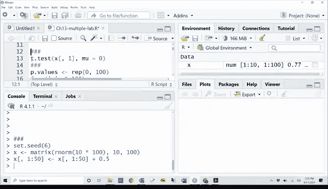

# R 版 103：多重检验校正：Bonferroni与Holm方法 🧪

在本节课中，我们将学习多重假设检验中的核心问题——如何控制犯错误的概率。我们将通过模拟数据和真实案例，具体介绍两种经典的校正方法：Bonferroni法和Holm法，并演示如何在R语言中实现它们。

## 设置与数据模拟


首先，我们需要设置随机种子以确保结果可重现，并模拟一个用于多重检验的数据集。

```r
set.seed(6)
```

我们创建一个矩阵 `x`，它有10行（观测）和100列（变量）。每一列代表一个待检验的假设，其原假设为该列数据的均值为0。初始时，所有数据都服从标准正态分布。

```r
x <- matrix(rnorm(10 * 100), nrow = 10, ncol = 100)
```



接下来，我们修改前50列的数据，使其真实均值变为0.5，这意味着对于这50列，原假设（均值为0）实际上是不成立的。

```r
x[, 1:50] <- x[, 1:50] + 0.5
```

## 执行多重t检验

上一节我们创建了模拟数据，本节中我们来看看如何对每一列进行假设检验。我们将使用 `t.test` 函数检验每一列的均值是否为0，并收集所有100次检验的p值。

以下是执行循环检验并记录结果的代码：

```r
p.values <- rep(0, 100)
for (i in 1:100) {
  p.values[i] <- t.test(x[, i])$p.value
}
```

检验完成后，我们根据p值是否小于0.05（即显著性水平α）做出“拒绝”或“不拒绝”原假设的决策。

```r
decision <- rep(“Do not reject H0”, 100)
decision[p.values < 0.05] <- “Reject H0”
```

由于这是我们自己模拟的数据，我们知道前50个原假设为假，后50个为真。因此，我们可以构建一个混淆矩阵来清晰展示检验结果。

```r
truth <- rep(c(“False”, “True”), each = 50)
table(truth, decision)
```

在这个模拟结果中，我们可能观察到大约3个“第一类错误”（原假设为真却被错误拒绝），同时只成功检测出约10个真正不成立的原假设。这是因为信号（均值差0.5）较弱，而样本量（n=10）有限。

## 增强信号后的检验

为了对比，我们增强信号强度，将前50列的均值差从0.5提高到1，然后重复上述检验过程。

```r
x[, 1:50] <- x[, 1:50] + 1 # 在之前+0.5的基础上再+0.5，总差值为1
# 重新计算p值和决策
```

这次，由于信号更强，我们成功拒绝的原假设数量（统计功效）会显著增加，可能达到41个左右，而第一类错误的数量仍会维持在期望值（约2.5个）附近波动。这说明了效应大小对检验结果的关键影响。

## 族错误率的概念

在介绍了单个检验的错误后，我们需要从整体上考虑问题。当同时进行M次检验时，至少犯一次第一类错误的概率称为**族错误率**。

以下公式计算了在M次独立检验中，族错误率随M增长的情况：
**FWER = 1 - (1 - α)^M**

我们可以用R代码可视化不同α水平下，FWER如何随检验次数M增加而快速上升至接近1。

```r
m <- 1:500
alpha_values <- c(0.05, 0.01, 0.001)
plot(m, 1 - (1 - alpha_values[1])^m, type=“l”, …) # 绘制曲线
```

## 应用Bonferroni与Holm校正

现在，我们将理论应用于实际案例。我们使用`ISLR2`包中的基金经理人数据，检验其中五位经理的超额收益是否显著不为0。

首先，加载数据并计算每位经理的t检验p值。

```r
library(ISLR2)
fund_managers <- Fund[, 1:5]
p_values_fund <- apply(fund_managers, 2, function(col) t.test(col)$p.value)
```

假设我们得到了p值向量 `c(0.006, 0.918, 0.011, 0.600, 0.244)`。如果不做任何校正，在α=0.05水平下，经理1和经理3的结果是显著的。

然而，为了控制整体族错误率，我们必须对p值进行校正。R语言中的 `p.adjust` 函数可以方便地实现这一点。

以下是应用Bonferroni校正的方法，其本质是将每个原始p值乘以检验总数M，并与1取最小值：
**p_adj_bonferroni = min(p * M, 1)**

```r
p_adj_bonf <- p.adjust(p_values_fund, method = “bonferroni”)
```

以下是应用Holm校正的方法，它是一种比Bonferroni更强大的逐步校正法：

```r
p_adj_holm <- p.adjust(p_values_fund, method = “holm”)
```

在本例中，Bonferroni校正后，经理3的p值变为0.055，略高于0.05的阈值；而Holm校正后，其p值为0.044，仍低于阈值。因此，使用Holm方法，我们可以在控制族错误率的同时，拒绝关于经理3的原假设，获得了比Bonferroni方法更高的检验功效。

## 总结

本节课中我们一起学习了多重假设检验的核心挑战与解决方案。
1.  **问题**：当同时进行大量检验时，犯至少一次第一类错误的概率（族错误率）会急剧增加。
2.  **方法**：我们介绍了两种控制族错误率的校正方法。
    *   **Bonferroni法**：简单保守，将每个p值乘以检验总数M。
    *   **Holm法**：一种更强大的逐步校正法，在控制错误率的同时提高了检验功效。
3.  **实践**：我们在R语言中通过模拟数据和真实案例，演示了如何执行多重检验、计算族错误率以及应用Bonferroni和Holm校正。

理解这些方法有助于我们在进行大数据分析时，做出更可靠、更严谨的统计推断。