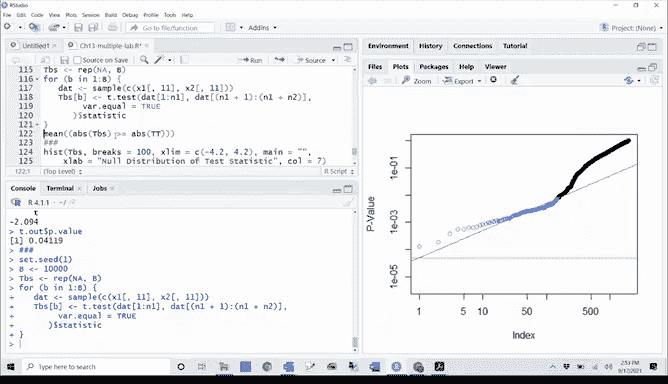

# R 版 104：多重假设检验与重采样方法 🧪


## 概述

在本节课中，我们将学习多重假设检验中的错误发现率控制方法，以及如何使用重采样技术来验证理论P值的合理性。我们将通过一个包含2000名基金经理的数据集和一个基因表达数据集来演示这些概念。

---

## 错误发现率简介

上一节我们介绍了Bonferroni和Holm方法，它们主要用于控制族错误率。本节中，我们来看看另一种更实用的方法——错误发现率控制。

错误发现率是指在所有被拒绝的原假设中，错误拒绝的比例。与严格的族错误率控制不同，FDR方法允许一定比例的假阳性，这在处理大量假设检验时更为实用。

## 使用Benjamini-Hochberg方法控制FDR

以下是使用R语言进行FDR控制的具体步骤。

首先，我们加载包含2000名基金经理的数据集，并为每位经理计算P值。

```r
# 假设已加载数据并计算了P值向量 p_values
q_values <- p.adjust(p_values, method = "BH")
```

`p.adjust`函数中的`method = "BH"`参数表示使用Benjamini-Hochberg方法进行调整。调整后得到的是Q值，它代表了控制FDR的阈值。

例如，如果我们设定FDR阈值为10%（Q=0.1），那么我们会拒绝所有Q值小于0.1的原假设。在本例中，有146名基金经理的Q值低于0.1。

这意味着，如果我们列出这146名经理，并声称他们具有非零超额收益，那么我们预计其中不超过10%（约14-15名）是假阳性。这就是将错误发现率控制在10%水平的含义。

相比之下，如果使用Bonferroni方法在10%水平上控制族错误率，我们将无法拒绝这2000个假设中的任何一个。FDR方法在实际应用中通常更合理。

## 手动实现Benjamini-Hochberg方法

如果你想深入了解原理，而不只是依赖R函数，可以手动实现Benjamini-Hochberg方法。

以下是实现步骤：
1.  将P值从小到大排序。
2.  设定目标FDR水平Q（例如0.1）。
3.  找到满足 `P(j) ≤ Q * j / m` 的最大索引j，其中m是总假设数。
4.  拒绝前j个原假设。

```r
# 手动实现BH方法
m <- length(p_values)
q <- 0.1
sorted_p <- sort(p_values)
indices <- which(sorted_p <= q * (1:m) / m)
if (length(indices) > 0) {
  k <- max(indices)
  rejected_hypotheses <- order(p_values)[1:k]
} else {
  rejected_hypotheses <- NULL
}
```

我们可以通过绘图来可视化这个过程。图中蓝色的点代表被拒绝的假设（即Q值小于0.1的P值），绿色的线代表Bonferroni阈值。可以看到，Bonferroni阈值（0.1/2000）远低于大多数P值，因此没有假设被拒绝。

## 使用重采样验证P值

理论P值的计算依赖于特定的分布假设（如t分布）。我们可以使用重采样（置换检验）的方法，在更少的假设下计算经验P值。

我们使用一个基因表达数据集（`Khan`数据集）进行演示。该数据集有83个观测（患者）和2308个特征（基因）。我们专注于比较第2类和第4类的观测。

首先，我们对第11个基因进行两样本t检验，得到理论P值。

```r
# 对第11个基因进行t检验
t_test_result <- t.test(x1, x2, var.equal = TRUE)
t_stat <- t_test_result$statistic
p_theoretical <- t_test_result$p.value
```

接下来，我们通过重采样计算经验P值。基本思想是：随机打乱样本的类别标签，多次计算t统计量，构建一个经验零分布。



```r
set.seed(1)
B <- 10000
t_stats_resampled <- rep(NA, B)
combined_data <- c(x1, x2)
n1 <- length(x1)
n_total <- length(combined_data)

for (b in 1:B) {
  # 随机打乱数据
  shuffled_data <- sample(combined_data)
  # 将打乱后的数据分成两组
  group1 <- shuffled_data[1:n1]
  group2 <- shuffled_data[(n1+1):n_total]
  # 计算重采样后的t统计量
  t_test_temp <- t.test(group1, group2, var.equal = TRUE)
  t_stats_resampled[b] <- t_test_temp$statistic
}
# 计算经验P值：观察到的统计量在经验分布中的极端程度
p_resampling <- mean(abs(t_stats_resampled) >= abs(t_stat))
```

在这个例子中，理论P值（0.04119）与重采样P值（0.0416）几乎完全相同。这表明，对于此数据，t检验的理论假设是合理的。黄色直方图（经验分布）与橙色曲线（理论t分布）高度重合也证实了这一点。

当我们对理论分布的假设存疑时，重采样方法提供了一个强有力的替代方案。

## 总结

本节课中我们一起学习了：
1.  **错误发现率**：一种更灵活的多重检验校正方法，它控制的是被拒绝假设中假阳性的预期比例。
2.  **Benjamini-Hochberg方法**：一种广泛使用的FDR控制程序，可以通过R的`p.adjust`函数轻松实现，也可以手动计算。
3.  **重采样方法**：通过置换检验构建经验零分布，用以计算P值，这种方法不依赖于严格的理论分布假设，可以作为理论方法的验证或替代。

本章节还有一些内容，如Tukey方法（用于特定场景的族错误率控制）以及用于FDR的重采样方法，鼓励大家自行查阅教材进行学习。