# R 版 11：多元线性回归 📈

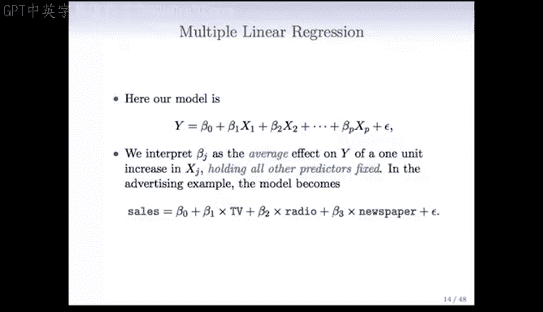

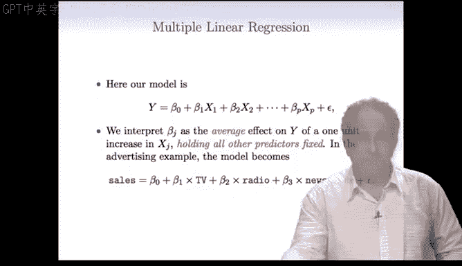

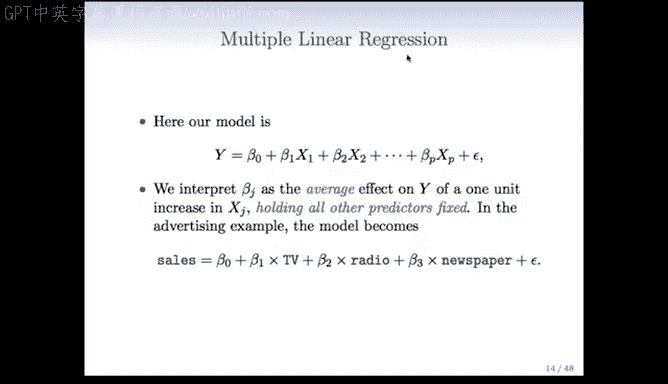

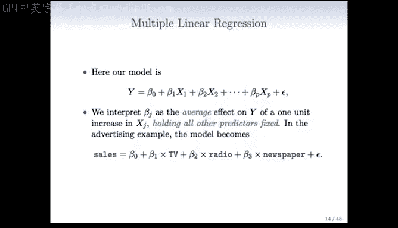

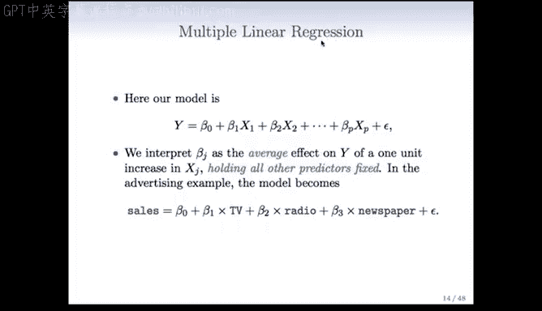

在本节课中，我们将开始讨论多元线性回归，这是一种使用多个预测变量进行回归分析的方法。

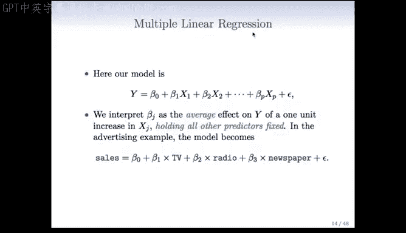

## 概述

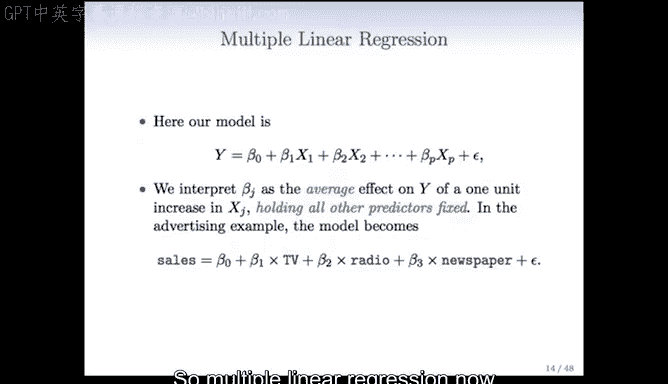

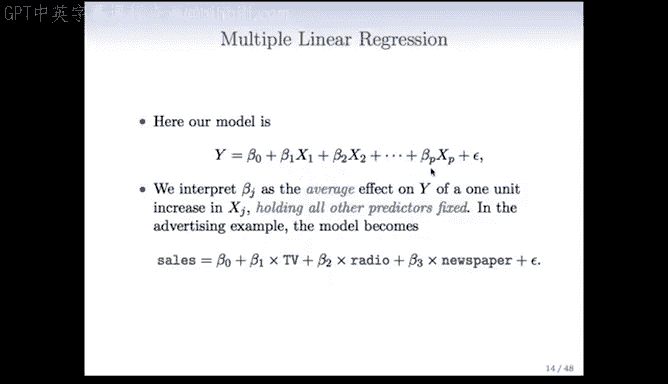

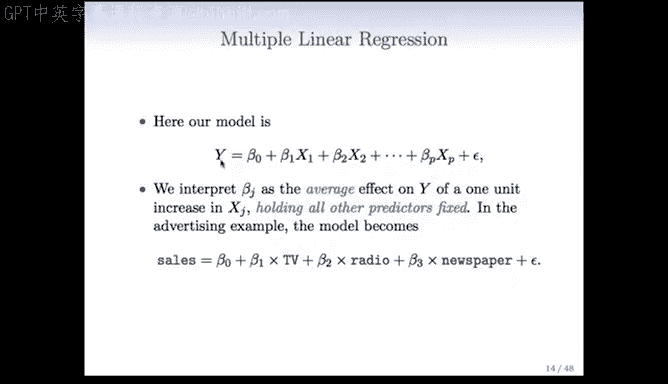

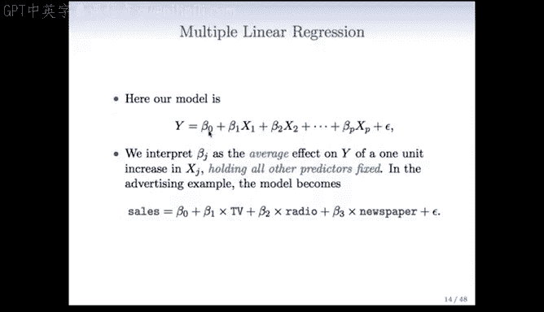

上一节我们介绍了简单线性回归。本节中，我们将把模型扩展到包含多个预测变量的情况，即**多元线性回归**。我们将学习其模型形式、系数的解释、最小二乘估计，并探讨在预测变量相关时解释系数所面临的挑战。

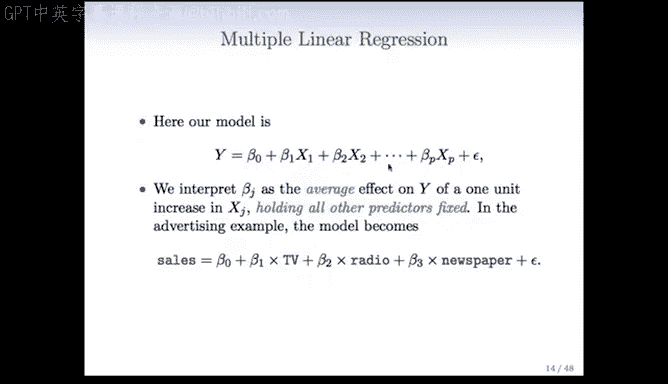

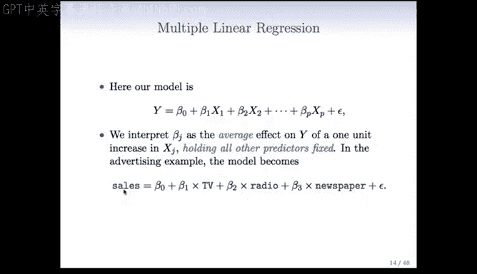

## 多元线性回归模型

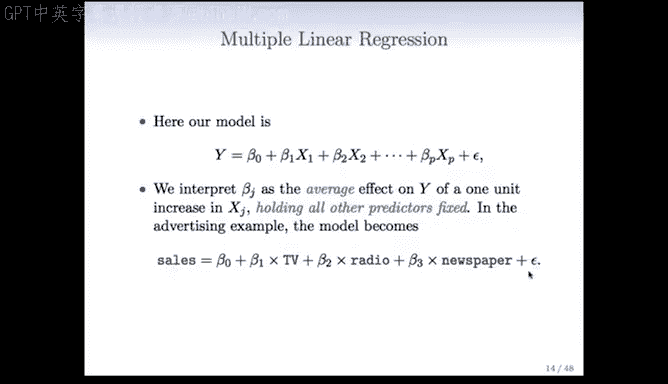

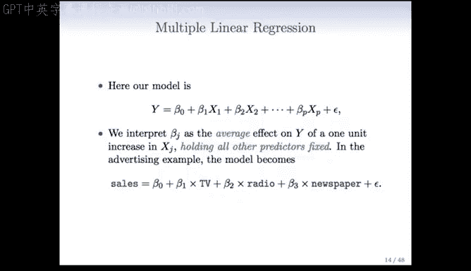

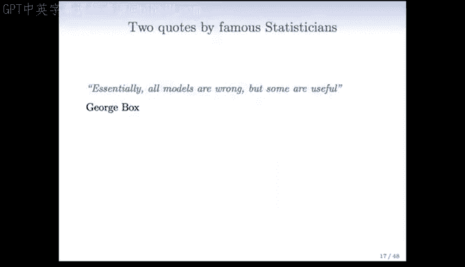

多元线性回归扩展了简单线性回归模型，使其包含多个预测变量。例如，在我们的广告数据中，我们有三个预测变量：电视、广播和报纸广告支出。

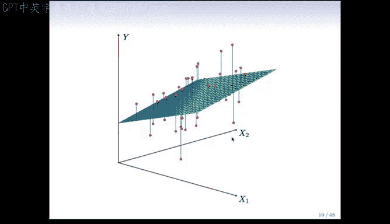

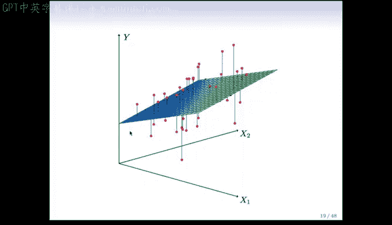

模型公式如下：
`Y = β₀ + β₁X₁ + β₂X₂ + ... + β_pX_p + ε`

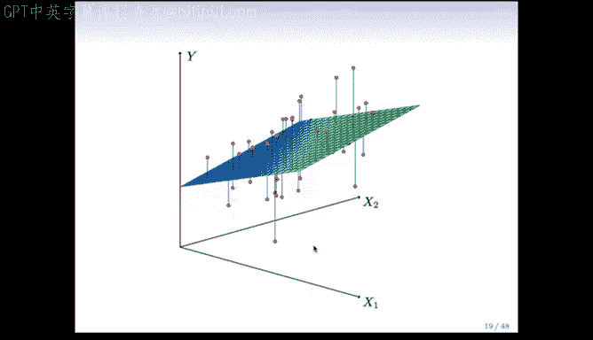

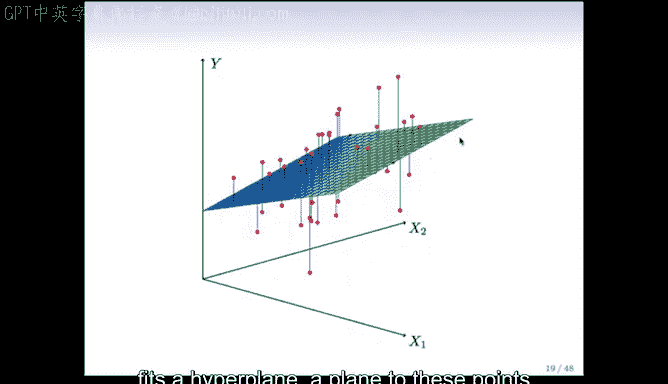

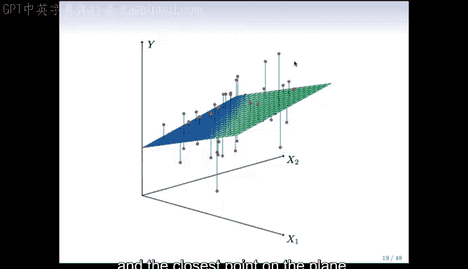

其中：
*   `Y` 是因变量（响应变量）。
*   `X₁, X₂, ..., X_p` 是 `p` 个预测变量。
*   `β₀` 是总体截距项。
*   `β₁, β₂, ..., β_p` 是每个预测变量对应的斜率参数（这些是未知的，需要估计）。
*   `ε` 是误差项，允许数据点围绕模型函数（一个超平面）波动。

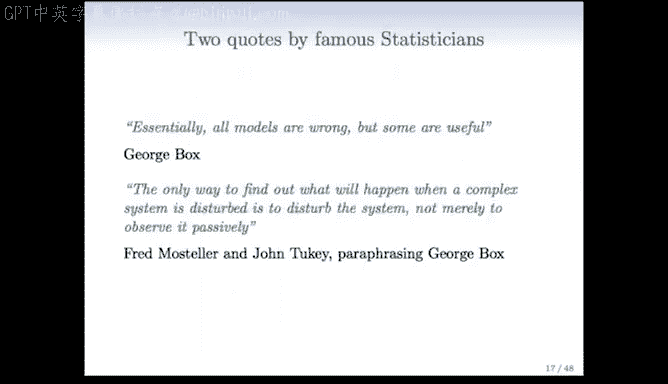

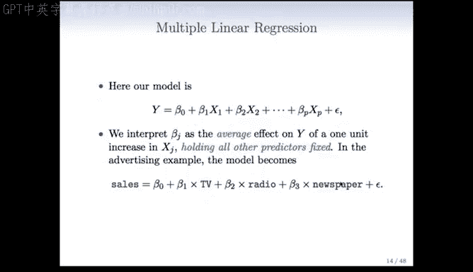

在广告示例中，具体模型为：
`销售额 = β₀ + β₁ * TV + β₂ * Radio + β₃ * Newspaper + ε`

## 从直线到超平面

在简单线性回归中，我们拟合的是一条直线。在多元线性回归中，当有两个预测变量时，我们拟合的是一个平面；当有三个或更多预测变量时，我们拟合的是一个**超平面**。

最小二乘法的目标与简单回归类似：找到一组系数（`β₀, β₁, ..., β_p`），使得所有观测数据点到这个超平面的垂直距离（残差）的平方和最小。

## 回归系数的解释与挑战

在简单模型中，我们只有一个系数需要解释。在多元模型中，我们有多个系数，解释它们需要更谨慎。

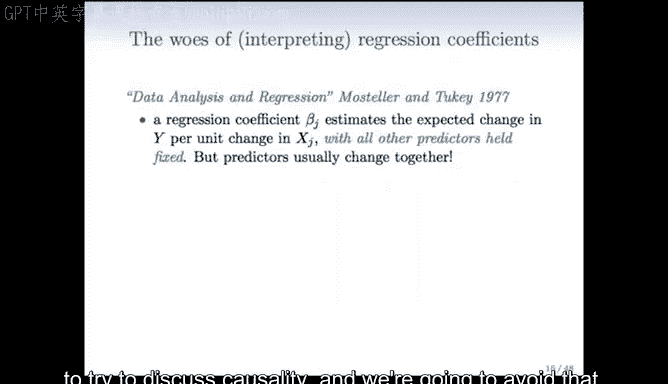

### 理论解释

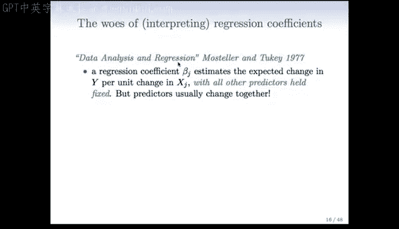

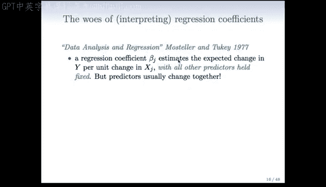

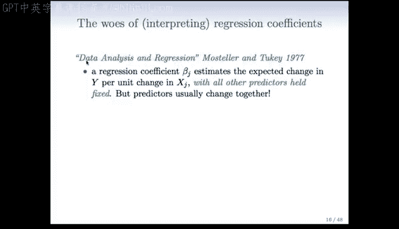

从理论上讲，系数 `β_j` 可以解释为：**在保持所有其他预测变量不变的情况下**，预测变量 `X_j` 每增加一个单位，响应变量 `Y` 平均变化 `β_j` 个单位。

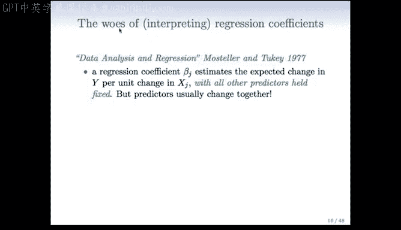

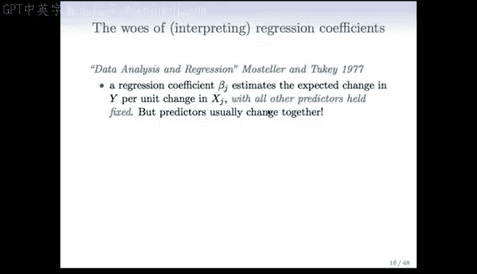

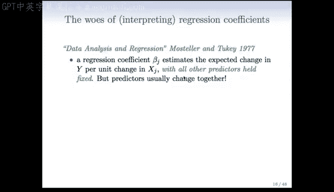

### 现实挑战

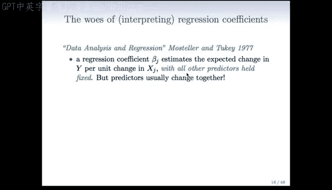

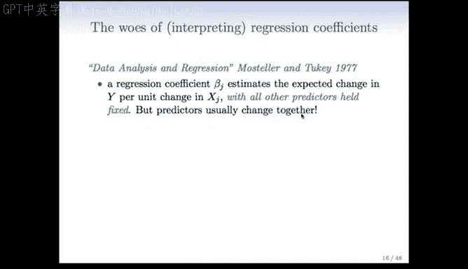

然而，这个解释在现实数据中常常存在问题，因为预测变量之间通常是**相关的**（例如，公司的各种广告预算可能相互关联）。相关性会带来以下问题：

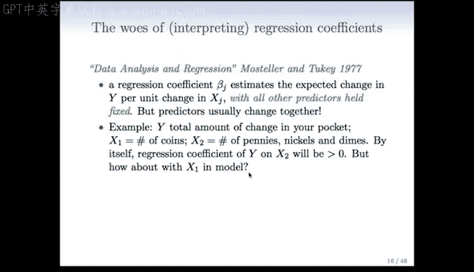

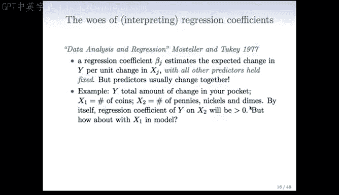

1.  **系数方差增大**：预测变量之间的相关性会导致其系数估计的方差变大，有时甚至非常剧烈。如果两个预测变量几乎完全相同，模型将很难区分它们各自的影响，导致这两个系数的估计非常不稳定（方差很大）。
2.  **“保持其他变量不变”的假设不现实**：在现实中，改变一个预测变量时，其他变量很可能也会随之变化。例如，增加电视广告预算时，公司的总广告预算可能固定，因此其他类型的广告预算可能会减少；或者公司整体更有钱，所有广告预算都增加。因此，“保持其他变量不变”的条件很难满足。
3.  **避免因果推断**：在观测性数据（非实验数据）中，由于存在混杂变量和相关性，我们**不能**从回归系数中得出因果关系的结论。例如，我们不能说“增加电视广告**导致**了销售额上升”。

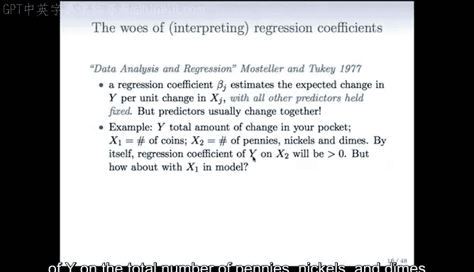

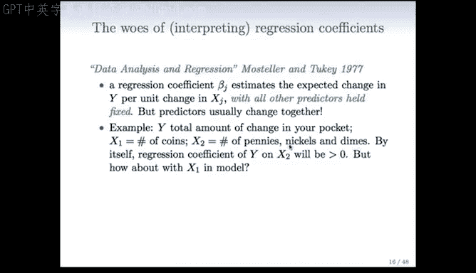

关于回归系数解释的复杂性，有一本经典著作《Data Analysis and Regression》（Mosteller 和 Tukey 著）中有一章名为“The Woes of Regression Coefficients”，对此进行了精彩论述。

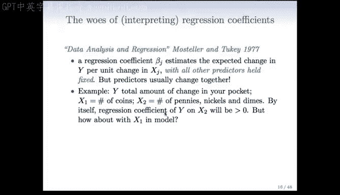

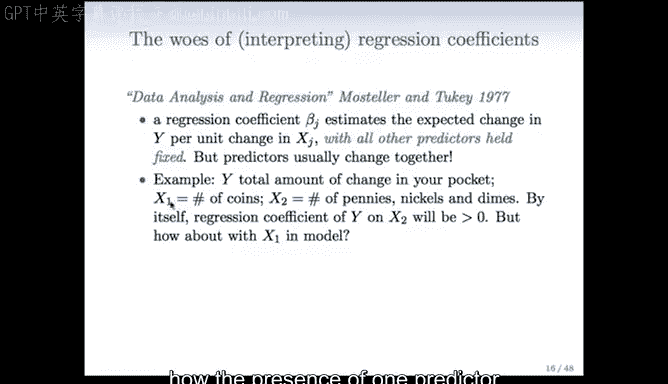

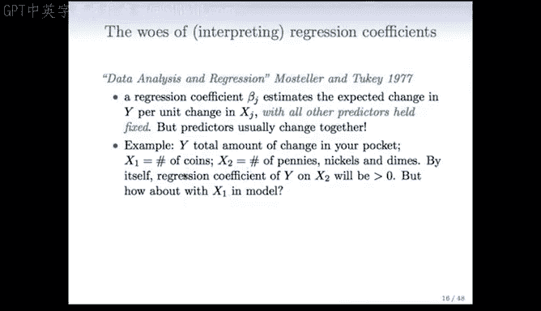

以下是两个帮助理解这一点的思考示例：

*   **示例1：口袋里的零钱**
    *   `Y`: 口袋里的零钱总额。
    *   `X₁`: 硬币总数量。
    *   `X₂`: 1美分、5美分、10美分硬币的数量。
    *   问题：在模型中已包含 `X₁`（硬币总数）的情况下，`X₂` 的系数可能是正还是负？为什么？（提示：`X₁` 和 `X₂` 高度相关）

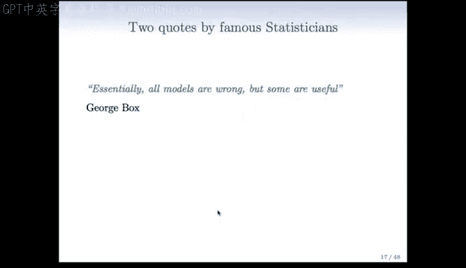

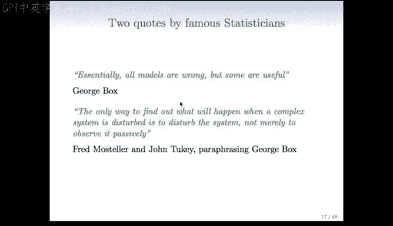

*   **示例2：美式足球擒抱次数**
    *   `Y`: 球员赛季擒抱次数。
    *   `X₁`: 体重。
    *   `X₂`: 身高。
    *   假设拟合模型后得到：体重系数为 `+0.50`，身高系数为 `-0.10`。这似乎表明“个子矮更有助于完成更多擒抱”。如何解释在模型已包含体重的情况下，身高的这个负系数？

统计学家 George Box 有两句名言很好地总结了这一点：
> “所有的模型都是错的，但有些是有用的。” —— 线性模型是对现实的近似，虽不完美但常很有用。
>
> “要了解扰动一个复杂系统会产生什么后果，唯一的方法就是去扰动它，而不是被动地观察它。” —— 强调了从观测数据中推断因果关系的困难。

## 最小二乘估计

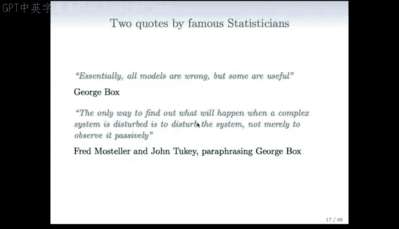

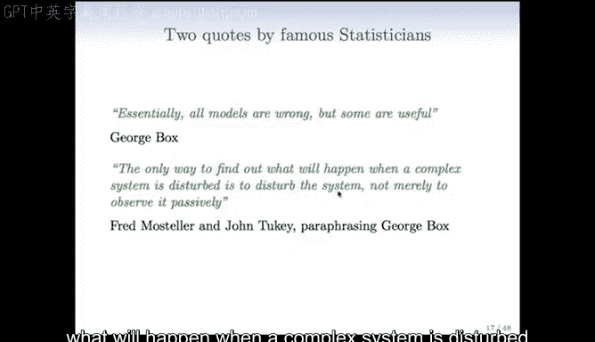

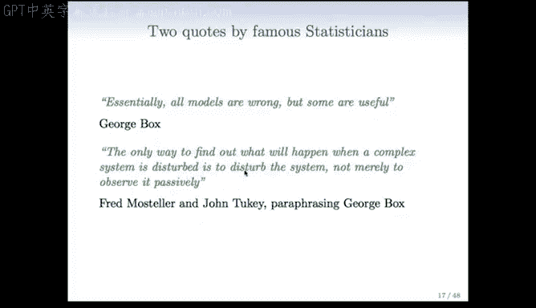

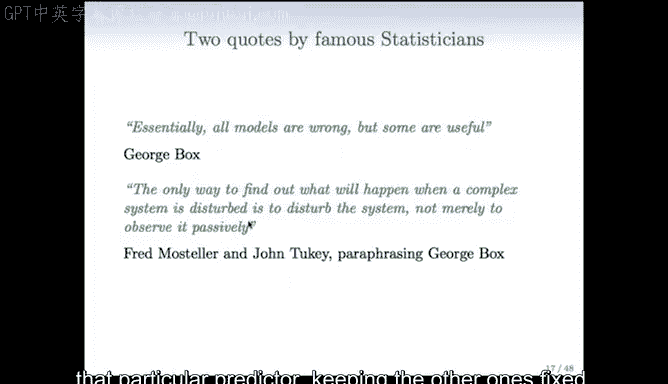

寻找多元线性回归的最小二乘估计，其思路与简单回归完全相同。

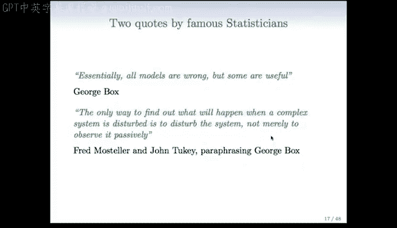

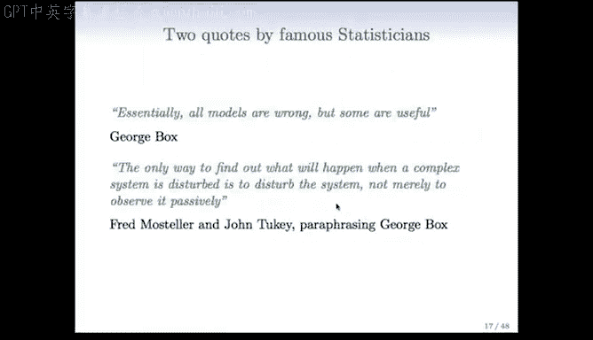

我们的预测值由以下方程给出：
`Ŷ = β̂₀ + β̂₁X₁ + β̂₂X₂ + ... + β̂_pX_p`

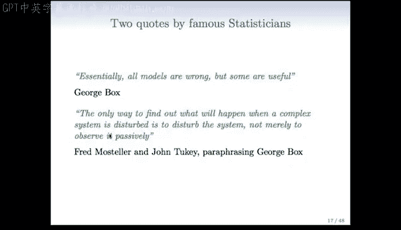

**多元最小二乘估计**就是能够最小化**残差平方和（RSS）** 的那组系数值 `(β̂₀, β̂₁, ..., β̂_p)`。
`RSS = Σ (y_i - ŷ_i)²`

我们无需手动计算这些系数（尽管在计算机时代以前人们不得不这样做）。如今，像 R 语言这样的统计软件可以快速地为大型数据集计算出最小二乘估计。

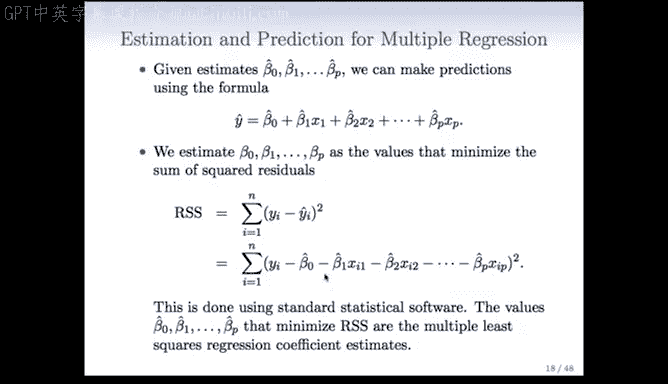

## 广告数据示例

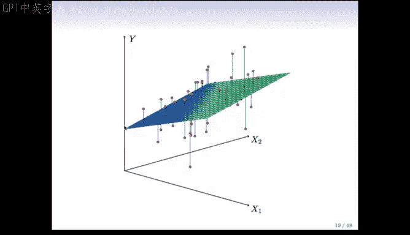

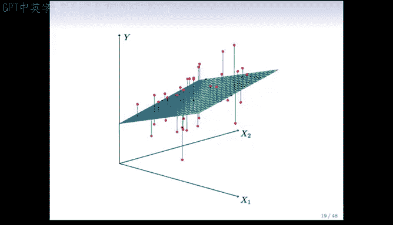

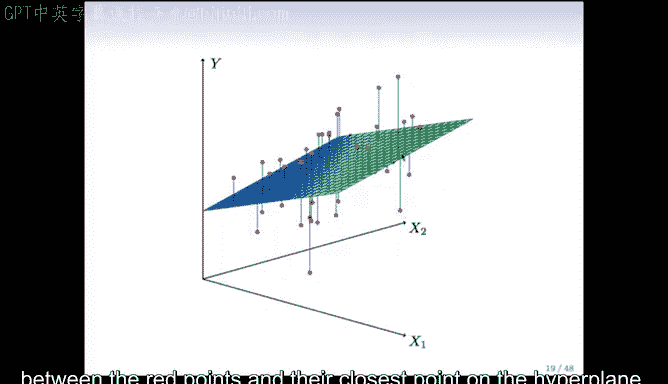

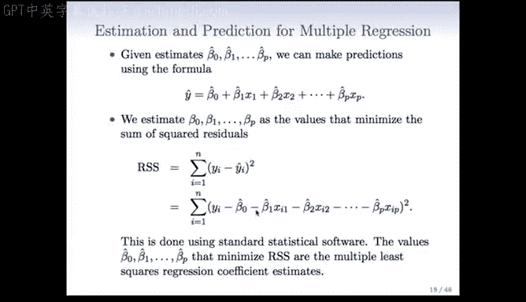

让我们回到广告数据的多元回归结果。

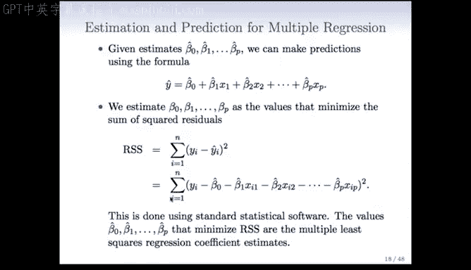

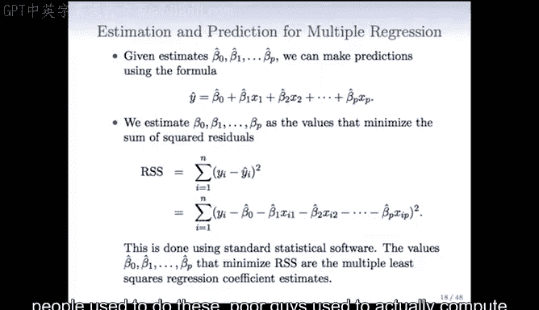

以下是模型的关键输出（系数表）：

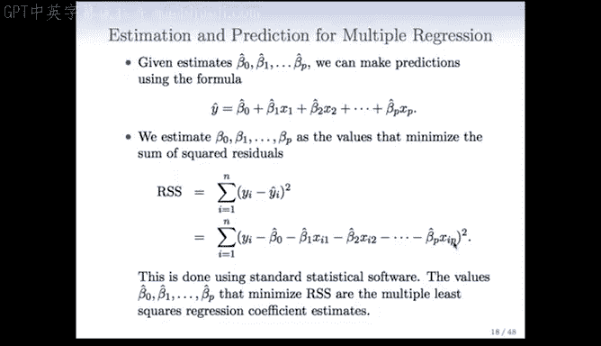

| 预测变量 | 系数估计 | 标准误 | t 统计量 | p值 |
| :--- | :--- | :--- | :--- | :--- |
| (截距) | 2.939 | 0.3119 | 9.42 | < 0.0001 |
| TV | 0.046 | 0.0014 | 32.81 | < 0.0001 |
| Radio | 0.189 | 0.0086 | 21.89 | < 0.0001 |
| Newspaper | -0.001 | 0.0059 | -0.18 | 0.8599 |

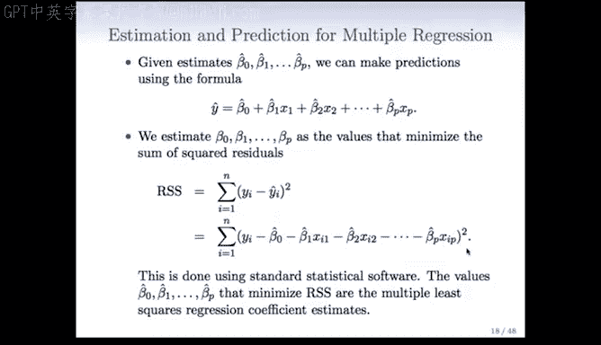

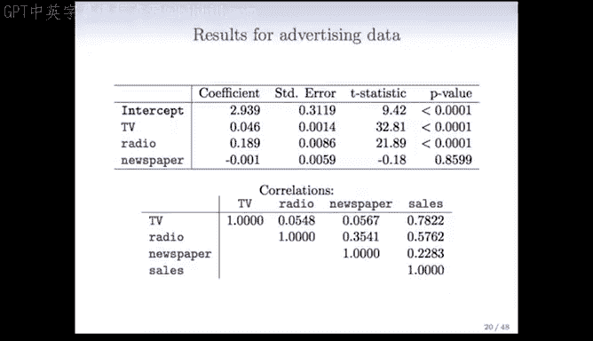

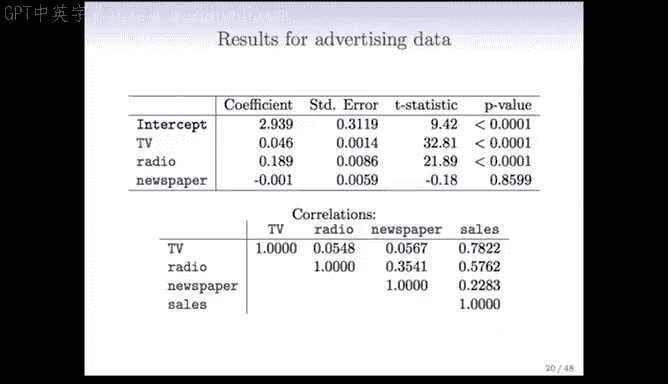

**结果解读（需谨记“在控制其他变量条件下”）：**

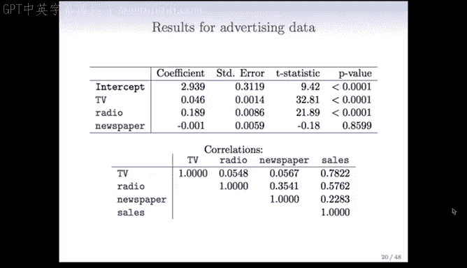

*   **TV (`β̂₁ = 0.046`)**：在控制了广播和报纸广告支出后，电视广告支出每增加1000美元，销售额平均增加约46个单位。t值很大，p值极小，表明TV的效应非常显著。
*   **Radio (`β̂₂ = 0.189`)**：在控制了电视和报纸广告支出后，广播广告支出每增加1000美元，销售额平均增加约189个单位。效应同样非常显著。
*   **Newspaper (`β̂₃ = -0.001`)**：在控制了电视和广播广告支出后，报纸广告支出的系数接近零，且t值很小(`-0.18`)，p值很大(`0.86`)。**这表明，在已知电视和广播广告投入的情况下，报纸广告投入对销售额没有显著的额外预测能力。**

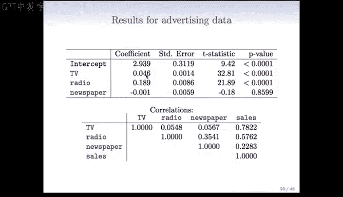

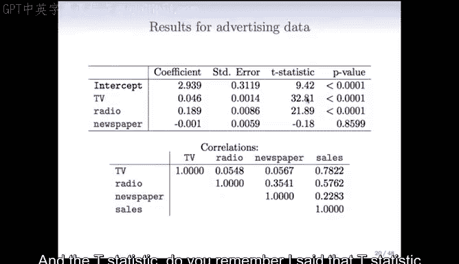

**为什么报纸广告在简单回归中可能显著，在多元回归中却不显著？**

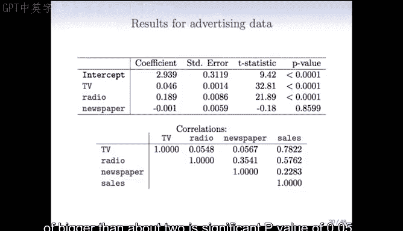

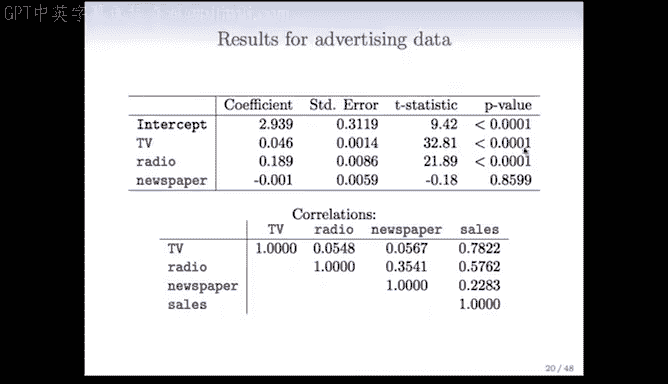

查看预测变量间的相关系数可能会找到答案：
*   Radio 和 Newspaper 的相关系数约为 `0.35`，存在一定正相关。
*   这意味着，报纸广告的效果可能已经被与之相关的广播广告所“吸收”或“代表”。一旦模型包含了广播广告这个信息更强的变量，报纸广告就不再提供额外的有用信息。

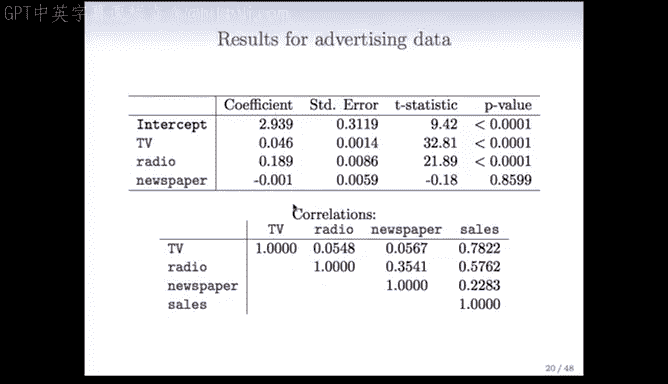

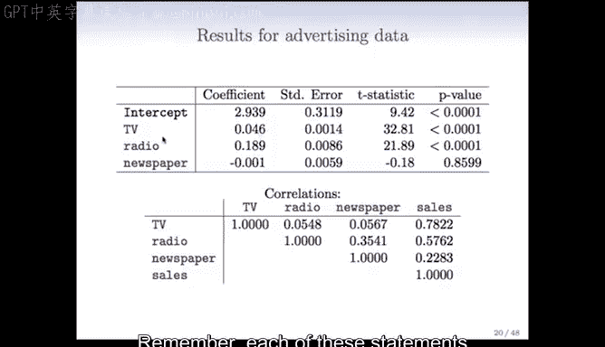

相反，TV 和 Radio 的相关系数很低，因此它们的效应在模型中可以互补，各自保持显著。

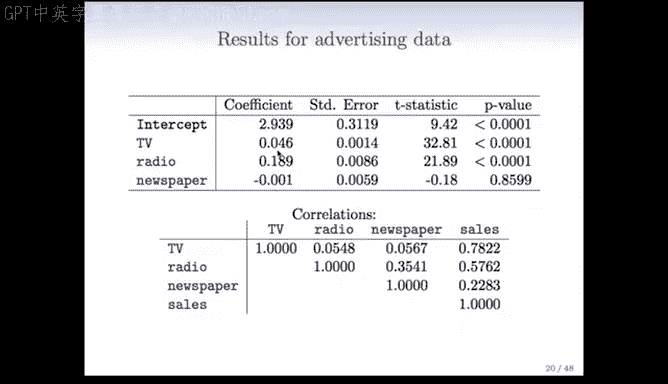

## 总结

本节课中，我们一起学习了多元线性回归的核心内容。

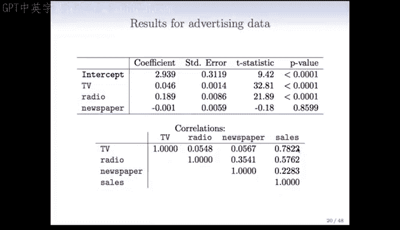

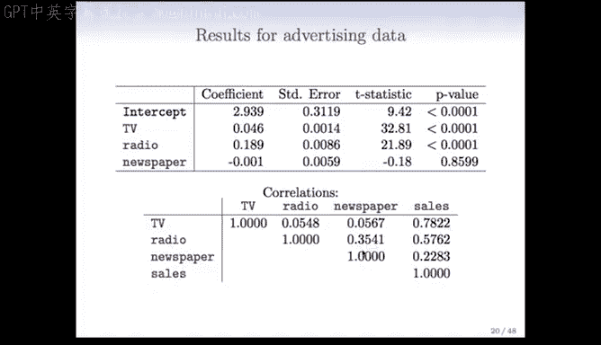

我们首先介绍了多元线性回归的模型形式，它使用一个超平面来拟合多个预测变量与响应变量之间的关系。接着，我们深入探讨了回归系数的解释，重点指出了当预测变量之间存在相关性时，对单个系数进行孤立解释的局限性和误导性，并强调在观测性研究中应避免因果断言。然后，我们了解了多元最小二乘估计的目标是最小化残差平方和，并可以通过统计软件轻松计算。最后，通过广告数据实例，我们具体分析了在控制其他变量的条件下，如何解释每个预测变量的显著性和实际意义。

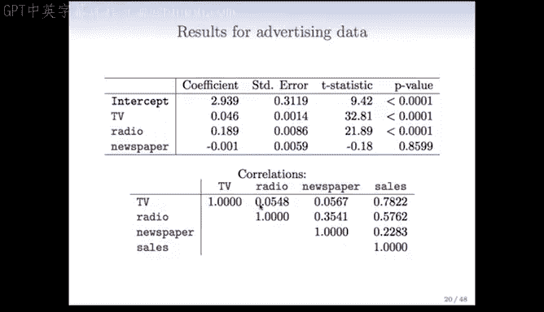

下一节，我们将讨论在实际应用回归分析时会产生的一些重要问题。