# R 版 12：回归分析中的重要问题与变量选择方法 📊 


在本节课中，我们将探讨在实际应用回归模型时可能遇到的一些关键问题，包括如何判断预测变量是否有效、如何选择重要变量，以及如何处理定性预测变量。


---

## 🔍 预测变量是否有效？

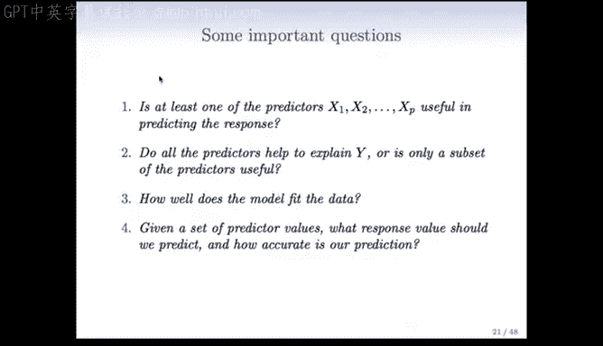

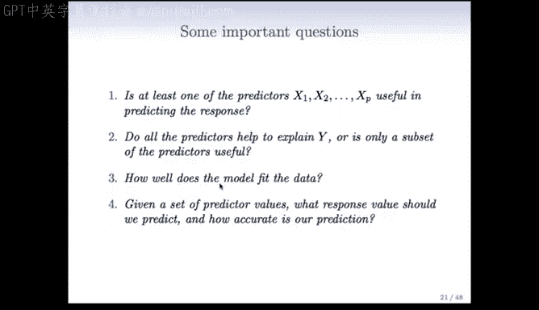

上一节我们介绍了多元线性回归模型的基本概念。本节中，我们来看看如何判断模型中至少有一个预测变量对响应变量有预测作用。

这是一个首要问题。如果所有预测变量整体上对结果都没有影响，那么分析可能应该就此停止。但如果有整体效应，我们需要进一步探究哪些预测变量是重要的，是所有都重要还是只有部分重要。

为了回答“至少有一个预测变量是否有用”这个问题，我们可以观察训练误差的下降情况。具体来说，可以计算**总平方和**（仅使用均值预测，即无预测变量模型）与**残差平方和**（使用所有预测变量）之间的差异。

**方差解释比例**（R²）定义为：
```
R² = (TSS - RSS) / TSS
```
其中 TSS 是总平方和，RSS 是残差平方和。例如，在广告数据中，使用三个预测变量后，R² 达到了 0.897，这意味着使用这三个预测变量解释了销售额围绕其均值变异的近 90%。

为了更量化地进行统计检验，我们可以构建 **F 统计量**：
```
F = ((TSS - RSS) / p) / (RSS / (n - p - 1))
```
其中 p 是拟合的参数数量（本例中为 3），n 是样本大小。在原假设（所有预测变量均无效）下，该统计量服从自由度为 p 和 n-p-1 的 F 分布。计算出的 F 统计量通常很大，其 p 值极小（如 < 0.0001），这有力地拒绝了原假设，表明预测变量对结果有显著影响。

---

## 🎯 如何选择重要变量？

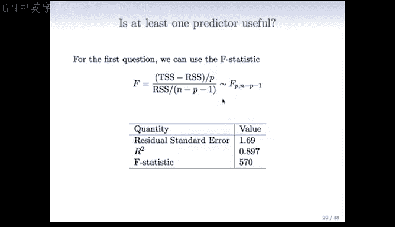

当我们拟合线性回归模型时，必须决定将哪些重要变量纳入模型。最直接的方法是**全子集回归**或**最优子集回归**。


以下是其基本思路：计算所有可能变量子集的最小二乘拟合，然后根据某些平衡训练误差与模型复杂度的准则，从中选择最佳模型。


这种方法在变量数量较少时可行，但当变量数量 P 很大时，会变得非常困难。因为可能的子集数量是 2^P，呈指数级增长。例如，当 P=40 时，模型数量超过 10 亿个。显然，搜索如此庞大的模型空间是不现实的。


因此，我们需要一种自动化的方法来搜索并找到一个好的变量子集。接下来我们将描述两种常用方法。

---

### ➡️ 前向选择

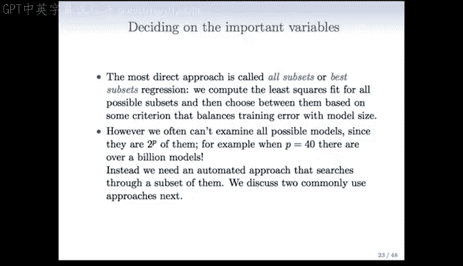

前向选择是一种有吸引力且易于处理的方法，它能产生一系列良好的模型。

以下是其工作原理：
1.  从一个**空模型**开始，该模型只包含截距项（即 Y 的均值）。
2.  逐一添加变量。首先，拟合 P 个只包含一个变量和截距的简单线性回归模型，选择能使残差平方和降低最多的那个变量加入模型。
3.  固定已选入的变量，在剩余的 P-1 个变量中再次搜索，找出能最大程度改善当前模型残差平方和的变量加入。
4.  重复此过程，每次添加一个变量，直到满足某个停止规则（例如，所有剩余变量的 p 值都高于某个阈值）。

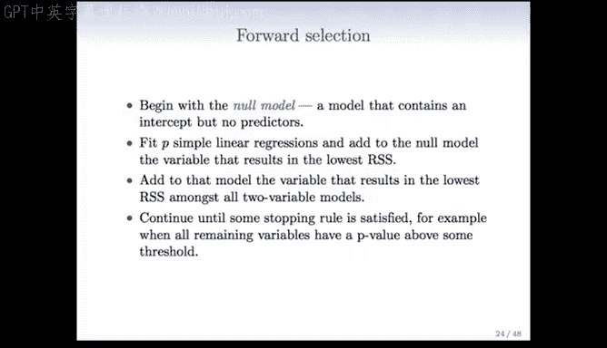

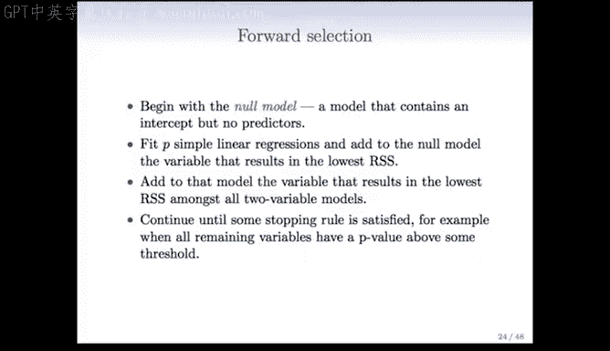

尽管听起来计算量可能很大，但实际上可以利用一些技巧高效地完成所有评估。

---

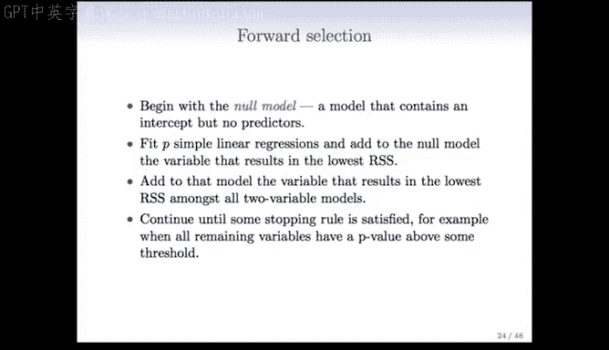

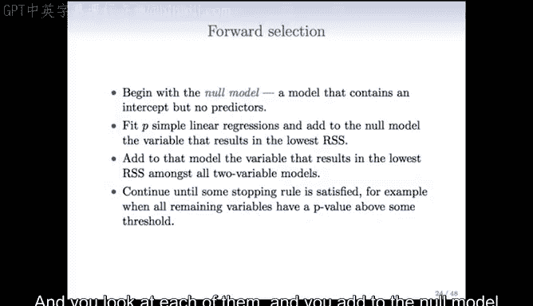

### ⬅️ 后向选择

与前向选择类似，如果变量数量 P 不是特别大，可以从另一端开始，即**后向选择**。

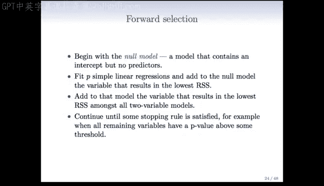

以下是其工作原理：
1.  从一个包含**所有变量**的完整模型开始。
2.  逐一移除变量。在每一步，移除对模型损害最小的变量，即统计显著性最弱的变量。这可以通过查看每个变量的 t 统计量来实现，移除 t 统计量最不显著的那个。
3.  得到一个包含 P-1 个变量的模型后，重复此过程，继续移除最不显著的变量。
4.  持续进行，直到达到预定义的阈值（例如，基于 p 值）。

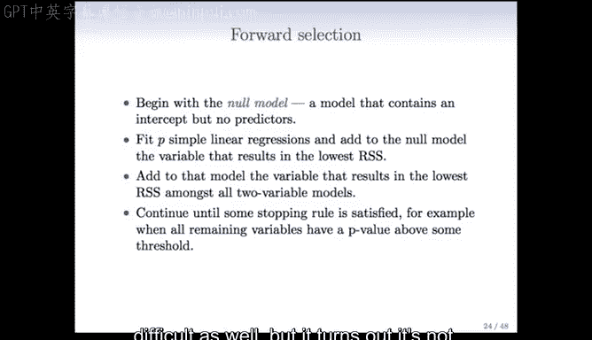

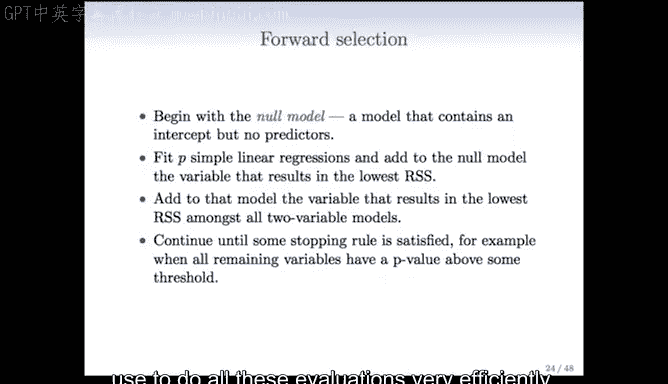

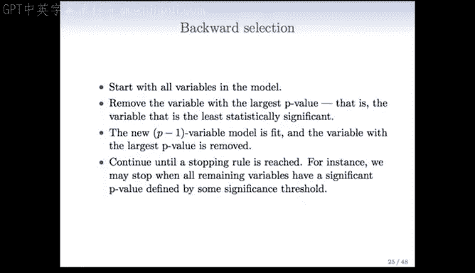

这两种方法（前向和后向选择）可能看起来有些特殊，但它们非常有效。在后续课程中，我们将讨论更系统的准则，用于在前向或逐步模型选择产生的模型路径中选择最优模型。


---

### 📊 模型选择准则

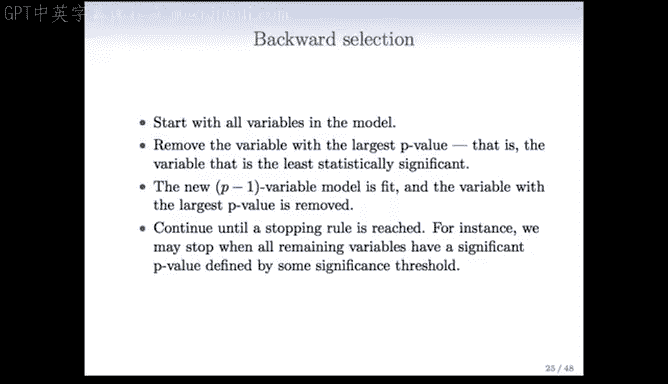

以下是一些常用的模型选择准则：
*   **马洛斯 Cp 准则 (Mallow‘s Cp)**
*   **赤池信息准则 (Akaike Information Criterion, AIC)**
*   **贝叶斯信息准则 (Bayesian Information Criterion, BIC)**
*   **调整后 R 方 (Adjusted R²)**
*   **交叉验证 (Cross-Validation)** - 这是我们非常喜欢的一种方法，后续将会学习。

我们将在后面的课程中更详细地讨论模型选择。


---


## 👥 如何处理定性预测变量？

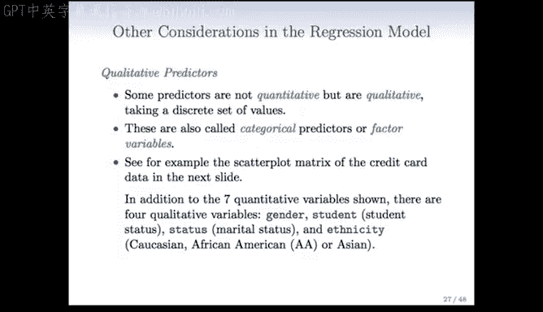

回归模型中还有一些我们尚未涉及的其他考虑因素，其中之一就是**定性预测变量**。

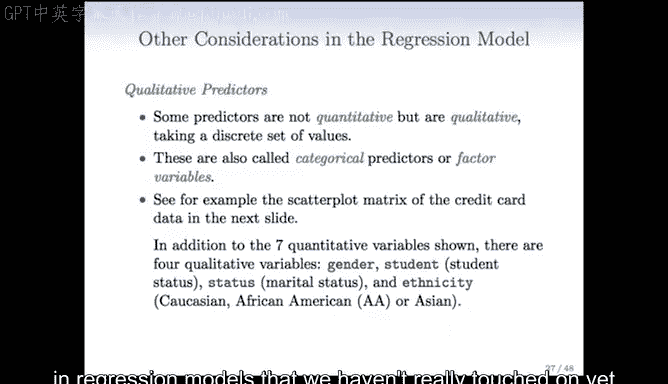

有些变量不是定量的，而是定性的。换句话说，它们不在连续尺度上取值，而是在一个离散集合中取值。我们称之为**分类预测变量**或**因子变量**。

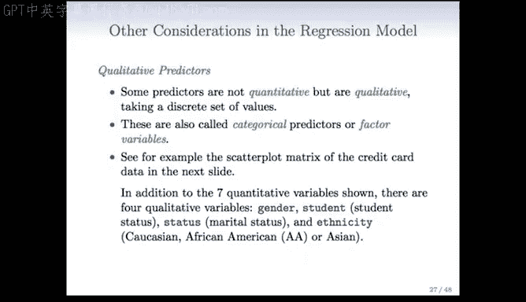

例如，在信用卡数据中，除了“当前余额”、“年龄”、“卡片数量”等定量变量外，还有以下定性变量：
*   **性别**：取值为男性或女性。
*   **学生状态**：持卡人是否是学生。
*   **婚姻状况**：已婚、单身或离异（这些类别没有顺序）。
*   **种族**：白种人、非裔美国人或亚裔（同样没有顺序）。

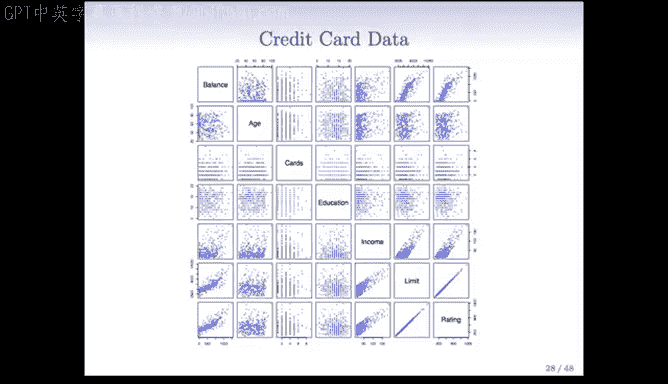

那么，在拟合线性回归模型时，我们如何处理这类定性预测变量呢？

---

### 🔢 创建虚拟变量

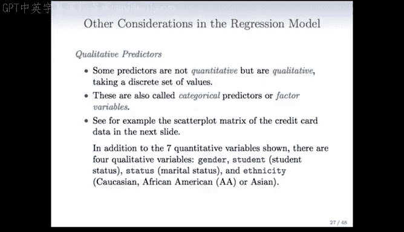

以研究忽略其他变量时，男性和女性信用卡余额的差异为例。

我们创建一个新变量，称为 **虚拟变量** 或 **哑变量**。例如，定义变量 X_i：
*   如果第 i 个人是女性，则 X_i = 1。
*   如果第 i 个人是男性，则 X_i = 0。

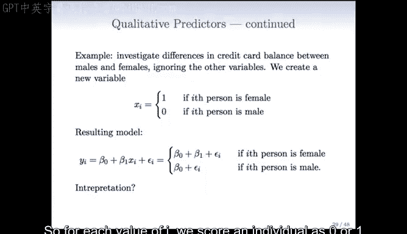

现在，将这个虚拟变量放入模型。由于 X_i 只能取 0 或 1，模型可以表示为：
*   如果为女性：Y = β₀ + β₁ * 1 + ε
*   如果为男性：Y = β₀ + β₁ * 0 + ε = β₀ + ε

因此，β₁ 表示相对于基线（本例中为男性），身为女性的效应。

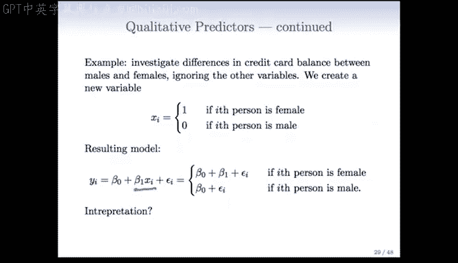

在仅使用性别这个虚拟变量的回归结果中，系数为 19.73，但 p 值为 0.66，不显著。这表明，与普遍看法相反，女性的信用卡余额并未显著高于男性。

---

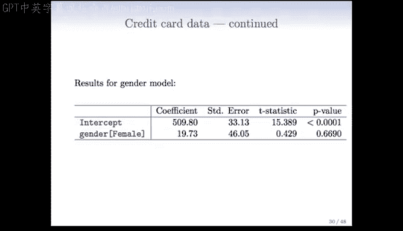

### 🔢 处理多水平定性变量

如果一个定性变量有两个以上的水平（例如，种族有三个水平：亚裔、白种人、非裔美国人），我们只需创建更多的虚拟变量。

一般规则是：如果一个分类变量有 k 个水平，则需要创建 k-1 个虚拟变量来表示这些类别。

对于种族变量（三个水平），我们创建两个虚拟变量：
*   X_i1：如果第 i 个人是亚裔则为 1，否则为 0。
*   X_i2：如果第 i 个人是白种人则为 1，否则为 0。

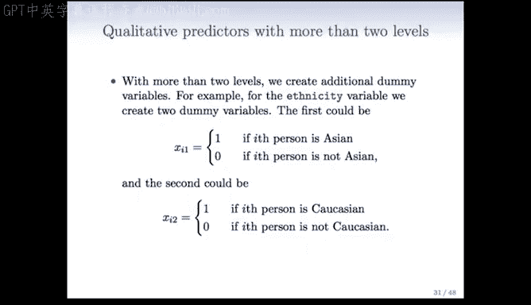


如果 X_i1 和 X_i2 都为 0，则该个体是非裔美国人。

此时的模型包含两个系数（β₁ 和 β₂），分别对应这两个虚拟变量：
*   亚裔：Y = β₀ + β₁ * 1 + β₂ * 0 + ε = β₀ + β₁ + ε
*   白种人：Y = β₀ + β₁ * 0 + β₂ * 1 + ε = β₀ + β₂ + ε
*   非裔美国人：Y = β₀ + β₁ * 0 + β₂ * 0 + ε = β₀ + ε

在这里，β₀ 代表基线水平（非裔美国人）的效应。β₁ 表示亚裔相对于非裔美国人的额外效应，β₂ 表示白种人相对于非裔美国人的额外效应。

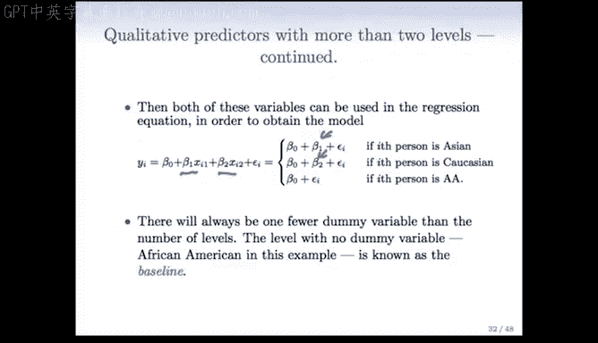


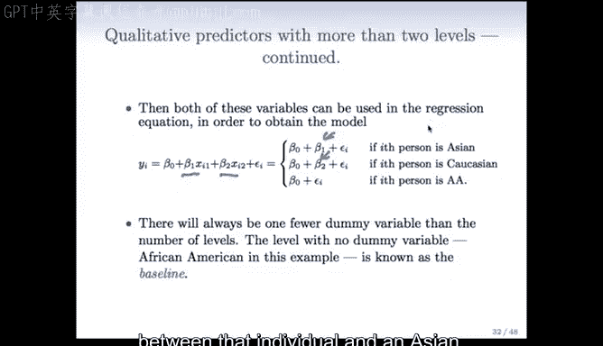

选择哪个类别作为基线不会影响模型的拟合优度（残差平方和保持不变），但会改变所进行的对比。因为基线决定了你正在比较的是哪两个组，所以 p 值可能会随着基线的改变而变化。

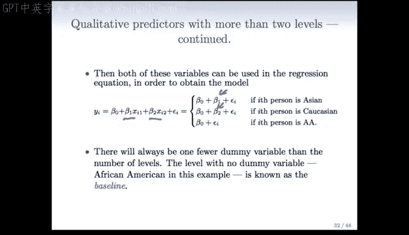

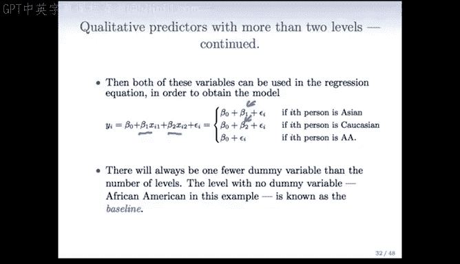

---

## 📝 总结

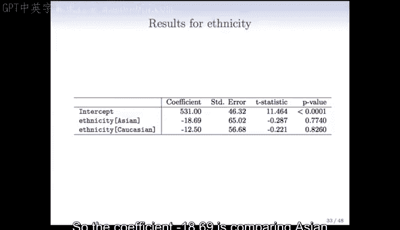

本节课中我们一起学习了回归分析中的几个核心问题：
1.  通过 F 检验和 R² 判断预测变量的整体有效性。
2.  介绍了**全子集回归**的局限性，并学习了两种实用的变量选择方法：**前向选择**和**后向选择**。
3.  了解了处理**定性预测变量**的方法，即通过创建**虚拟变量**将其纳入线性回归模型，并理解了基线水平的选择对系数解释的影响。

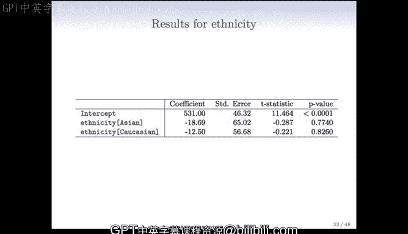

掌握这些概念和方法，将帮助你在实际数据分析中更有效地构建和解释回归模型。