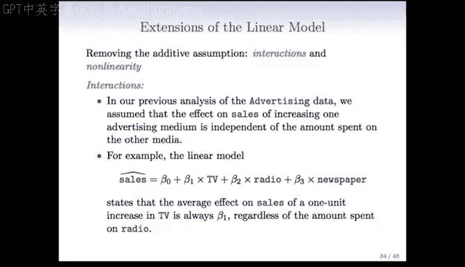
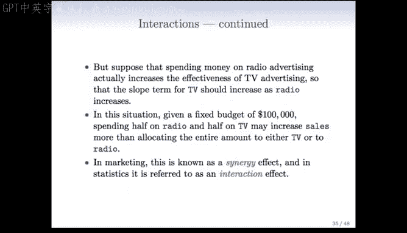
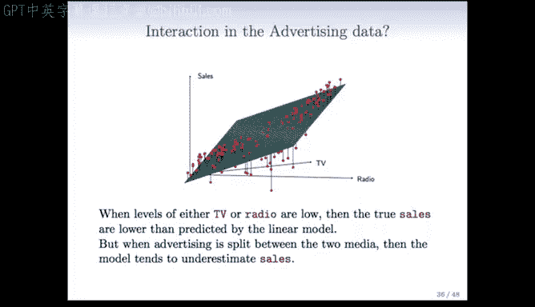
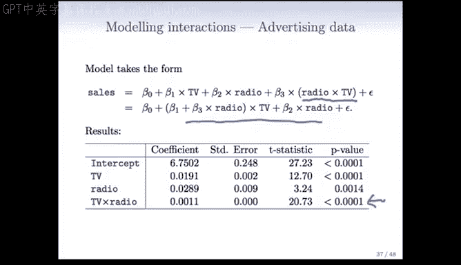
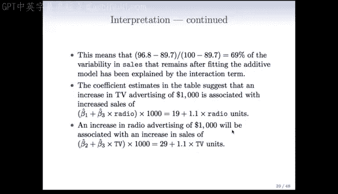
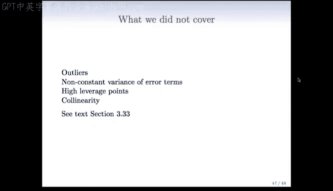
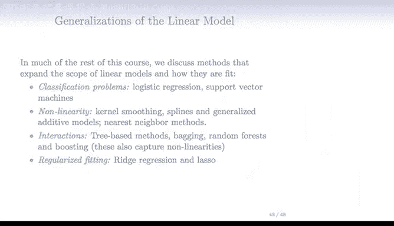

# R 版 13：线性模型的扩展 📊 

在本节课中，我们将学习线性回归模型的几种重要扩展方法。这些扩展能帮助我们处理更复杂的现实数据关系，包括变量间的交互作用以及非线性效应。

---

## 🔄 交互作用

上一节我们介绍了基础的线性模型。本节中，我们来看看如何在线性模型中纳入交互作用。

在之前对广告数据的分析中，我们假设增加一种广告媒介（如电视）对销售额的影响，独立于在其他媒介（如广播）上的花费。例如，在线性模型 `sales = β0 + β1×TV + β2×radio + β3×newspaper` 中，电视广告的系数 β1 是固定的，不随广播广告投入的变化而改变。

但实际情况中，广播广告的投入可能会提升电视广告的效果。这意味着电视广告的斜率应随广播投入的增加而增加。在市场营销中，这被称为协同效应；在统计学中，我们称之为交互效应。

以下是在模型中纳入交互作用的方法：

*   **添加乘积项**：我们在模型中加入预测变量的乘积作为一个新项。例如：`sales = β0 + β1×TV + β2×radio + β3×(TV×radio)`。
*   **模型解释**：这个模型可以重新整理为 `sales = β0 + (β1 + β3×radio)×TV + β2×radio`。这表明，电视广告的系数现在变成了 `(β1 + β3×radio)`，它会随着广播投入 `radio` 的值变化而变化。
*   **层次原则**：当模型中包含交互项时，即使其对应的主效应项（如单独的 `TV` 和 `radio`）不显著，通常也应将其保留在模型中。这是因为没有主效应时，交互效应的解释会变得困难且不直观。

---

## 📈 定性变量的交互作用

我们已了解了两个定量变量间的交互作用。现在，我们看看如何处理一个定量变量和一个定性变量之间的交互。

以信用卡数据为例，我们想用定量变量 `income`（收入）和定性变量 `student`（学生身份）来预测 `balance`（余额）。我们为学生身份创建一个虚拟变量。

*   **无交互作用的模型**：模型形式为 `balance = β0 + β1×income + β2×student`。这表示学生和非学生群体有相同的收入斜率 `β1`，但截距不同（学生截距为 `β0+β2`，非学生为 `β0`）。
*   **包含交互作用的模型**：模型形式为 `balance = β0 + β1×income + β2×student + β3×(income×student)`。
    *   对于非学生（`student=0`）：模型简化为 `balance = β0 + β1×income`。
    *   对于学生（`student=1`）：模型变为 `balance = (β0+β2) + (β1+β3)×income`。
*   **结果解释**：包含交互项后，模型允许学生和非学生群体不仅拥有不同的截距，还拥有不同的收入斜率。这使得模型能更灵活地捕捉不同组别间的关系。

---

## 🧮 非线性关系

最后，我们探讨如何让线性模型捕捉预测变量与响应变量之间的非线性关系。

以汽车数据为例，`mpg`（每加仑英里数）与 `horsepower`（马力）的关系显然不是直线。我们可以通过加入预测变量的多项式项来扩展线性模型，以拟合这种曲线关系。

*   **多项式回归**：例如，要拟合一个二次关系，我们可以创建新变量 `horsepower²`，并将模型构建为 `mpg = β0 + β1×horsepower + β2×horsepower²`。我们还可以加入更高次项（如立方项）来拟合更复杂的曲线。
*   **模型性质**：这仍然被称为**线性模型**，因为它在参数（β0, β1, β2...）上是线性的。我们只是通过添加由原始变量构造的新特征（如 `horsepower²`）来引入非线性。
*   **实现方法**：这种方法极大地扩展了线性回归的适用范围，同时我们仍然可以使用最小二乘法等标准线性模型技术进行拟合。

---

## 📝 总结与展望

本节课中，我们一起学习了线性模型的三个重要扩展：**交互作用**、**包含定性变量的交互**以及**多项式回归**。这些技术使我们能够用线性模型的框架来处理更复杂的现实世界数据关系。

本章节还有一些其他重要主题未在此详述，例如异常值处理、误差项的非恒定方差、高杠杆点以及共线性问题。这些内容在教材中有详细讨论。

线性模型是一个强大的框架。在接下来的课程中，我们将看到它的更多推广：
*   对于分类问题，我们将讨论**逻辑回归**和**支持向量机**。
*   对于非线性建模，我们将介绍**核平滑**、**样条**和**广义加性模型**。
*   为了更系统地处理交互和非线性，我们将学习基于树的方**法，如随机森林和提升法**。
*   对于变量数很多的数据集，我们将介绍使用**正则化拟合**的技术，如**岭回归和LASSO**。

这些方法共同构成了现代统计学习的核心工具箱。