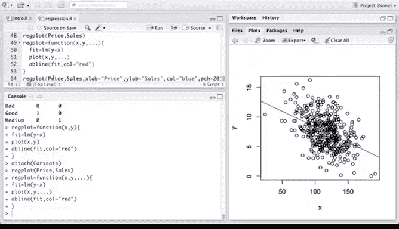

# R 版 14：R语言中的回归分析 📊

在本节课中，我们将学习如何在R语言中实现线性回归模型。我们将从简单的线性回归开始，逐步过渡到多元线性回归、非线性项和交互项的引入，以及如何处理定性预测变量。最后，我们还会学习如何编写自定义的R函数来封装建模和绘图过程。

---

## 加载数据与库

首先，我们需要加载必要的R包和数据。`MASS` 包包含我们将要使用的数据集，而 `ISLR` 包则包含了教材中使用的数据。

```r
library(MASS)
library(ISLR)
```

---

## 简单线性回归

上一节我们介绍了线性回归的基本概念，本节中我们来看看如何在R中实现它。我们将使用 `Boston` 数据集，它包含了波士顿郊区住房的多个社会经济指标。

```r
# 查看数据集中的变量名
names(Boston)
# 获取数据集的详细帮助信息
?Boston
```

`Boston` 数据框有506行和14列。例如，`medv` 代表业主自住房屋的中位数价值（以10万美元计），`lstat` 代表该地区较低社会地位人口的百分比。

首先，我们绘制 `medv` 和 `lstat` 的散点图，以观察它们之间的关系。

```r
plot(medv ~ lstat, data = Boston)
```

从图中可以看出，随着 `lstat` 的增加，`medv` 呈下降趋势。

接下来，我们拟合一个简单的线性回归模型。公式 `medv ~ lstat` 表示用 `lstat` 来预测 `medv`。

```r
fit1 <- lm(medv ~ lstat, data =Boston)
# 打印模型基本信息
fit1
# 获取更详细的模型摘要
summary(fit1)
```

`summary` 函数提供了丰富的输出，包括：
*   系数估计值及其标准误、t值和p值。
*   残差摘要。
*   模型的R平方值。

我们可以使用 `abline` 函数将拟合的回归线添加到散点图上。

```r
plot(medv ~ lstat, data = Boston)
abline(fit1, col="red")
```

以下是其他一些有用的函数：
*   `confint`：获取模型系数的置信区间。
*   `predict`：使用模型进行预测，并可计算预测值的置信区间。

```r
# 获取系数的95%置信区间
confint(fit1)
# 对新数据进行预测并计算置信区间
predict(fit1, data.frame(lstat=c(5,10,15)), interval="confidence")
```

---

## 多元线性回归

现在，我们尝试使用多个预测变量来拟合模型。在公式中，使用加号 `+` 来分隔多个预测变量。

```r
# 使用 lstat 和 age 两个变量进行拟合
fit2 <- lm(medv ~ lstat + age, data=Boston)
summary(fit2)
```

模型摘要显示，`lstat` 和 `age` 的系数都是显著的。我们还可以看到模型的R平方值。

我们可以使用公式中的点号 `.` 来包含除响应变量外的所有其他变量作为预测变量。

```r
# 使用除 medv 外的所有变量进行拟合
fit3 <- lm(medv ~ ., data=Boston)
summary(fit3)
```

在这个包含所有预测变量的模型中，`age` 变量变得不再显著。这表明其他变量与 `age` 高度相关，在它们存在的情况下，`age` 的额外解释力就很小了。

我们可以绘制模型诊断图来评估模型假设和拟合效果。

```r
par(mfrow=c(2,2)) # 设置2x2的绘图布局
plot(fit3)
```

第一张图（残差 vs. 拟合值）显示出明显的曲线模式，提示模型可能存在未捕捉到的非线性关系。

`update` 函数可以方便地基于现有模型进行修改，例如移除某些变量。

```r
# 从 fit3 中移除 age 和 indus 变量
fit4 <- update(fit3, ~ . - age - indus)
summary(fit4)
```

---

## 非线性与交互作用

之前我们发现 `medv` 和 `lstat` 的关系可能是非线性的。我们可以通过引入多项式项或交互项来建模更复杂的关系。

在公式中，星号 `*` 表示包含两个变量的主效应及其交互效应。

```r
# 拟合包含 lstat 和 age 交互项的模型
fit5 <- lm(medv ~ lstat * age, data=Boston)
summary(fit5)
```

要显式地加入二次项，可以使用 `I()` 函数来保护算术运算符，使其在公式语法中保持原意。

```r
# 拟合包含 lstat 二次项的模型
fit6 <- lm(medv ~ lstat + I(lstat^2), data=Boston); summary(fit6)
```

我们也可以使用 `poly` 函数方便地拟合多项式回归。

```r
# 拟合 lstat 的四次多项式
fit7 <- lm(medv ~ poly(lstat, 4), data=Boston)
```

为了将非线性拟合线添加到图中，我们需要手动计算并绘制拟合值。

```r
# 将变量附加到搜索路径，方便绘图
attach(Boston)
par(mfrow=c(1,1)) # 恢复单图布局
plot(medv ~ lstat)
# 添加二次拟合线（红色圆点）
points(lstat, fitted(fit6), col="red", pch=20)
# 添加四次多项式拟合线（蓝色圆点）
points(lstat, fitted(fit7), col="blue", pch=20)
```

---

## 定性预测变量

接下来，我们看看如何处理定性（分类）预测变量。我们将使用 `Carseats` 数据集。

```r
# 查看数据集
fix(Carseats) # 弹出数据编辑器
names(Carseats)
summary(Carseats)
```

`summary` 函数对于定性变量（如 `ShelveLoc`）会显示其不同水平的频数表。

我们可以像使用定量变量一样，在公式中包含定性变量。R会自动为其生成虚拟变量。

```r
# 拟合包含所有变量及两个交互项的模型
fit8 <- lm(Sales ~ . + Income:Advertising + Age:Price, data=Carseats)
summary(fit8)
```

`contrasts` 函数可以查看R是如何为某个因子变量创建虚拟变量的编码方案。

```r
contrasts(Carseats$ShelveLoc)
```

---

## 编写自定义函数

最后，我们来学习如何编写简单的R函数，将建模和绘图步骤封装起来，提高代码的复用性。

以下是一个基础函数，它接受预测变量 `x` 和响应变量 `y`，拟合模型并绘制带回归线的散点图。

```r
regplot <- function(x, y) {
  fit <- lm(y ~ x)
  plot(x, y)
  abline(fit, col="red")
}
```

使用该函数：

```r
attach(Carseats)
regplot(Price, Sales)
```

我们可以改进这个函数，通过 `...` 参数来传递额外的图形参数（如坐标轴标签、颜色等）给内部的 `plot` 函数。

```r
regplot <- function(x, y, ...) {
  fit <- lm(y ~ x)
  plot(x, y, ...)
  abline(fit, col="red")
}
```

现在，我们可以在调用函数时自定义图形：

```r
regplot(Price, Sales, xlab="Price", ylab="Sales", col="blue", pch=20)
```



---

## 总结


本节课中我们一起学习了在R语言中进行回归分析的核心操作。我们从简单线性回归入手，掌握了使用 `lm()` 函数拟合模型、使用 `summary()` 解读结果、以及使用 `plot()` 和 `abline()` 进行可视化。接着，我们扩展到多元线性回归，学习了如何通过公式语法添加多个预测变量、交互项（`*`）和多项式项（`I(x^2)` 或 `poly()`）。我们还探讨了如何处理定性预测变量，以及如何利用 `update()` 函数修改现有模型。最后，我们通过编写自定义的 `regplot` 函数，了解了如何封装分析流程以提高效率。R语言的回归建模功能非常强大，鼓励大家多动手实践，查阅帮助文件（`?function_name`），以探索更多可能性。