# R 版 16：逻辑回归 📊

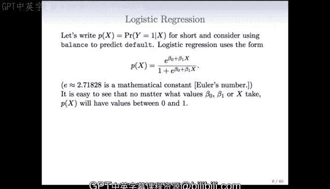

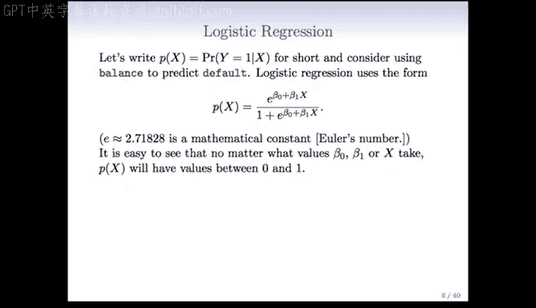

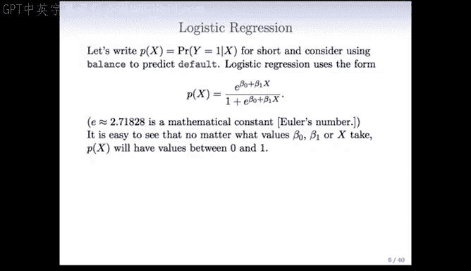

在本节课中，我们将要学习逻辑回归模型。这是一种用于预测二元结果（例如“是”或“否”）的统计方法。我们将从模型的基本形式开始，解释其如何将线性模型的输出转换为概率，并介绍如何使用最大似然法来估计模型参数。


---

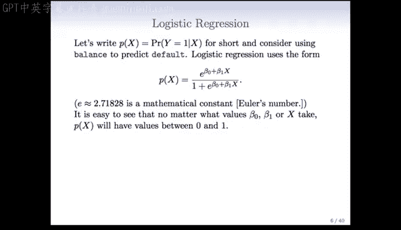

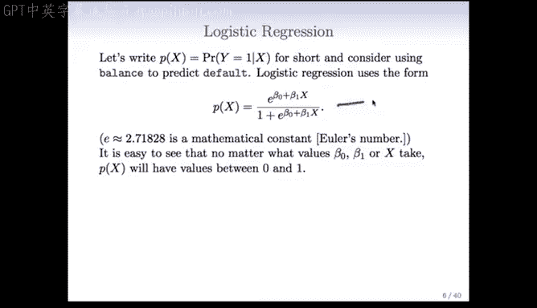

## 逻辑回归模型

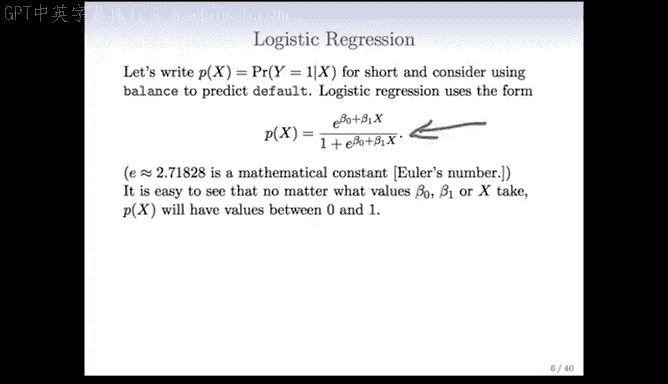

上一节我们介绍了线性回归用于预测连续值。本节中我们来看看当预测目标是二元分类（如是否违约）时，逻辑回归模型的形式。


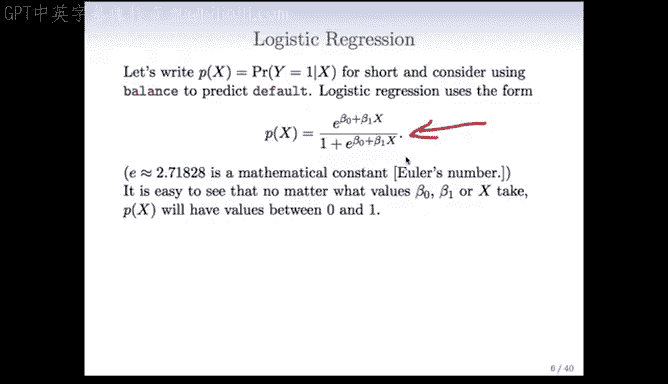

我们记 `P(x)` 为给定预测变量 `x` 时，结果 `y` 为 1 的概率。逻辑回归模型使用以下公式来建模这个概率：

**公式：**
`P(x) = e^(β₀ + β₁x) / (1 + e^(β₀ + β₁x))`

其中 `e` 是自然常数。这个公式确保了无论 `β₀ + β₁x` 的值是多少，`P(x)` 的输出始终在 0 到 1 之间，符合概率的定义。

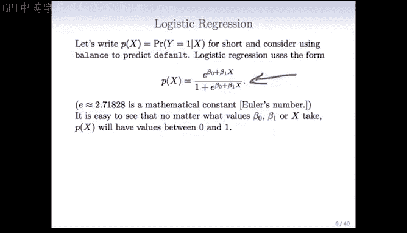

---

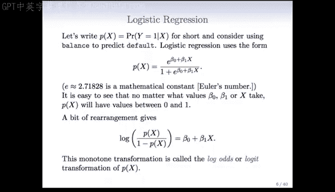

## 逻辑变换（Logit Transformation）

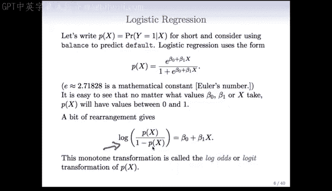


这个模型之所以被称为“逻辑”回归，源于一个关键的单调变换。我们对几率（odds）取自然对数，可以得到一个线性形式。

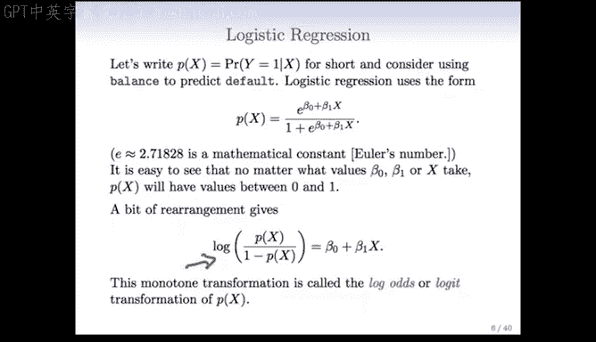

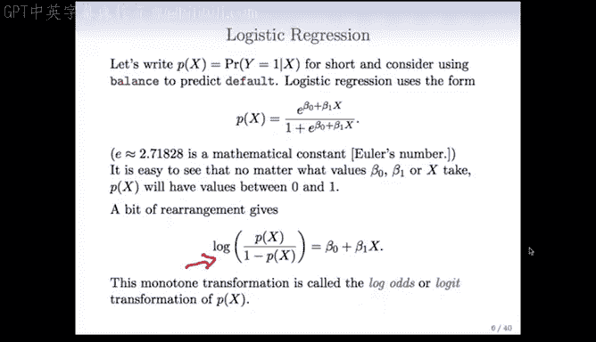

**公式：**
`log( P(x) / (1 - P(x)) ) = β₀ + β₁x`

等号左边的部分 `log( P(x) / (1 - P(x)) )` 被称为**对数几率**或 **logit 变换**。通过这个变换，我们就能使用线性模型的工具来处理概率问题。

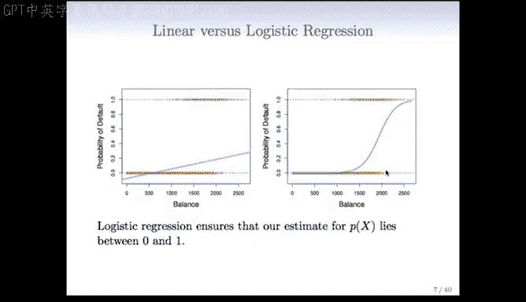

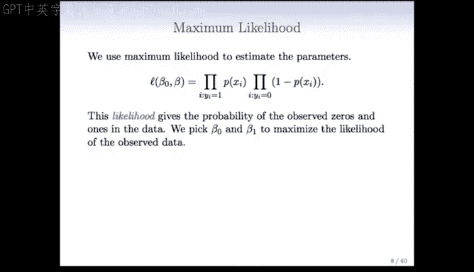

---

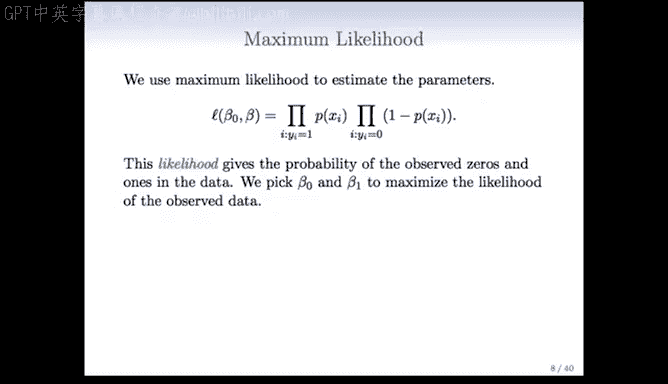

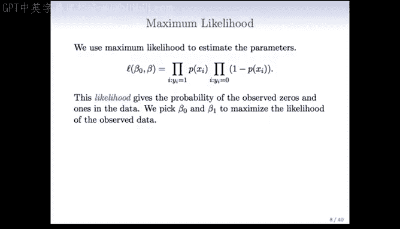

## 参数估计：最大似然法

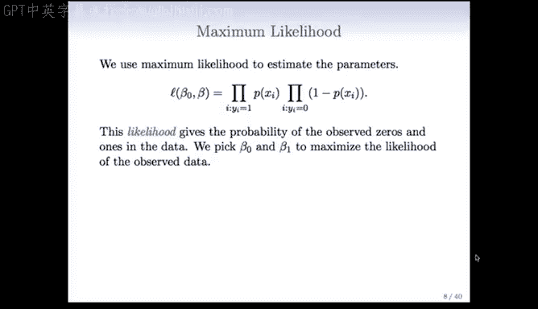

我们已经定义了模型，那么如何从数据中估计参数 `β₀` 和 `β₁` 呢？最常用的方法是**最大似然估计**，由统计学家罗纳德·费希尔（Ronald Fisher）推广。

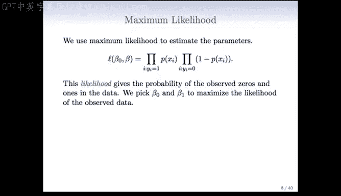

其核心思想是：对于给定的参数值，我们可以计算观察到当前这组数据（一系列0和1）的联合概率。最大似然法就是寻找能使这个联合概率最大化的参数值。

以下是计算似然函数的过程：


**公式：**
`L(β₀, β₁) = Π [P(x_i)]^y_i * [1 - P(x_i)]^(1 - y_i)`

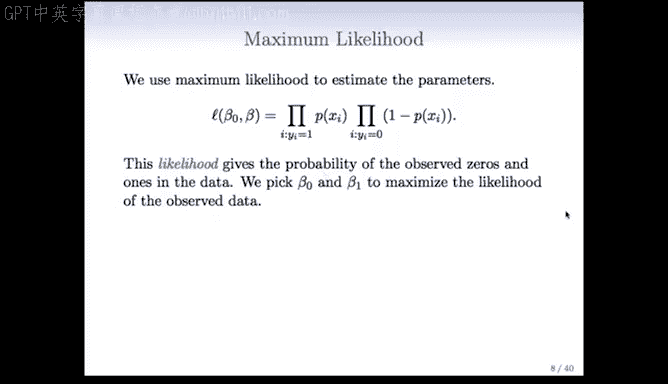

其中，`Π` 表示连乘，`y_i` 是第 `i` 个观测的实际结果（0或1），`P(x_i)` 是模型预测的概率。我们通过优化算法（如R语言中的 `glm()` 函数）来找到使 `L` 最大的 `β₀` 和 `β₁`。

---

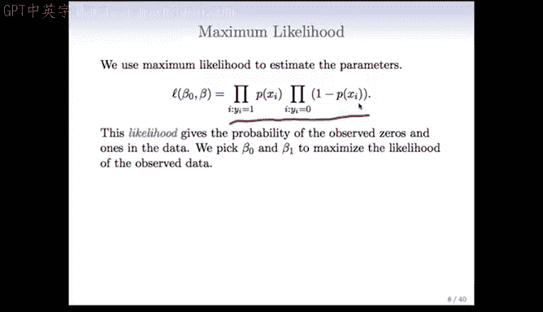

## 模型拟合示例

让我们回到信用卡违约预测的例子，仅使用`balance`（欠款余额）这一个变量来拟合逻辑回归模型。

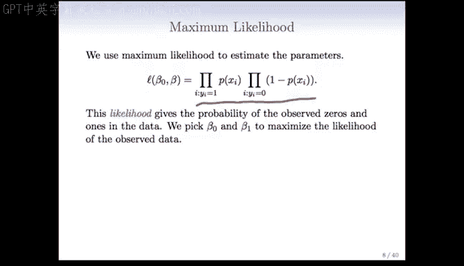

使用统计软件（如R）拟合后，我们得到以下系数估计结果：

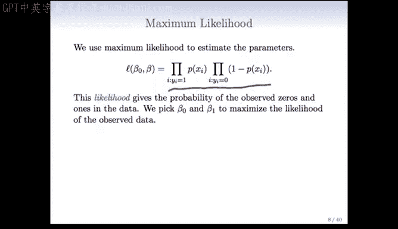

**系数估计表：**
| 系数 | 估计值 | 标准误 | Z统计量 | P值 |
| :--- | :--- | :--- | :--- | :--- |
| 截距 (β₀) | -10.6513 | 0.3612 | -29.5 | < 0.0001 |
| 余额 (β₁) | 0.0055 | 0.0002 | 24.9 | < 0.0001 |

**代码示例（R语言）：**
```r
# 使用glm函数拟合逻辑回归模型
glm.fit <- glm(default ~ balance, data = Credit, family = binomial)
summary(glm.fit)
```

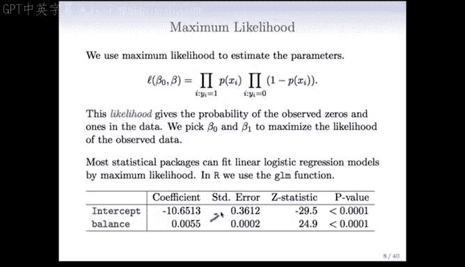

结果显示，`balance` 的系数为 0.0055，虽然看起来很小，但请注意其单位是“每美元”。换算成千美元，其影响约为 5.5，因此实际影响是显著的。P值远小于 0.05，表明`balance`是预测违约的强有力因子。通常我们更关注斜率（如`balance`的系数）的显著性，而非截距。

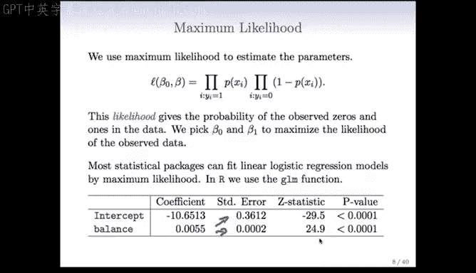

---

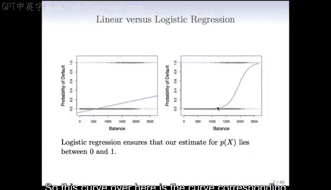

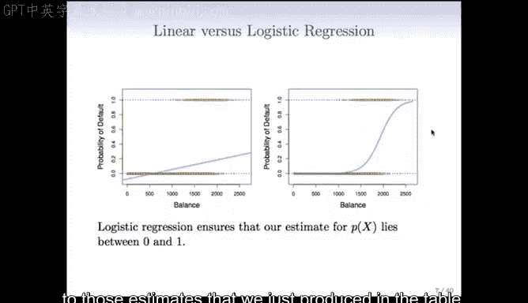

## 进行预测

拟合模型后，我们可以用它来预测新个体的违约概率。

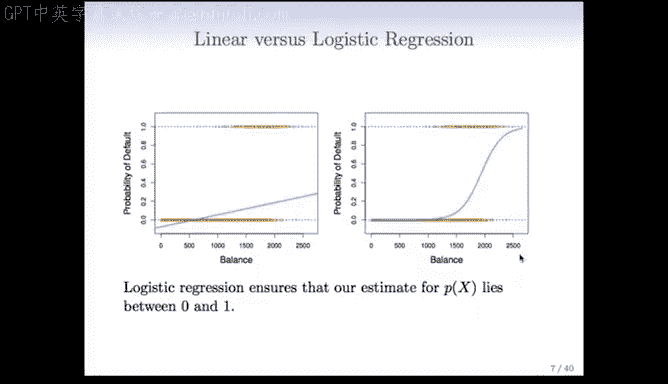

例如，预测一个余额为1000美元的客户的违约概率：

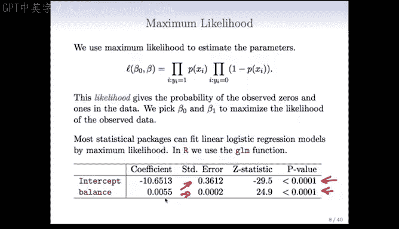

**计算过程：**
`P(1000) = e^(-10.65 + 0.0055*1000) / (1 + e^(-10.65 + 0.0055*1000)) ≈ 0.0058`

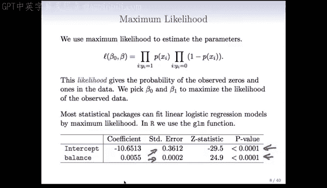

这意味着该客户的违约概率约为 0.58%。

如果另一个客户的余额为2000美元：

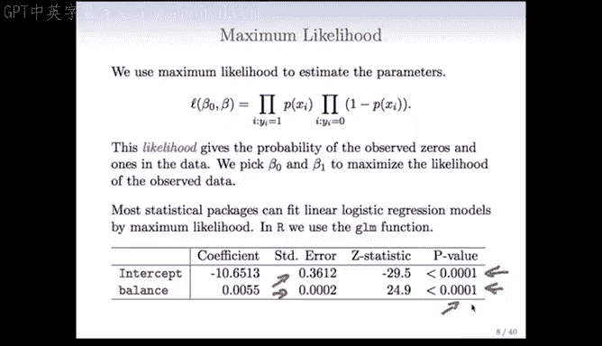

**计算过程：**
`P(2000) = e^(-10.65 + 0.0055*2000) / (1 + e^(-10.65 + 0.0055*2000)) ≈ 0.586`

违约概率跃升至约58.6%，增长非常显著。

---

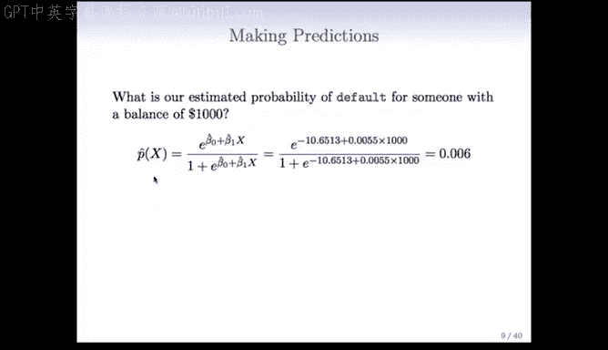

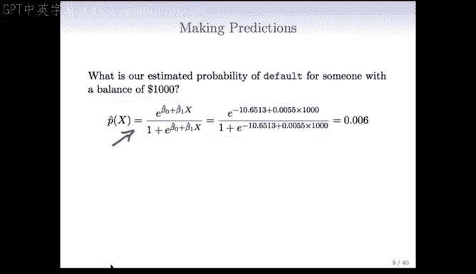

## 使用分类预测变量

逻辑回归同样可以处理分类预测变量，例如`student`（是否是学生，用0或1表示）。

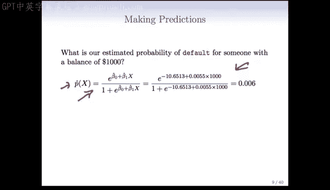

使用`student`作为唯一预测变量拟合模型，得到结果：

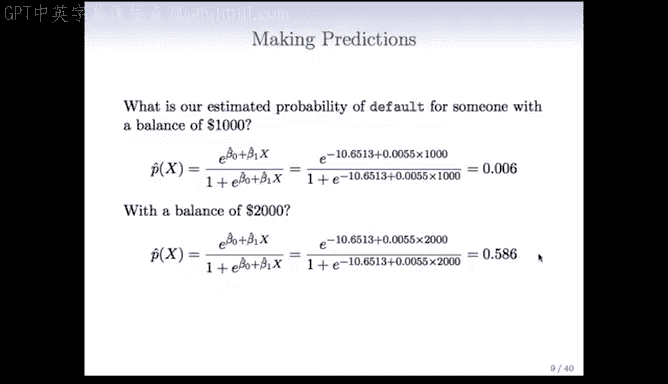

**系数估计：**
- 截距 (β₀): -3.5041
- 学生状态 (β₁): 0.4049
- 学生状态的P值 < 0.05，显著。

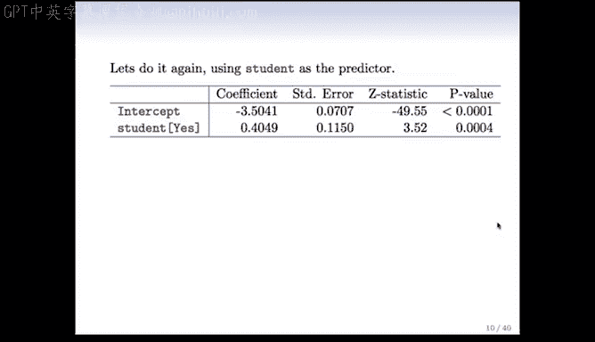

根据模型：
- 学生的预测违约概率为：`P = e^(-3.5041 + 0.4049*1) / (1 + e^(-3.5041 + 0.4049*1)) ≈ 0.0431`
- 非学生的预测违约概率为：`P = e^(-3.5041 + 0.4049*0) / (1 + e^(-3.5041 + 0.4049*0)) ≈ 0.0292`

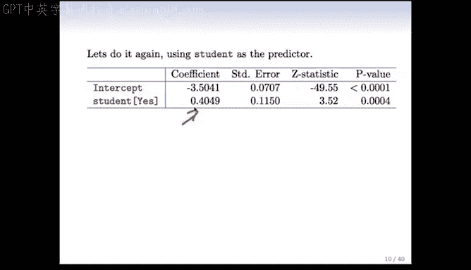

初步看来，学生的违约概率略高。在后续课程中，我们将探讨如何将`student`与`balance`等变量结合，构建包含多个预测变量及交互项的更复杂模型。

---

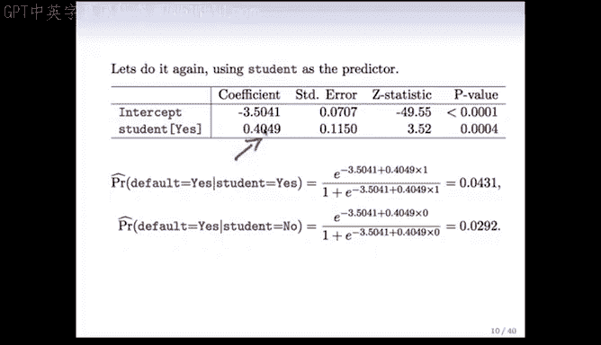

## 总结

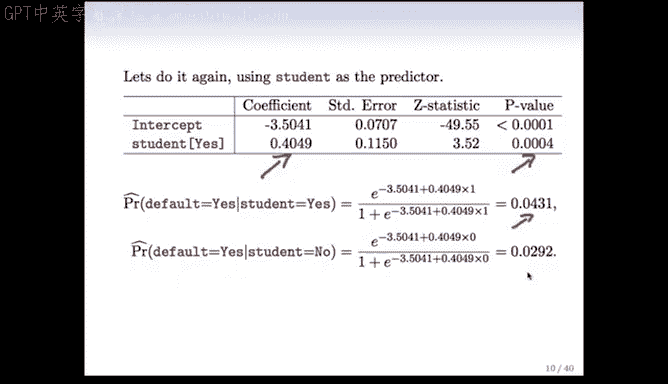

本节课中我们一起学习了逻辑回归的核心内容：
1.  **模型形式**：逻辑回归通过 **S型函数（Sigmoid Function）** 将线性组合 `β₀ + β₁x` 映射到 `(0, 1)` 区间，输出为一个概率值。
2.  **逻辑变换**：通过对几率取对数（logit变换），将非线性概率问题转化为线性模型问题。
3.  **参数估计**：使用**最大似然估计**法，寻找最能解释已观测数据的模型参数。
4.  **预测与应用**：拟合后的模型可用于计算新样本属于某一类的概率，并且能够同时处理连续型和分类型的预测变量。

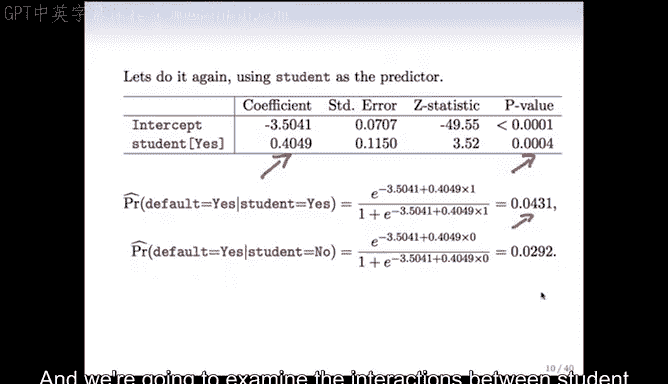

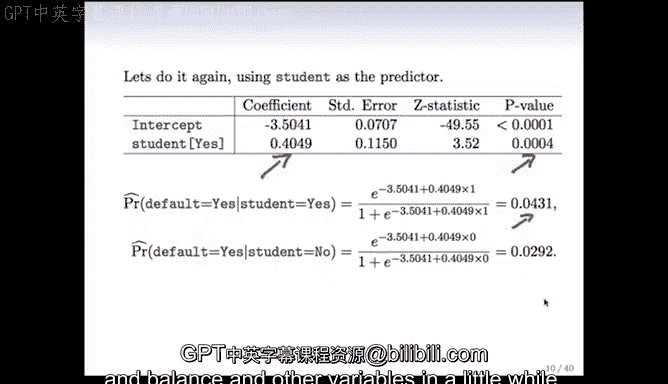

逻辑回归是分类问题中最基础且强大的工具之一，为理解更复杂的分类模型奠定了坚实的基础。