# R 版 17：多元逻辑回归 📊

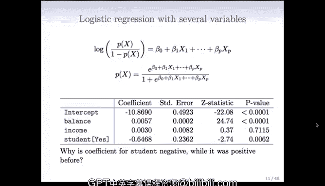

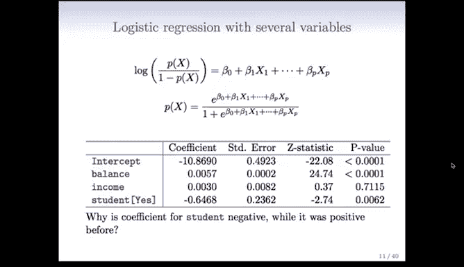

在本节课中，我们将学习如何将逻辑回归模型从单一预测变量扩展到多个预测变量。我们将探讨多元逻辑回归模型的形式、拟合方法，并重点理解当多个变量同时进入模型时，回归系数的解释可能发生的变化。

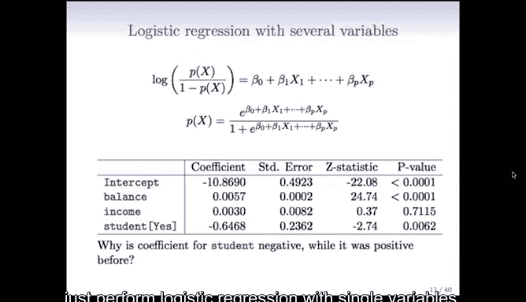

---

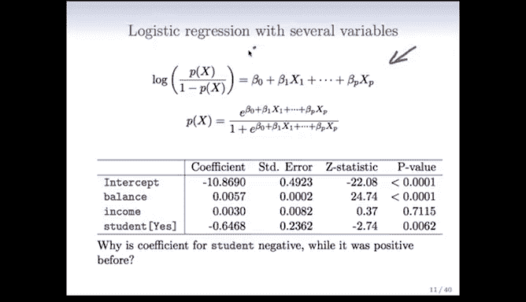

## 从单变量到多变量模型

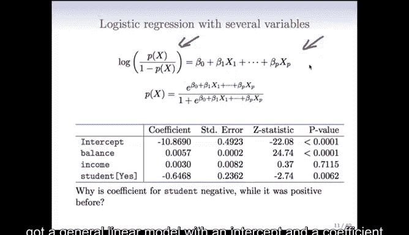

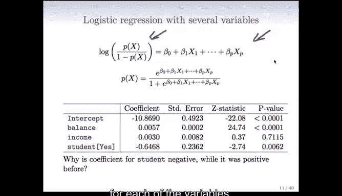

上一节我们介绍了单变量逻辑回归模型。本节中我们来看看当数据集中包含多个预测变量时，我们该如何处理。

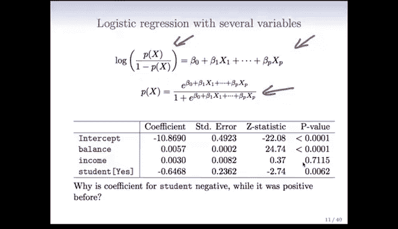

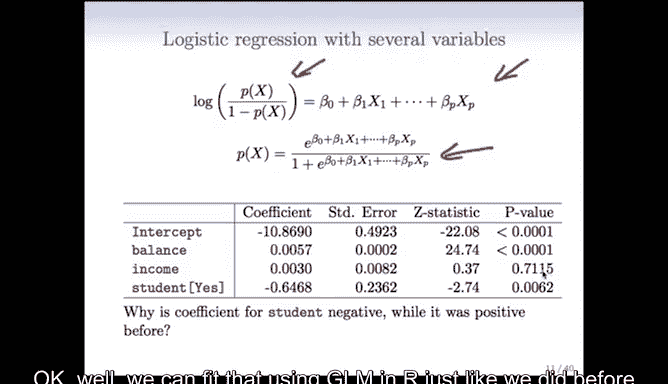

当拥有多个变量时，我们希望将它们全部纳入考虑。因此，我们将构建一个多元逻辑回归模型。

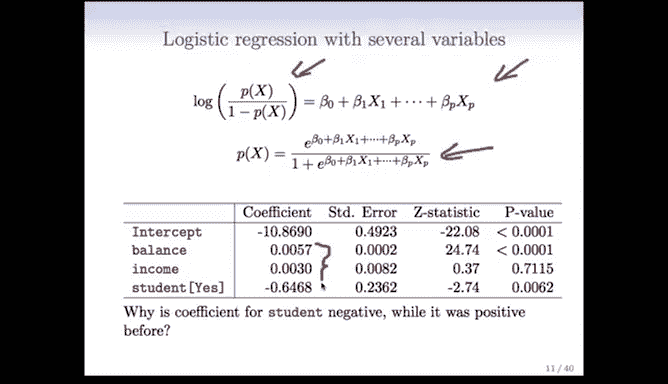

概率的变换形式与之前相同，但现在我们拥有一个包含截距项和每个变量系数的广义线性模型。

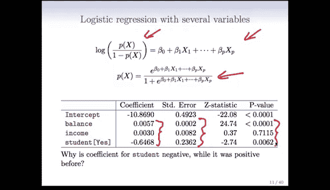

**公式**：
`log(p / (1 - p)) = β₀ + β₁X₁ + β₂X₂ + ... + βₖXₖ`

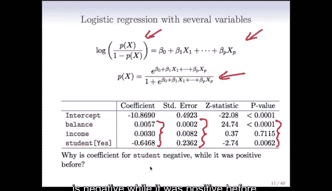

如果对该变换进行逆运算，同样可以得到一个保证概率值在0到1之间的形式。

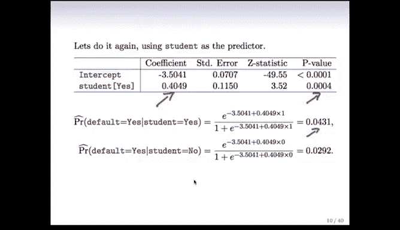

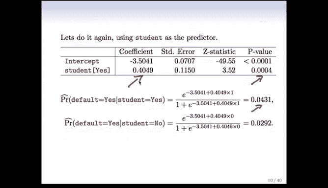

**公式**：
`p = exp(β₀ + β₁X₁ + ... + βₖXₖ) / (1 + exp(β₀ + β₁X₁ + ... + βₖXₖ))`

我们可以像之前一样，在R语言中使用GLM函数来拟合这个模型。

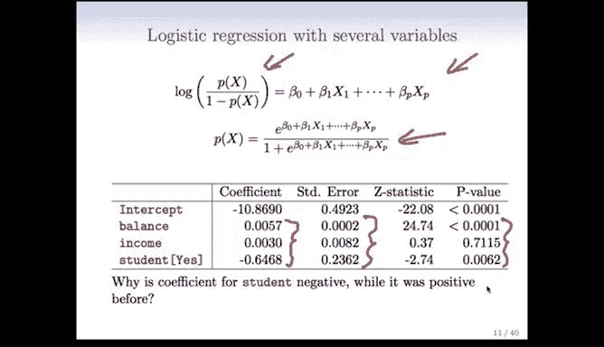

以下是拟合包含`balance`、`income`和`student`三个变量的多元逻辑回归模型的R代码示例：

```r
# 假设数据框名为‘credit_data’
multivar_fit <- glm(default ~ balance + income + student,
                    data = credit_data,
                    family = binomial)
summary(multivar_fit)
```

现在我们会得到三个系数、三个标准误、三个Z统计量和三个P值。

首先我们观察到，与单变量情况一致，`balance`和`student`是显著的，而`income`不显著。这表明有两个变量是重要的。

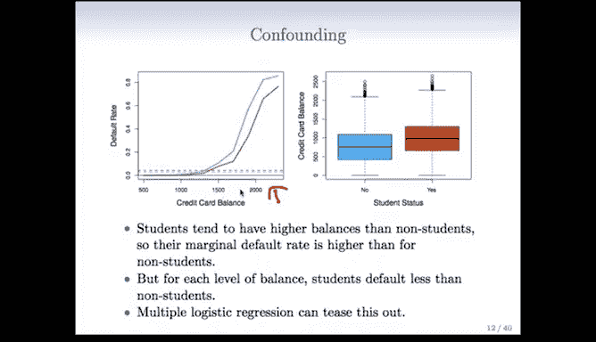

但有一个相当引人注目的发现：`student`变量的系数变成了负值。而在之前单独建模时，它的系数是正值。

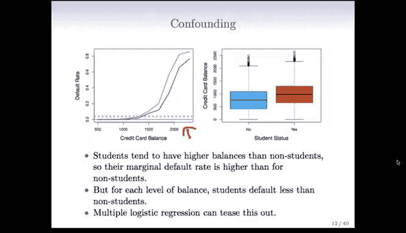

这并非错误。我们之前讨论线性回归模型时提到过，由于变量之间的相关性，在多元模型中解释系数是困难的。现在我们将看到变量相关性所扮演的角色。

## 理解系数符号的反转


为了理解系数符号为何反转，我们需要审视变量之间的关系。


下图展示了信用卡余额与违约率的关系，并按学生状态着色（棕色代表“是”，蓝色代表“否”）。学生通常比非学生拥有更高的信用卡余额。由于余额对违约有强烈影响，这导致在单独看学生状态时，学生看起来违约率更高。


然而，当我们**在相同余额水平下**分别观察学生和非学生时，会发现学生的违约率实际上更低。因此，当单独使用`student`变量时，它与`balance`变量产生了混淆。余额的强烈效应使得学生看起来是更差的违约者。


多元逻辑回归能够考虑这些相关性，从而将这种效应分离出来。


## 另一个例子：南非心脏病数据


让我们继续看一个包含更多变量的例子。这是在课程引言中讨论过的南非心脏病数据集。


这项研究是一项回顾性研究，调查了160名患有心肌梗塞（即心脏病发作）的白人男性病例，并从众多未患病者中抽取了302名对照样本。所有研究对象均为15至64岁、来自南非西开普地区的白人男性。该研究在20世纪80年代初进行，该地区心脏病总体患病率高达5.1%，属于高风险。

在这项研究中，我们测量了7个预测因子（在此背景下也称为风险因素）。

以下是用于探索数据的散点图矩阵R代码示例：

```r
# 假设数据框名为‘heart_data’，响应变量为‘chd’（冠心病）
pairs(heart_data, col = ifelse(heart_data$chd == 1, "brown", "blue"))
```

散点图矩阵是一种将每个变量与其他变量进行配对绘图的有效方式。因为是分类问题，我们可以在图中用颜色编码心脏病状态（棕色/红色点代表病例，蓝色点代表对照）。

例如，查看顶部的图，如果烟草使用量高且收缩压高，则倾向于出现棕色点，即那些曾心脏病发作的人。


每个子图都展示了两个风险因素的成对关系，并编码了心脏病状态。


其中一个有趣的变量是`famhist`（家族史）。它是一个分类变量，并且是一个重要的风险因素。它是一个0/1变量，可以看到右侧类别（有家族史）中的棕色点比左侧类别（无家族史）更多。


在本例中，我们的主要目的并非预测患心脏病的概率，而是理解各风险因素在心脏病风险中的作用。这项研究实际上是一项旨在教育公众采用更健康饮食的干预性研究。

以下是使用GLM拟合心脏病数据的R代码和结果摘要：

```r
# 拟合包含所有预测变量的逻辑回归模型
heart_fit <- glm(chd ~ ., data = heart_data, family = binomial)
summary(heart_fit)
```

我们得到每个变量的系数、标准误、Z值和P值。

结果有些复杂：
*   我们对截距项不太感兴趣。
*   `tobacco`（烟草使用）是显著的。
*   `ldl`（低密度脂蛋白，一种胆固醇指标，是“坏”胆固醇）是显著的。
*   `famhist`（家族史）非常显著。
*   `age`（年龄）是显著的。我们知道心脏病风险随年龄增长而增加。

有趣的是，`obesity`（肥胖）和`alcohol`（酒精使用）在这里并不显著。这似乎有点令人惊讶。

这再次是变量相关性的情况。如果我们查看之前的散点图矩阵，会发现变量之间存在大量相关性。例如，年龄和烟草使用相关，酒精使用和LDL似乎呈负相关。这些相关性会产生影响。

因此，例如，当`ldl`在模型中显著时，一旦它被纳入模型，`alcohol`可能就不再需要了，因为这些变量彼此充当了代理。

---

## 总结

本节课中我们一起学习了多元逻辑回归。我们了解到，模型可以自然地扩展到包含多个预测变量，其核心形式是对数几率与预测变量的线性组合相关。我们通过R语言的`glm()`函数拟合了模型，并重点探讨了当多个相关变量同时进入模型时，回归系数的符号和显著性可能发生变化，强调了在多元模型中谨慎解释单个系数的重要性。通过信用卡违约和南非心脏病数据的例子，我们看到了变量间的混淆效应如何影响分析，以及多元模型在控制其他变量后揭示真实关系的能力。