# R 版 18：病例对照抽样与多项逻辑回归 📊

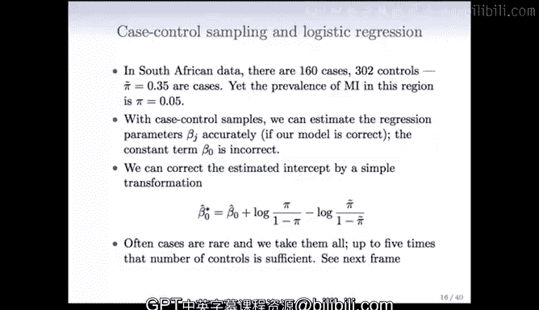

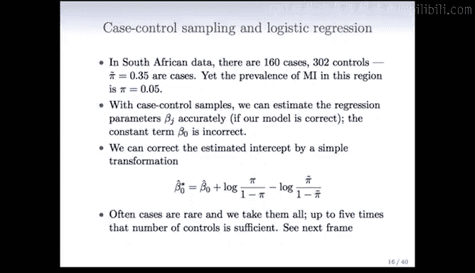

在本节课中，我们将学习逻辑回归中的两种重要技术：病例对照抽样和多项逻辑回归。我们将了解病例对照抽样如何解决罕见事件研究中的效率问题，以及逻辑回归模型如何扩展到处理两个以上的类别。

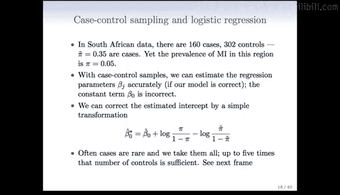

---

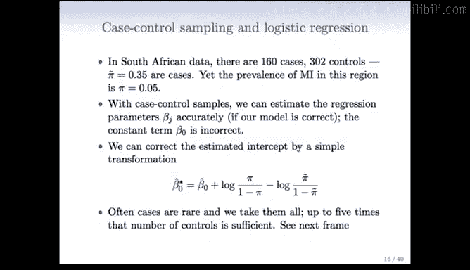

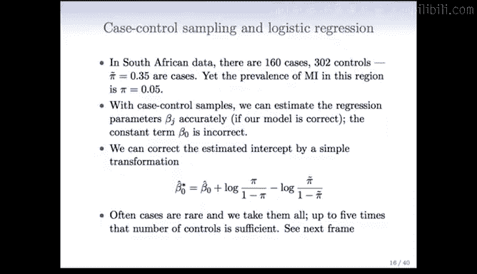

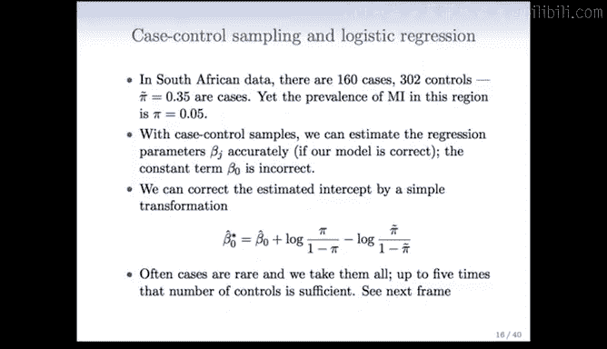

## 病例对照抽样

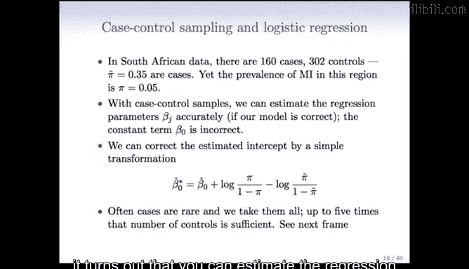

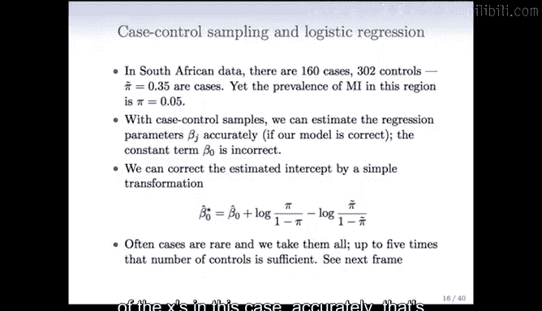

上一节我们介绍了逻辑回归模型。本节中我们来看看一种在流行病学中非常实用的抽样方法——病例对照抽样。

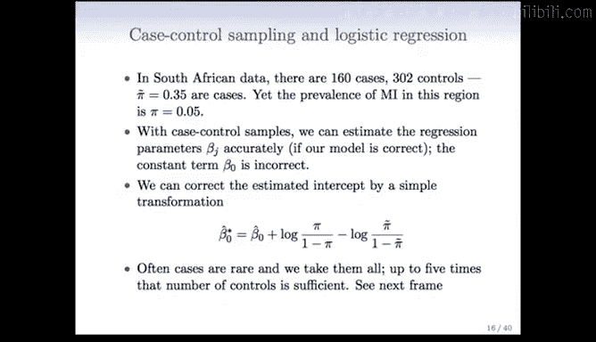

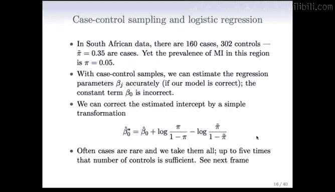

在研究中，我们有时会遇到目标事件（如疾病）发生率很低的情况。例如，在南非特定年龄段的人群中，心脏病风险约为5%。然而，如果直接进行随机抽样，为了获得足够多的病例（患病者），可能需要非常大的样本量和很长的追踪时间。

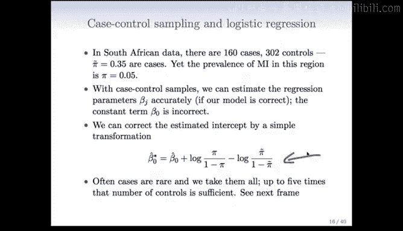

病例对照抽样提供了一种更高效的替代方案。研究者不是前瞻性地追踪一大群人，而是直接找到已知的病例（如160名心脏病患者）和对照组（如302名非心脏病患者），然后记录他们的风险因素。这种方法成本更低、速度更快。

### 病例对照抽样的核心原理

以下是病例对照抽样的核心原理：

*   **回归系数的一致性**：即使样本中的病例比例（如35%）与总体中的真实比例（5%）不符，只要模型正确，逻辑回归估计出的**自变量系数**仍然是正确的。
*   **截距项的修正**：样本与总体比例的不匹配会导致**截距项**的估计出现偏差。但这个偏差可以通过一个简单的公式进行修正。

修正截距项的公式如下：

```
β0_corrected = β0_estimated + log(π / (1 - π)) - log(π̃ / (1 - π̃))
```

其中：
*   `β0_estimated` 是从病例对照样本中估计出的原始截距。
*   `π` 是总体中事件的真实概率（如0.05）。
*   `π̃` 是样本中事件的“表观”概率（如0.35）。


### 在非平衡大数据中的应用

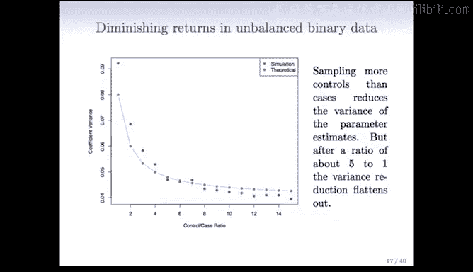

病例对照抽样的思想在现代大数据场景中同样适用。例如，在预测网页广告点击率时，点击事件可能极其罕见（如0.1%）。如果使用全部海量数据（包含大量未点击的“0”），计算效率会很低。

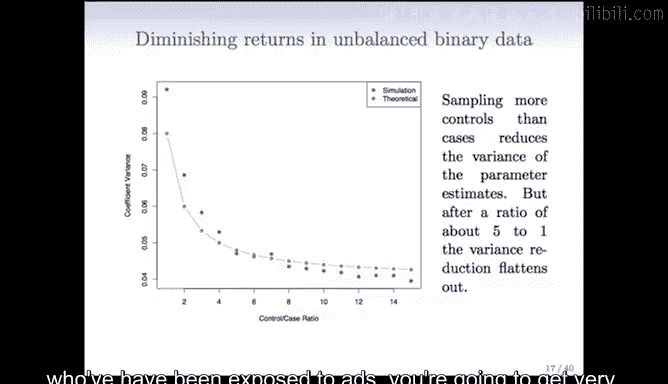


以下是如何处理此类非平衡数据：

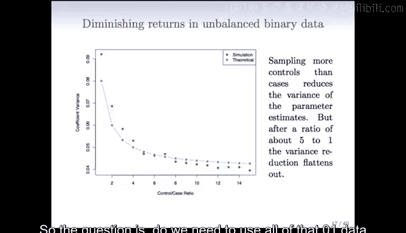

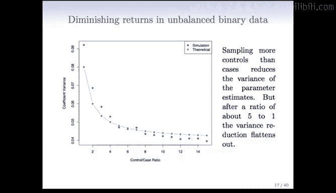

*   **对“对照组”进行抽样**：我们不需要使用所有的“0”（未点击）数据。可以仅抽取一部分“对照组”样本与全部的“病例”（点击）数据一起建模。
*   **最优抽样比**：研究表明，当对照组与病例组的比例达到约5:1或6:1时，模型参数估计的方差就基本稳定了。继续增加对照组样本带来的收益会递减。

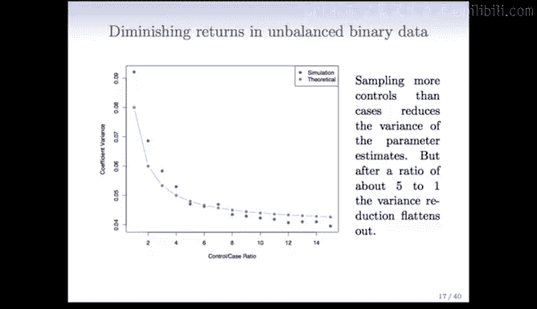

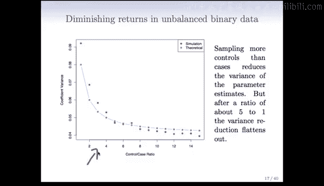

这意味着，在处理极端稀疏的数据时，可以为每个病例样本抽取大约5-6个对照样本，从而构建一个规模更小、更易于管理的数据集进行高效建模。

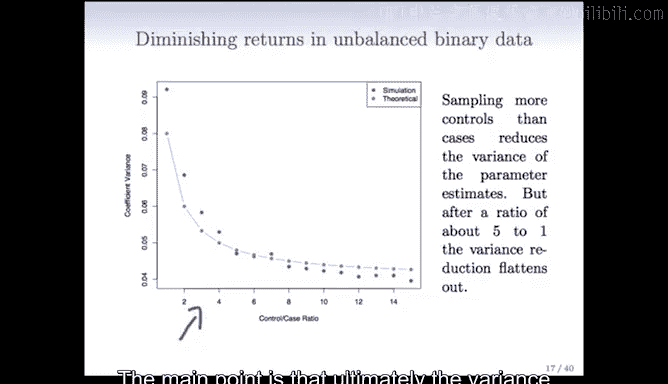

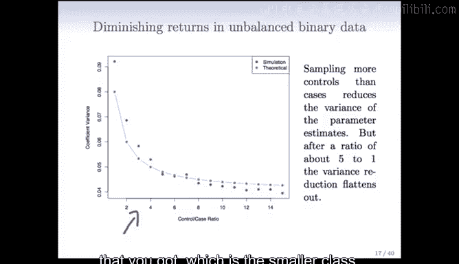

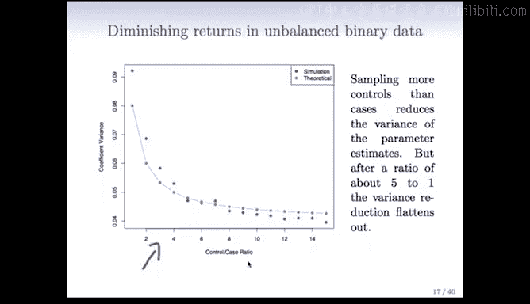

---

## 多项逻辑回归

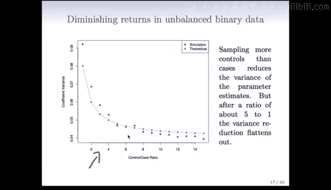

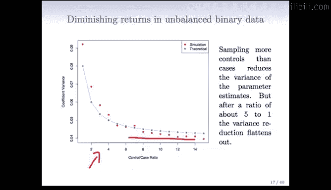

之前我们讨论的都是二分类逻辑回归。那么，当响应变量有两个以上的类别时，逻辑回归还能用吗？

答案是肯定的。逻辑回归可以很自然地推广到多分类问题，这种方法通常被称为**多项逻辑回归**或**多类逻辑回归**。

### 模型形式

多项逻辑回归使用一种称为 **Softmax函数** 的对称形式。假设我们有K个类别（K>2），则样本属于第k类的概率模型为：

```
P(Y = k | X) = exp(βk0 + βk1*X1 + ... + βkp*Xp) / Σ_{j=1}^{K} [ exp(βj0 + βj1*X1 + ... + βjp*Xp) ]
```

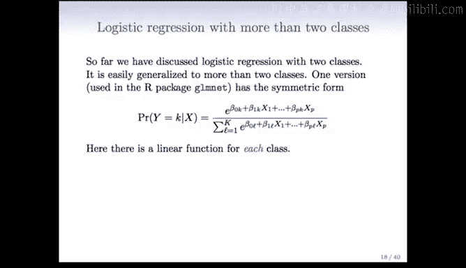

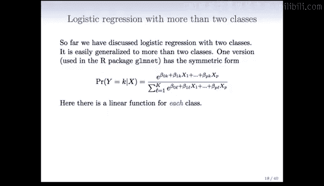

在这个模型中：
*   每个类别 `k` 都有自己的一套线性模型参数（`βk0, βk1, ..., βkp`）。
*   分子是第 `k` 类的线性组合的指数。
*   分母是所有K个类别的线性组合的指数之和，确保所有类别的概率之和为1。

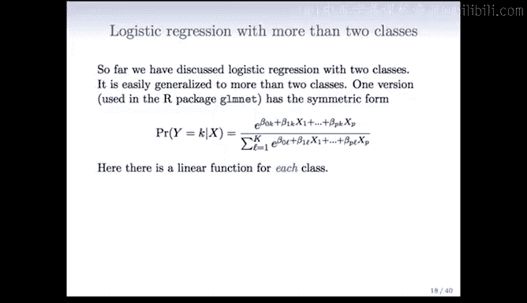

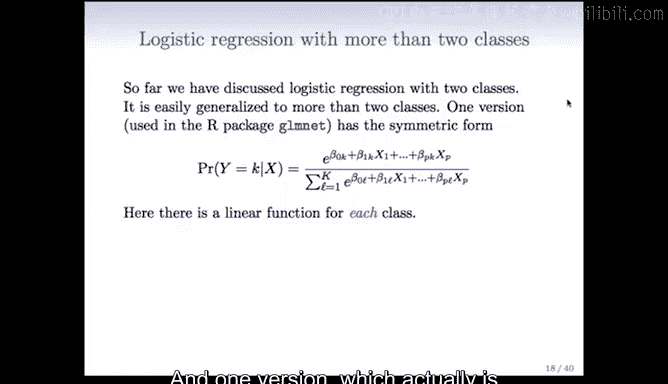

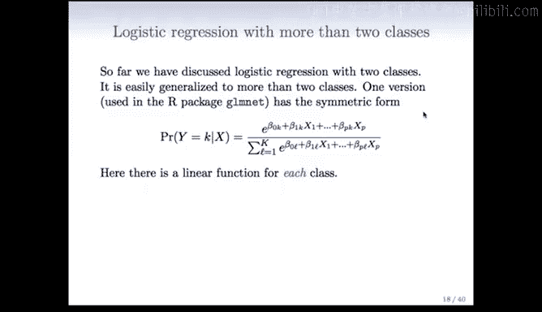

这种形式在计算上非常方便，也是R语言中`glmnet`等包实现多分类逻辑回归的基础。

---

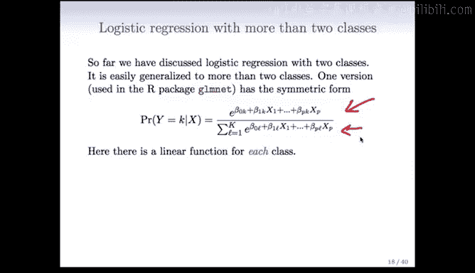

## 总结

本节课中我们一起学习了逻辑回归的两个重要扩展。
1.  **病例对照抽样**：这是一种针对罕见事件的高效研究设计。它通过事后抽样病例和对照来快速收集数据，虽然会扭曲样本中的事件比例，但通过公式修正截距项后，仍能得到正确的自变量效应估计。
2.  **多项逻辑回归**：通过Softmax函数，逻辑回归模型可以优雅地处理响应变量为多分类的问题，为每个类别分配一套系数，并通过指数归一化得到各类别的概率。

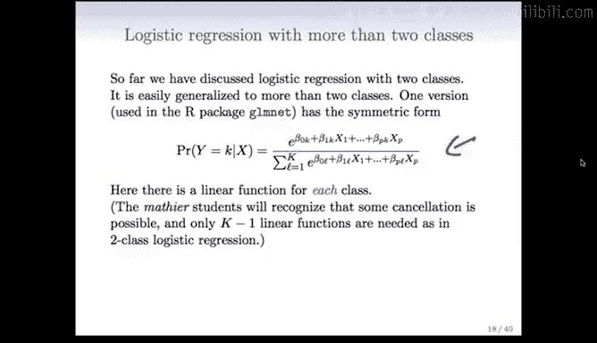

掌握这些技术，能让你更灵活地应对实际数据分析中类别不平衡和多分类的挑战。