# R 版 19：判别分析 📊

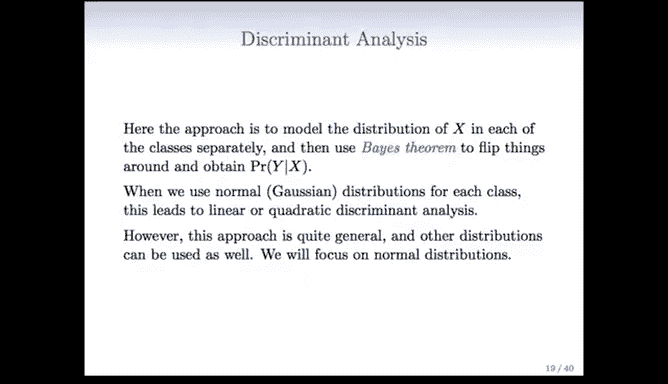

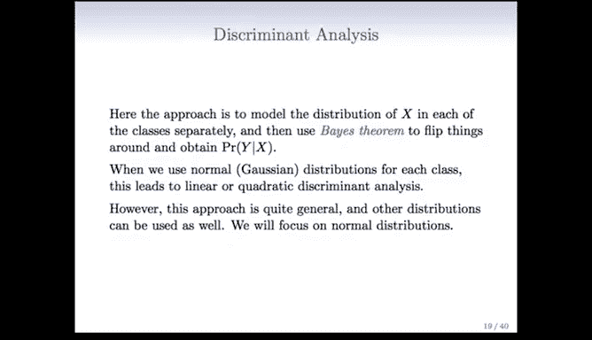

在本节课中，我们将学习一种名为判别分析的分类方法。判别分析从与逻辑回归截然不同的角度来处理分类问题，其核心思想是为每个类别分别建模预测变量X的分布，然后利用贝叶斯定理来推导给定X时Y的条件概率。

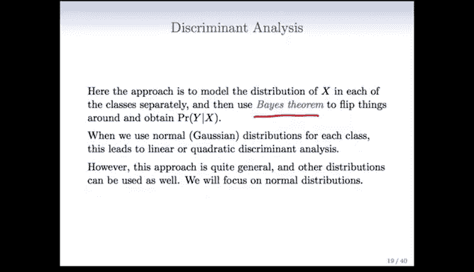

---

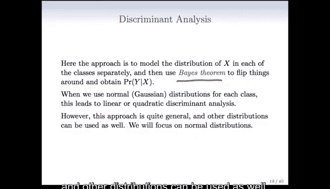

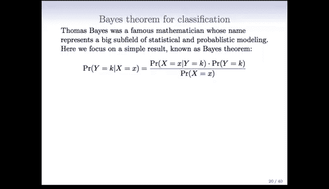

上一节我们介绍了判别分析的基本思想，本节中我们来看看其背后的数学原理——贝叶斯定理。

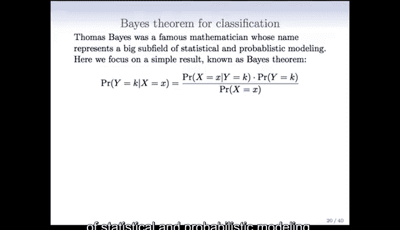

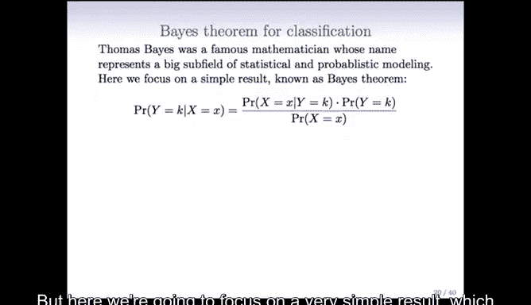

贝叶斯定理是概率论中的一个基本公式，它允许我们“翻转”条件概率。在分类的语境下，我们关心的是给定观测值 `x` 时，其属于类别 `k` 的概率，即 `P(Y = k | X = x)`。

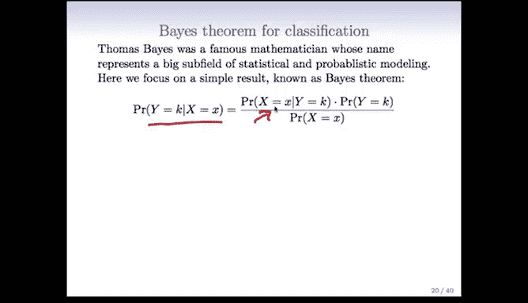

根据贝叶斯定理，这个概率可以计算为：

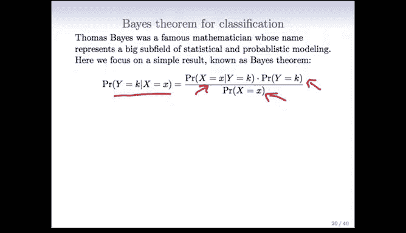

`P(Y = k | X = x) = [ π_k * f_k(x) ] / [ Σ_{l=1}^{K} π_l * f_l(x) ]`

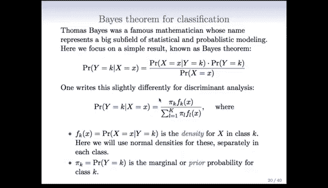

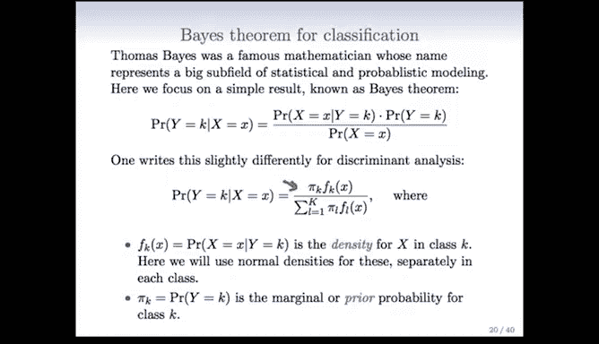

其中：
*   **`π_k`** 是类别 `k` 的先验概率（即边际概率 `P(Y = k)`）。
*   **`f_k(x)`** 是类别 `k` 中 `X` 的概率密度函数。
*   分母是 `X = x` 的边际概率，确保所有类别的后验概率之和为1。

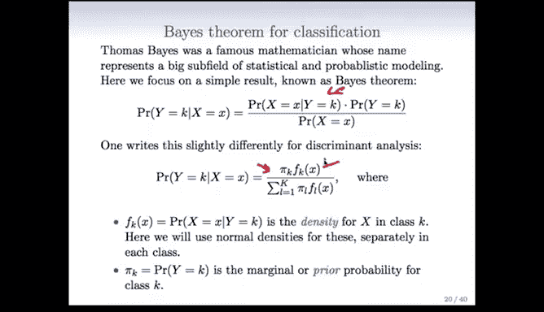

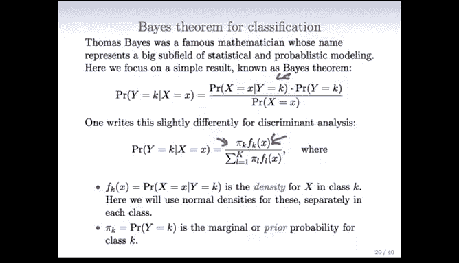

判别分析的核心就是为每个类别的密度函数 `f_k(x)` 选择一个具体的模型（例如高斯分布），然后利用上述公式进行分类。

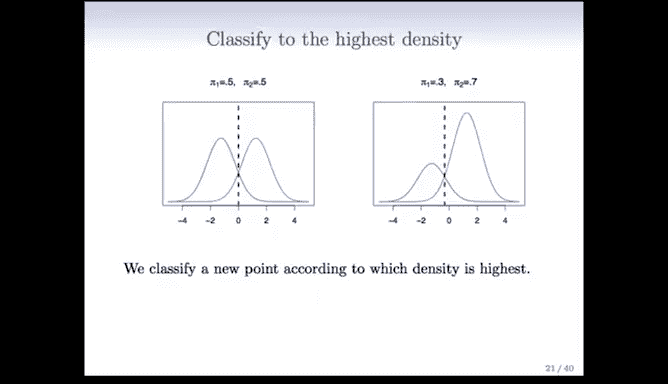

---

理解了贝叶斯定理的框架后，我们来看一个直观的例子，理解先验概率 `π_k` 和密度函数 `f_k(x)` 如何共同决定分类边界。

以下是两个类别的分类示意图：

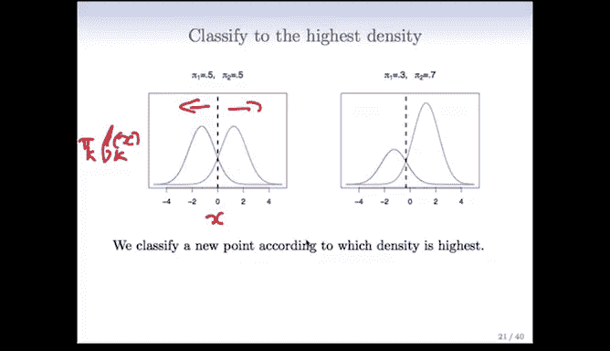

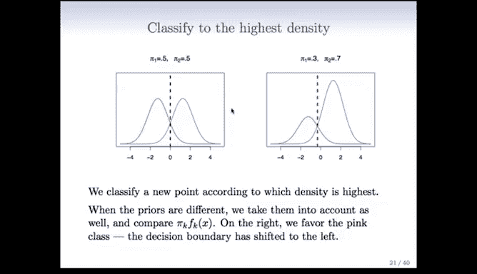

*   **左图**：假设两个类别的先验概率 `π_1` 和 `π_2` 相等。此时，分类边界（垂直虚线）位于两个密度函数 `f_1(x)` 和 `f_2(x)` 的交点处。对于任意点 `x`，我们将其分配给在该点处密度更高的类别。
*   **右图**：假设类别2（紫色）的先验概率 `π_2` 显著高于类别1（绿色）。此时，`π_k * f_k(x)` 的曲线发生变化，更高的先验概率“放大”了紫色类别的密度曲线。这导致分类边界向左移动，意味着模型在决策时会倾向于将更多观测值划入先验概率更高的类别，这通常能降低整体错误率。

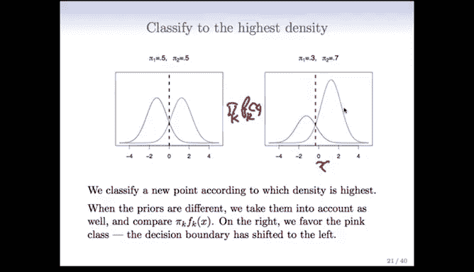

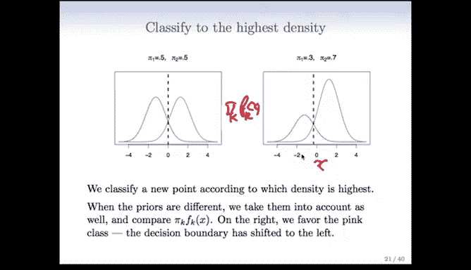

这个例子表明，判别分析同时考虑了数据的分布形态（通过 `f_k(x)`）和类别的总体比例（通过 `π_k`）。

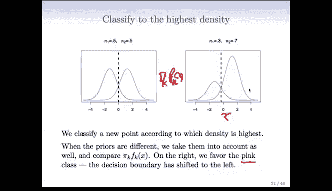

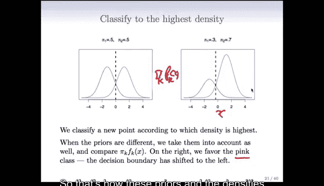

---

既然逻辑回归也是一种强大的分类工具，为什么还需要判别分析呢？以下是判别分析可能更具优势的三种情况：

1.  **类别高度分离时**：当存在能够完美区分类别的预测变量时，逻辑回归的参数估计会变得非常不稳定（系数趋向于无穷大）。而线性判别分析在此情况下表现更为稳健。
2.  **样本量较小且预测变量近似服从正态分布时**：如果每个类别内的样本量不大，且预测变量 `X` 的分布近似于正态分布，那么基于正态假设的线性判别分析模型通常比逻辑回归更稳定。
3.  **追求理论最优分类器时**：如果我们为每个类别建立的分布模型（例如高斯分布）是准确的，那么根据贝叶斯定理推导出的分类规则（即判别分析所用的规则）是所有可能分类器中错误率最低的，是理论上的最优解。

---

本节课中我们一起学习了判别分析。判别分析通过为每个类别分别建模预测变量 `X` 的分布（如高斯分布），并应用贝叶斯定理来计算后验概率，从而实现分类。我们了解了其数学基础，通过图示看到了先验概率和类别密度如何影响决策边界，并讨论了相较于逻辑回归，判别分析在类别分离明显、小样本正态数据以及追求理论最优解等场景下的潜在优势。