# R 版 20：高斯判别分析（单变量）📊

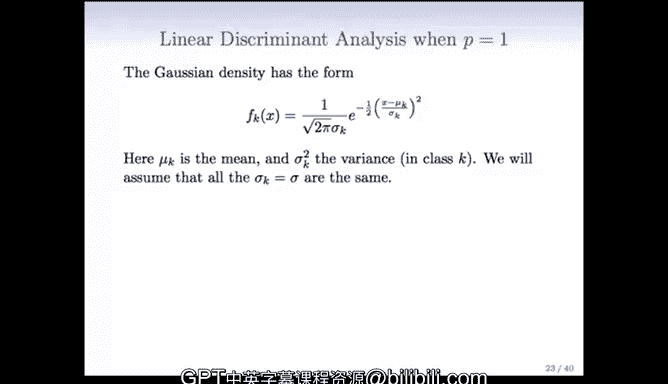

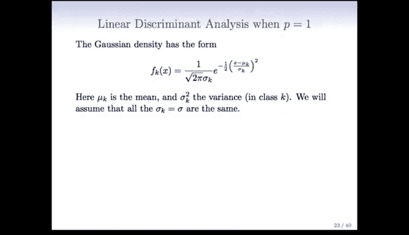

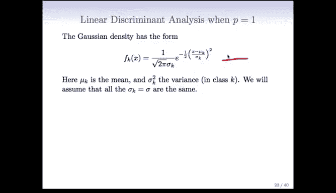

在本节课中，我们将学习高斯判别分析（Gaussian Discriminant Analysis）在单变量情况下的基本原理和数学推导。我们将从最简单的单变量场景开始，逐步理解如何利用高斯分布假设和贝叶斯定理进行分类。

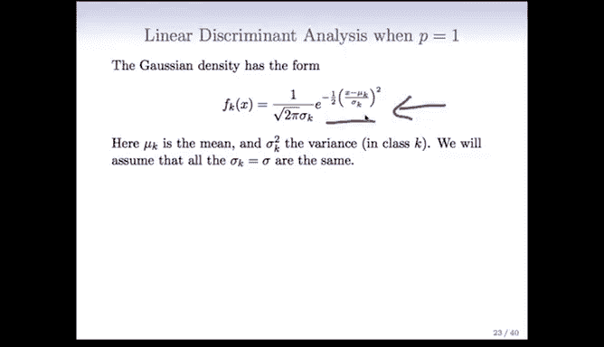

---

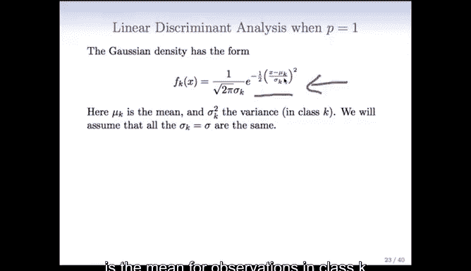

## 概述

上一节我们介绍了分类问题的基本框架。本节中，我们来看看一种基于概率模型的分类方法——高斯判别分析。我们将从只有一个预测变量 `x` 的简单情况入手，推导其数学形式，并理解其决策边界的含义。

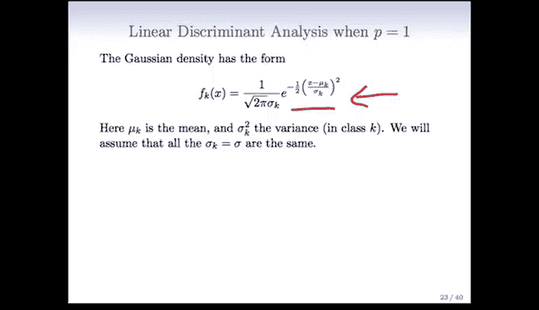

## 高斯密度函数

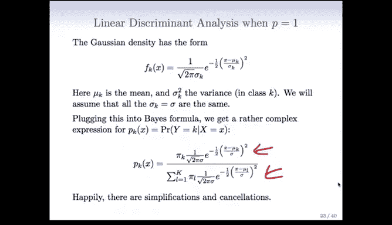

首先，我们需要了解高斯（正态）密度函数的数学形式。对于类别 `K`，其单变量高斯密度函数如下：

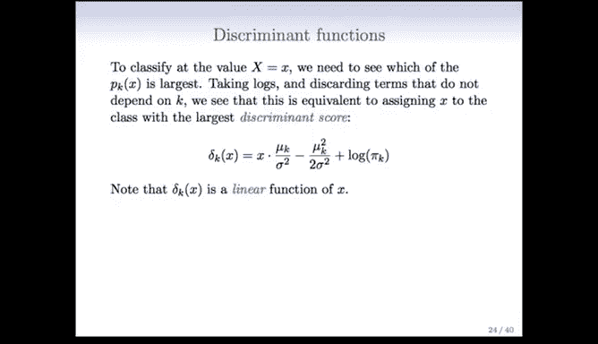

$$
f_k(x) = \frac{1}{\sqrt{2\pi\sigma_k^2}} \exp\left(-\frac{(x - \mu_k)^2}{2\sigma_k^2}\right)
$$

在这个公式中：
*   `μ_k` 是类别 `K` 中观测值的**均值**。
*   `σ_k^2` 是类别 `K` 中该变量的**方差**。

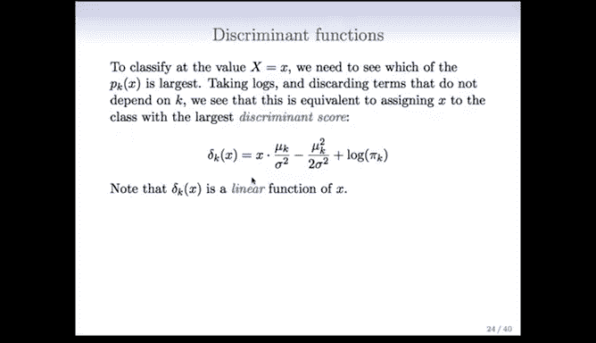

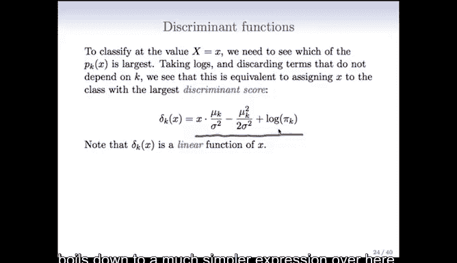

为了简化问题，我们首先假设所有类别的方差是相同的，即 `σ_k^2 = σ^2`。这个假设非常重要，它将决定我们最终得到的判别函数是线性的还是二次的。

## 应用贝叶斯定理

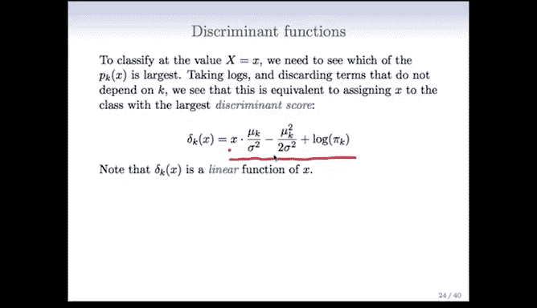

接下来，我们将高斯密度函数代入贝叶斯公式来计算后验概率 `P(Y=k|X=x)`。直接代入会得到一个相当复杂的表达式。

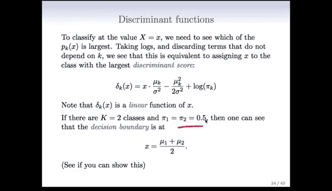

幸运的是，为了进行分类，我们并不需要精确计算每个类别的概率，只需要找出哪个类别的概率最大。因此，我们可以对表达式取对数，并舍弃所有不依赖于类别 `K` 的项。这个过程会带来大量的简化与抵消。

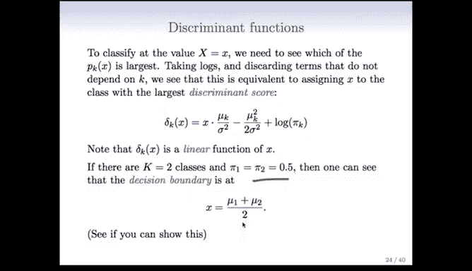

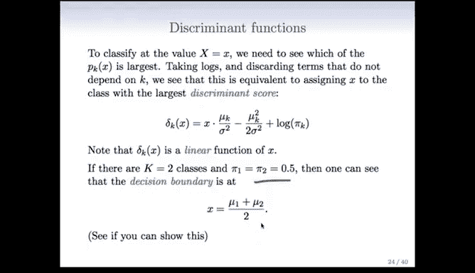

最终，复杂的表达式简化为一个**判别得分**。我们将观测值 `x` 分配给具有最大判别得分的类别。

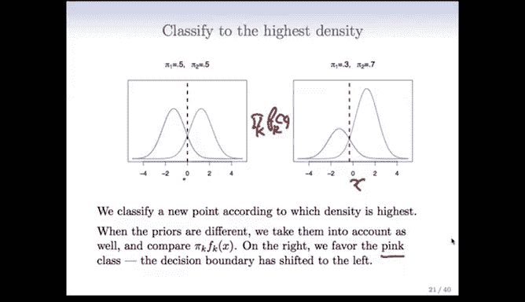

## 线性判别函数

经过简化，我们得到每个类别 `K` 的判别得分函数：

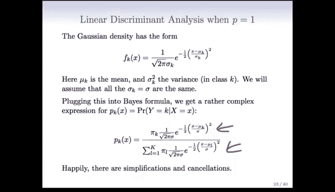

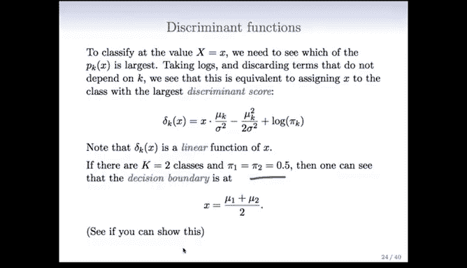

$$
\delta_k(x) = x \cdot \frac{\mu_k}{\sigma^2} - \frac{\mu_k^2}{2\sigma^2} + \log(\pi_k)
$$

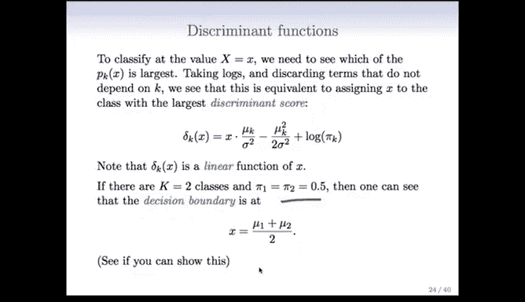

请注意，这是一个关于 `x` 的**线性函数**。它包含：
*   一个与 `x` 相乘的系数 `μ_k / σ^2`。
*   一个常数项 `-μ_k^2/(2σ^2) + log(π_k)`，其中 `π_k` 是类别 `K` 的先验概率。

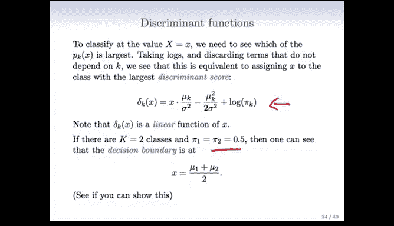

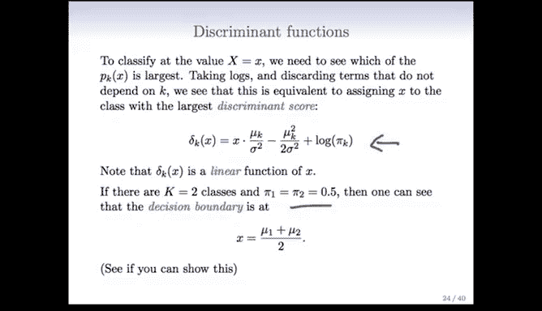

对于每个类别，我们都有这样一个线性函数。

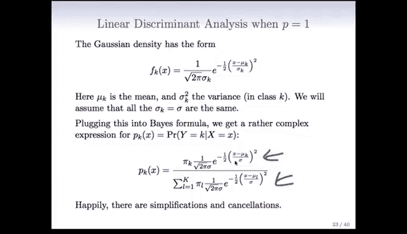

## 决策边界

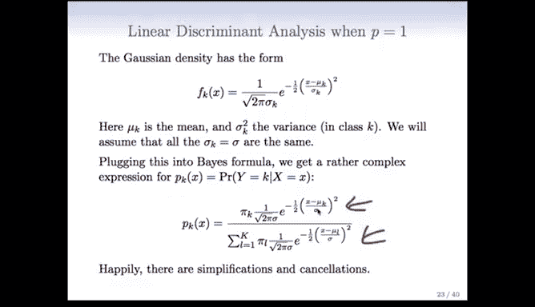

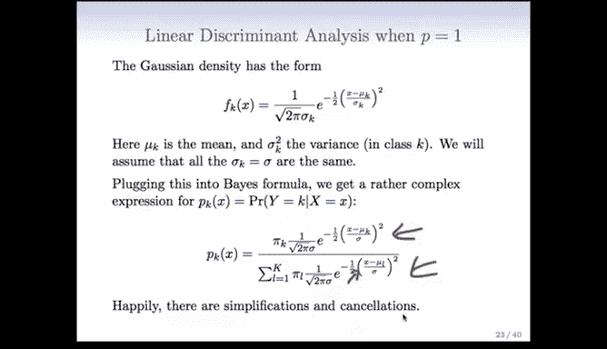

现在，让我们考虑一个更简单的特例：两个类别，且先验概率相等（`π_1 = π_2 = 0.5`）。

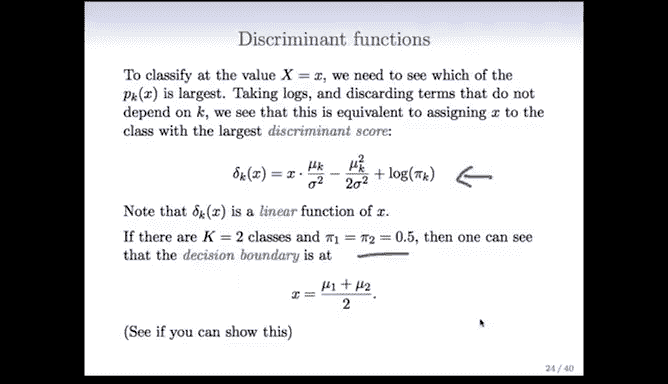

在这种情况下，可以证明决策边界（即分类从一类切换到另一类的点）恰好位于两个类别均值的中间点：

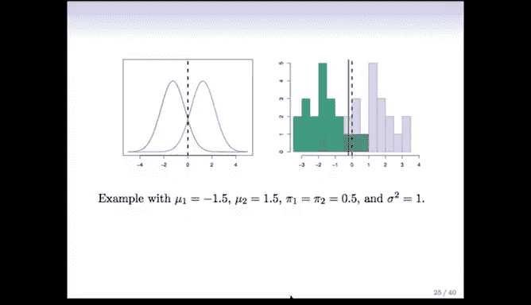

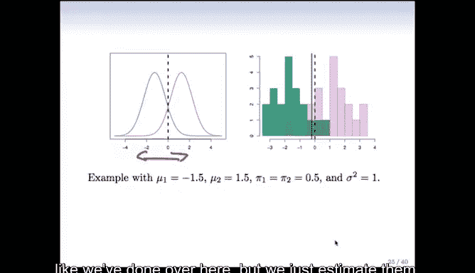

$$
\text{决策边界} = \frac{\mu_1 + \mu_2}{2}
$$

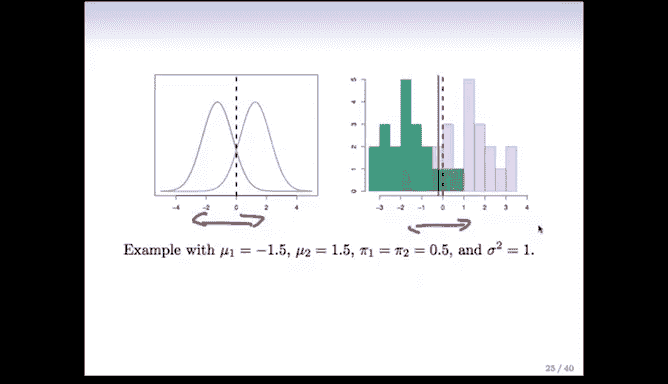

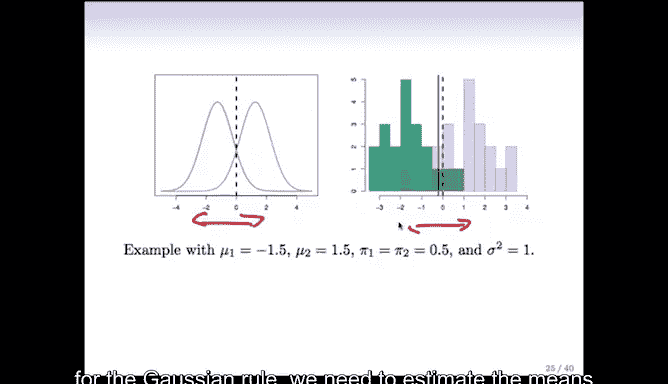

这个结果非常直观。如果两个高斯分布方差相同且先验概率相等，那么最优的分界点就是它们中心点的中点。

## 从数据中估计参数

在实际应用中，我们并不知道真实的总体参数（`μ_k`, `σ^2`, `π_k`），只能从观测数据中进行估计。

以下是估计这些参数的公式：

1.  **先验概率 `π_k`**：用每个类别的样本比例来估计。
    $$
    \hat{\pi}_k = \frac{n_k}{n}
    $$

2.  **类别均值 `μ_k`**：用每个类别的样本均值来估计。
    $$
    \hat{\mu}_k = \frac{1}{n_k} \sum_{i: y_i = k} x_i
    $$

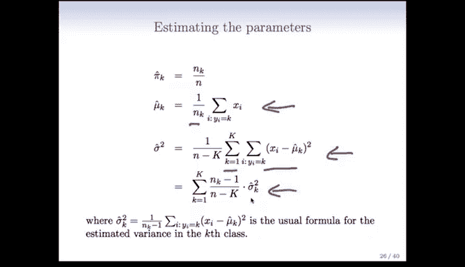

3.  **共同方差 `σ^2`**：使用**合并方差**估计。这相当于对每个类别的样本方差进行加权平均。
    *   一种计算方式是：
        $$
        \hat{\sigma}^2 = \frac{1}{n - K} \sum_{k=1}^{K} \sum_{i: y_i = k} (x_i - \hat{\mu}_k)^2
        $$
    *   另一种等价形式是：
        $$
        \hat{\sigma}^2 = \sum_{k=1}^{K} \frac{n_k - 1}{n - K} \cdot \hat{\sigma}_k^2
        $$
        其中 `\(\hat{\sigma}_k^2\)` 是类别 `k` 的样本方差。

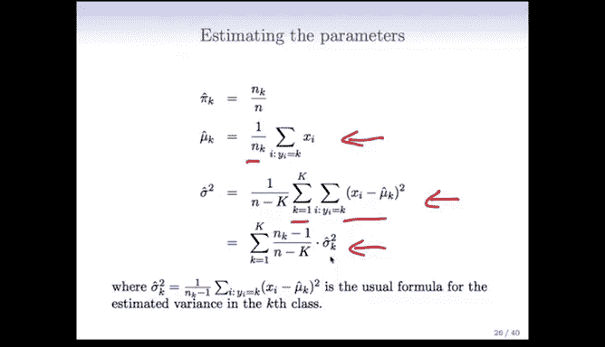

将估计出的参数 `\(\hat{\mu}_k\)`, `\(\hat{\sigma}^2\)`, `\(\hat{\pi}_k\)` 代入判别得分函数，我们就得到了可用于新数据分类的**估计决策规则**。此时，决策边界可能不会精确落在理论值上，但会非常接近。

---

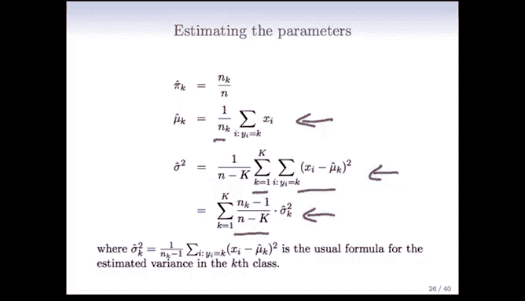

## 总结

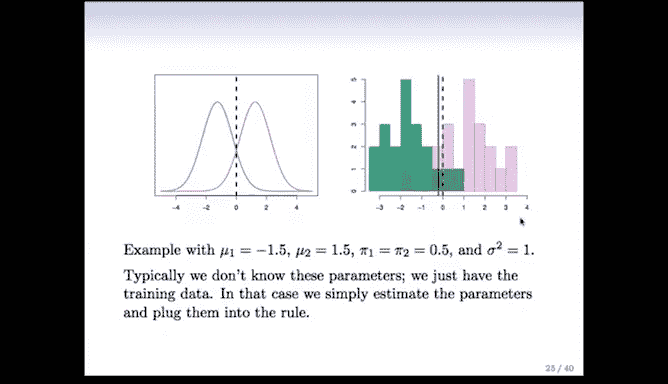

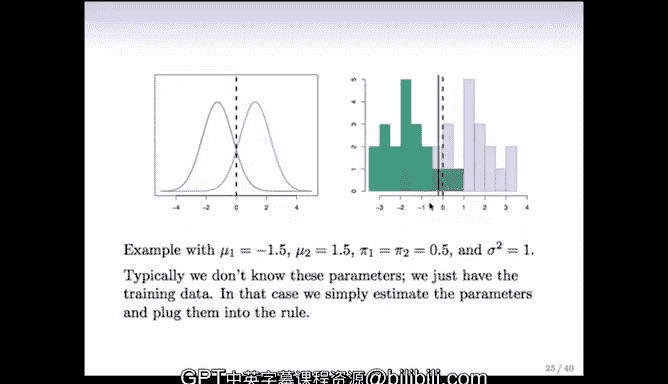

本节课中，我们一起学习了单变量高斯判别分析的核心内容。我们从高斯密度函数出发，通过贝叶斯定理和取对数简化，推导出了线性的判别得分函数。我们理解了在等方差和等先验概率的假设下，决策边界位于类别均值的中间。最后，我们学习了如何从实际数据中估计所需的参数，从而应用这一分类方法。高斯判别分析为理解更复杂的分类模型奠定了重要的基础。