# R 版 21：多元高斯判别分析 📊

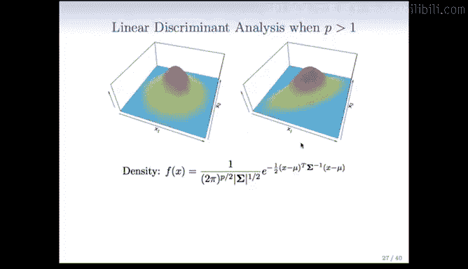

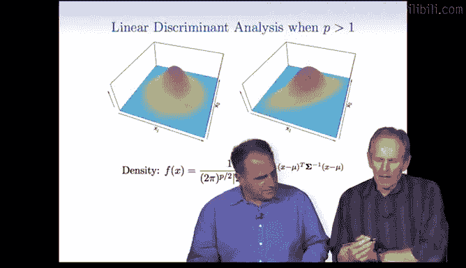

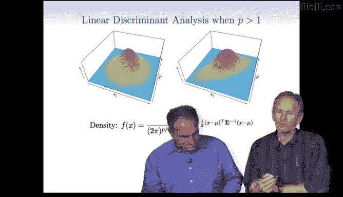

在本节课中，我们将学习高斯判别分析（Gaussian Discriminant Analysis, GDA）在多个变量情况下的应用。我们将从单变量扩展到多变量，理解其数学形式、可视化方法，并探讨如何在实际数据中应用和评估该模型。

---

## 从单变量到多变量

上一节我们介绍了单变量高斯判别分析。本节中，我们来看看当数据包含多个变量时，模型如何扩展。

当进行多变量分析时，我们使用多元高斯分布。下图展示了一个包含两个变量（X1和X2）的二元高斯密度函数图像。

左侧图像展示了两个变量不相关时的密度，形状像一个标准的钟形。右侧图像展示了两个变量存在正相关时的密度，形状像一个被拉伸的钟形。

多元高斯密度的数学公式比单变量情况复杂，它是单变量公式的推广。

**多元高斯密度函数公式**涉及一个协方差矩阵 Σ。其判别函数 δ_k(x) 可以推导如下：

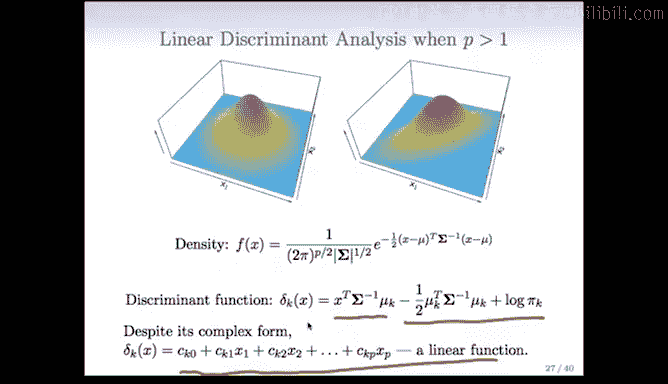

$$
\delta_k(x) = x^T \Sigma^{-1} \mu_k - \frac{1}{2} \mu_k^T \Sigma^{-1} \mu_k + \log \pi_k
$$

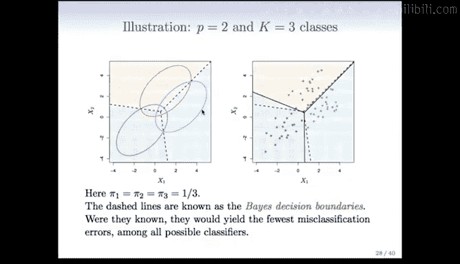

虽然公式看起来复杂，但关键在于它仍然是输入变量 **x** 的线性函数。我们可以将其重写为更简单的形式：

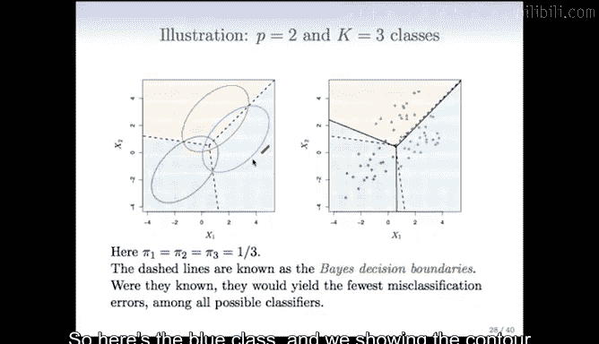

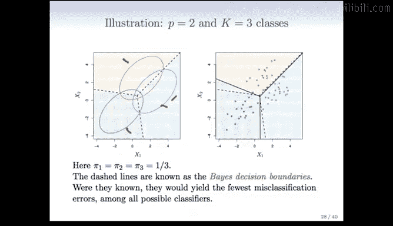

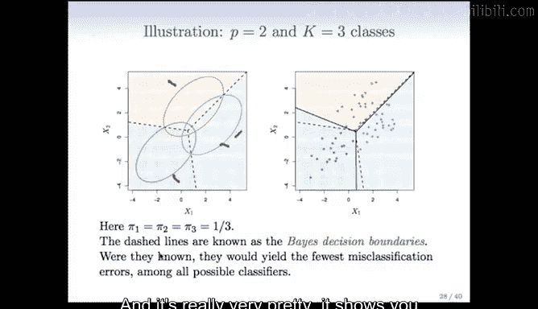

$$
\delta_k(x) = c_{k0} + c_{k1}x_1 + c_{k2}x_2 + ... + c_{kp}x_p
$$

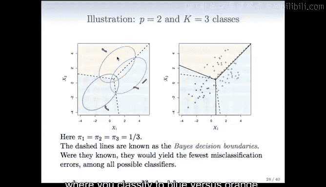

其中，常数项 \(c_{k0}\) 和系数 \(c_{k1}, ..., c_{kp}\) 由上述复杂公式中的各部分构成。

分类规则是：为每个类别计算一个判别函数，然后将样本分类到判别函数值最大的那个类别。

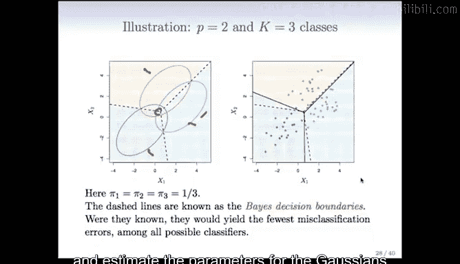

---

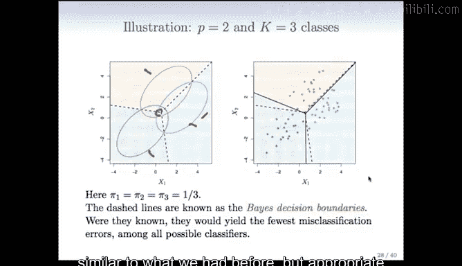

## 决策边界与参数估计

我们可以像单变量情况一样，为判别分析绘制决策边界的可视化图像。

以下是两个变量、三个类别的示例。图中展示了每个类别高斯密度的等高线（例如，某个特定概率水平的轮廓）。

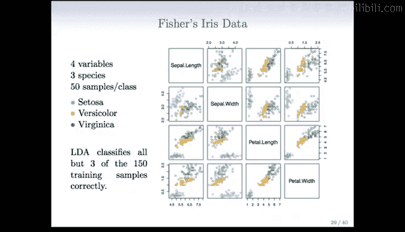

*   蓝色、绿色和橙色区域分别代表三个类别的密度等高线。
*   点状线是真实的（贝叶斯）决策边界。它恰好穿过不同类别等高线相交的点，所有边界在中心区域交汇。

在实际中，我们不知道真实的分布参数。因此，我们需要从数据中估计每个类别高斯分布的参数（均值和协方差矩阵），估计公式是单变量情况的多元推广。

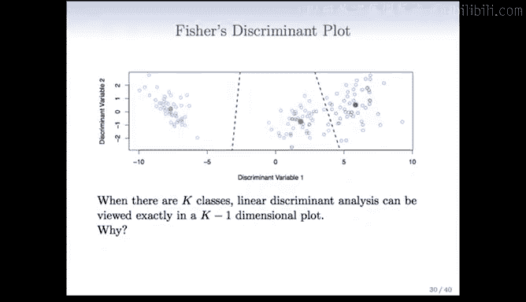

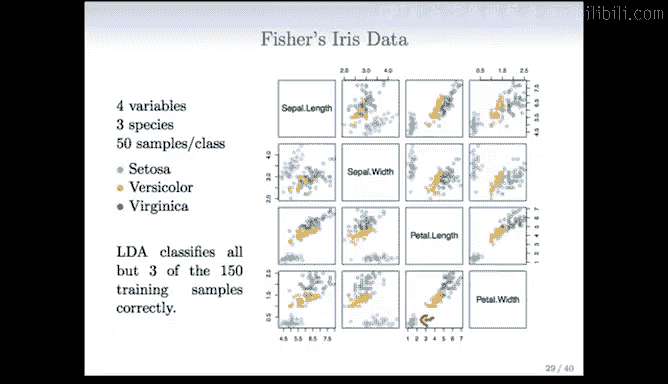

将估计的参数代入模型后，我们得到图中实线所示的估计决策边界。在这个由高斯分布生成的数据示例中，即使数据点不多，估计的边界也非常接近真实边界。

---

## 经典案例：费雪的鸢尾花数据集

学习判别分析，不能不提费雪的鸢尾花数据集。这是最著名的数据集之一，包含三种鸢尾花（Setosa, Versicolor, Virginica）的样本。

数据集中有四个用于分类的特征：萼片长度、萼片宽度、花瓣长度和花瓣宽度。每个类别有50个样本。

通过线性判别分析，我们可以得到一个能够捕捉所有四个变量分类信息的低维图，即判别图。

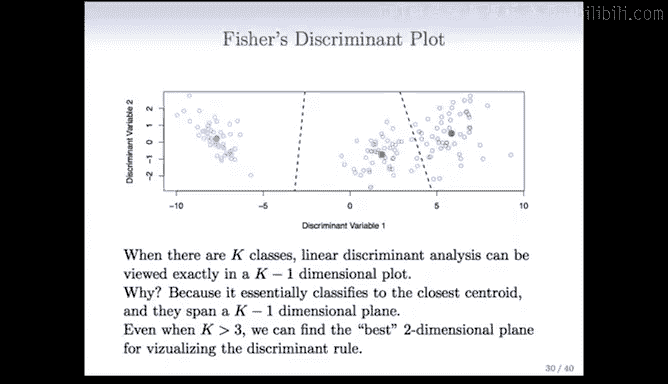

图中两个坐标轴（判别变量1和2）是原始四个变量的线性组合。在这个新空间中，三个类别的分离度非常清晰。这是因为对于三个类别，其质心存在于四维空间的一个二维子平面上，而分类本质上是计算在该子平面上的距离。

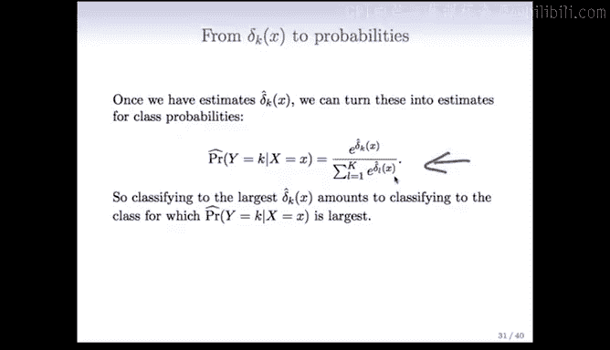

这种生成低维可视化图的能力，是线性判别分析在多类别分类中受欢迎的重要原因。

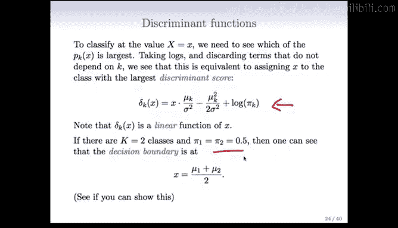

**需要注意的限制**：当特征数量非常大时（例如4000个），协方差矩阵的估计（大小为4000x4000）会变得非常困难，此时需要采用其他修正方法。

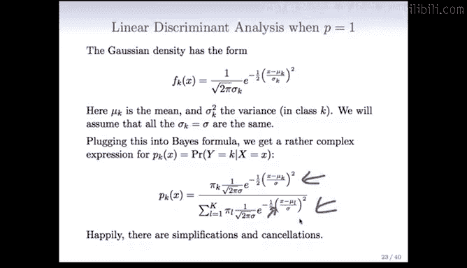

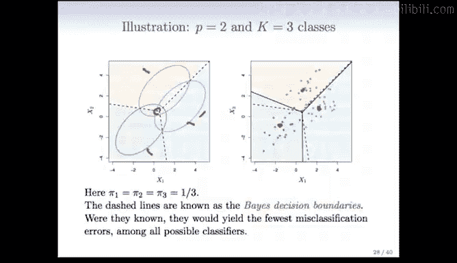

---

## 从判别函数到概率估计

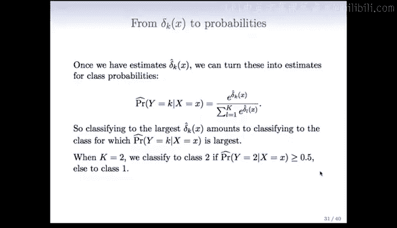

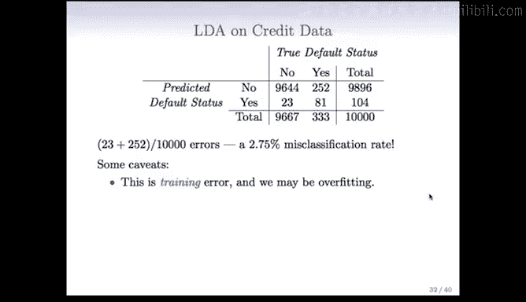

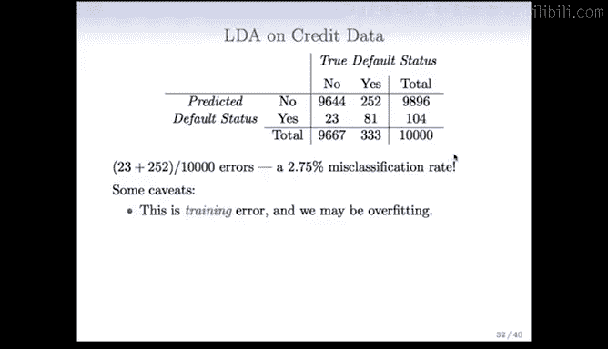

判别分析不仅可以给出分类结果，还能轻松地输出属于每个类别的概率估计。

之前推导判别函数时所做的简化与消元，同样适用于计算后验概率。最终，样本属于第k类的概率可以用判别函数表示：

$$
P(Y=k|X=x) = \frac{e^{\delta_k(x)}}{\sum_{l=1}^{K} e^{\delta_l(x)}}
$$

对于二分类问题，如果设定阈值为0.5，则当 \(P(Y=2|X=x) > 0.5\) 时分类为第2类，否则为第1类，这与逻辑回归类似。

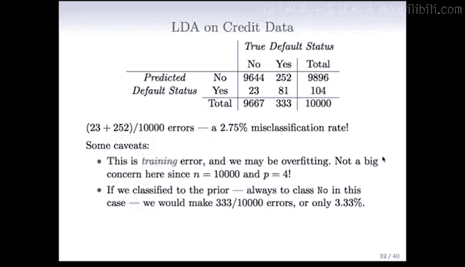

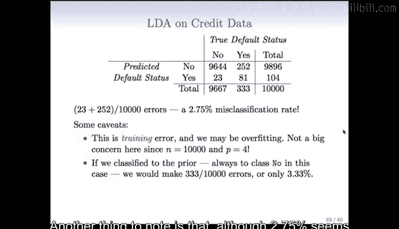

---

## 模型评估与ROC曲线

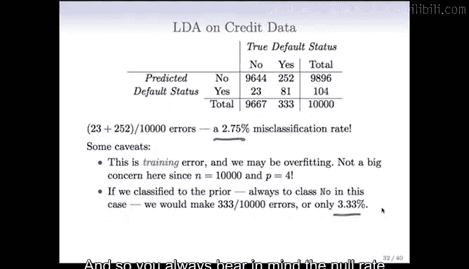

我们可以在信用数据集上应用线性判别分析，并生成混淆矩阵来评估性能。

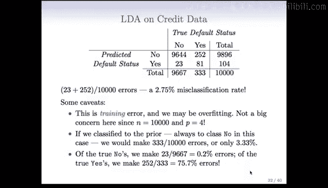

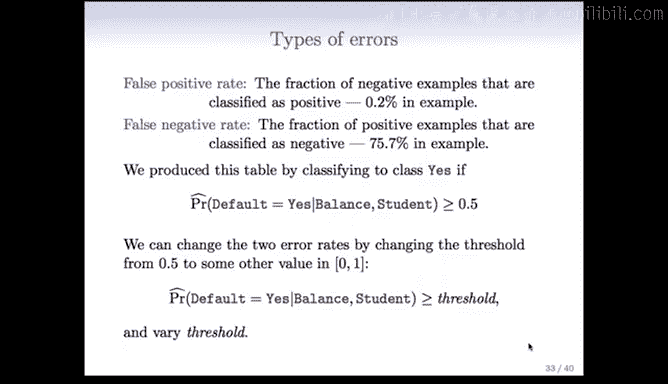

混淆矩阵显示：
*   总体错误率约为2.75%。
*   然而，如果使用最简单的“总是预测多数类（无违约）”的零模型，错误率也只有3.33%。因此，需要对比零模型来评估性能提升。
*   错误类型分布不均：在真实“违约”的样本中，错误率高达75.7%（假阴性率高）；而在真实“不违约”的样本中，错误率仅为2%（假阳性率低）。

在诸如信用筛查等应用中，我们可能希望调整假阳性和假阴性率之间的平衡。这可以通过改变分类概率的阈值来实现（默认阈值为0.5）。

以下是不同阈值下，总体错误率、假阳性率和假阴性率的变化图：

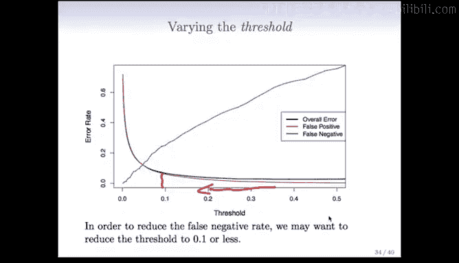

降低阈值意味着更倾向于预测“违约”，这会导致假阳性率缓慢上升，同时假阴性率下降，从而改变两类错误的平衡。

这种权衡关系可以用**ROC曲线**来综合展示。ROC曲线描绘了在不同阈值下，**真阳性率**与**假阳性率**之间的关系。

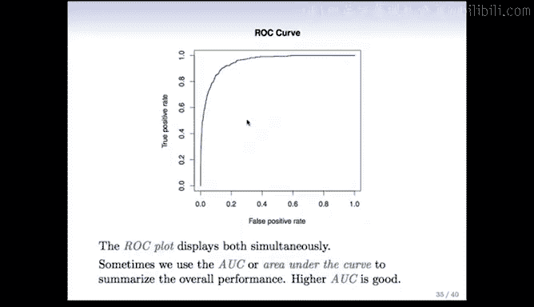

*   45度对角线代表“无信息”的分类器（如随机猜测）。
*   理想的ROC曲线应尽量靠近左上角（真阳性率高，假阳性率低）。
*   我们可以通过比较ROC曲线来评估不同分类器的性能。
*   为了更简洁地总结，常使用**曲线下面积**（AUC）指标，AUC越大表示分类器性能越好。

---

## 总结

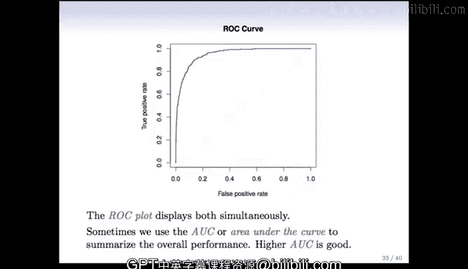

本节课中，我们一起学习了多元高斯判别分析。
1.  我们了解了多元高斯分布的形态及其线性判别函数。
2.  我们看到了如何可视化多类别下的决策边界，并通过估计参数来构建分类器。
3.  我们探讨了经典的鸢尾花数据集，并理解了判别分析在低维投影上的优势及其计算限制。
4.  我们学习了判别分析如何给出概率估计，以及如何通过调整阈值来平衡不同类型的分类错误。
5.  最后，我们介绍了使用混淆矩阵、ROC曲线和AUC来全面评估分类器性能的方法。