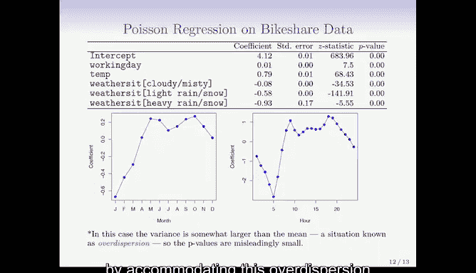

# R 版 22：广义线性模型 🧮


在本节课中，我们将学习广义线性模型。这是一种用于处理多种不同类型响应变量的统一框架。我们将通过一个简单的例子——泊松回归，来理解这一重要模型家族。

## 概述

我们已经学习了线性回归用于定量响应，逻辑回归用于二元响应。然而，还存在其他类型的响应变量，例如非负响应和偏态分布数据。广义线性模型提供了一个统一的框架来处理这些不同的响应类型。本节我们将通过一个关于自行车共享数据的泊松回归实例，来介绍这一框架。

## 自行车共享数据示例

我们使用的数据集记录了华盛顿特区一家自行车租赁公司的若干变量。响应变量是 `bikers`，即华盛顿特区自行车共享项目每小时的用户数量。预测变量包括温度、是否为工作日、天气状况（多云、有雾、小雨/雪，其中“晴朗”为基准水平）、月份以及一天中的小时数。

我们首先拟合了一个线性回归模型。从月份系数的图中可以看出，华盛顿特区在五月和六月租用自行车的人数较多，在炎热的月份较少，秋季又有所增加，冬季则非常少。从小时系数的图中可以看出，工作日开始和结束时租车人数较多，因为人们将其作为公共交通工具使用，白天和午餐时段的数量也有所不同。

然而，响应变量是每小时用户的数量。首先，它是一个非负变量。当我们绘制响应变量与一天中小时数的关系图并添加平滑曲线时，可以发现：当均值较低时，数据的离散程度也较低；但当均值较高时，离散程度似乎变得更大。方差似乎随着均值的增加而增加。

线性回归模型假设响应变量 `y` 的方差是恒定的。但在此例中，当我们拟合完整的线性模型时，有10%的线性模型预测值为负数。尽管响应变量总是正数，但线性模型对预测值没有正数约束。

在这种情况下，你可能会倾向于对自行车数量的对数进行建模。但这也有其自身问题，例如预测值处于错误的尺度上，因为你真正需要的是在自行车数量的尺度上进行预测，而不是在对数尺度上。此外，有些计数值可能为零，无法取对数。因此，这通常不是一个好的解决方案。

## 泊松回归模型

泊松模型应运而生。正如我们使用二项分布模型处理0/1数据一样，泊松回归或泊松分布适用于对计数数据进行建模。

泊松概率质量函数的公式如下：

```
P(Y = k) = (λ^k * e^{-λ}) / k!
```

它给出了 `y` 等于 `k` 的概率的显式形式。它由参数 `λ` 控制，`λ` 是分布中的平均计数。对于泊松分布，方差等于均值。因此，当均值较高时，方差也较高。这是泊松分布的一个特性。

顺便提一下，对于二项分布，方差也取决于均值。对于二项分布，如果均值是 `p`，那么方差是 `p * (1 - p)`。对于伯努利分布也是如此。这往往是我们讨论的这类广义线性模型的一个共同特性，高斯分布除外。

以上是针对单个泊松分布。但我们感兴趣的是均值随协变量变化的泊松分布。因此，我们现在将 `λ` 写作 `x` 的函数。我们假设 `λ` 的对数是 `x` 的线性函数。

就像逻辑回归中我们假设概率的 logit 是 `x` 的函数一样，这里我们假设均值的对数是 `x` 的函数。或者，你可以反转这个变换，说 `λ` 是 `x` 坐标线性组合的指数函数。这自动保证了均值是正数。

我们可以通过最大似然法拟合这个模型。我们使用泊松分布作为拟合的基础。拟合模型后，我们可以得到一个摘要，就像逻辑回归和线性回归一样，摘要会标识每个变量的系数、标准误和P值等。这些系数与线性模型不同，因为它们是在对数尺度上，但传达的信息是相似的。

泊松模型的一个优点是，它在拟合时考虑了方差的变化。我们再次展示了月份和小时的效应估计点图。如果回头比较，会发现它们有些相似。

## 广义线性模型家族

在本课程中，我们已经介绍了三种广义线性模型：高斯（线性）、二项（逻辑）和泊松。它们各自有一个特征性的连接函数。连接函数是均值的变换，该变换由一个线性模型表示。



我们将其写作：`η = g(μ)`，其中 `g(.)` 是连接函数，它是均值的变换，且该变换是线性模型。

以下是三种模型的连接函数：
*   **线性模型**：恒等连接。它直接对均值建模。
*   **逻辑回归**：Logit连接。在逻辑回归中，二项分布的均值是概率。
*   **泊松回归**：对数连接。

如何决定使用哪种模型？这取决于响应变量的性质。对于计数数据，我们选择适合计数的分布（泊松）。对于二元数据，伯努利分布几乎是唯一的选择。对于定量数据变量，如果其分布看起来对称，我们通常使用高斯分布。

这些模型还具有特征性的方差函数。我们讨论过，泊松分布的方差等于均值。这些模型通过最大似然法拟合，并且R语言中的 `glm` 函数可以生成类似我们展示的摘要。

我们尚未讨论的其他广义线性模型包括伽马分布、负二项分布（尽管名称如此，但实际上用于计数数据，特别是在存在过度离散时）以及逆高斯分布。伽马分布通常用于具有长右尾的正观测值或非负观测值。广义线性模型是一个相当大的家族，我们只介绍了其中较为重要的几种。

## 总结

本节课我们一起学习了广义线性模型。我们了解到，广义线性模型通过连接函数和特定的分布假设，将线性回归、逻辑回归和泊松回归等模型统一到一个框架下。我们通过自行车共享数据的泊松回归实例，具体探讨了如何处理计数数据，并比较了其与线性回归在处理此类数据时的差异。最后，我们简要回顾了三种主要广义线性模型的特点及其适用场景。