# R 版 23：二次判别分析与朴素贝叶斯 📊

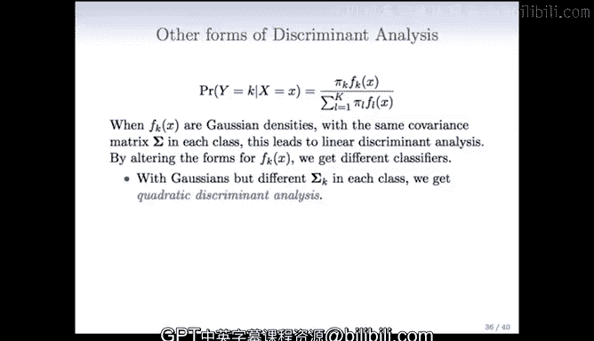

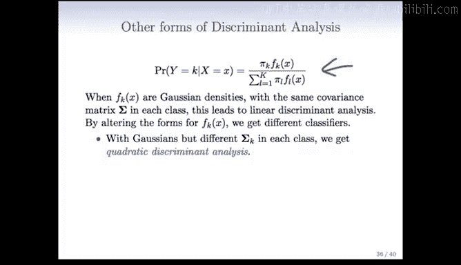

在本节课中，我们将学习线性判别分析（LDA）的两个重要扩展：**二次判别分析（QDA）** 和 **朴素贝叶斯分类器**。我们将探讨它们与LDA的区别、各自的适用场景以及背后的核心思想。

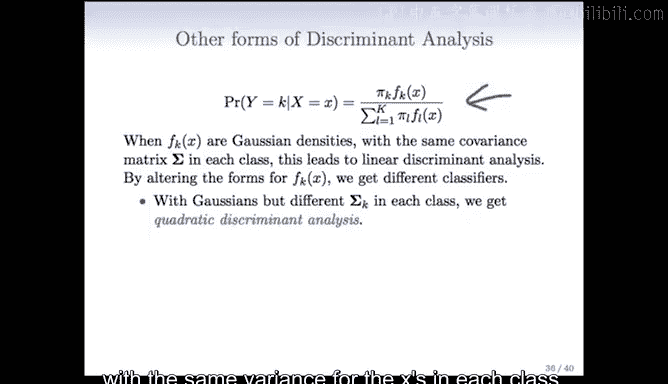

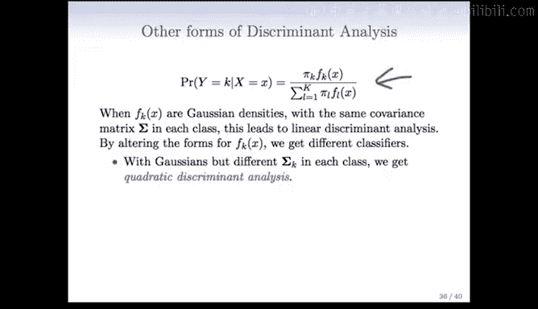

---

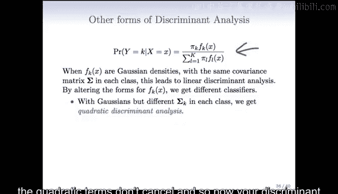

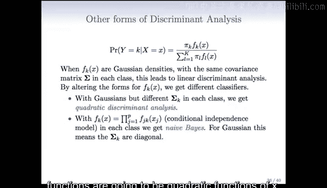

## 从线性判别分析到更通用的形式

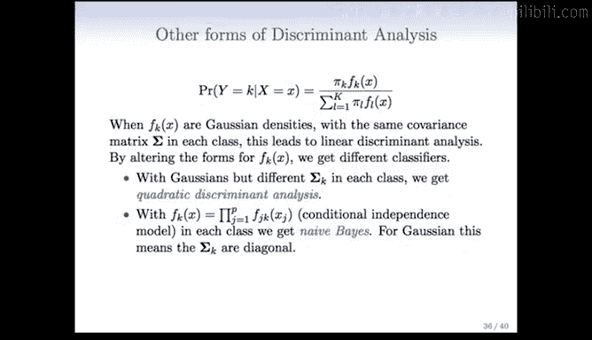

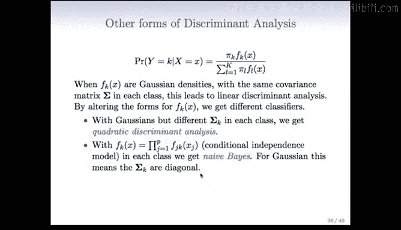

上一节我们介绍了使用高斯密度函数且假设各类别方差相同的线性判别分析。其判别规则的形式是通用的，我们可以使用其他密度估计方法，并将其代入该规则，从而得到不同的分类器。

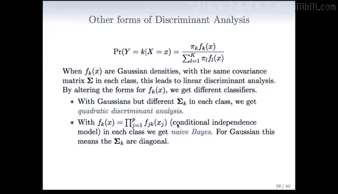

### 当各类别方差不同时

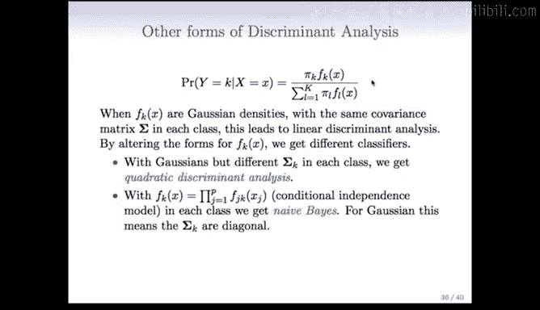

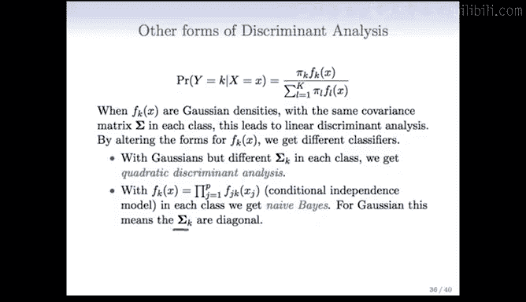

如果我们假设每个类别中的特征 `X` 服从高斯分布，但**协方差矩阵不同**，情况会如何？在LDA中，由于假设方差相等，公式中的二次项会相互抵消，最终得到关于 `X` 的线性判别函数。

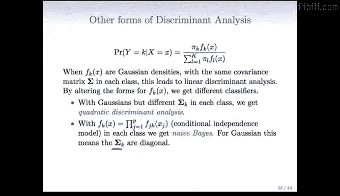

然而，当各类别的协方差矩阵 `Σ_k` 不同时，二次项将不会抵消。此时，判别函数会变成关于 `X` 的**二次函数**。

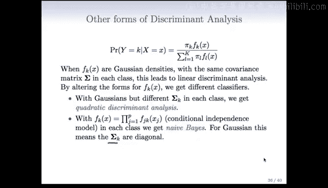

**核心公式**：第 `k` 类的判别函数 `δ_k(x)` 将包含二次项：
`δ_k(x) = -0.5 * (x - μ_k)^T Σ_k^{-1} (x - μ_k) - 0.5 * log|Σ_k| + log π_k`
其中 `μ_k` 是均值，`Σ_k` 是协方差矩阵，`π_k` 是先验概率。

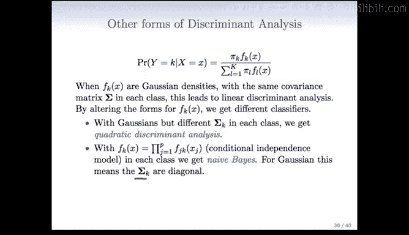

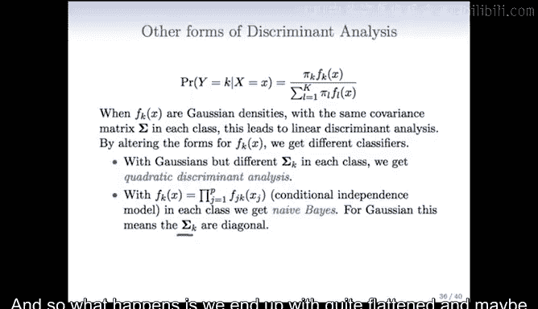

这种方法被称为**二次判别分析（QDA）**。它会产生弯曲的（非线性）决策边界。

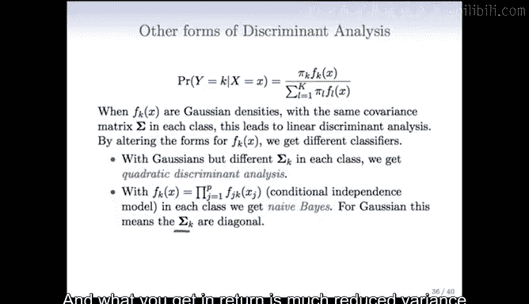

### 高维情况下的挑战与简化

当特征数量非常多时（例如之前提到的4000个特征），估计这些庞大的协方差矩阵 `Σ_k` 会非常困难，因为参数数量是特征数量 `P` 的平方级。

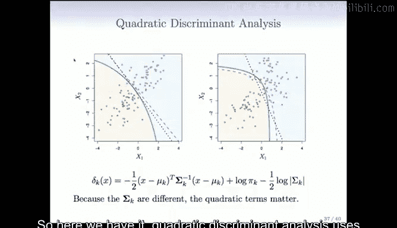

一个有效的简化方法是：假设在每个类别内部，各个特征之间是**条件独立**的。这意味着每个类别的联合密度可以分解为各个特征边缘密度的乘积。

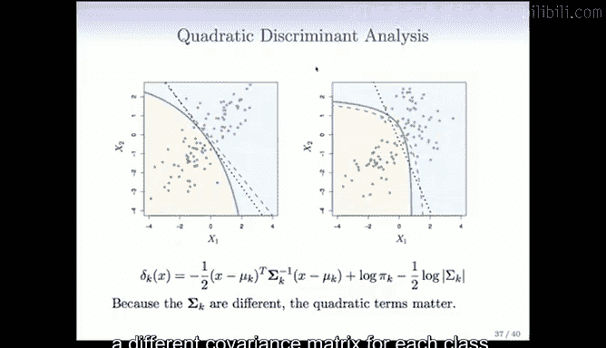

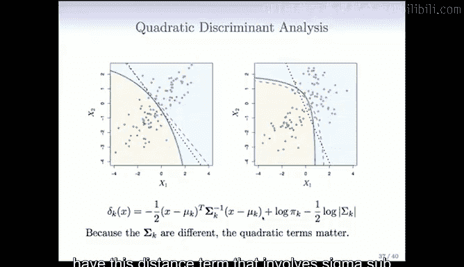

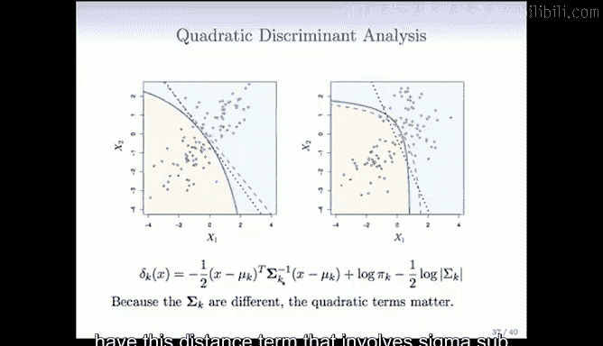

将这个假设代入贝叶斯分类规则，就得到了**朴素贝叶斯分类器**。

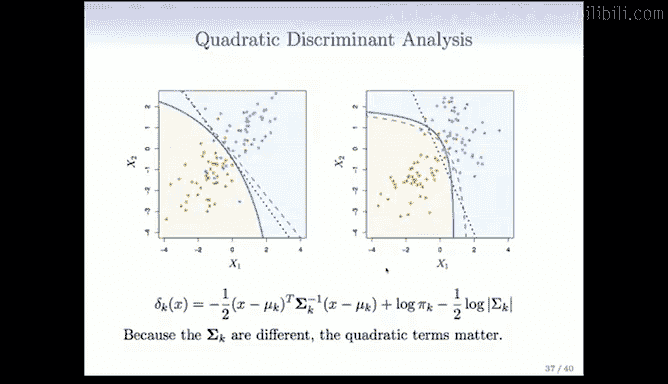

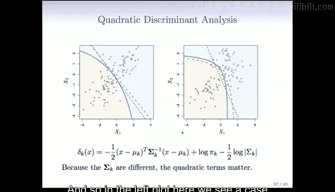

对于LDA框架下的朴素贝叶斯，这意味着我们假设每个类别的协方差矩阵 `Σ_k` 都是**对角矩阵**。这样，需要估计的参数数量就从 `P^2` 级大幅减少到 `P` 级。

尽管“特征条件独立”这个假设通常过于简化（甚至可能是错误的），但朴素贝叶斯分类器在高维问题中往往表现优异。原因在于：
*   **分类任务的目标**是找出概率最大的类别，而不是精确估计概率值本身。
*   即使概率估计存在偏差，只要相对大小顺序正确，仍能做出正确分类。
*   通过大幅减少参数，我们获得了**更低的估计方差**，这在很多时候比微小的偏差更重要。

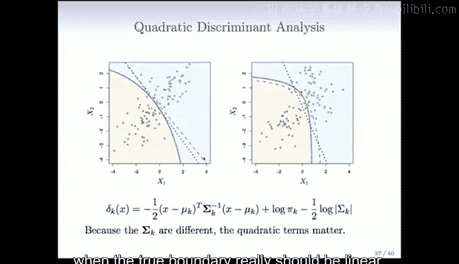

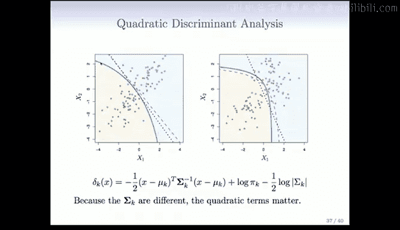

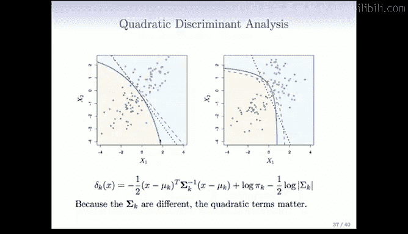

---

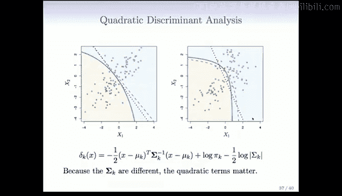

## 方法对比与应用场景

以下是二次判别分析（QDA）与朴素贝叶斯（Naive Bayes）的核心对比：

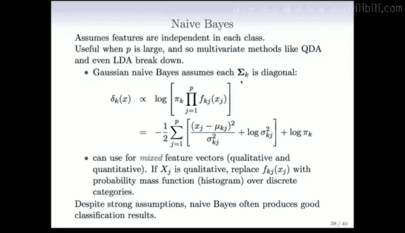

*   **二次判别分析（QDA）**
    *   **核心假设**：每个类别有自己的协方差矩阵 `Σ_k`。
    *   **判别边界**：二次（弯曲）边界。
    *   **适用场景**：特征数量较少，且各类别数据分布形状（协方差）差异明显时效果更好。
    *   **局限性**：特征多时，估计大量参数会导致模型不稳定。

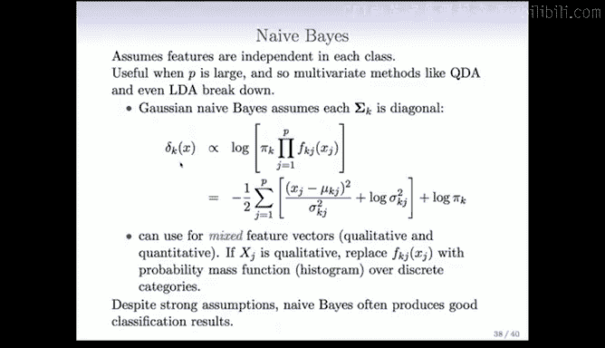

*   **朴素贝叶斯**
    *   **核心假设**：特征在给定类别下条件独立，协方差矩阵为对角阵。
    *   **判别边界**：可以是线性或二次，取决于特征分布假设（如高斯）。
    *   **适用场景**：特征数量非常多的高维问题。能处理混合类型特征（定量特征用高斯密度，定性特征用概率质量函数）。
    *   **优势**：参数少，计算高效，对高维数据鲁棒性强。

### 图示理解

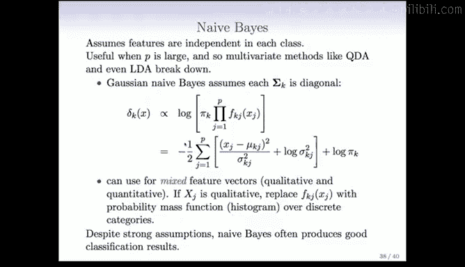

通过图示可以直观理解：
*   当真实决策边界是线性时（数据协方差相同），LDA表现很好，QDA会产生轻微弯曲的边界，但对分类性能影响不大。
*   当真实决策边界是曲线时（数据协方差不同），QDA能很好地捕捉这种结构，而LDA会给出一个差异较大的线性边界。

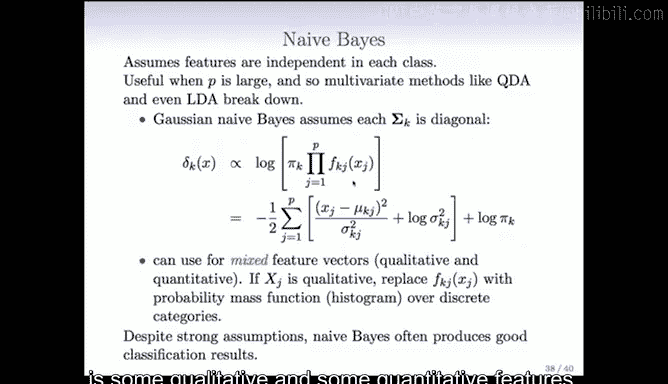

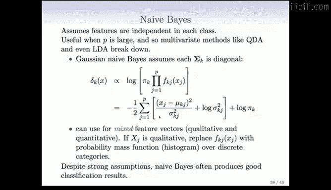

---

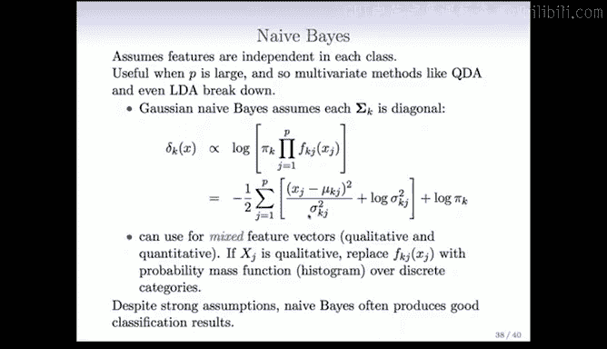

## 延伸联系：判别式学习 vs. 生成式学习

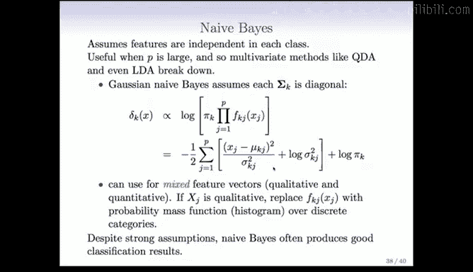

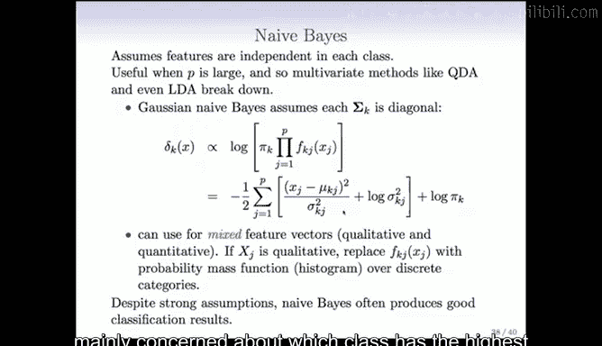

我们之前学习了两种分类方法：逻辑回归和线性判别分析（LDA）。它们之间有何异同？

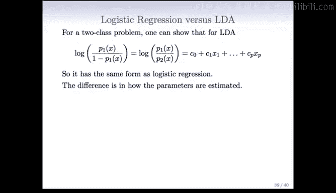

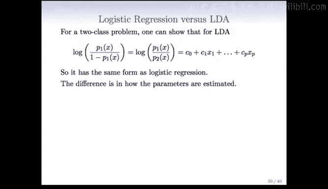

可以证明，对于二分类问题，LDA得到的**对数几率**也是输入 `X` 的线性函数，其形式与逻辑回归完全相同。

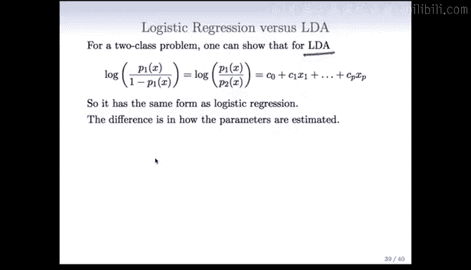

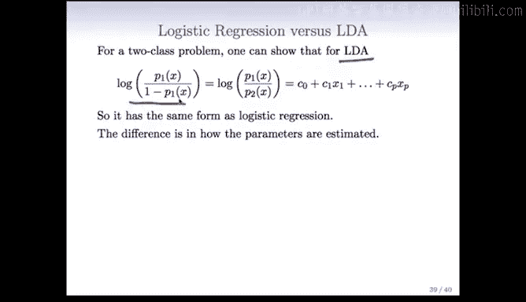

**核心公式**：`log( P(Y=1|X) / P(Y=0|X) ) = β_0 + β^T X`

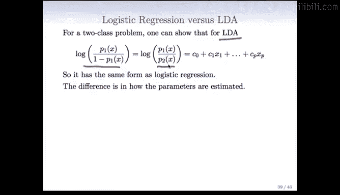

两者的根本区别在于**参数估计的方式**：
*   **逻辑回归**：直接对条件分布 `P(Y|X)` 进行建模，通过最大化**条件似然**来估计参数。这种方法在机器学习中称为**判别式学习**。
*   **判别分析（LDA/QDA）**：对联合分布 `P(X, Y)` 进行建模，通过估计每个类别的特征分布 `P(X|Y)` 和先验概率 `P(Y)`，再利用贝叶斯定理得到 `P(Y|X)`。这种方法称为**生成式学习**。

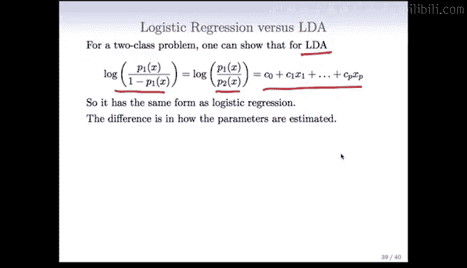

尽管出发点不同，但在实际应用中，这两种方法的结果通常非常相似。

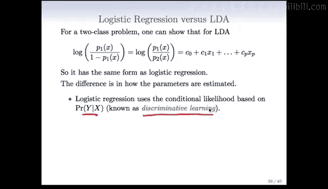

**补充说明**：逻辑回归也可以通过显式地加入特征的二次项（如 `X^2`, `X_i * X_j`）来拟合非线性的二次决策边界，这与QDA的功能类似。

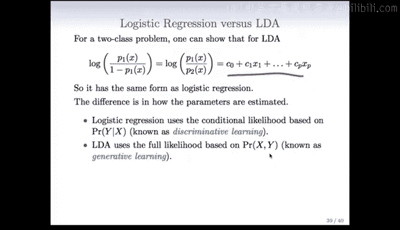

---

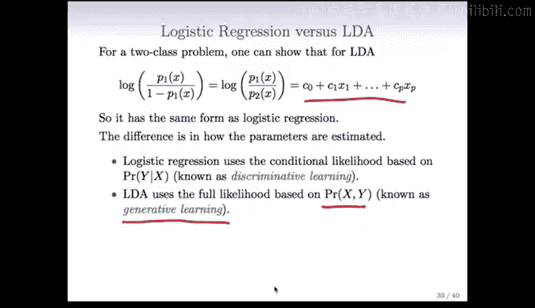

## 总结与预告

本节课我们一起学习了线性判别分析的两种重要扩展：
1.  **二次判别分析**：放宽了方差齐性的假设，允许各类别有不同协方差矩阵，从而能捕捉更复杂的非线性关系。
2.  **朴素贝叶斯**：通过特征条件独立的强假设，极大地简化了模型，使其特别适用于高维分类任务。

我们还辨析了**判别式学习**与**生成式学习**这两种建模哲学的区别。

在接下来的课程中，我们将回到这些方法，探讨更一般的版本以构建更强大的分类器。特别地，我们将介绍另一种非常流行的分类方法——**支持向量机**。

**课程预告**：下一节我们将进入关于**交叉验证**与**自助法**的重要章节，并将有幸听到该领域奠基人Bradley Efron教授的分享。