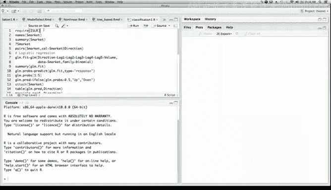
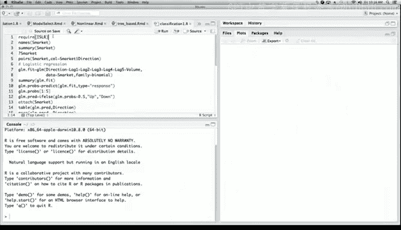
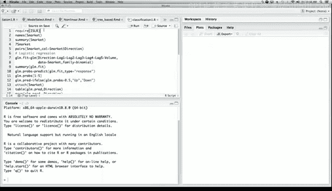
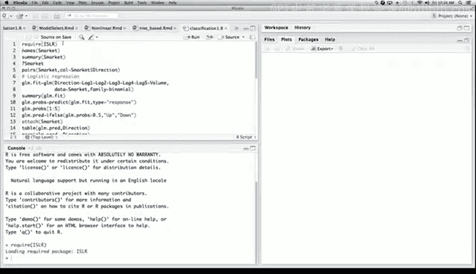
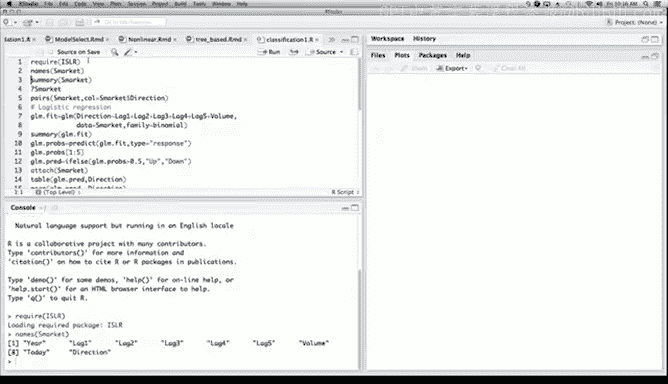
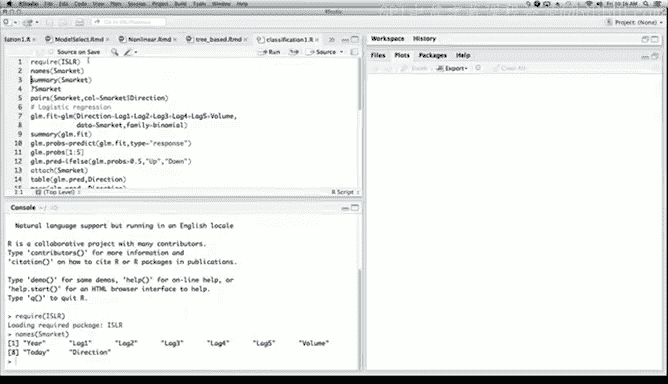
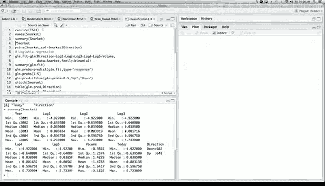
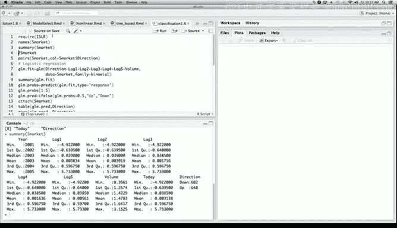
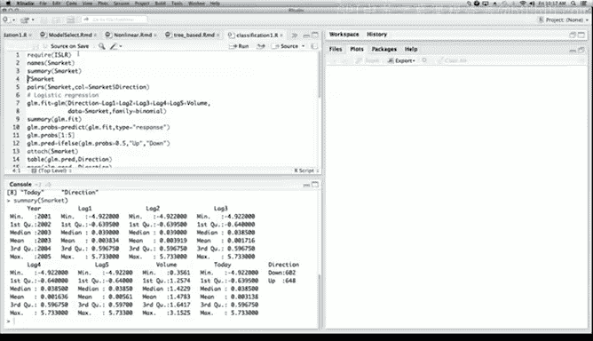

# R 版 24：R语言逻辑回归建模教程 📊



在本节课中，我们将学习如何使用R语言中的`glm()`函数来拟合逻辑回归模型。我们将使用`ISLR`包中的`Smarket`数据集，通过预测股市的涨跌方向来演示逻辑回归的完整流程。

---



## 加载数据与初步探索

首先，我们需要加载`ISLR`包，它包含了我们将要使用的数据集。我们使用`require()`命令来加载包，其功能与`library()`类似。

```r
require(ISLR)
```

加载完成后，我们可以查看`Smarket`数据集的内容。使用`names()`函数可以查看数据框中的变量名，而`summary()`函数则提供了每个变量的简要统计摘要。



```r
names(Smarket)
summary(Smarket)
```









从摘要中，我们可以看到数据集中包含多个滞后变量（`Lag1` 到 `Lag5`）、交易量（`Volume`）、当日收益率（`Today`）以及市场方向（`Direction`）。`Direction`是一个二元响应变量，表示市场相较于前一日是上涨（Up）还是下跌（Down）。我们将使用逻辑回归模型来预测这个变量。






---

## 数据可视化

为了对数据有一个直观的了解，我们可以绘制散点图矩阵。使用`pairs()`函数，并以`Direction`变量作为颜色标识，可以观察不同类别（上涨/下跌）的数据点在各个变量上的分布。

```r
pairs(Smarket, col=Smarket$Direction)
```

从图中可以看出，除了`Direction`与`Today`变量存在明显关联外（这是由定义决定的），其他变量之间似乎没有很强的相关性。这在股市数据中是常见的，因为如果市场很容易预测，人们早就从中获利了。

---

## 拟合逻辑回归模型

接下来，我们使用`glm()`函数来拟合一个逻辑回归模型。我们将`Direction`作为响应变量，使用`Lag1`到`Lag5`以及`Volume`作为预测变量。通过设置`family = binomial`参数，我们指定拟合的是逻辑回归模型。

```r
glm.fit <- glm(Direction ~ Lag1 + Lag2 + Lag3 + Lag4 + Lag5 + Volume,
               data = Smarket, family = binomial)
summary(glm.fit)
```

模型摘要显示了每个预测变量的系数估计值、标准误、z统计量和p值。在这个例子中，所有预测变量的p值都不显著，这意味着在统计意义上，这些变量与市场方向没有显著的线性关系。这并不意外，也并不意味着模型完全无法做出预测。

摘要还提供了零偏差（Null Deviance）和残差偏差（Residual Deviance）。零偏差对应仅包含截距项的模型，而残差偏差对应包含所有预测变量的完整模型。两者差异不大，表明加入这些预测变量对模型拟合度的提升有限。

---

## 模型预测与评估

我们可以使用训练好的模型对训练数据进行预测。通过`predict()`函数并设置`type = "response"`，我们可以得到预测的概率值。

```r
glm.probs <- predict(glm.fit, type = "response")
glm.probs[1:5]
```

前几个预测概率值都接近0.5，这再次表明模型没有给出很强的预测信号。

为了将概率值转换为具体的类别预测（上涨或下跌），我们设定一个阈值为0.5。使用`ifelse()`函数，将概率大于0.5的预测为“Up”，否则预测为“Down”。

```r
glm.pred <- ifelse(glm.probs > 0.5, "Up", "Down")
```

为了评估模型在训练数据上的表现，我们创建一个混淆矩阵，并计算正确分类的比例。

```r
attach(Smarket)
table(glm.pred, Direction)
mean(glm.pred == Direction)
```

结果显示，在训练数据上，模型的正确分类率约为52%，略高于随机猜测（50%）。但这可能存在过拟合的风险。

---

## 划分训练集与测试集

为了更客观地评估模型的泛化能力，我们需要将数据划分为训练集和测试集。这里，我们以年份2005年为界，将2005年之前的数据作为训练集，2005年及之后的数据作为测试集。

```r
train <- (Year < 2005)
glm.fit <- glm(Direction ~ Lag1 + Lag2 + Lag3 + Lag4 + Lag5 + Volume,
               data = Smarket, family = binomial, subset = train)
```

然后，我们使用训练好的模型对测试集进行预测。

```r
glm.probs <- predict(glm.fit, newdata = Smarket[!train, ], type = "response")
glm.pred <- ifelse(glm.probs > 0.5, "Up", "Down")
```

接着，我们提取测试集对应的真实市场方向，并评估模型在测试集上的表现。

```r
direction.2005 <- Direction[!train]
table(glm.pred, direction.2005)
mean(glm.pred == direction.2005)
```

在测试集上，模型的正确分类率下降到了48%，甚至低于随机猜测的水平。这表明我们最初包含所有预测变量的模型可能确实存在过拟合问题。

---

## 尝试简化模型

上一节我们发现包含所有变量的模型在测试集上表现不佳。本节中，我们尝试拟合一个更简单的模型，只使用`Lag1`和`Lag2`作为预测变量，看看是否能提升模型的泛化性能。

```r
glm.fit <- glm(Direction ~ Lag1 + Lag2, data = Smarket,
               family = binomial, subset = train)
glm.probs <- predict(glm.fit, newdata = Smarket[!train, ], type = "response")
glm.pred <- ifelse(glm.probs > 0.5, "Up", "Down")
table(glm.pred, direction.2005)
mean(glm.pred == direction.2005)
```

简化后的模型在测试集上的正确分类率提升到了约56%，表现有了明显改善。这说明，有时使用更少、更相关的预测变量，即使它们在统计上不显著，也可能获得更好的预测效果，因为它有助于减少过拟合。

---

## 总结

本节课中我们一起学习了在R语言中应用逻辑回归的完整流程。我们首先加载并探索了`Smarket`数据集，然后使用`glm()`函数拟合了逻辑回归模型。我们学习了如何解读模型摘要、进行预测、将概率转换为类别，并通过混淆矩阵评估模型性能。

更重要的是，我们实践了将数据划分为训练集和测试集的方法，这帮助我们发现了初始模型可能存在的过拟合问题。通过尝试一个更简单的模型，我们验证了模型简化有时能有效提升其在未见数据上的预测能力。这个过程展示了模型构建、评估与改进的基本思路。