# R 版 25：线性判别分析 (LDA) 实战教程 📊 

在本节课中，我们将学习如何使用R语言进行线性判别分析。我们将使用股票市场数据，通过前两天的收益率来预测当天市场的涨跌方向。课程将涵盖数据准备、模型拟合、结果解读以及预测评估的全过程。

---

## 🛠️ 准备工作

首先，我们需要加载必要的R包和数据。我们将使用 `ISLR` 包中的 `Smarket` 数据集，以及 `MASS` 包中的 `lda` 函数来执行线性判别分析。

```r
# 加载包含数据集的包
require(ISLR)
# 加载包含LDA函数的包
require(MASS)
```

加载包后，我们可以查看 `lda` 函数的帮助文档以了解其语法和选项。

```r
# 查看LDA函数的帮助文档
help(lda)
```

---

## 📈 拟合线性判别分析模型

上一节我们准备好了环境和数据，本节中我们来看看如何具体拟合一个LDA模型。我们将使用 `Smarket` 数据集，其中响应变量是市场方向 (`Direction`)，预测变量是前两天的收益率 (`Lag1` 和 `Lag2`)。我们只使用2005年之前的数据进行训练。

以下是拟合模型的代码：

```r
# 使用2005年之前的数据拟合LDA模型
lda.fit <- lda(Direction ~ Lag1 + Lag2, data = Smarket, subset = (Year < 2005))
```


运行上述代码后，模型会快速完成拟合。我们可以通过打印模型对象来查看摘要信息。


```r
# 打印模型摘要
lda.fit
```

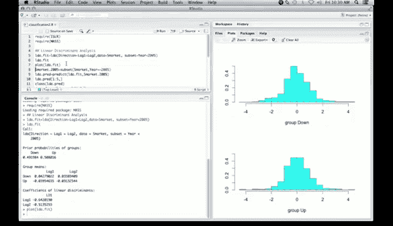


输出结果将显示：
1.  **先验概率**：数据中“上涨”和“下跌”类别的比例，各约50%。
2.  **组均值**：两个类别（上涨和下跌）在 `Lag1` 和 `Lag2` 上的平均得分。
3.  **线性判别系数**：用于区分两个类别的线性函数的系数。

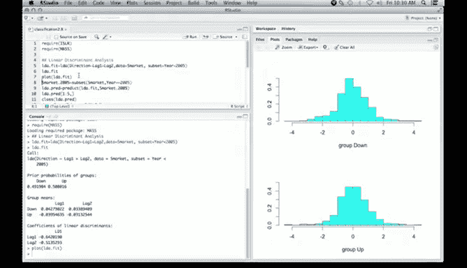

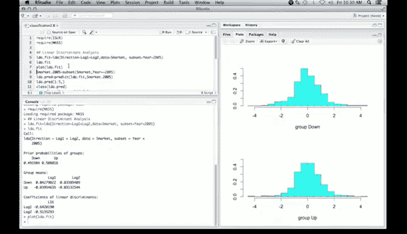

---


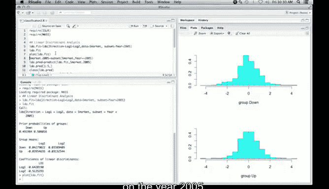

## 📊 可视化与初步分析


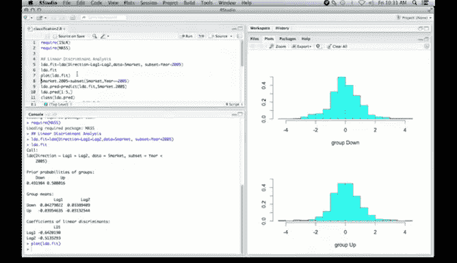

模型拟合后，我们可以使用 `plot` 方法对其进行可视化，以直观地检查判别效果。


```r
# 绘制LDA结果
plot(lda.fit)
```


该图会显示线性判别函数值对于“上涨”组和“下跌”组的分布直方图。从图中可以看出，两个直方图几乎完全重叠，这表明仅凭前两天的收益率很难清晰地区分市场第二天的涨跌。这在股票市场预测中是常见情况。


---

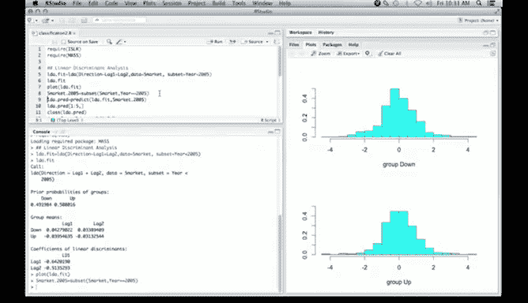

## 🔮 在新数据上进行预测

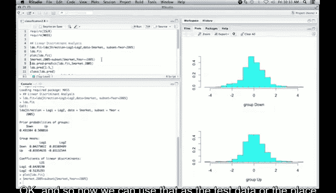


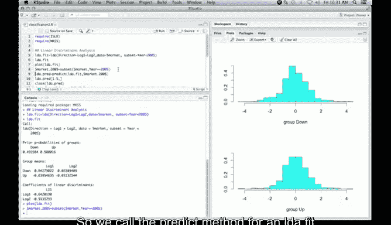

接下来，我们将使用训练好的模型对2005年的数据进行预测，以评估模型的性能。

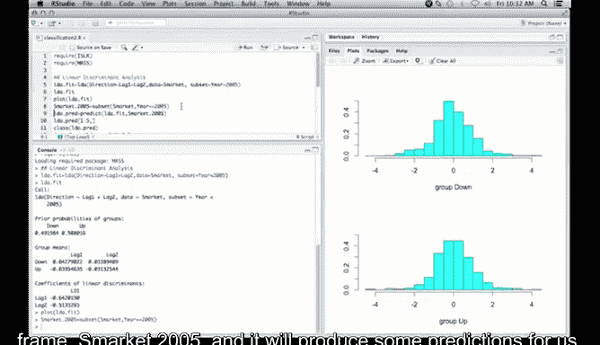

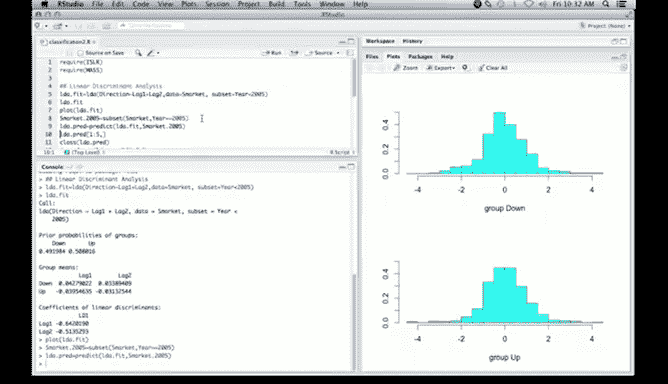

首先，我们需要从原始数据集中提取出2005年的数据作为测试集。


```r
# 创建2005年的数据子集作为测试集
Smarket.2005 <- subset(Smarket, Year == 2005)
```


然后，使用 `predict` 函数对测试集进行预测。


```r
# 对测试集进行预测
lda.pred <- predict(lda.fit, Smarket.2005)
```

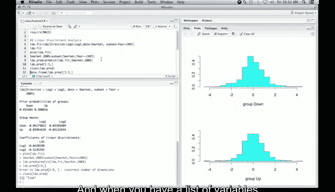

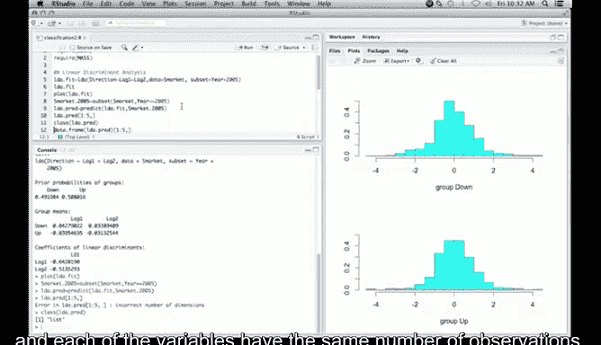

`predict` 函数的输出是一个列表。为了更方便地查看结果，我们可以将其转换为数据框。

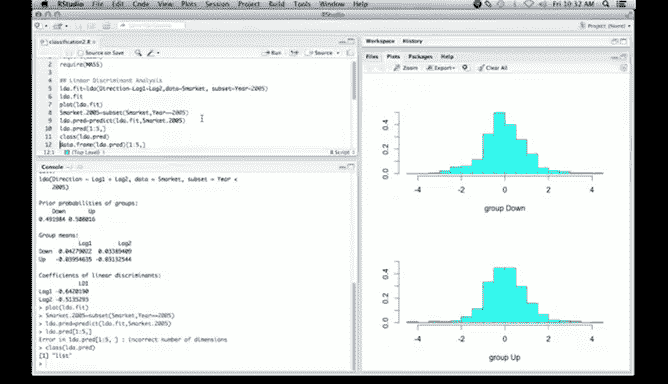


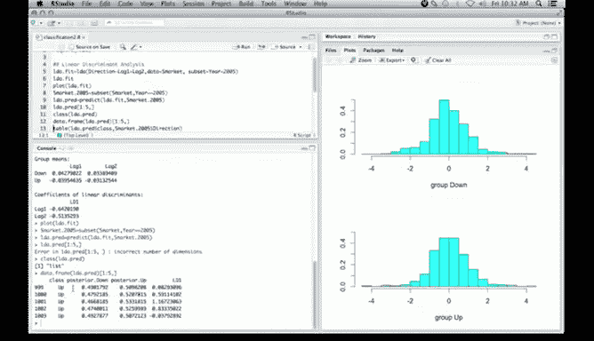

```r
# 将预测结果列表转换为数据框并查看前几行
lda.pred.df <- data.frame(lda.pred)
head(lda.pred.df)
```


数据框包含以下几列：
*   `class`：模型的预测类别（上涨或下跌）。
*   `posterior.Up` 和 `posterior.Down`：样本属于“上涨”或“下跌”类别的后验概率。
*   `x`：线性判别得分。

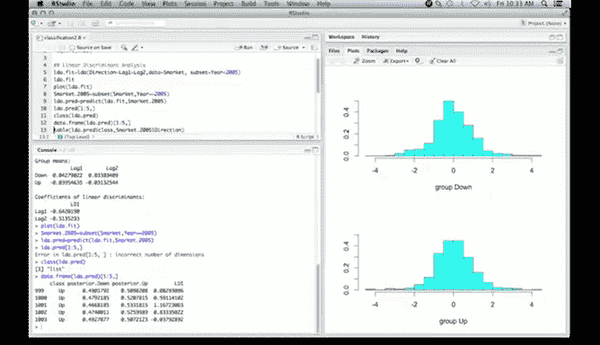


---


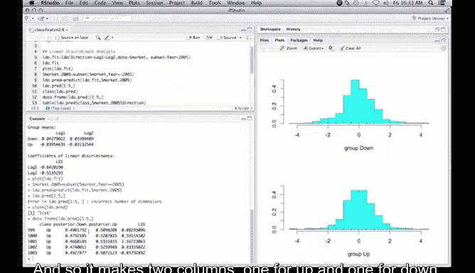

## 📋 评估模型性能

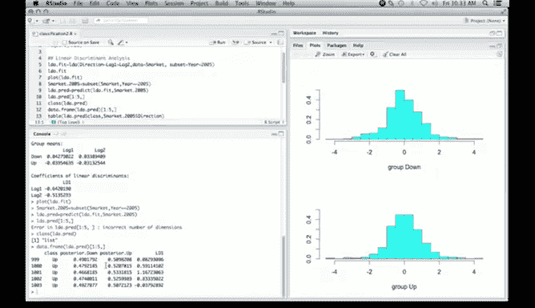


为了评估模型的预测准确性，我们需要将预测结果与真实情况进行比较。

以下是创建混淆矩阵并计算正确分类率的步骤：


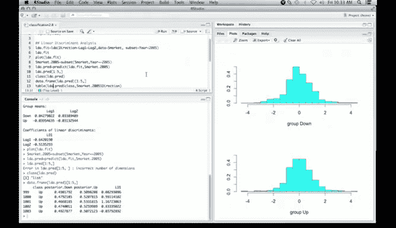

```r
# 创建混淆矩阵：预测类别 vs. 真实类别
confusion_table <- table(lda.pred$class, Smarket.2005$Direction)
confusion_table
```

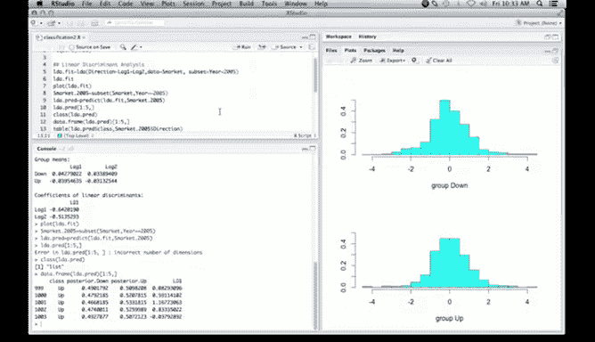

混淆矩阵的对角线元素代表正确分类的样本数，非对角线元素代表错误分类的样本数。

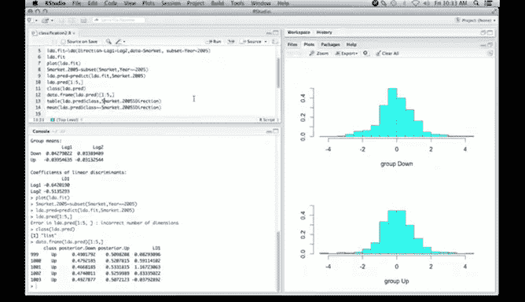


最后，我们可以计算模型的整体正确分类率。


```r
# 计算正确分类率
correct_rate <- mean(lda.pred$class == Smarket.2005$Direction)
correct_rate
```

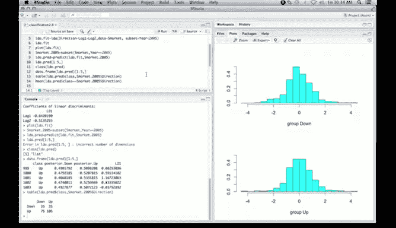


在本例中，正确分类率大约为 **0.56**（56%）。虽然这个提升并不显著，但在金融预测领域，任何微小的优势都可能具有价值。


---

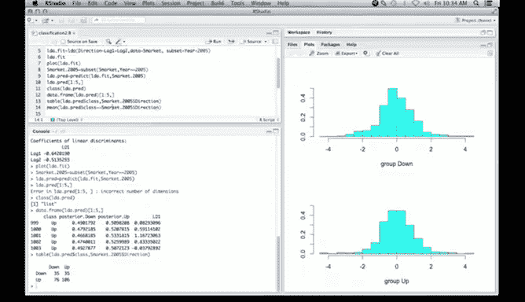

## 🎯 课程总结


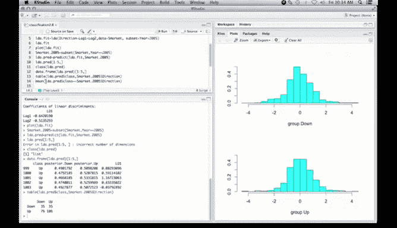

本节课中我们一起学习了线性判别分析在R语言中的完整应用流程。

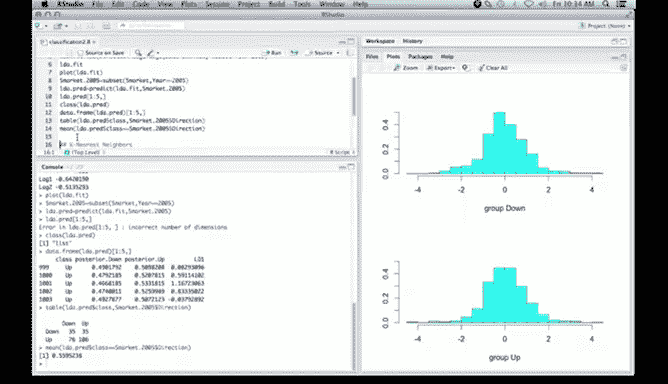

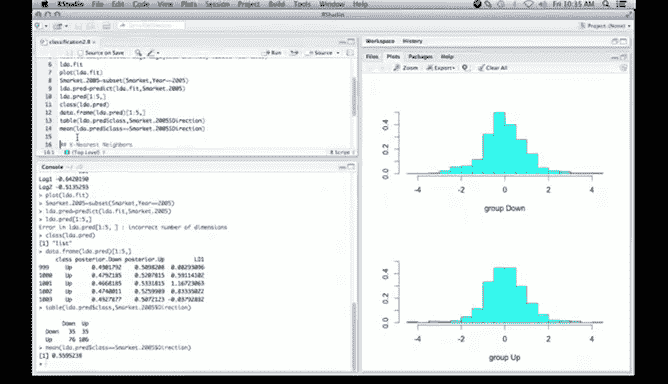

我们首先加载了必要的包和数据，然后使用 `lda` 函数拟合了一个预测股票市场方向的模型。通过可视化，我们观察到判别效果有限。接着，我们在独立的2005年测试集上进行了预测，并通过混淆矩阵和正确分类率评估了模型性能，得到了约56%的准确率。


这个过程展示了监督学习分类方法的一个标准工作流：**数据准备 -> 模型训练 -> 结果可视化 -> 在新数据上预测 -> 性能评估**。书中还有更多关于LDA和其他分类方法的示例，建议进一步阅读以加深理解。