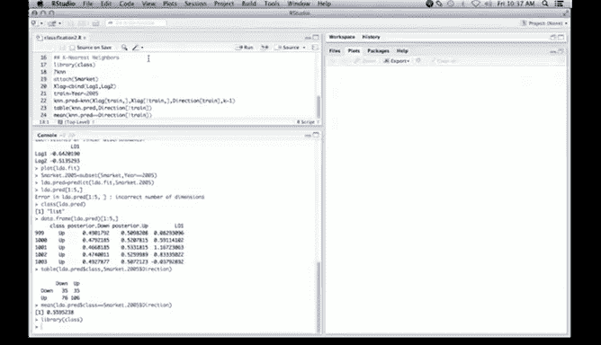

# R 版 26：K最近邻分类 👨‍🏫


在本节课中，我们将要学习一种非常经典且实用的分类方法——K最近邻（K-Nearest Neighbors， KNN）分类。我们将使用R语言，通过一个股票市场的实例来演示其基本应用。

K最近邻是一种非常直观的分类算法。它的核心思想是：对于一个待分类的新观测点，在特征空间中找出训练集里离它最近的K个“邻居”，然后根据这K个邻居的类别“投票”来决定新观测点的类别。这是一种“惰性学习”方法，因为它没有显式的训练过程，而是在预测时直接进行计算。

---

## 准备工作与数据加载 📂

上一节我们介绍了线性判别分析（LDA），本节中我们来看看另一种非参数分类方法。首先，我们需要加载必要的R包并准备数据。

K最近邻分类在R中可以通过 `class` 包中的 `knn` 函数实现。因此，我们首先加载这个库。



```r
library(class)
```

我们可以查看 `knn` 函数的帮助文档以了解其用法。

```r
?knn
```

帮助文件显示，`knn` 函数的调用格式与我们之前使用的 `lda` 函数略有不同。它不直接使用公式（formula），而是需要分别指定训练集的特征矩阵、测试集的特征矩阵、训练集的类别标签以及参数K的值。

我们将继续使用股票市场（`Smarket`）数据集。为了在调用函数时能直接使用变量名，我们可以先 `attach` 这个数据框。

```r
attach(Smarket)
```

接下来，我们创建特征矩阵，这里我们依然使用 `Lag1` 和 `Lag2` 这两个滞后变量作为预测变量。

```r
xlag <- cbind(Lag1, Lag2)
```

我们创建一个逻辑向量 `train`，用于划分训练集（2005年之前的数据）和测试集（2005年的数据）。

```r
train <- (Year < 2005)
```

---

## 应用K=1的最近邻分类 🧮

现在，我们可以调用 `knn` 函数进行K=1的最近邻分类。这意味着，对于测试集中的每一个点，算法都会在训练集中找到与之欧氏距离最近的那个点，并将其类别直接赋予测试点。

以下是调用代码：

```r
knn.pred <- knn(train = xlag[train, ],
                test = xlag[!train, ],
                cl = Direction[train],
                k = 1)
```

函数参数说明：
*   `train`: 训练集的特征矩阵。
*   `test`: 测试集的特征矩阵。
*   `cl`: 训练集观测对应的类别标签（`Direction`）。
*   `k`: 最近邻的个数，这里设为1。

计算完成后，我们可以通过混淆矩阵来评估模型在测试集上的分类性能。

```r
table(knn.pred, Direction[!train])
```

从结果来看，当K=1时，模型的预测准确率恰好是0.5，与随机猜测（抛硬币）的效果相同。这表明仅使用最近的一个邻居在这个数据集上分类效果不佳。

---

## 总结与延伸 🎯

本节课中我们一起学习了K最近邻分类的基本原理和在R中的实现。我们使用 `class::knn` 函数，在股票市场数据集上应用了K=1的分类，并发现其效果不理想。

K最近邻算法虽然简单，但却是数据科学工具箱中一个非常重要的工具。有专家指出，在大约三分之一的问题上，K最近邻都能取得最佳或接近最佳的效果。因此，在进行分类任务时，它总是一个值得尝试的基准方法。

当单一最近邻（K=1）效果不好时，一个自然的延伸是尝试不同的K值（例如K=3, 5, 10等）。通过交叉验证等方法选择一个合适的K值，往往能显著提升模型性能。虽然本小节没有演示多K值实验，但你可以在教材对应章节的后续内容中找到相关示例进行深入探索。