# R 版 27：交叉验证 📊

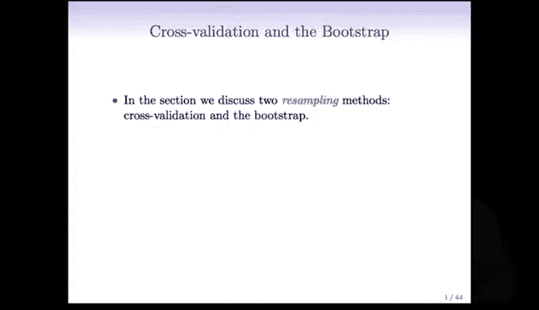

在本节课中，我们将要学习如何评估我们建立的回归和分类预测模型。理想情况下，我们希望从总体中获得新样本，以测试我们的预测效果。然而，我们并不总是有新数据。直接使用训练数据评估模型会过于乐观，因为它已经“见过”这些数据。因此，我们将介绍一种非常巧妙的方法——**交叉验证**，它能够利用同一份训练数据来评估预测方法的性能。

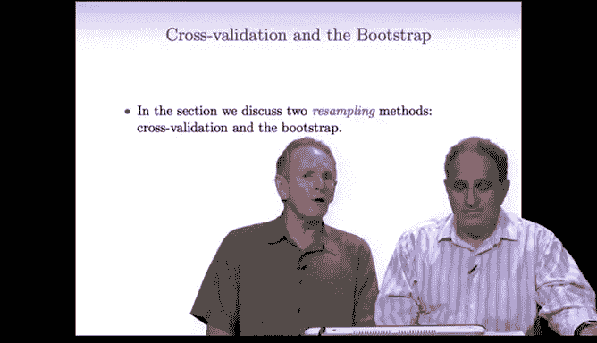

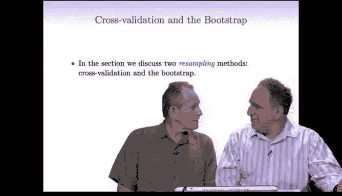

此外，我们还将探讨估计量的标准误。有时我们的估计量相当复杂，我们想知道其标准误，即在从总体中反复抽取新样本并重新计算估计值时，这些估计值的标准差。同样，由于我们通常只有一个样本，我们将介绍另一种巧妙的方法——**自助法**，它能够利用你拥有的单一训练样本来估计标准差等指标。

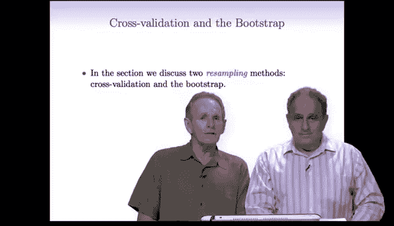

上一节我们介绍了模型评估的基本挑战，本节中我们来看看具体的解决方案：交叉验证与自助法。

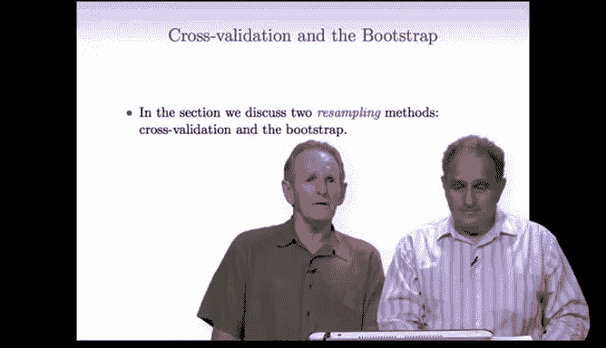

---

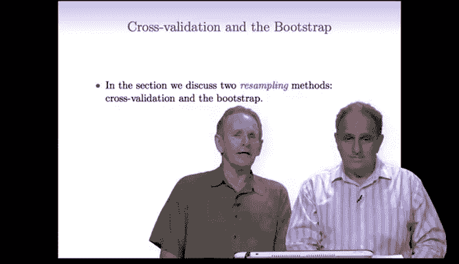

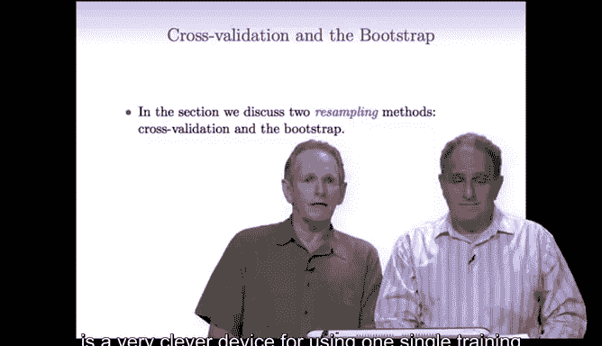

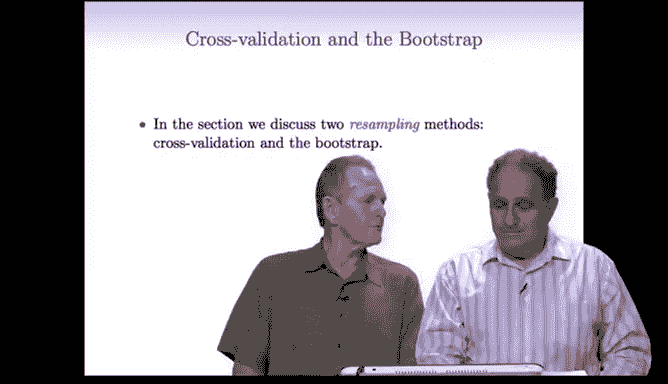

## 训练误差 vs. 测试误差 🔄

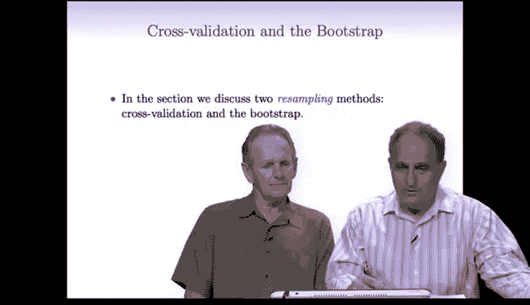

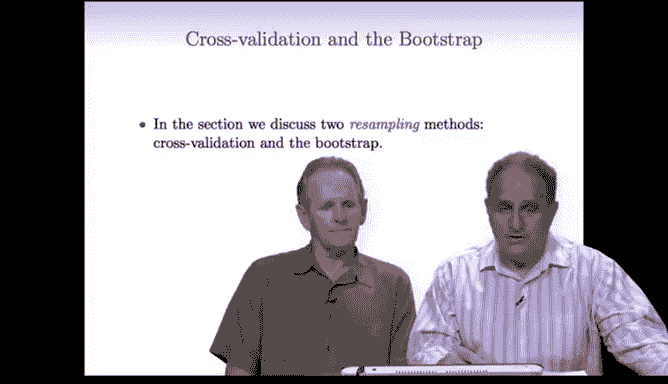

在深入交叉验证之前，让我们回顾一下训练误差与测试误差的概念。

*   **测试误差**：指模型在新数据上产生的误差。我们首先在训练集上拟合模型，然后将该模型应用于模型未曾见过的全新数据。测试误差反映了模型在未来未知数据上的真实表现。
*   **训练误差**：指将模型应用于其训练所基于的同一数据集时产生的误差。训练误差更容易计算，但通常低于测试误差，因为模型已经“见过”训练集。模型拟合数据越复杂（过拟合），训练误差看起来就越低，而测试误差却可能显著升高。

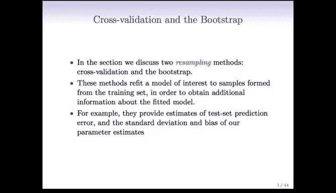

因此，**训练误差不能很好地替代测试误差**。

下图很好地总结了这些概念：

*   **横轴**：模型复杂度，从低到高。例如，在线性模型中，复杂度可以是特征或系数的数量。
*   **纵轴**：预测误差。
*   **蓝色曲线**：训练误差。随着模型复杂度增加，训练误差持续下降。
*   **红色曲线**：测试误差。它先下降，在某个最佳复杂度点达到最低，之后因过拟合而开始上升。

测试误差由**偏差**和**方差**共同决定：
*   **偏差**：模型预测平均值与真实值之间的差距。
*   **方差**：模型预测值围绕其平均值的波动程度。

模型复杂度低时，偏差高、方差低。随着复杂度增加，偏差下降，但方差上升。预测误差是偏差与方差之和，存在一个权衡点，使得总误差最小，这就是**偏差-方差权衡**。

我们的目标是找到使测试误差最小的模型复杂度，而训练误差无法提供这方面的有效信息。

---

## 验证集方法 🧪

既然不能使用训练误差来估计测试误差，那么最佳解决方案是拥有一个大型测试集。但通常我们没有。因此，我们介绍**验证集方法**。

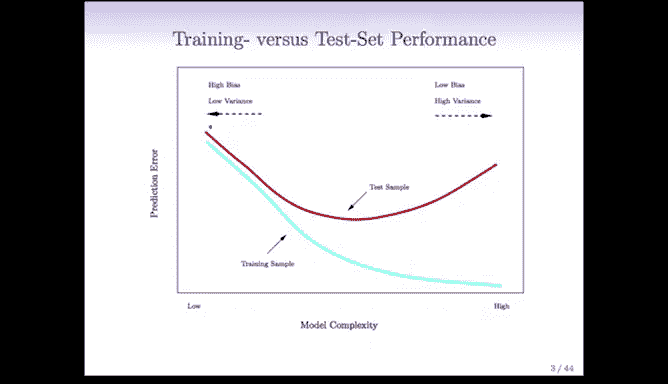

其核心思想很简单：将数据随机分成大致相等的两部分。
1.  第一部分称为**训练集**。
2.  第二部分称为**验证集**或**留出集**。

我们使用训练集拟合模型，然后将拟合好的模型应用于验证集，并记录在验证集上产生的误差，即**验证集误差**。这个误差可以为我们提供测试误差的估计。

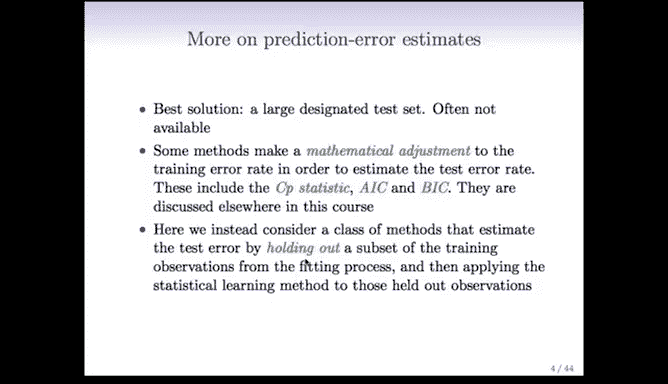

*   对于**定量响应**，误差通常用**均方误差**衡量。
*   对于**定性/分类响应**，误差用**分类错误率**衡量。

以下是该过程的示意图：

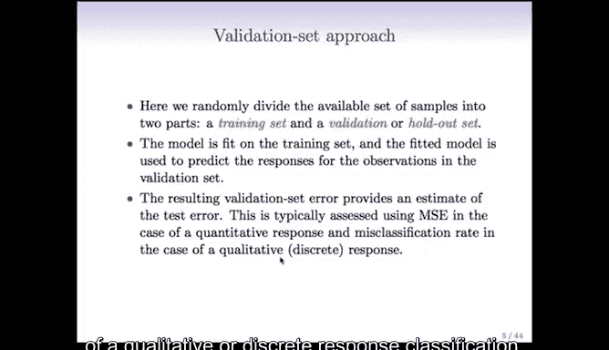

蓝色部分为训练集，粉色部分为验证集。我们基于蓝色部分训练模型，并预测粉色部分的数据点。

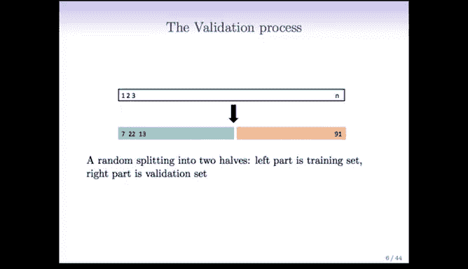

---

## 验证集方法的局限性 ⚠️

然而，验证集方法存在一些明显的缺点：

1.  **估计结果波动大**：由于数据被随机分成两半，不同的划分会导致验证集误差估计值差异很大。下图展示了在汽车数据上，使用不同随机划分进行验证时，测试误差估计的波动情况。

    

    虽然最佳模型复杂度（多项式次数）通常稳定在2附近，但误差的具体数值却在很大范围内波动。

2.  **训练样本利用不充分**：我们只用了一半的数据（训练集）来训练模型。通常，训练数据越多，模型性能越好。因此，用一半数据训练得到的模型，其误差估计会高于用全部数据训练得到的模型误差。也就是说，**验证集误差估计的是基于 `n/2` 个观测值的模型的测试误差，而我们真正关心的是基于全部 `n` 个观测值的模型的测试误差**。

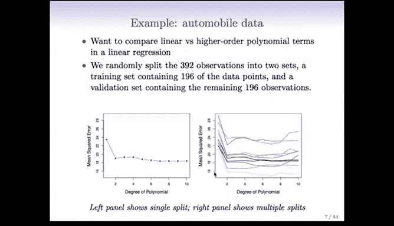

鉴于验证集方法的这些局限性，在下一节我们将介绍**交叉验证**，它能帮助克服这些问题。

---

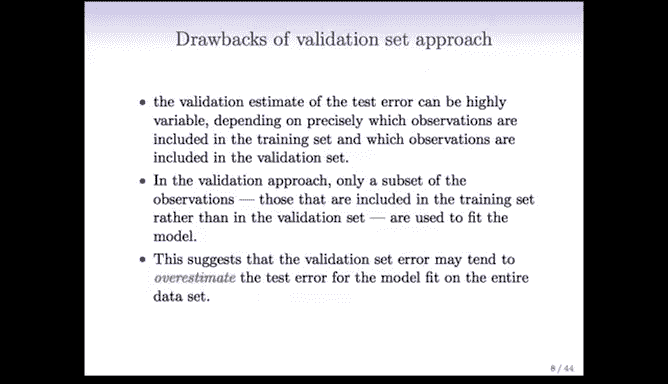

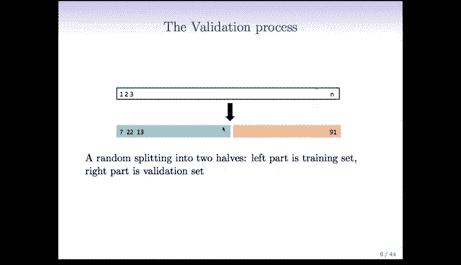

## 总结 📝

本节课中我们一起学习了：
1.  **模型评估的核心问题**：训练误差过于乐观，不能代表模型在未知数据（测试集）上的真实性能。
2.  **偏差-方差权衡**：测试误差由偏差和方差共同决定，模型复杂度需要在两者之间取得平衡。
3.  **验证集方法**：一种通过将数据分为训练集和验证集来估计测试误差的简单方法。
4.  **验证集方法的局限性**：包括估计结果的高波动性以及未能充分利用所有数据进行训练，导致对最终模型性能的估计可能存在偏差。

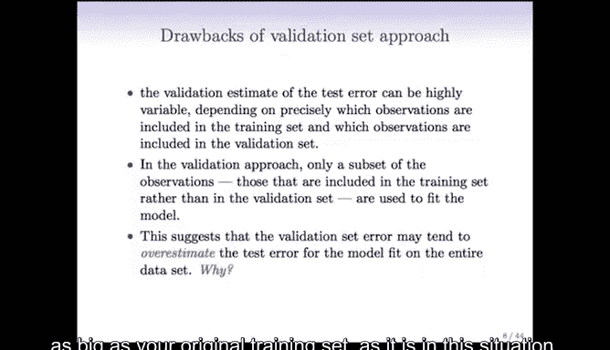

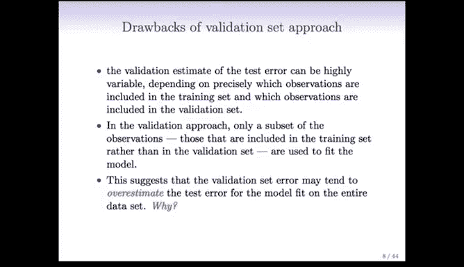

下一节，我们将深入探讨更强大、更稳定的评估方法——**交叉验证**。