# R 版 28：K折交叉验证 📊

在本节课中，我们将要学习一种非常重要的模型评估技术——K折交叉验证。我们将了解其工作原理、数学公式、如何选择K值，以及它如何解决上一节中提到的验证集方法的缺点。

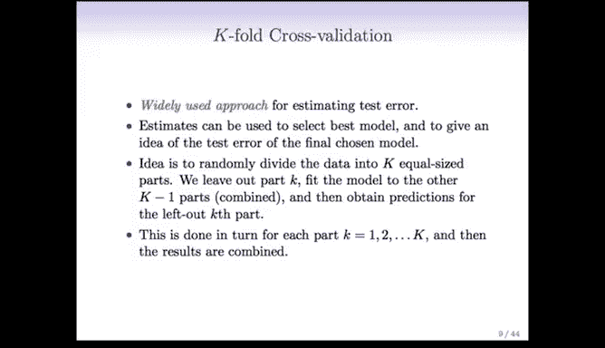

上一节我们介绍了验证集方法及其局限性。本节中我们来看看K折交叉验证，它将解决其中的一些问题。这是一种极其灵活且强大的技术，用于估计预测误差和理解模型复杂度，在本课程后续章节以及实际工作中都会频繁使用。

## K折交叉验证的核心思想 🧠

K折交叉验证的核心思想如其名所示：它是一种验证方法，但以K部分的形式进行，共执行K次。在每一次中，一个部分扮演验证集的角色，其余K-1个部分共同扮演训练集的角色。

以下是其工作原理的直观展示。假设我们进行5折交叉验证（K=5）。我们将数据集随机划分为大小大致相等的五个部分。

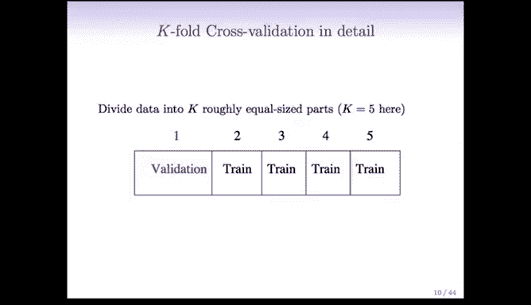

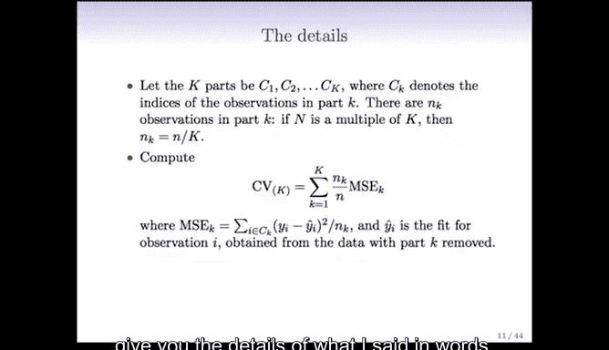

在第一阶段，第一部分作为验证集，其余四部分合并作为训练集。我们在训练集上拟合模型，然后在验证集上预测并记录误差。
第二阶段，第二部分作为验证集，其余部分作为训练集，重复上述过程。
我们总共进行五个这样的阶段，确保每个部分都恰好有一次作为验证集。
最后，我们将所有五个部分上计算出的预测误差汇总，得到所谓的**交叉验证误差**。

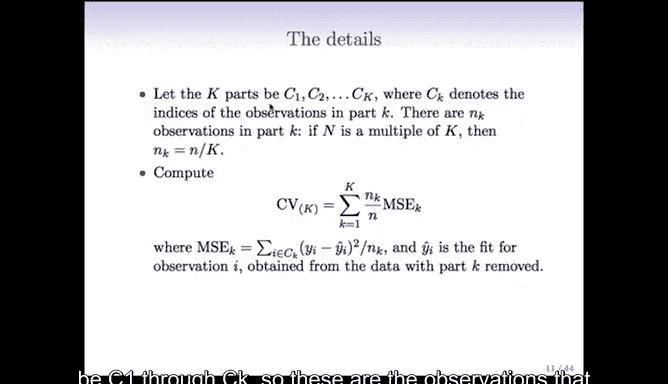

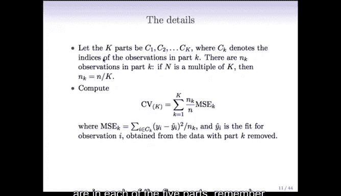

## 数学公式与细节 📐

现在，我们用数学语言来描述上述过程。

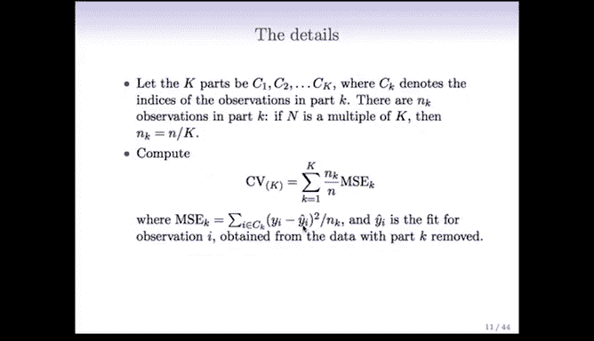

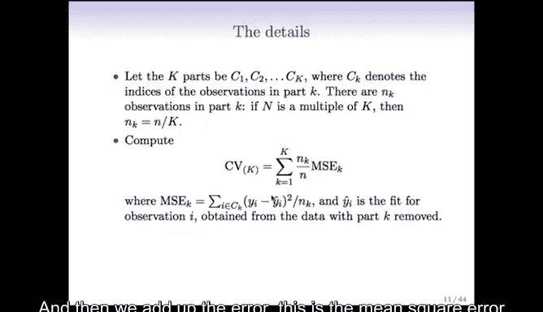

我们将数据划分为K个部分（或称“折”），记作 \( C_1, C_2, ..., C_K \)。在我们的例子中，K=5。
我们尽量确保每个部分中的观测值数量 \( n_k \) 大致相同。

交叉验证误差率（对于定量响应变量，使用均方误差）的计算公式如下：

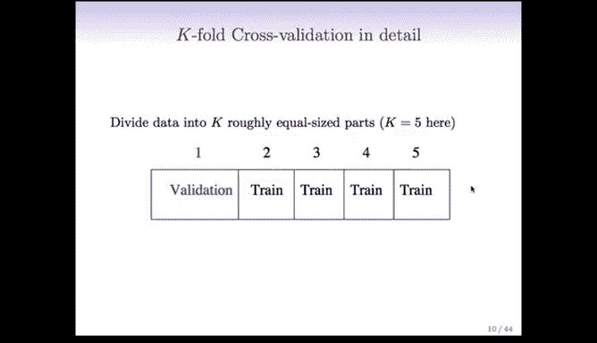

\[
CV_{(K)} = \frac{1}{K} \sum_{k=1}^{K} \frac{1}{n_k} \sum_{i \in C_k} (y_i - \hat{y}_i^{(-k)})^2
\]

其中：
*   \( \hat{y}_i^{(-k)} \) 表示使用**不包含**第 \( k \) 折的所有数据（即其他K-1折）训练出的模型，对观测点 \( i \)（属于第 \( k \) 折）做出的预测。
*   内层求和计算的是在第 \( k \) 个验证集上的均方误差。
*   外层求和将所有K折的误差平均起来，得到最终的交叉验证误差估计。

## 留一法交叉验证：一个特例 🔍

K折交叉验证的一个极端特例是**留一法交叉验证**。此时，折数K等于观测样本总数n。

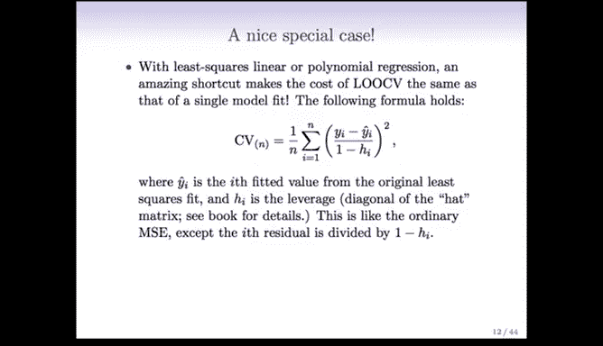

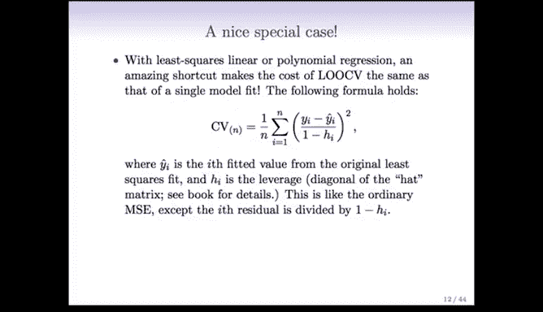

在留一法中，每个观测点单独作为一次验证集，其余n-1个观测点作为训练集。这意味着需要进行n次模型训练。

对于最小二乘线性回归等特定模型，留一法交叉验证有一个非常高效的计算公式，无需真正重新拟合n次模型：

\[
CV_{(n)} = \frac{1}{n} \sum_{i=1}^{n} \left( \frac{y_i - \hat{y}_i}{1 - h_{ii}} \right)^2
\]

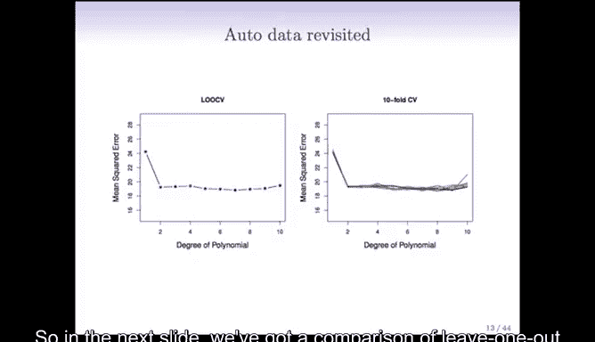

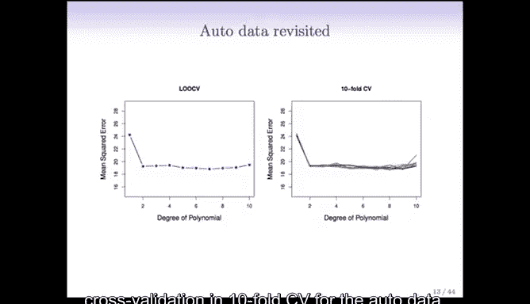

其中：
*   \( \hat{y}_i \) 是基于全部数据拟合的模型预测值。
*   \( h_{ii} \) 是“帽子矩阵”H的第i个对角线元素，它衡量了第i个观测点对其自身拟合值的影响程度（杠杆值）。
*   这个公式表明，如果一个观测点对自身拟合的影响很大（\( h_{ii} \) 接近1），其残差会被放大，从而在交叉验证误差中得到更重的惩罚，这符合直觉。

## 如何选择K值？权衡偏差与方差 ⚖️

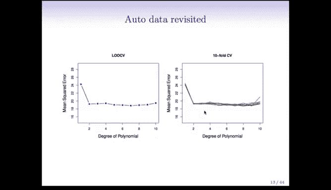

尽管留一法交叉验证有计算上的便利，但在实践中，选择K=5或10通常是更好的选择。原因在于偏差-方差的权衡：

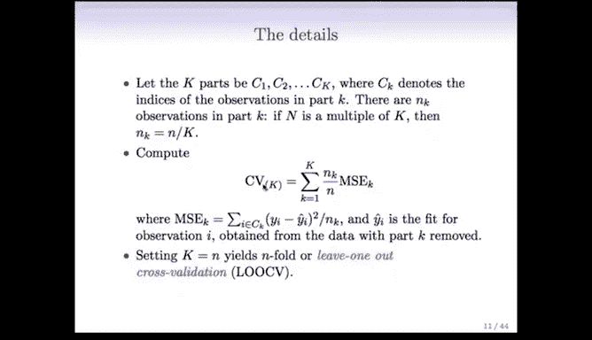

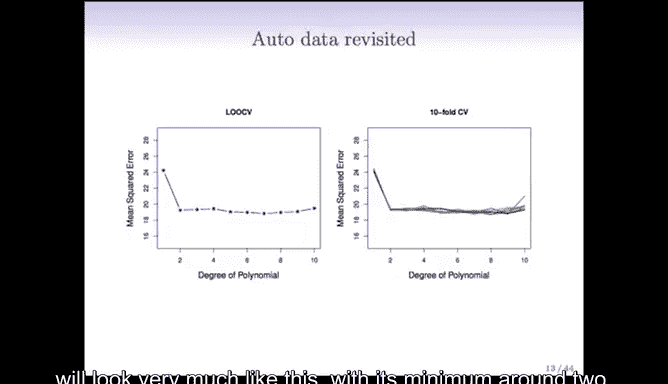

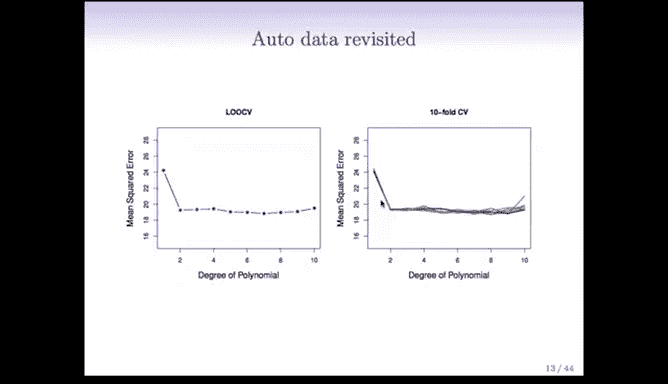

*   **留一法交叉验证 (K=n)**：
    *   **优点（低偏差）**：每次训练使用了几乎全部数据（n-1个样本），因此其估计的预测误差偏差较小，更接近基于全数据训练的模型误差。
    *   **缺点（高方差）**：由于产生的n个训练集彼此之间高度相似（仅相差一个样本），导致计算出的n个误差值高度相关。对这些高度相关的值求平均，得到的交叉验证估计值方差会很高，表现不稳定。

*   **K折交叉验证 (K=5或10)**：
    *   这是一个良好的折中方案。
    *   每次训练使用大约 (K-1)/K 比例的数据（例如K=5时用80%数据），虽然会引入一些**偏差**（高估真实预测误差），但通常可以接受。
    *   由于各折之间的训练集差异更大，计算出的误差值相关性更低，因此平均后的交叉验证估计值**方差更低**，更稳定。

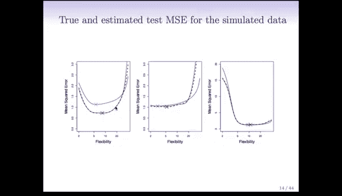

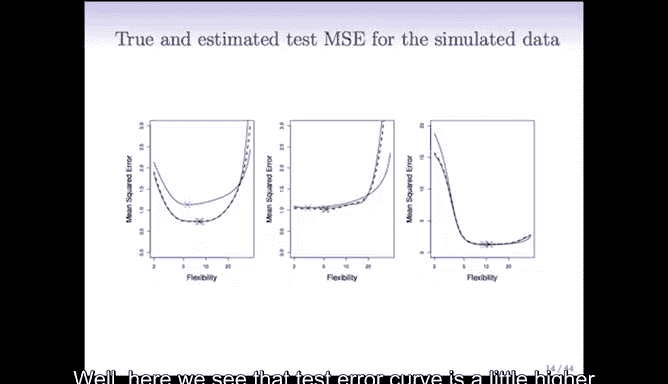

下图展示了在`Auto`数据集上，不同验证方法的比较：

*   **左图（验证集法）**：将数据分成两半（训练/验证），重复10次。可以看到曲线波动很大，方差高。
*   **中图（留一法）**：曲线相对平滑，偏差小。
*   **右图（10折交叉验证）**：对数据做10次不同的随机划分，得到的10条曲线彼此非常接近，说明其估计稳定，方差低。最终的平均交叉验证曲线（未单独画出）会非常平滑，且最小值位置可靠。

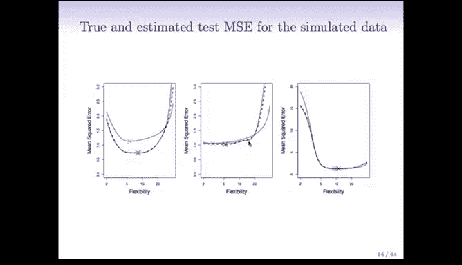

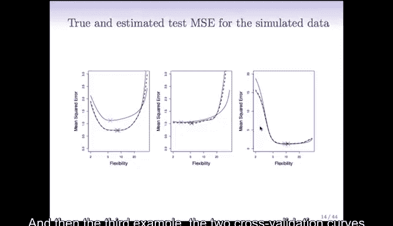

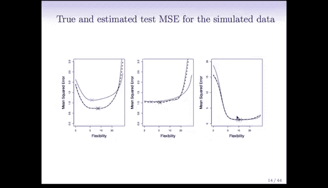

## 交叉验证的标准误 📉

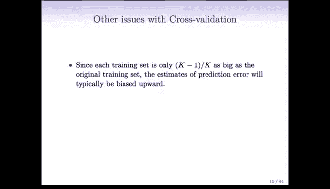

由于交叉验证误差本质上是多个误差估计的平均值，我们可以计算其标准误，以衡量该估计的波动性。

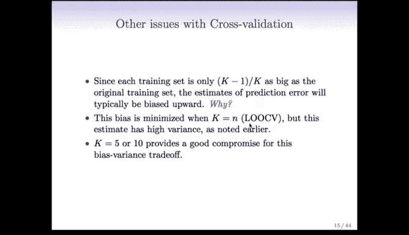

\[
SE(CV_{(K)}) = \sqrt{\text{Var} \left( \frac{1}{K} \sum_{k=1}^{K} \text{Err}_k \right) }
\]

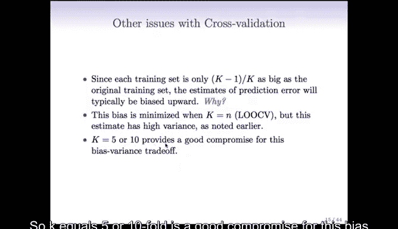

其中 \( \text{Err}_k \) 是第k折上的误差估计。在实践中，我们通常直接计算各折误差值的标准差。

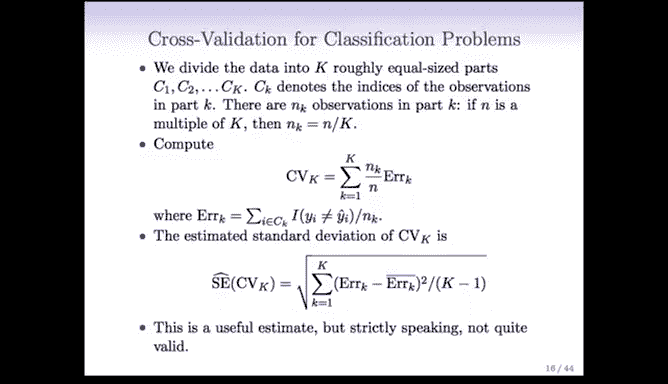

**注意**：严格来说，由于不同折的误差估计基于部分重叠的训练集，它们并非完全独立，因此上述标准误公式只是一个近似。但经验表明，它通常能提供有用的参考。在绘制交叉验证误差曲线时，添加标准误带（如均值±1个标准误）可以直观显示模型性能估计的不确定性。

## 应用于分类问题 🎯

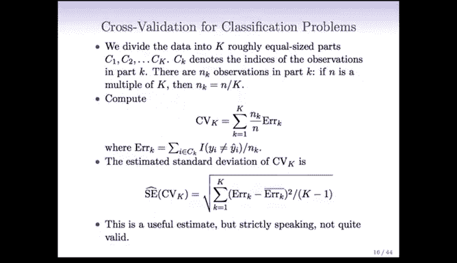

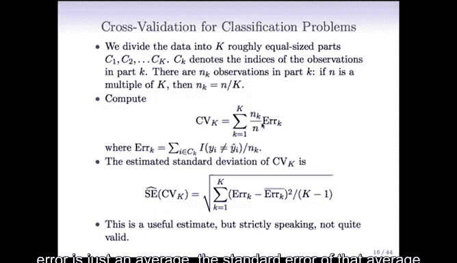

将K折交叉验证应用于分类问题非常简单，只需改变误差度量的定义：

1.  过程完全不变：将数据分为K折，轮流将每一折作为验证集。
2.  误差计算：不再使用均方误差，而是使用**误分类率**（0-1损失）。
3.  最终公式变为：
    \[
    CV_{(K)} = \frac{1}{K} \sum_{k=1}^{K} \frac{1}{n_k} \sum_{i \in C_k} I(y_i \neq \hat{y}_i^{(-k)})
    \]
    其中 \( I(\cdot) \) 是指示函数，预测错误时为1，正确时为0。

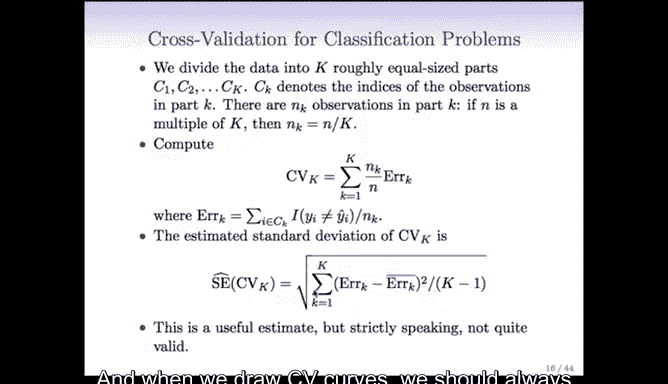

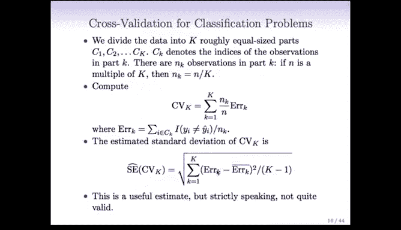

## 总结与要点 ✅

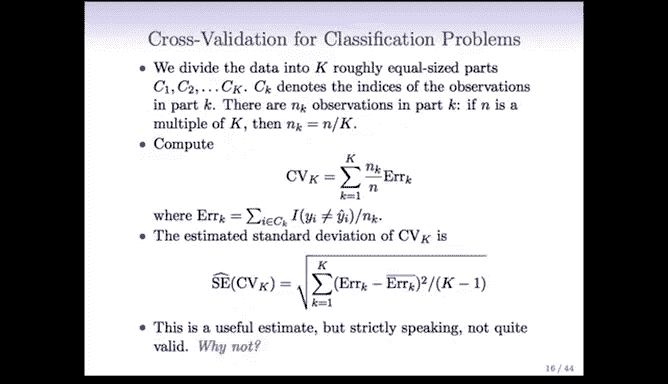

本节课中我们一起学习了K折交叉验证这一核心的模型评估技术。

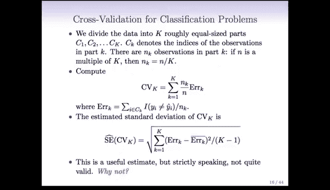

*   **核心目的**：更可靠、更高效地估计模型的测试误差，用于模型选择或调参。
*   **工作原理**：将数据随机分为K个大小相似的子集（折）。进行K轮训练与验证，每轮使用一个不同的子集作为验证集，其余K-1个子集合并作为训练集。最后汇总K轮的误差作为性能评估。
*   **关键优势**：
    *   比单次验证集方法更稳定（方差更低）。
    *   比留一法交叉验证计算效率更高（尤其对于复杂模型），且在偏差与方差间取得了更好平衡。
    *   **明确分离了训练与验证过程**，这为获得真实的测试误差估计提供了保障（下一节讨论Bootstrap方法时，我们会看到不这样做的后果）。
*   **实践建议**：
    *   通常选择 **K=5 或 K=10**。
    *   对于**定量响应**，使用**均方误差**作为误差度量。
    *   对于**分类响应**，使用**误分类率**作为误差度量。
    *   报告交叉验证结果时，考虑提供其**标准误**以反映估计的波动性。

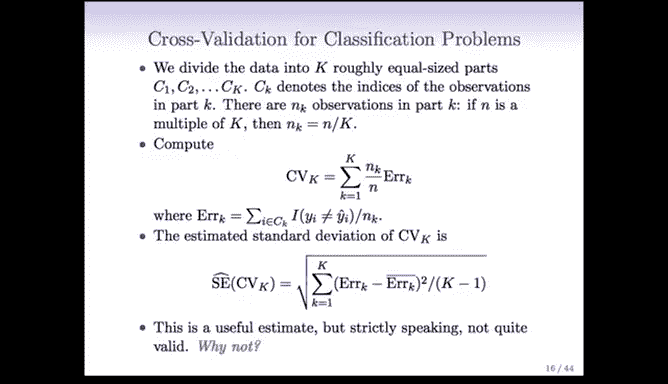

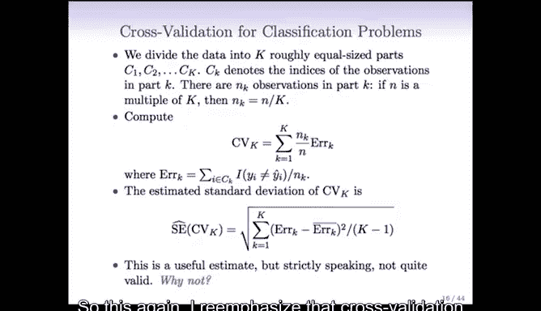

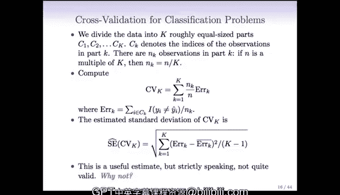

K折交叉验证是统计学习与机器学习中一项基础且必不可少的工具，深入理解它将有助于你在后续的模型构建与评估中做出更明智的决策。