# R 版 29：交叉验证的错误与正确方式 🔍

在本节课中，我们将学习交叉验证这一重要技术，它用于评估模型在回归和分类问题中的测试误差，并帮助我们判断模型的复杂度，例如模型中应包含多少个特征或多项式的阶数。这是一个非常重要的技术，因此了解其常见的错误用法并掌握正确方法至关重要。

上一节我们介绍了交叉验证的基本概念，本节中我们来看看一个常见的错误用法及其严重后果。

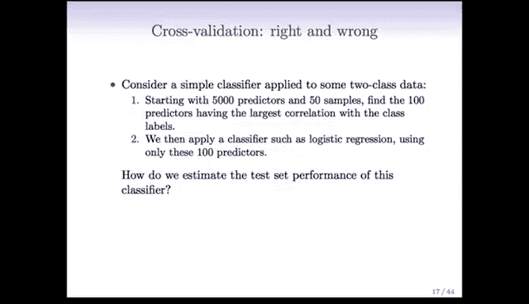

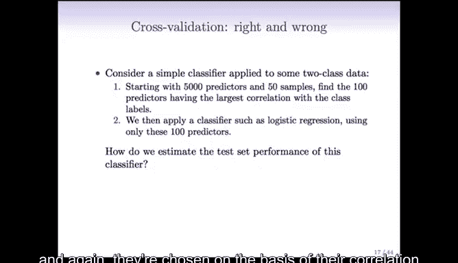

## 一个错误用法的思想实验

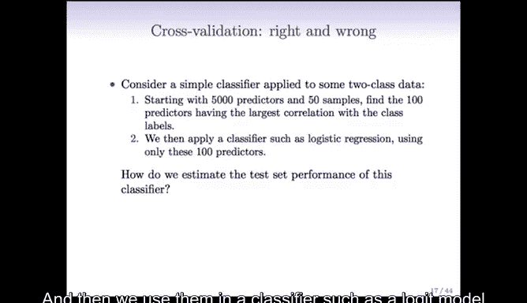

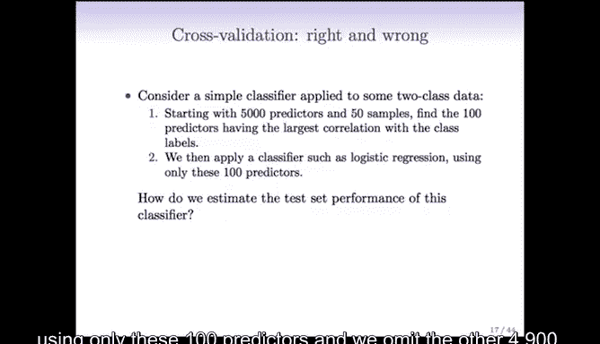

设想一个简单的场景：我们有50个样本，但每个样本有5000个预测变量。这在当今数据科学中越来越常见，即预测变量数量远大于样本数量。我们的目标是预测两个类别。

以下是构建分类器的一种常见但**错误**的流程：

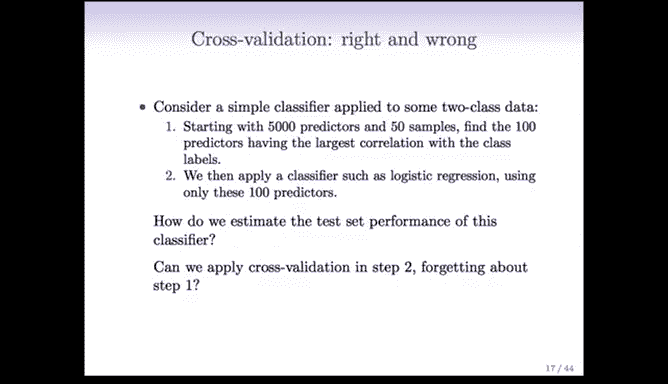

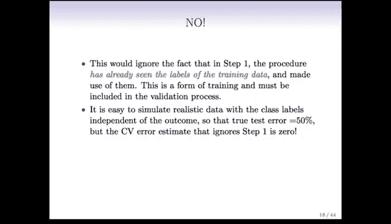

1.  **过滤预测变量**：从5000个预测变量中，筛选出与类别标签**单独**相关性最高的100个变量。
2.  **构建分类器**：仅使用这筛选出的100个变量，构建一个分类器（例如逻辑回归模型）。

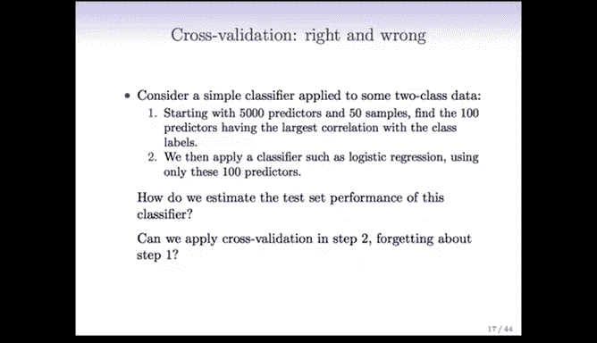

现在的问题是：我们如何评估这个分类器的测试误差？一个诱人的**错误**做法是：**忽略第一步的过滤过程**，假装我们一开始就只有这100个变量，然后直接对这100个变量和分类器应用交叉验证。

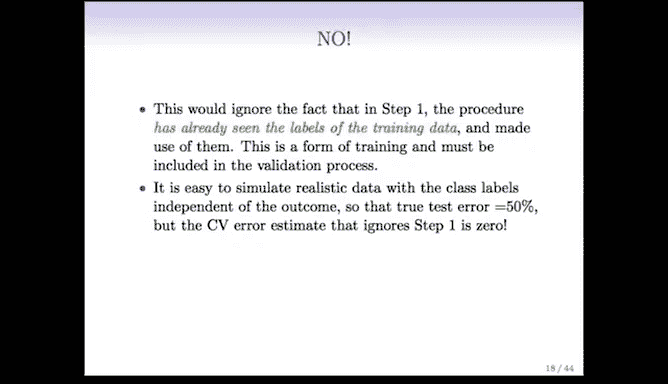

**为什么这是错误的？**

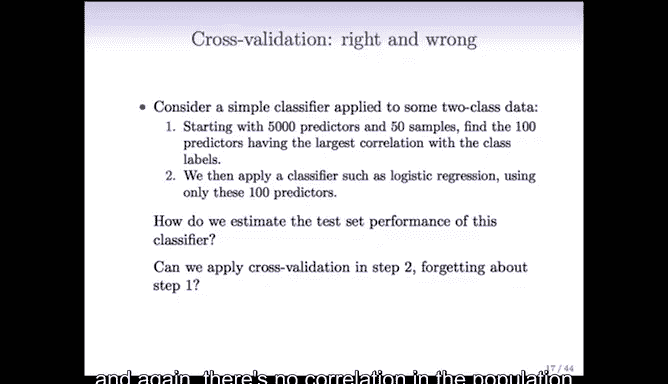

因为第一步的过滤过程已经“窥探”了所有样本的标签信息。当我们根据与标签的相关性选择“最佳”100个变量时，我们已经使用了全部数据来指导模型构建。这本身就是一种“训练”。在后续的交叉验证中，如果我们忽略这一步，就等于让验证过程建立在已经“污染”过的数据上，会导致对测试误差的严重低估。

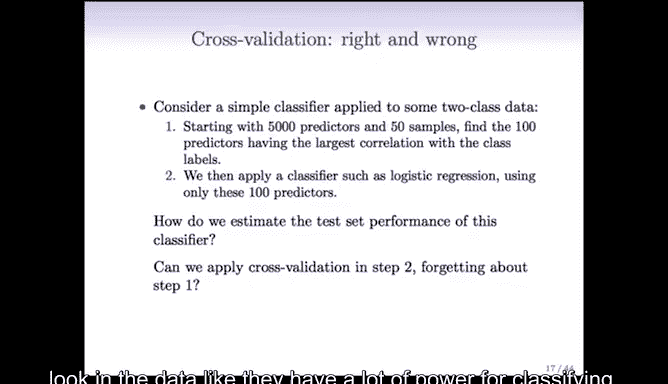

## 错误用法的严重后果

为了更清晰地说明问题，我们可以考虑一个更极端的情况：假设我们有500万个预测变量和50个样本，并且**在总体中，所有预测变量与类别标签都毫无关联**，即真实的测试误差应为50%（相当于抛硬币）。

如果我们从500万个变量中“精心挑选”出看起来最好的100个，那么这100个变量在**当前数据**中会显得与标签高度相关。如果我们忽略筛选步骤，直接对这100个变量应用交叉验证，交叉验证会告诉我们模型误差极低，甚至为0。我们就这样“欺骗”了交叉验证，得出了完全错误的乐观结论。

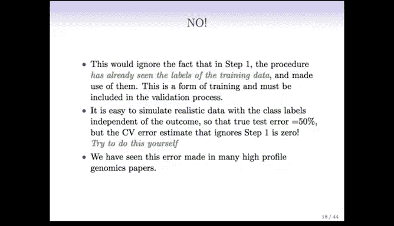

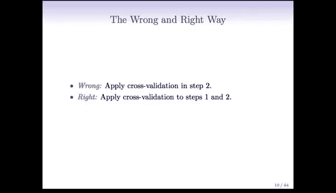

这种错误并非虚构，在基因组学等拥有海量预测变量的研究领域，这种错误经常出现在已发表的高水平论文中。研究人员为了处理成千上万的基因变量，常常先进行初步筛选以减少变量数量，然后在后续分析中忘记将这个筛选步骤纳入验证流程，从而导致严重的评估偏差。

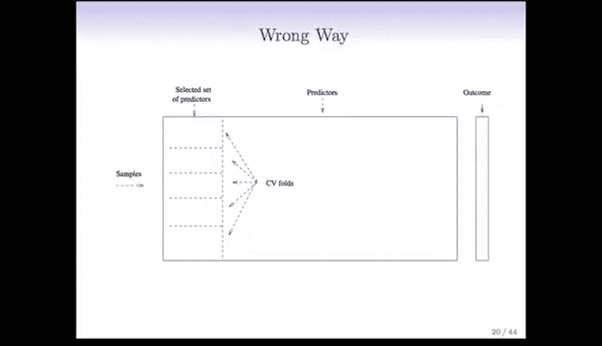

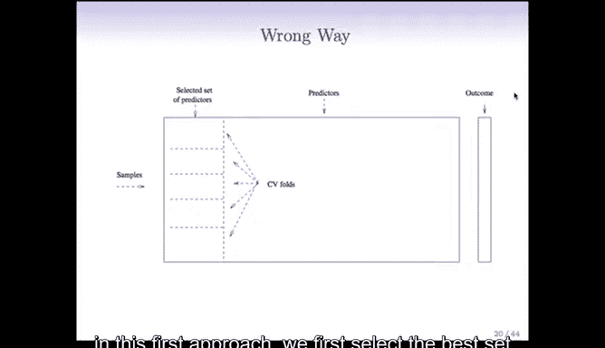

## 交叉验证的正确方式 ✅

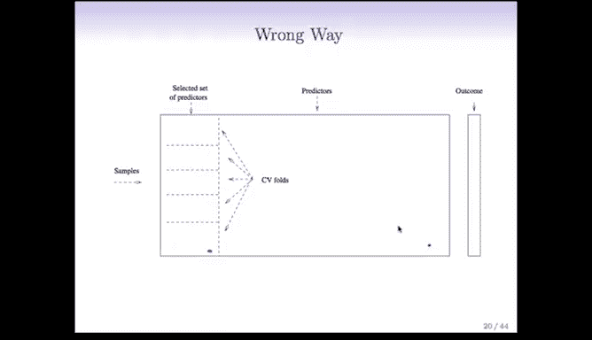

那么，正确的方式是什么？关键在于：**必须将整个建模流程（包括变量筛选）都纳入交叉验证的框架内**。

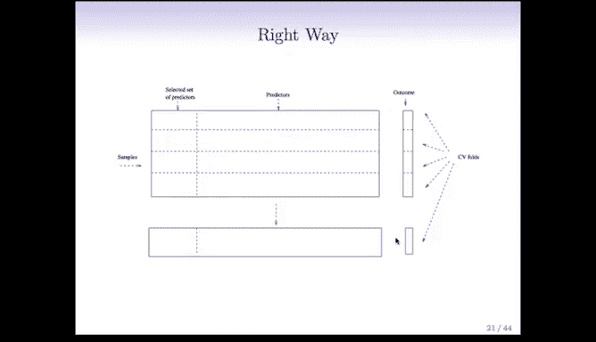

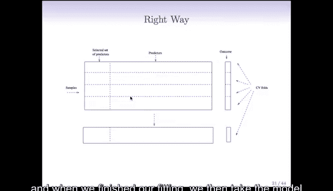

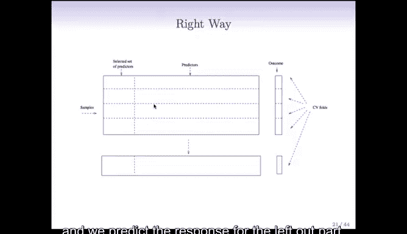

以下是正确进行交叉验证的步骤：

1.  **首先划分折**：在开始任何数据拟合或变量筛选之前，先将整个数据集划分为K个折（例如5折）。
2.  **在训练集上执行完整流程**：对于第i折：
    *   将其作为测试集暂时搁置。
    *   在剩余的K-1折数据（训练集）上，执行**完整的建模流程**，包括变量筛选（例如，从5000个变量中选出与训练集标签最相关的100个）和模型训练。
    *   使用在训练集上筛选出的变量和训练出的模型，去预测被搁置的第i折（测试集）的标签。
3.  **循环与汇总**：对每一折重复步骤2，最后汇总所有测试折的预测误差，得到交叉验证误差估计。

**核心区别**：在正确的方式中，**每一次变量筛选都只基于当前训练集的数据**，完全独立于测试集。这样，筛选过程的随机性和波动性也被考虑进了误差估计中，从而得到对测试误差更真实、无偏的估计。

## 一个真实案例

几年前，在斯坦福的一场工程学博士答辩中，一位学生试图用约10万个基因标记（SNPs）预测心脏病。他先通过某种过滤方法将变量减少到1000个，然后对这1000个变量应用交叉验证，得到了约35%的误差率，这在该领域看起来是个不错的结果。

然而，在答辩中，我指出了他的错误：他的交叉验证没有包含变量筛选步骤。起初，他和他的导师都认为这无关紧要。几个月后，这位学生重新按照正确方法进行了实验，结果误差率变成了50%（即随机猜测水平）。这个案例生动地说明了，当预测变量数量巨大时，忽略筛选步骤的交叉验证会带来多么严重的误导性结果。

## 总结

本节课我们一起学习了交叉验证中一个至关重要但常被忽视的要点：**必须将特征选择等所有使用响应变量（标签）的步骤，都包含在交叉验证循环内部**。任何在交叉验证开始前就使用全部数据进行的预处理或筛选，都会导致对模型性能的乐观估计，使结果无效。正确的方式是**先划分数据折，然后在每一折的训练集内部独立地完成从数据预处理到模型训练的全部流程**，再用得到的模型去预测对应的测试集。牢记这一点，是获得可靠模型评估的关键。

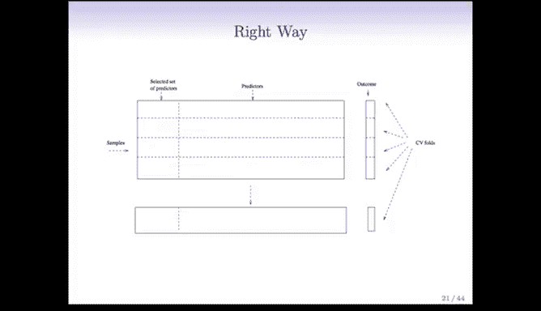

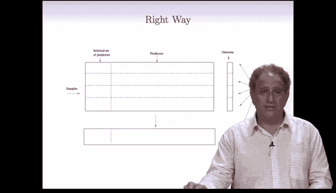

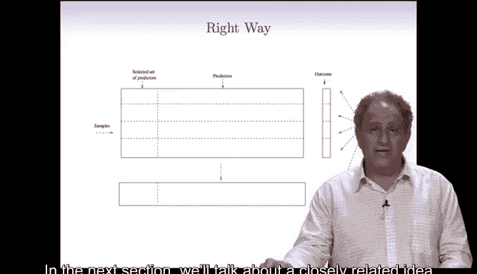

在下一节中，我们将讨论一个与交叉验证密切相关但不同的概念：自助法。