# R 版 30：统计学习中的Bootstrap方法 🚀

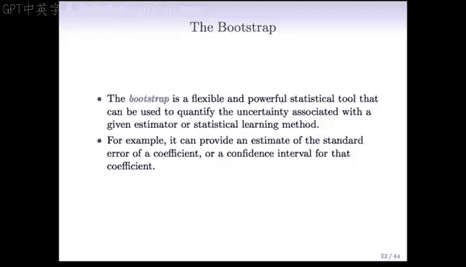

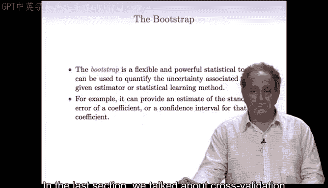

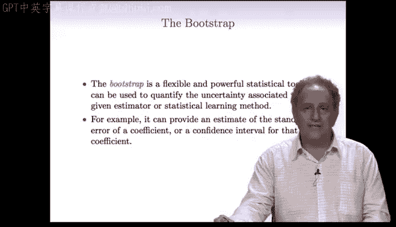

在本节课中，我们将要学习一种与交叉验证密切相关的强大技术——**Bootstrap（自助法）**。这是一种用于评估估计量不确定性的重要方法，特别是用于获取估计量的标准误和置信区间。

上一节我们讨论了用于监督学习中测试误差估计的交叉验证。本节中，我们来看看Bootstrap方法。

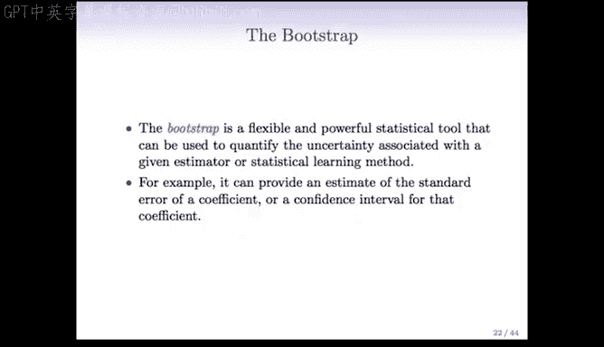

---

## Bootstrap的起源与核心思想

Bootstrap方法由Brad Efron于1979年提出，已成为过去30年统计学中最重要的技术之一。其名称来源于“**靠自己的鞋带把自己拉起来**”的寓言故事，寓意利用现有资源（数据）获取更多信息。

其核心思想是：**我们无法从总体中重复抽样，但可以将已有的样本数据本身视为“总体”，通过有放回地重复抽样来模拟抽样分布，从而评估估计量的变异性。**

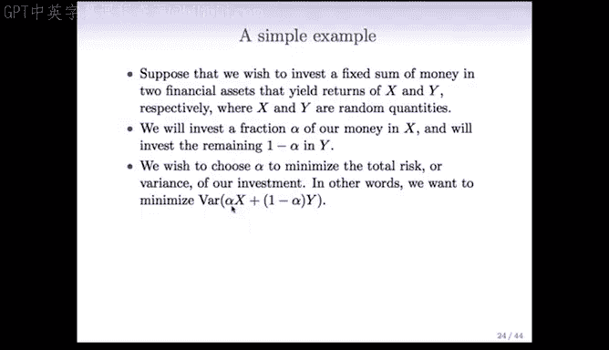

---

## 一个简单的投资例子 💰

假设我们有一笔资金，希望投资于两种资产X和Y，其收益率是随机变量。我们想将资金的比例 **α** 投资于X，剩余部分 **(1-α)** 投资于Y，目标是使投资组合的总风险（方差）最小化。

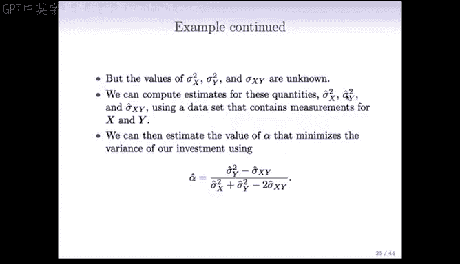

**投资组合的方差公式为：**
`Var(αX + (1-α)Y)`

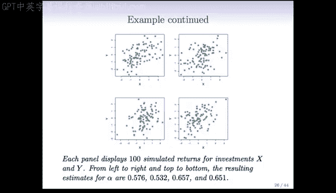

在总体模型中，可以证明最优的 **α** 由以下公式给出：

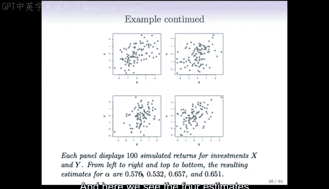

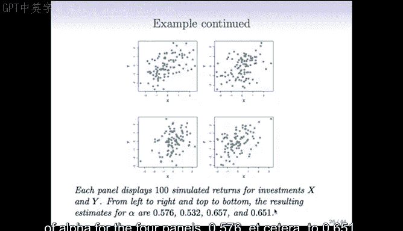

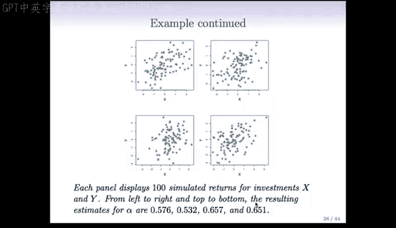

**α = (σ²_Y - σ_XY) / (σ²_X + σ²_Y - 2σ_XY)**

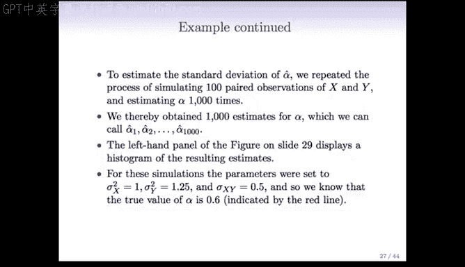

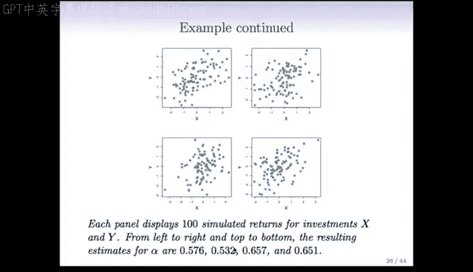

其中：
*   `σ²_X` 是X的方差
*   `σ²_Y` 是Y的方差
*   `σ_XY` 是X和Y的协方差

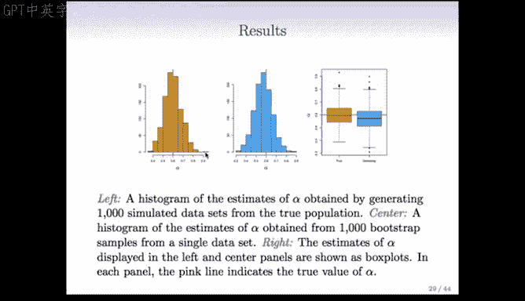

然而，这些总体参数通常是未知的。如果我们有一个来自总体的数据集，我们可以用样本方差和协方差来估计它们，从而得到 **α** 的估计值 **α_hat**。

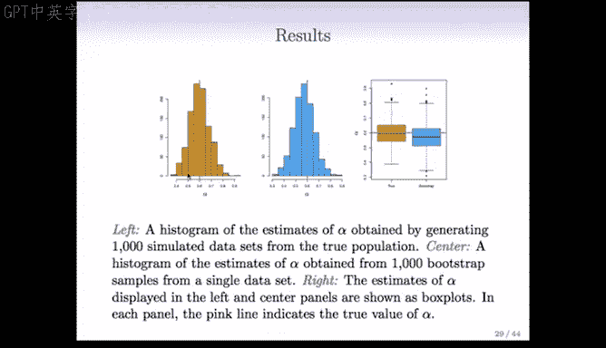

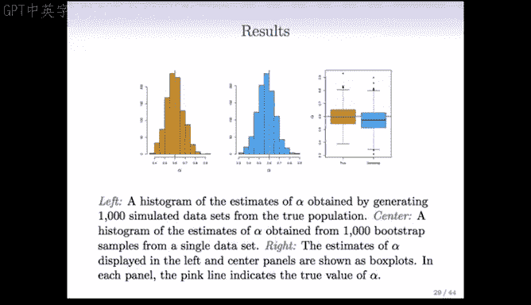

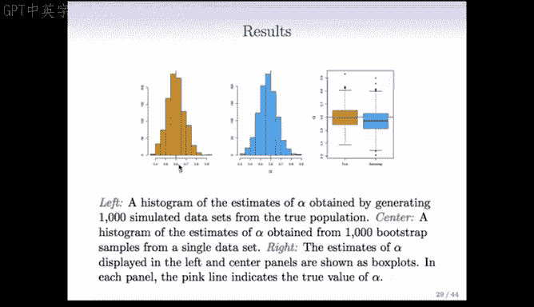

---

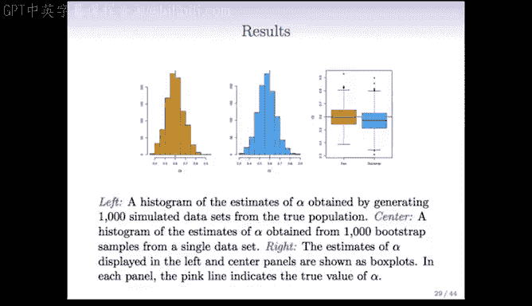

## 标准误与抽样分布 📊

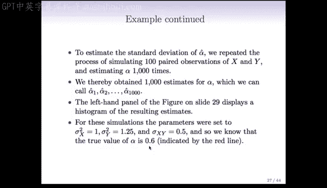

如果我们能像“扮演上帝”一样从真实总体中重复抽取许多（例如1000个）样本，对每个样本计算 **α_hat**，那么这些 **α_hat** 的分布就称为**抽样分布**。这个分布的标准差，就是估计量 **α_hat** 的**标准误**，它衡量了估计量的精确度。

**关键问题：** 在现实中，我们通常只有一个样本，无法从总体中重复抽样。那么如何估计标准误呢？

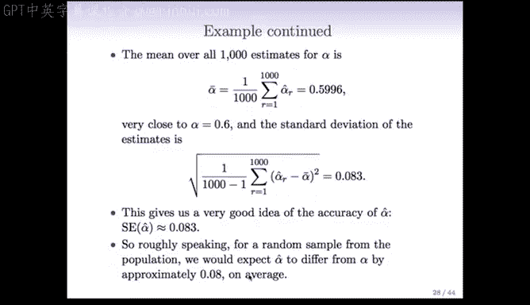

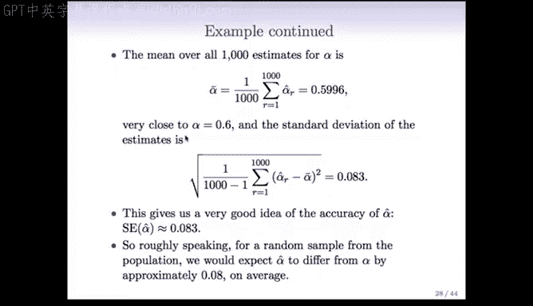

---

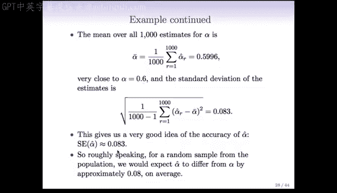

## Bootstrap方法详解 🔄

Bootstrap提供了一种解决方案：**将我们已有的单个样本视为“总体”，从中进行有放回地重复抽样，来模拟从真实总体中抽样的过程。**

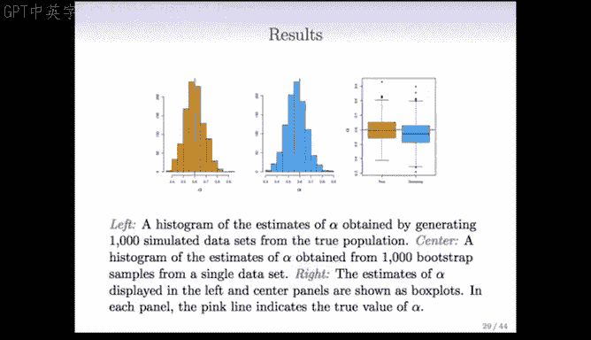

以下是Bootstrap抽样的步骤说明：

假设我们有一个包含3个观测值的原始数据集：`[观测1， 观测2， 观测3]`。

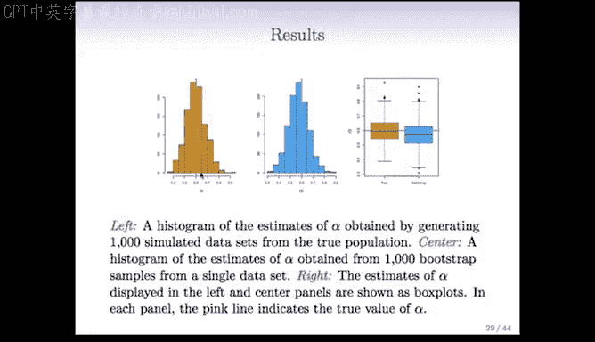

1.  **有放回抽样：** 我们从原始数据中随机抽取一个观测值，记录后将其放回。这意味着同一个观测值可能被多次抽中，也可能一次都不被抽中。
2.  **构成Bootstrap样本：** 重复步骤1 `n` 次（`n` 是原始样本量），形成一个Bootstrap样本。
3.  **重复生成：** 独立地重复上述过程 `B` 次（例如 `B=1000`），生成 `B` 个Bootstrap数据集。

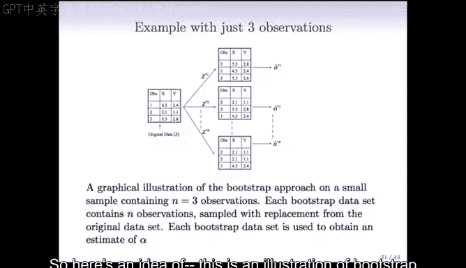

**Bootstrap样本示例：**
*   **Bootstrap样本1:** `[观测3， 观测3， 观测1]`
*   **Bootstrap样本2:** `[观测2， 观测3， 观测1]`
*   **Bootstrap样本3:** `[观测2， 观测2， 观测1]`

---

## 应用Bootstrap估计标准误

对于投资组合的例子，应用Bootstrap的流程如下：

1.  从原始数据（`n` 对 `(X, Y)`）生成 `B` 个Bootstrap样本。
2.  对第 `b` 个Bootstrap样本，计算其样本方差和协方差，并代入公式得到估计值 **α_hat***b*。
3.  计算这 `B` 个 **α_hat***b* 值的标准差。

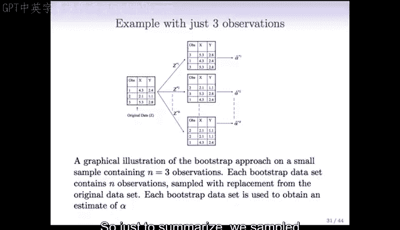

**Bootstrap标准误公式（近似）：**
`SE_boot(α_hat) = sqrt( (1/(B-1)) * Σ_{b=1}^{B} (α_hat*_b_* - α_hat_bar)² )`

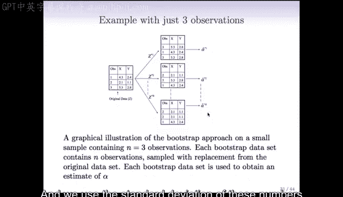

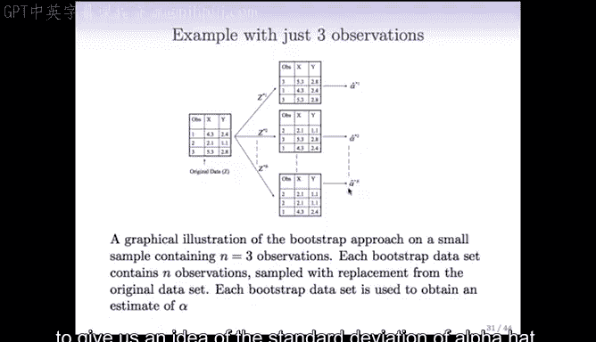

其中 `α_hat_bar` 是 `B` 个Bootstrap估计值的均值。

通过模拟实验对比发现，**从Bootstrap样本计算出的标准误（例如0.087）与从真实总体重复抽样计算出的标准误（例如0.083）非常接近**。这表明Bootstrap方法能有效地利用现有数据，近似估计出我们无法直接计算的抽样变异性。

---

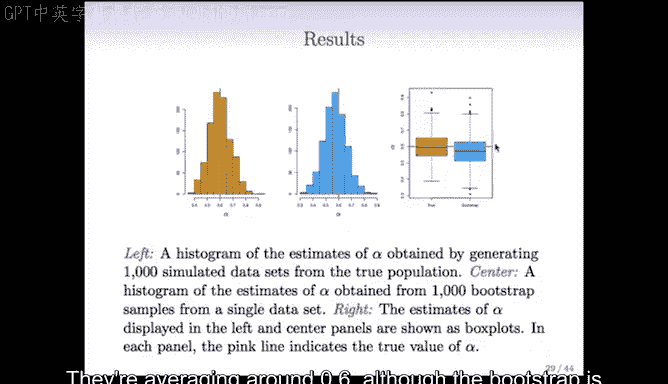

## 总结

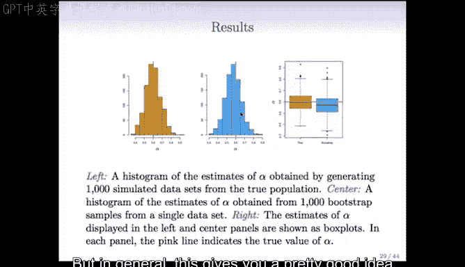

本节课中我们一起学习了：
1.  **Bootstrap的核心理念**：通过有放回地重抽样，将现有样本作为“伪总体”来模拟抽样过程。
2.  **Bootstrap的步骤**：从原始数据中生成多个Bootstrap样本，在每个样本上重新计算目标估计量，然后分析这些估计量的分布。
3.  **Bootstrap的主要应用**：估计统计量的标准误，进而构建置信区间，是评估估计量不确定性的强大工具。

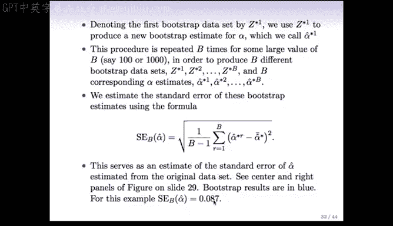

Bootstrap方法优雅地解决了现实统计推断中的一个根本难题——我们只有一个样本。它让我们能够“靠自己的鞋带站起来”，从有限的数据中挖掘出关于估计量稳定性的宝贵信息。在接下来的课程中，我们将探讨Bootstrap更广泛的应用场景。