# R 版 31：深入理解Bootstrap方法 🚀

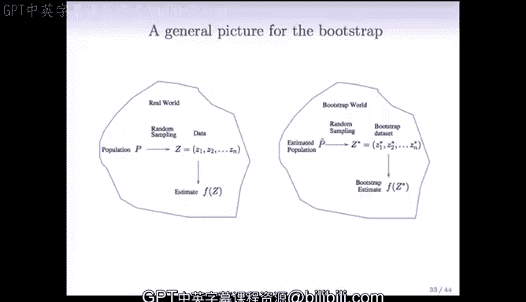

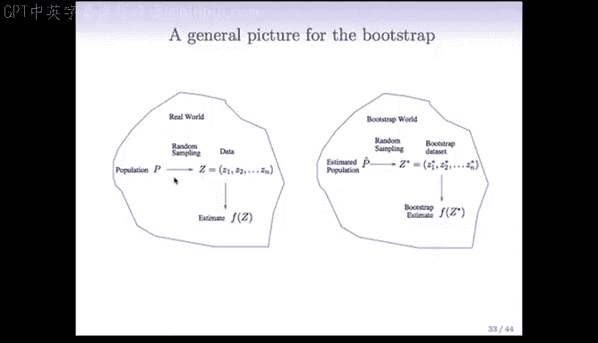

在本节课中，我们将更深入地探讨Bootstrap方法。我们将回顾其基本思想，并将其应用于更复杂的场景，例如时间序列数据。同时，我们也会讨论Bootstrap在构建置信区间和估计预测误差方面的应用与局限性。

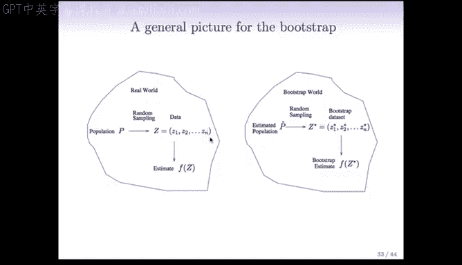

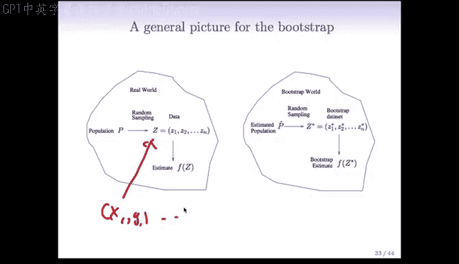

---

## Bootstrap方法回顾

上一节我们通过投资组合的例子介绍了Bootstrap的基本流程。现在，我们用一个更通用的框架来理解它。

这个框架由伯克利的David Friedman提出，清晰地展示了Bootstrap的“世界观”。

*   在现实世界中，存在一个我们无法直接接触的总体（Population）。
*   这个总体产生了我们的观测数据，即训练样本 `Z1, Z2, ..., Zn`。
*   从训练样本中，我们计算得到一个统计量的估计值，例如之前例子中的 `α_hat`。
*   我们通常希望了解这个估计值 `α_hat` 的标准误。

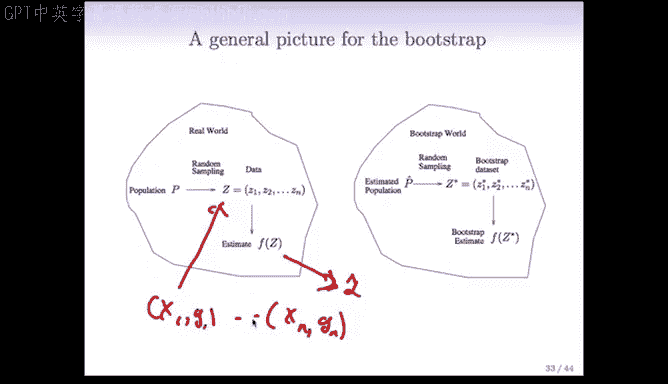

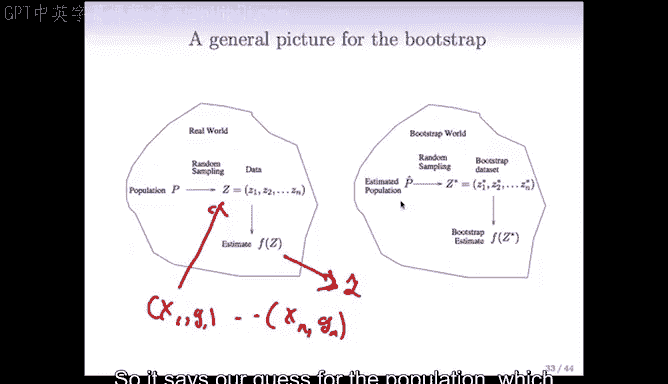

理想情况下，如果我们能接触总体，就可以反复从中抽取新的训练样本，计算多个 `α_hat`，然后用它们的标准差来估计标准误。但现实中，我们通常只有一个训练样本。

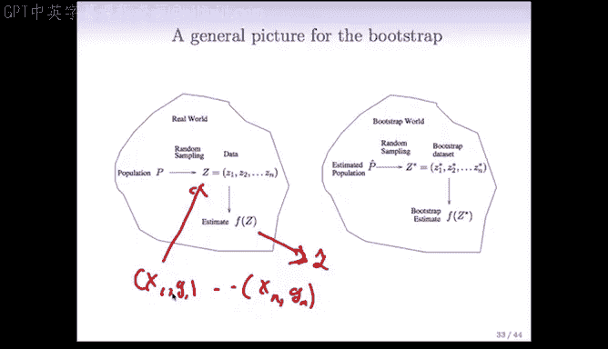

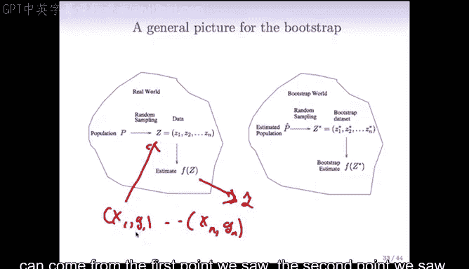

Bootstrap的核心思想是：**用我们已有的训练样本本身来模拟总体**。

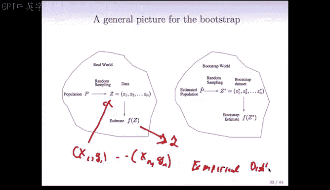

具体做法是，我们创建一个“经验分布函数” `P_hat`，它给训练样本中的每一个观测点 `Zi` 分配相同的概率 `1/n`。

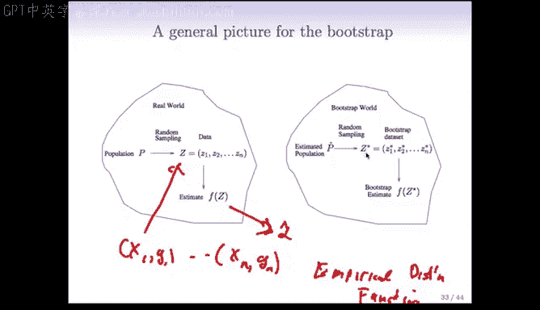

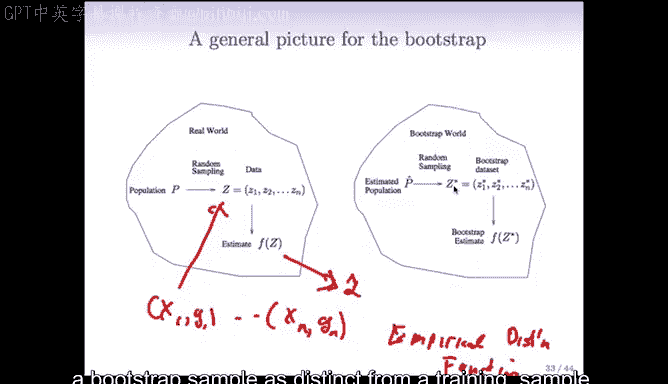

从这个经验分布 `P_hat` 中进行**有放回地随机抽样**，就得到了一个Bootstrap样本 `Z*1, Z*2, ..., Z*n`。注意，我们用上标 `*` 来区分Bootstrap样本和原始训练样本。

从这个Bootstrap样本中，我们可以计算出对应的统计量估计值，记为 `α_hat*`。

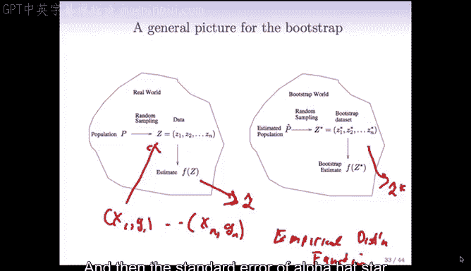

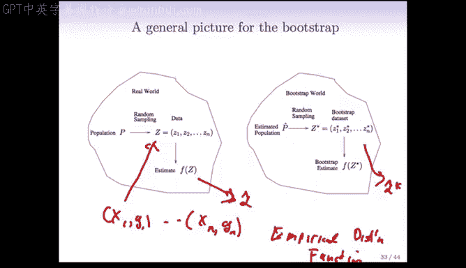

将上述过程重复数百次（例如1000次），我们就能得到一系列Bootstrap估计值 `α_hat*1, α_hat*2, ..., α_hat*B`。这些值的标准差，就是我们对原始估计值 `α_hat` 标准误的Bootstrap估计。

**公式表示如下：**
*   经验分布：`P_hat`，对每个 `Zi` 赋予概率 `1/n`。
*   Bootstrap样本：从 `P_hat` 中有放回抽取 `n` 次得到 `Z*`。
*   Bootstrap估计：`α_hat* = S(Z*)`，其中 `S` 是计算统计量的函数。
*   标准误估计：`SE_boot(α_hat) = sd({α_hat*1, ..., α_hat*B})`

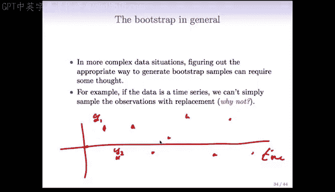

---

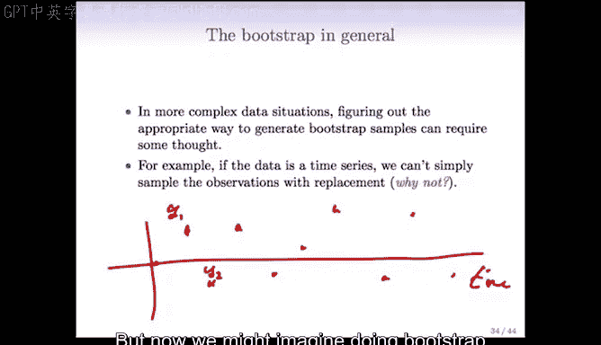

## 复杂情况下的Bootstrap应用

理解了基本框架后，我们来看看如何在更复杂的数据结构中应用Bootstrap。关键在于识别数据中哪些部分是独立可重复抽样的单元。

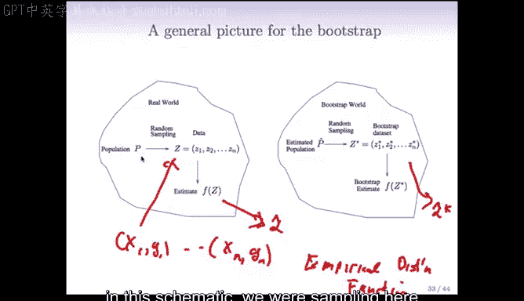

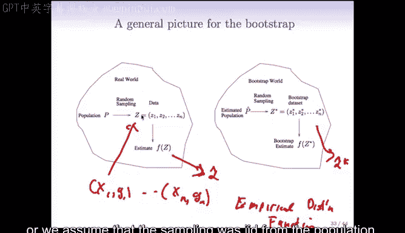

### 时间序列与块状Bootstrap

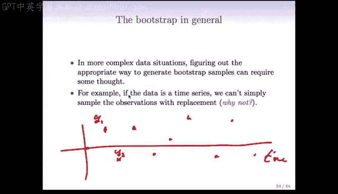

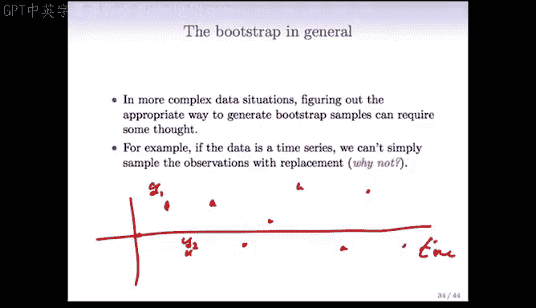

假设我们有一个时间序列数据，例如每日股价。我们想用前一天的股价来预测当天的股价，这会用到回归模型。

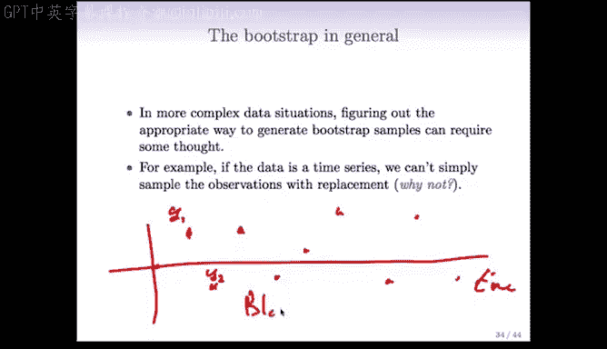

如果我们简单地像之前一样对单个数据点进行有放回抽样，会破坏时间序列数据点之间的相关性（例如今天的股价与昨天相关），这不符合现实。

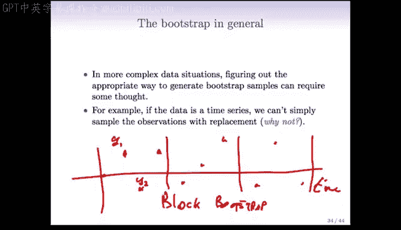

解决方案是使用**块状Bootstrap**。

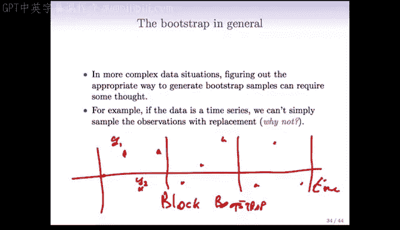

块状Bootstrap将时间序列数据划分为连续的“块”。我们假设不同块之间的数据是近似独立的，而块内部的数据则保持其相关性。

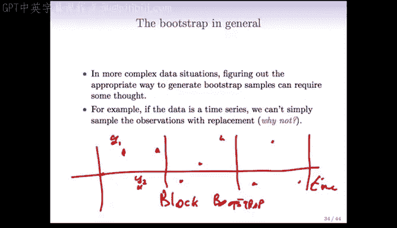

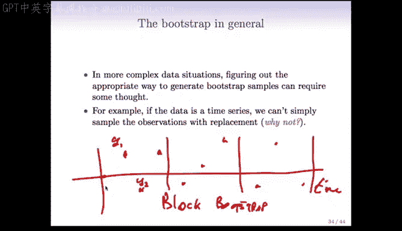

以下是具体步骤：
1.  确定块大小（例如，块大小为3）。
2.  将原始时间序列划分为连续的块（块1，块2，...）。
3.  对这些**块**进行有放回地随机抽样。
4.  将抽到的块按顺序拼接起来，形成一个新的Bootstrap时间序列样本。
5.  在这个新样本上拟合模型并计算统计量。

通过这种方式，我们在Bootstrap样本中保留了时间序列的局部依赖结构。

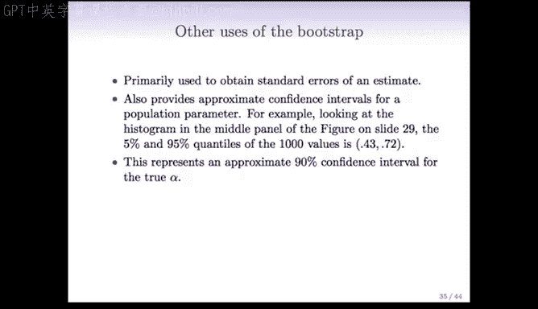

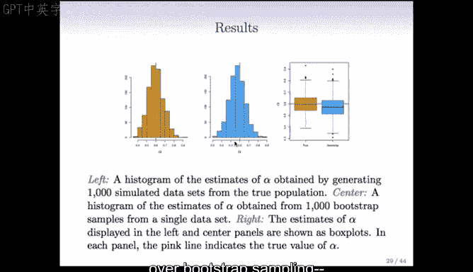

---

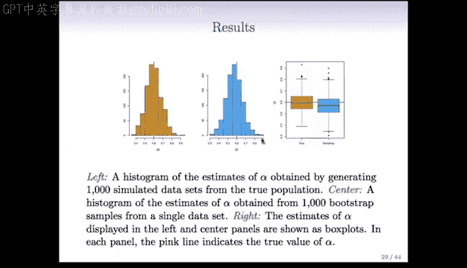

## Bootstrap置信区间

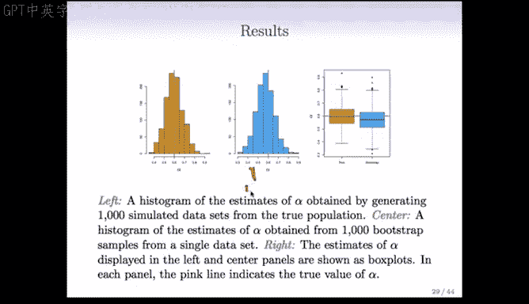

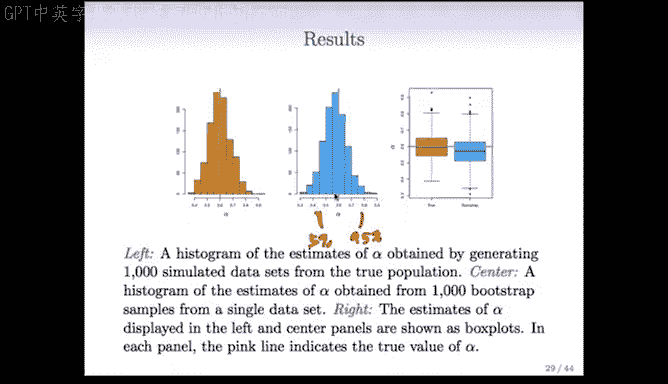

除了估计标准误，Bootstrap另一个非常常见的用途是构建参数的置信区间。

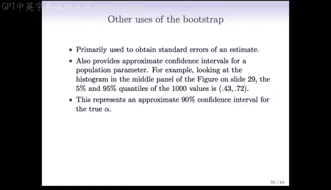

回顾投资组合例子中，我们通过1000次Bootstrap得到了 `α_hat` 的分布直方图。构建置信区间的一个直观方法是使用这个分布的分位数。

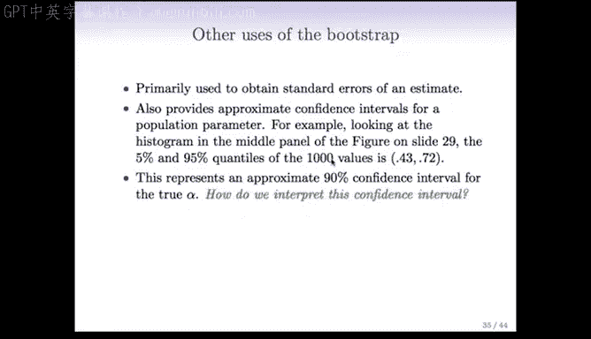

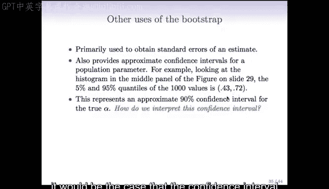

例如，要构建一个90%的置信区间，我们可以取Bootstrap分布的第5百分位数和第95百分位数作为区间的上下界。

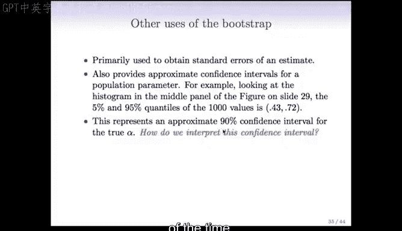

这种方法被称为**Bootstrap百分位数区间**。它是从Bootstrap结果中构建置信区间最简单、最常用的方法之一。

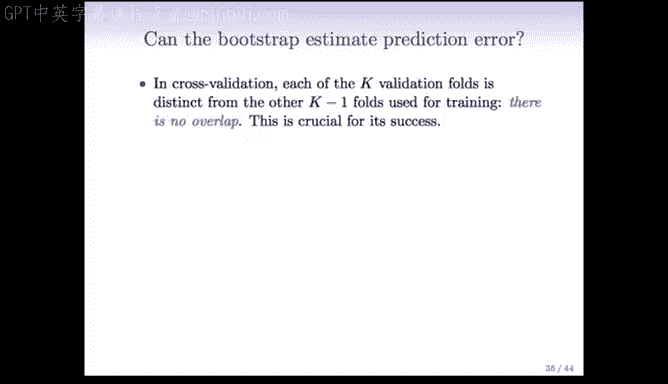

在之前的例子中，我们得到的90%置信区间是 `(0.43, 0.72)`。这个区间的含义是：如果我们能重复从总体中抽样并计算区间，那么有90%的此类区间会包含参数的真实值。

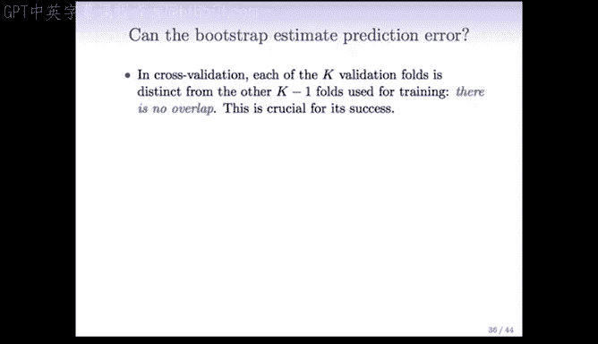

---

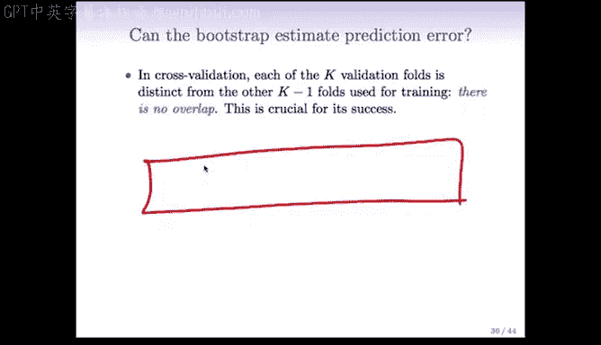

## Bootstrap与预测误差估计

我们之前讨论过，交叉验证是估计模型预测误差（如误分类率）的主要工具。那么，能用Bootstrap来估计预测误差吗？

一个自然的想法是：
1.  生成一个Bootstrap样本作为训练集。
2.  用原始训练集作为验证集进行预测并计算误差。

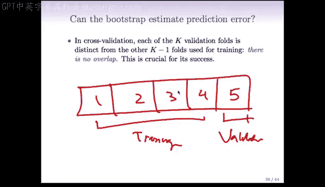

但这里存在一个严重问题：**重叠偏差**。

由于Bootstrap样本是通过有放回抽样从原始训练集中生成的，平均而言，一个Bootstrap样本中包含了原始训练集中大约 **2/3** 的数据点。这意味着，当我们用Bootstrap样本训练模型，再去预测原始训练集时，大部分数据点（约2/3）并不是“新”数据，模型在训练时已经“见过”它们。

这会导致估计出的预测误差严重偏低，不能反映模型在全新数据上的真实表现。

一种改进方法是：当用Bootstrap样本训练后，只记录那些**未出现在该Bootstrap样本中**的原始数据点上的预测误差。但这会使过程变得复杂。

**结论是：对于估计预测误差，交叉验证方法更简单、更直接，通常效果也更好。** 在数据科学中，一个重要的哲学是：如果简单方法能完成任务，就优先使用简单方法，而不是追求更复杂但收益不大的技术。

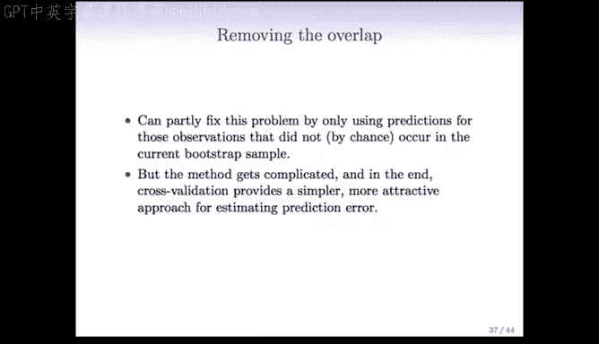

---

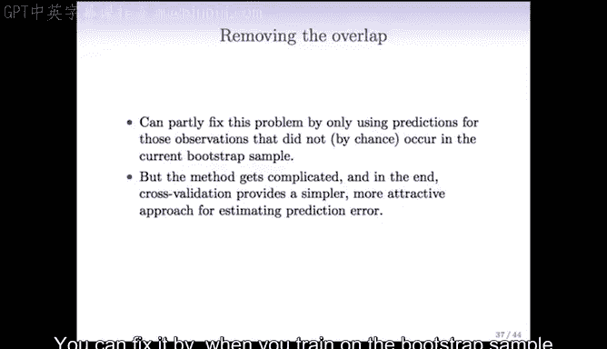

## 总结

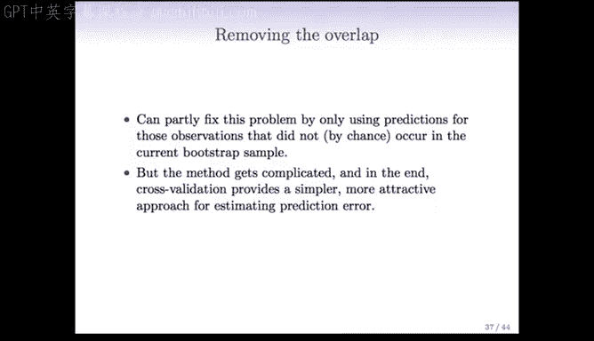

本节课我们一起深入学习了Bootstrap方法：
1.  我们通过一个通用框架回顾了Bootstrap的核心思想：用经验分布模拟总体，并通过重复抽样来评估统计量的不确定性。
2.  我们探讨了在时间序列等非独立数据中应用Bootstrap的挑战，并介绍了**块状Bootstrap**的解决方案。
3.  我们学习了如何使用Bootstrap分布的分位数来构建参数的**置信区间**（百分位数区间）。
4.  最后，我们分析了Bootstrap在估计**预测误差**方面的局限性，由于训练集与验证集的重叠会导致偏差，因此在这方面**交叉验证通常是更简单有效的选择**。

Bootstrap是一个强大而灵活的工具，特别适用于评估估计量的变异性，但在应用时需要根据数据结构的特点谨慎选择抽样方式。