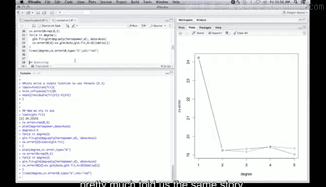

# R 版 32：交叉验证 🧪


在本节课中，我们将学习交叉验证的基本概念，并通过R语言实践，比较留一交叉验证与K折交叉验证在模型选择中的应用。我们将使用`Auto`数据集，探索马力与每加仑英里数之间的关系，并利用交叉验证选择最佳的多项式回归模型。

---

## 1. 准备工作与数据探索

首先，我们需要加载必要的R包和数据。我们将使用`ISLR`包中的`Auto`数据集，以及`boot`包中的交叉验证函数。

```r
require(ISLR)
require(boot)
```

接下来，我们查看数据集中的两个变量：`mpg`（每加仑英里数）和`horsepower`（马力），并绘制它们的散点图。

```r
plot(mpg ~ horsepower, data = Auto)
```

从图中可以观察到，随着马力的增加，每加仑英里数显著下降，这表明两者之间存在非线性关系。

---

## 2. 留一交叉验证

上一节我们介绍了数据集的基本情况，本节中我们来看看如何使用留一交叉验证来评估模型性能。

留一交叉验证的原理是：对于包含n个观测值的数据集，每次留出一个观测值作为测试集，用剩余的n-1个观测值训练模型，并在留出的观测值上做预测。这个过程重复n次，最终计算所有预测误差的平均值。

以下是使用`cv.glm`函数进行留一交叉验证的步骤：

1.  使用`glm`函数拟合一个线性模型。
2.  将拟合的模型传递给`cv.glm`函数进行计算。

```r
glm_fit <- glm(mpg ~ horsepower, data = Auto)
cv_err <- cv.glm(Auto, glm_fit)
cv_err$delta
```

`cv.glm`函数会返回两个误差估计值。第一个是原始的留一交叉验证误差，第二个是经过偏差校正的版本。偏差校正是因为训练集（n-1个样本）比我们理想中用于估计误差的完整数据集（n个样本）略小，这在K折交叉验证中影响更大。

对于线性回归模型，留一交叉验证误差有一个高效的计算公式，无需反复拟合模型。公式如下：

**公式 5.2：**
\[
CV_{(n)} = \frac{1}{n} \sum_{i=1}^{n} \left( \frac{y_i - \hat{y}_i}{1 - h_i} \right)^2
\]

其中，\(\hat{y}_i\) 是使用全部数据拟合模型后对第i个观测值的预测值，\(h_i\) 是“帽子矩阵”的第i个对角元素，它衡量了第i个观测值对其自身预测值的影响程度。

我们可以根据这个公式编写自己的函数来计算留一交叉验证误差：

```r
loocv <- function(fit) {
  h <- lm.influence(fit)$h
  mean((residuals(fit) / (1 - h))^2)
}
```

使用这个函数计算之前线性模型的交叉验证误差，结果应与`cv.glm`的第一个输出值一致。

```r
loocv(glm_fit)
```

---

## 3. 使用交叉验证进行模型选择

了解了留一交叉验证的原理后，我们将其应用于模型选择。我们将拟合不同次数的多项式回归模型，并使用交叉验证误差来选择最佳模型。

以下是具体步骤：

1.  创建一个向量用于存储不同多项式次数的交叉验证误差。
2.  循环拟合1到5次的多项式模型。
3.  对每个模型计算留一交叉验证误差。

```r
cv_error <- rep(0, 5)
degree <- 1:5

for (d in degree) {
  glm_fit <- glm(mpg ~ poly(horsepower, d), data = Auto)
  cv_error[d] <- loocv(glm_fit)
}

plot(degree, cv_error, type = "b")
```

从误差图中可以看出，一次多项式（线性模型）的误差最高。二次多项式模型的误差显著下降，而更高次数的模型误差改善不大。这与我们从散点图中观察到的非线性趋势相符。

---

## 4. K折交叉验证

上一节我们使用留一交叉验证选择了模型，本节中我们来看看另一种更常用的方法：K折交叉验证。

K折交叉验证将数据随机分成K个大小相似的子集（或“折”）。每次留出一个子集作为测试集，用其余K-1个子集训练模型，并在留出的子集上计算误差。这个过程重复K次，每次使用不同的子集作为测试集，最终将K次误差的平均值作为估计。

与留一法（K=n）相比，K折法（通常K=5或10）的计算量更小，且通常能提供更稳定、偏差更小的误差估计。

以下是使用10折交叉验证重复模型选择的过程：

```r
set.seed(17) # 设置随机种子以保证结果可重现
cv_error_10fold <- rep(0, 5)

for (d in degree) {
  glm_fit <- glm(mpg ~ poly(horsepower, d), data = Auto)
  cv_error_10fold[d] <- cv.glm(Auto, glm_fit, K = 10)$delta[1]
}

lines(degree, cv_error_10fold, type = "b", col = "red")
```

将10折交叉验证的误差线（红色）添加到之前的图中，可以发现其趋势与留一交叉验证（黑色）基本一致，都表明二次模型是最佳选择。

---



## 总结

本节课中我们一起学习了交叉验证的核心概念与实践。我们首先探索了数据，然后实现了留一交叉验证，并利用其高效计算公式评估了线性模型。接着，我们将其应用于多项式回归的模型选择，发现二次模型对`mpg`和`horsepower`关系的拟合效果最佳。最后，我们实践了10折交叉验证，并确认了其结论与留一法的一致性。在实际应用中，**K折交叉验证（通常K=5或10）因其计算效率和稳定性而更受青睐**。