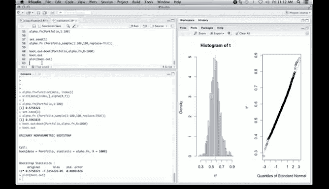

# R 版 33：R语言统计学习 - 5.R.2 自助法（Bootstrap） 🚀


在本节课中，我们将学习如何使用R语言实现自助法。自助法是一种强大的统计工具，由Bradley Efron发明，它允许我们在难以推导理论分布的情况下，通过重抽样来估计统计量的抽样分布。我们将通过一个投资组合优化的具体例子来演示其应用。

## 概述

自助法的核心思想是通过从原始数据集中有放回地重复抽样，生成大量“自助样本”，然后在每个样本上重新计算我们感兴趣的统计量。通过观察这些统计量在大量自助样本上的分布，我们可以近似其真实的抽样分布，从而计算标准误、置信区间等。

上一节我们介绍了自助法的基本概念，本节中我们来看看如何在R语言中具体实现它。

## 数据与问题设定

我们考虑一个投资组合问题。假设有两种投资资产X和Y。我们的目标是找到一个最优的权重α，使得投资组合 `αX + (1-α)Y` 的风险（方差）最小。

已知最小风险组合的权重α由以下公式给出：

**α = (σ²_Y - σ_XY) / (σ²_X + σ²_Y - 2σ_XY)**

其中：
*   `σ²_X` 是资产X的方差。
*   `σ²_Y` 是资产Y的方差。
*   `σ_XY` 是资产X和Y的协方差。

我们的目标是计算基于样本数据得出的α估计值，并估计其标准误。由于α是方差和协方差的非线性函数，其理论标准误难以推导，这正是自助法大显身手的地方。

## 实现步骤

以下是实现自助法估计α标准误的完整步骤。

### 1. 定义计算α的函数

首先，我们需要一个函数，输入两个资产的数据向量，根据上述公式计算α。

```r
# 定义计算最优权重α的函数
alpha <- function(x, y) {
    var_x <- var(x)
    var_y <- var(y)
    cov_xy <- cov(x, y)
    alpha_hat <- (var_y - cov_xy) / (var_x + var_y - 2 * cov_xy)
    return(alpha_hat)
}
```

### 2. 准备数据并计算原始估计值

我们使用一个名为`Portfolio`的数据集，其中包含变量X和Y。

```r
# 加载数据并计算原始α估计值
data(Portfolio)
original_alpha <- alpha(Portfolio$X, Portfolio$Y)
print(original_alpha)
# 输出: 0.5758321
```
原始数据计算出的最优权重α约为0.576。

### 3. 创建用于自助法的包装函数

自助法函数（如`boot`）需要一个特定的函数格式。该函数应接受数据和索引（`index`）作为参数，索引用于指定当前自助样本包含哪些观测行。

```r
# 创建用于boot函数的包装函数
alpha_fn <- function(data, index) {
    # 使用with函数，方便在data[index, ]中直接使用列名X和Y
    with(data[index, ], {
        return(alpha(X, Y))
    })
}

# 测试函数：使用原始数据（索引为1:n）应得到相同结果
n <- nrow(Portfolio)
test_alpha <- alpha_fn(Portfolio, 1:n)
print(test_alpha)
# 输出: 0.5758321
```

### 4. 执行单次自助抽样

在运行完整自助法之前，我们先理解一次自助抽样的过程。我们设置随机种子以确保结果可重现。

```r
# 设置随机种子以保证结果可重现
set.seed(1)

# 进行一次自助抽样：有放回地从1:n中抽取n个观测的索引
boot_sample_index <- sample(1:n, size = n, replace = TRUE)

# 基于这个自助样本计算α
boot_alpha_once <- alpha_fn(Portfolio, boot_sample_index)
print(boot_alpha_once)
# 输出: 0.5963833
```
可以看到，基于一个自助样本计算的α值与原始估计值不同。

### 5. 运行完整自助法

现在，我们使用`boot`包来自动化这个过程，重复自助抽样1000次，并汇总结果。

```r
# 加载boot包
library(boot)

# 运行自助法，R=1000表示重复1000次
boot_results <- boot(data = Portfolio,
                     statistic = alpha_fn,
                     R = 1000)

# 查看自助法结果摘要
print(boot_results)
```
输出结果将包含：
*   **原始估计值 (original)**: 约0.576。
*   **偏差估计 (bias)**: 通常很小。
*   **标准误估计 (std. error)**: 这是我们关心的核心，例如可能约为0.09。

### 6. 可视化自助分布

查看α在自助样本上的分布有助于理解其变异性。

```r
# 绘制自助分布图
plot(boot_results)
```
图形将包含两个面板：
1.  **直方图**：展示1000个自助α估计值的分布。通常看起来近似对称，可能接近正态分布。
2.  **Q-Q图**：将自助统计量的分位数与标准正态分布的分位数进行比较。如果点大致落在一条直线上，则表明分布接近正态。我们的结果可能显示右侧尾部稍厚。

## 总结



本节课中我们一起学习了如何在R语言中应用自助法。我们通过一个投资组合权重的例子，完整演示了从定义统计量函数、创建包装函数到使用`boot`包执行和评估自助分析的流程。自助法绕过了复杂的理论推导，通过计算机模拟直接为我们提供了统计量（如α）标准误的可靠估计，是处理复杂、非线性统计问题的利器。