# R 版 34：模型选择与正则化 - 6.1 引言与最优子集选择 📊

在本节课中，我们将学习模型选择与正则化的基本概念。我们将探讨如何在线性回归的框架下，通过选择或压缩特征系数来改进最小二乘法，从而提升模型的解释性和预测能力。课程将涵盖最优子集选择、逐步选择方法以及收缩方法等核心内容。

---

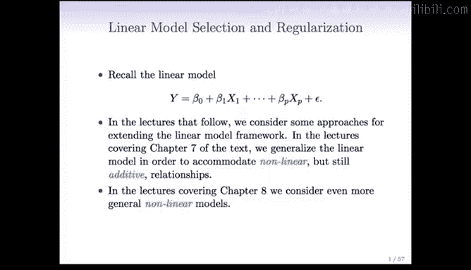

## 引言与目标 🎯

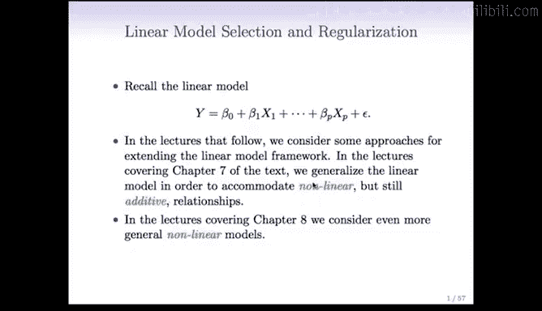

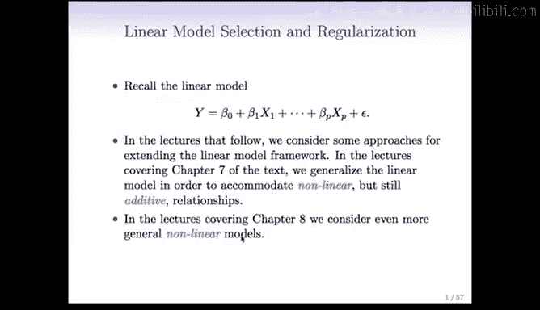

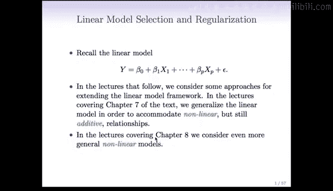

上一节我们回顾了线性模型的基本形式。本节中，我们将探讨改进线性模型拟合的方法。

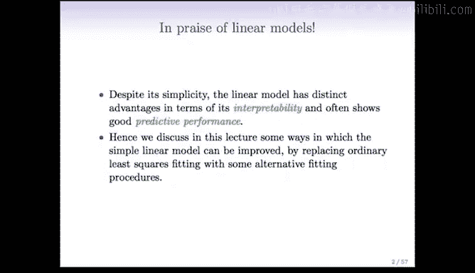

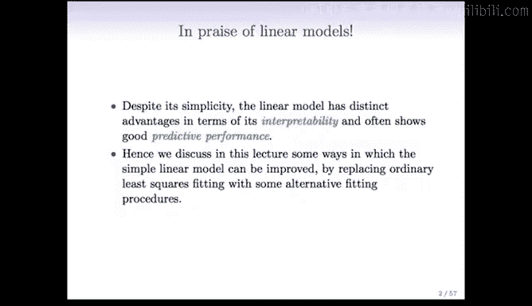

线性模型形式简单，易于解释，并且在许多情况下预测效果良好。其基本形式为：

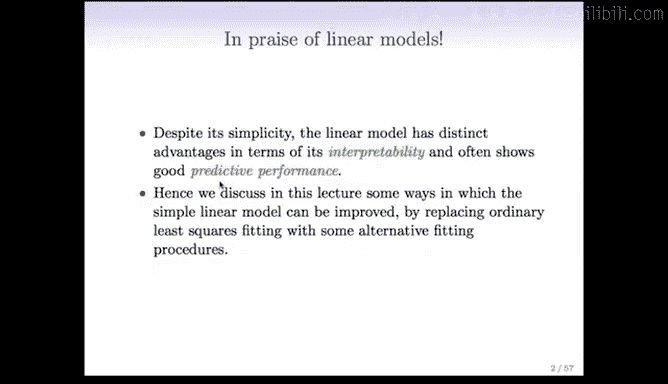

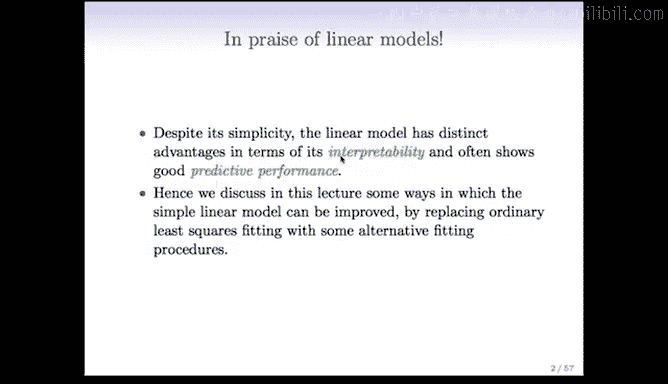

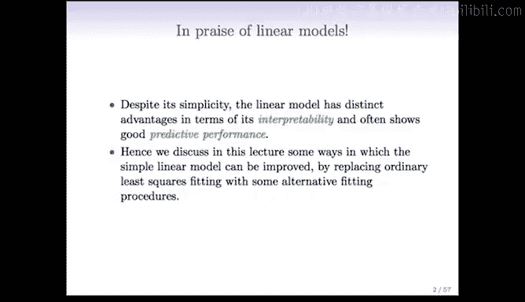

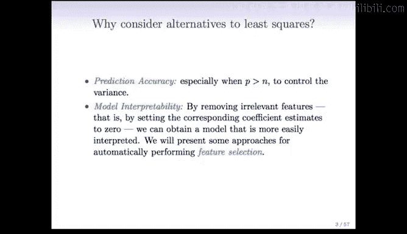

**公式：**
`Y = β₀ + β₁X₁ + β₂X₂ + ... + βₚXₚ + ε`

我们的目标是通过选择或压缩特征系数来改进最小二乘估计。这主要出于两个目的：
1.  **提高预测准确性**：当特征数量 `p` 大于样本数量 `n` 时，最小二乘解甚至无法定义。我们需要通过减少特征数量或压缩系数来避免过拟合，从而获得更好的预测效果。
2.  **增强模型可解释性**：拥有数百个特征的模型难以解释。如果我们将特征筛选到最重要的5个或10个，模型将更容易理解，从科学角度来看也更有用。

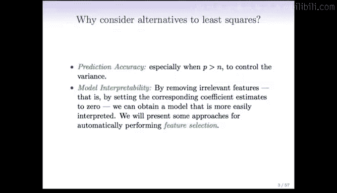

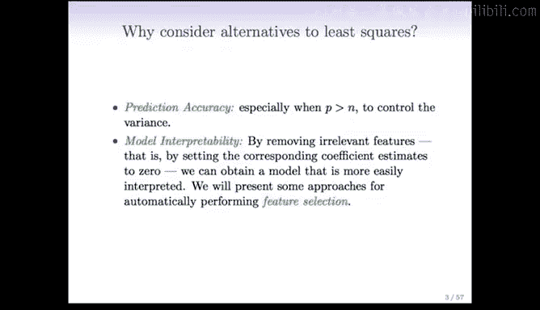

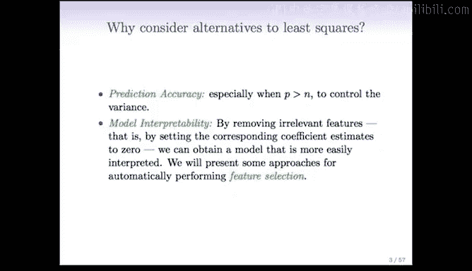

我们将特征选择定义为在众多特征中挑选出最具信息量的那些的过程。

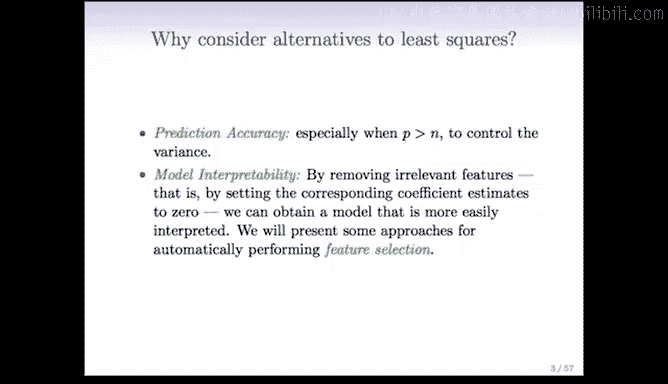

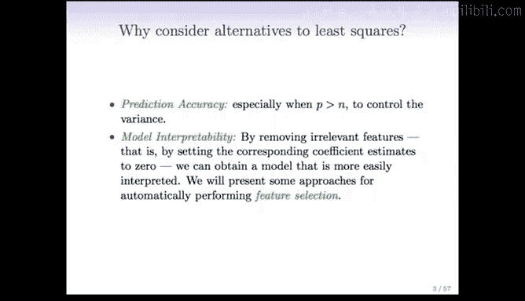

---

## 方法概览 📋

本节课我们将讨论三类主要技术：

1.  **子集选择**：尝试从 `p` 个预测变量中找出与响应变量最相关的子集。我们将看到最优子集选择以及前向、后向逐步选择等不同形式。
2.  **收缩方法**：不显式地选择变量，而是通过对系数数量或大小施加惩罚来约束模型。我们将讨论岭回归和LASSO。
3.  **降维**：寻找变量的重要组合，并将这些组合作为回归中的特征。我们将讨论主成分回归和偏最小二乘法。

虽然我们在线性回归的背景下讨论这些概念，但它们同样可以应用于逻辑回归或其他类型的模型。

---

## 最优子集选择 🔍

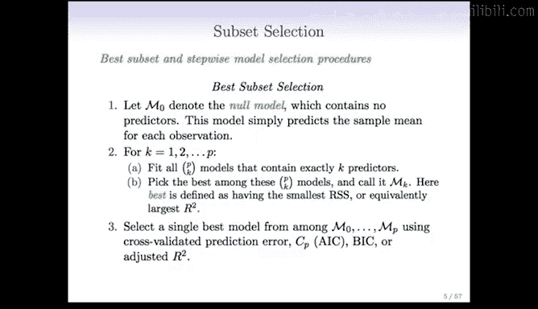

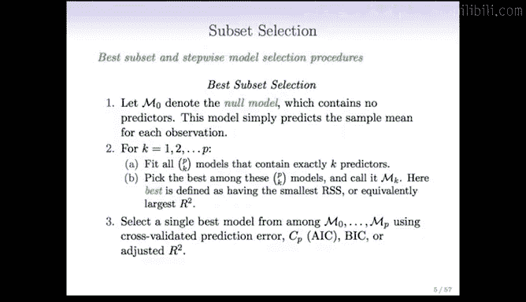

上一节我们介绍了模型选择的目标。本节中，我们来看看最优子集选择这一具体方法。

最优子集选择是一个简单的想法：假设我们有 `p` 个预测变量，但我们希望得到一个只包含其中一部分变量的更简单的模型。最自然的方法是考虑所有可能的预测变量子集，并从中选择最佳模型。

以下是执行最优子集选择的步骤：

**步骤 1：生成所有可能模型**
我们以系统化的方式创建一系列模型：
*   `M₀`：零模型，不包含任何预测变量，仅包含截距项。它用样本均值预测每个观测值。
*   `M₁`：包含**恰好一个**预测变量的最佳模型。我们需要检查所有 `p` 个单变量模型，并选择最好的一个。
*   `M₂`：包含**恰好两个**预测变量的最佳模型。我们需要检查所有 `C(p, 2)` 个双变量模型，并选择最好的一个。
*   ...
*   `Mₚ`：包含所有 `p` 个预测变量的模型。

其中，`C(p, k)` 表示从 `p` 个元素中选取 `k` 个的组合数，计算公式为：
**公式：**
`C(p, k) = p! / [k! * (p-k)!]`

在每个子集大小 `k` 下，我们通过最小化残差平方和或等价地最大化 R² 来选择最佳模型。

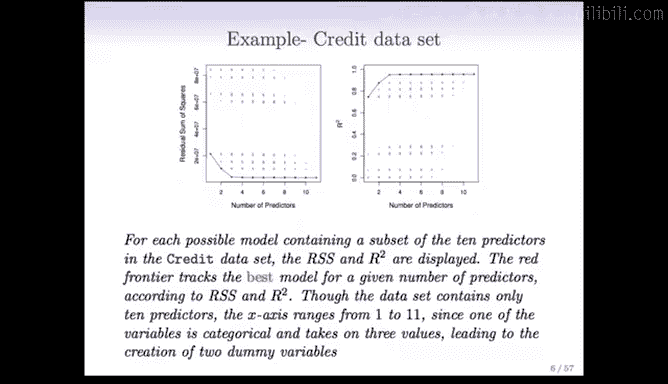

**步骤 2：选择单一最佳模型**
在得到 `M₀` 到 `Mₚ` 这一系列模型后，我们需要从中选出一个单一的“最佳”模型。这一步需要格外小心，因为我们必须选择一个测试误差最小的模型，而不仅仅是训练误差最小的模型。

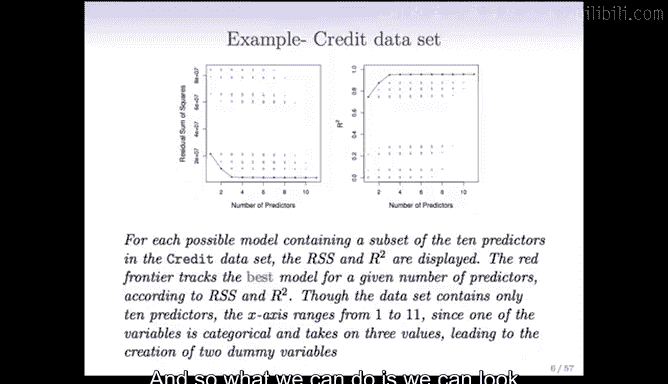

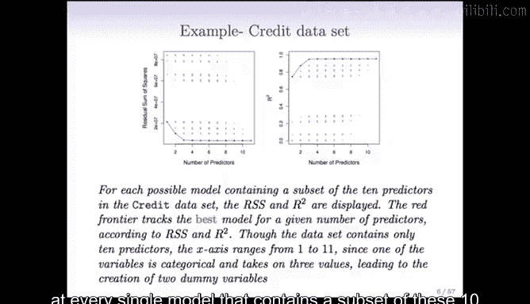

以下是可用于选择模型的方法：
*   通过交叉验证估计预测误差。
*   使用一些信息准则，如马洛斯 Cp、贝叶斯信息准则或调整后的 R²。

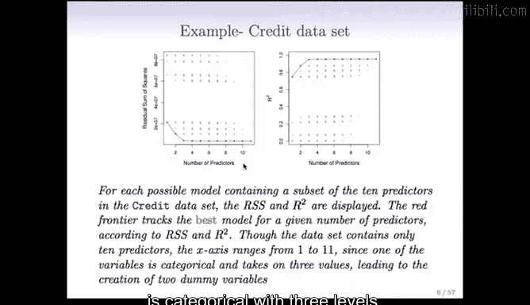

---

## 实例演示：信用卡数据 💳

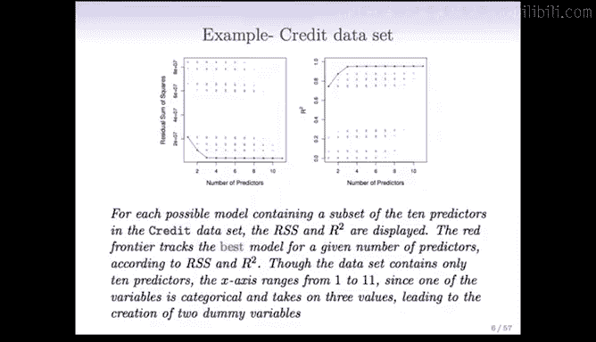

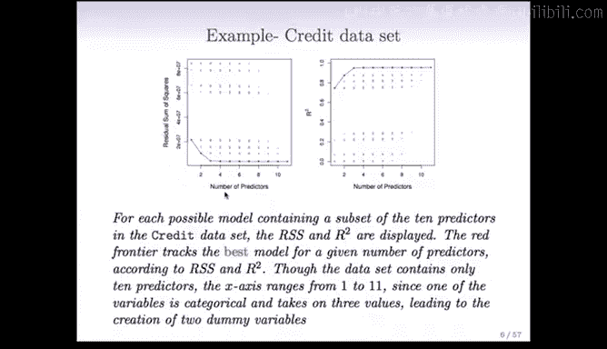

让我们通过一个实例来理解最优子集选择的过程。我们使用之前章节见过的信用卡数据集。

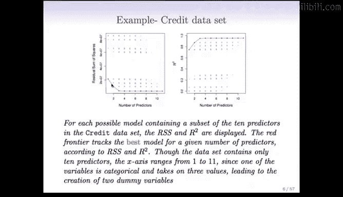

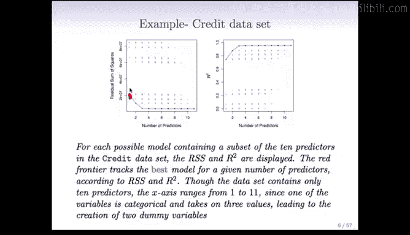

该数据集包含10个预测变量（如信用卡数量、信用评级、信用额度等），目标是预测定量响应变量——信用卡余额。

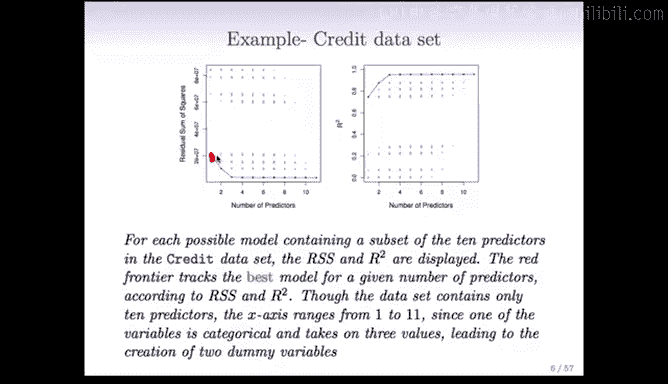

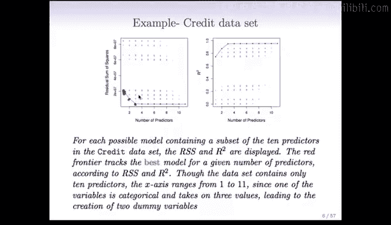

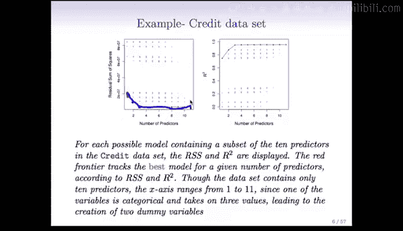

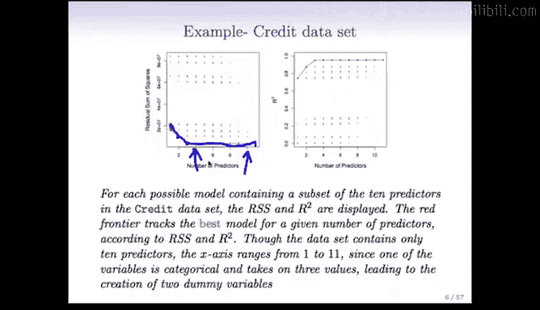

我们可以检查包含这10个预测变量所有可能子集的模型。下图左侧绘制了这些模型：

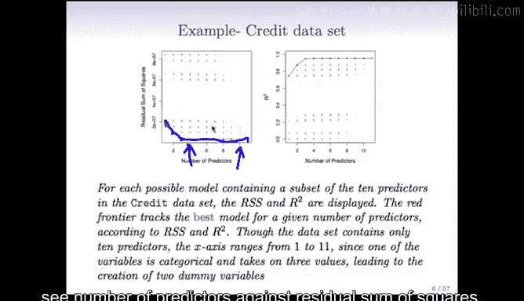

*   **X轴**：模型包含的预测变量数量（1到11，因为其中一个分类变量被编码为两个虚拟变量）。
*   **Y轴**：每个模型的残差平方和。
*   **灰色点**：代表每一个可能的子集模型。由于有10个预测变量，总共有 `2^10 = 1024` 个子模型。
*   **红线**：连接了每个子集大小下的最佳模型（即 `M₁`, `M₂`, ..., `M₁₀`）。

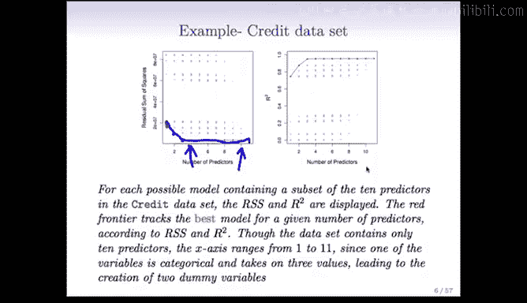

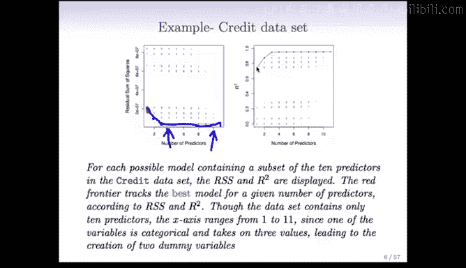

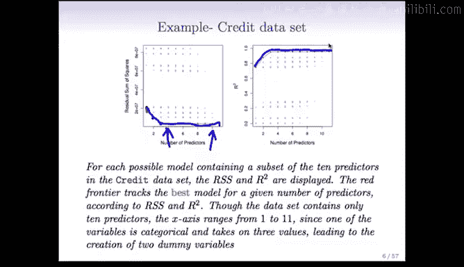

我们观察到，随着模型变大（包含更多预测变量），残差平方和单调下降，而 R² 单调上升。这是因为增加变量至少不会使模型在训练集上的表现变差（最坏情况是将新变量的系数设为0，得到与之前相同的模型）。

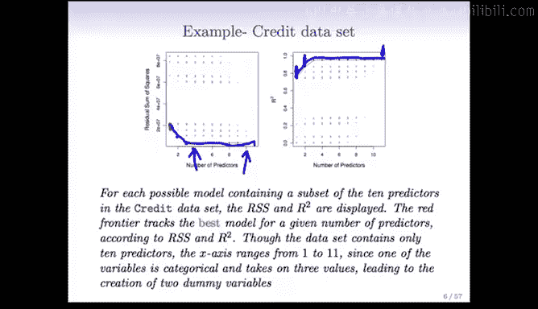

然而，这也引出了关键问题：我们无法直接通过比较残差平方和或 R² 来评判不同大小的模型哪个更好。例如，一个包含8个预测变量的模型其训练误差几乎总是小于一个包含4个预测变量的模型。因此，为了在不同大小的模型间做出有意义的选择，我们必须使用交叉验证或信息准则等方法，这将在后续课程中详细讨论。

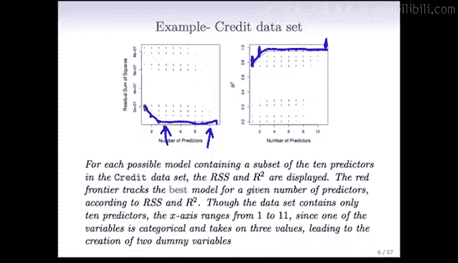

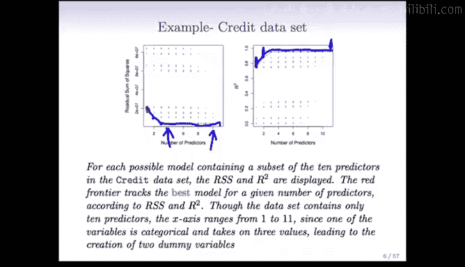

---

## 总结 📝

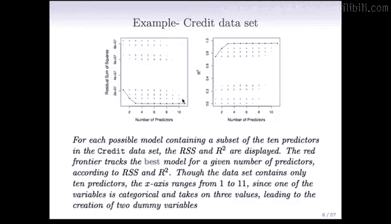

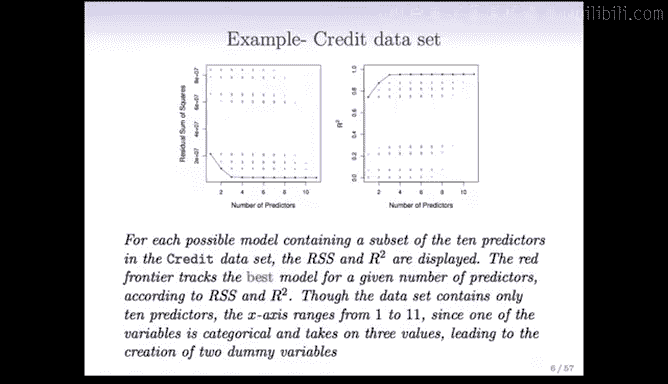

本节课我们一起学习了模型选择与正则化的引言部分，并深入探讨了最优子集选择方法。

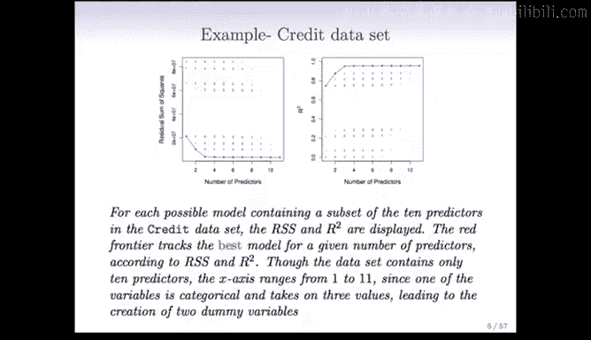

我们了解到，为了提升线性模型的预测能力和可解释性，尤其是在特征数量众多时，我们需要超越普通最小二乘法。最优子集选择通过系统地评估所有可能的特征子集，为每个子集大小找到一个最佳模型。然而，最终从这些不同大小的模型中选出全局最佳模型时，必须依赖交叉验证或信息准则等技术，以避免过拟合并确保模型具有良好的泛化能力。

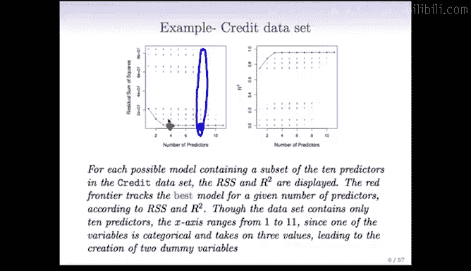

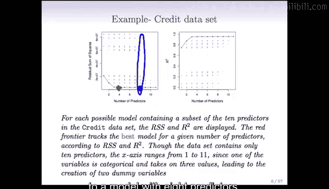

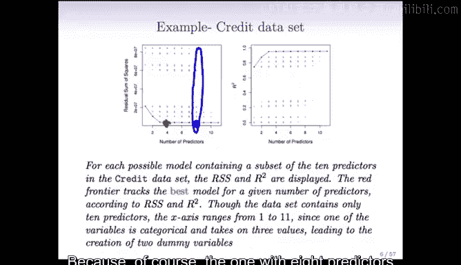

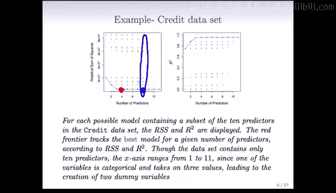

在接下来的课程中，我们将继续学习逐步选择法、收缩方法等其他模型选择与正则化技术。