# R 版 36：6.3 向后逐步选择法 📉

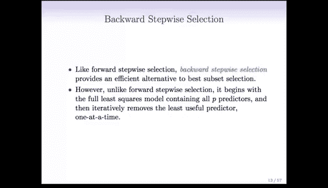

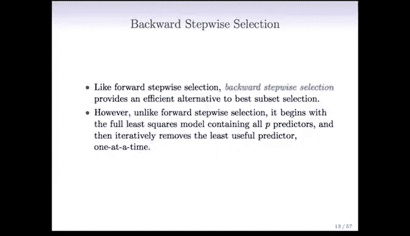

## 概述
在本节课中，我们将要学习一种名为“向后逐步选择法”的特征选择技术。它是“最优子集选择法”的一种高效替代方案，其操作方向与上一节介绍的“向前逐步选择法”完全相反。

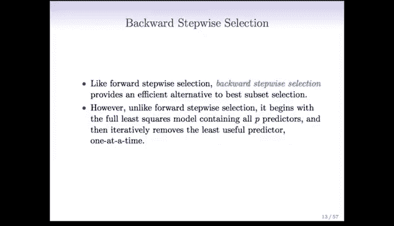

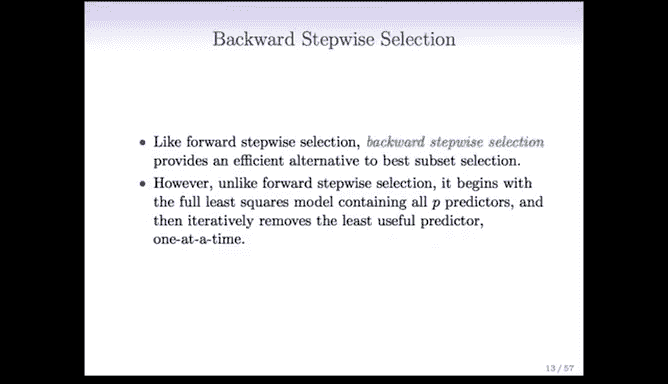

## 向后逐步选择法介绍
上一节我们介绍了向前逐步选择法，本节中我们来看看向后逐步选择法。与向前逐步选择法类似，向后逐步选择法也是最优子集选择法的一种高效替代方案。然而，它的操作过程与向前逐步选择法恰恰相反。

在向前逐步选择法中，我们从仅包含截距项的模型 **M0** 开始，然后逐一添加特征，依次得到 **M1**、**M2** 等模型。

相比之下，在向后逐步选择法中，我们将从包含全部 **P** 个预测变量的模型 **MP** 开始，然后逐一移除预测变量，直到我们得到仅包含截距项的模型 **M0**。

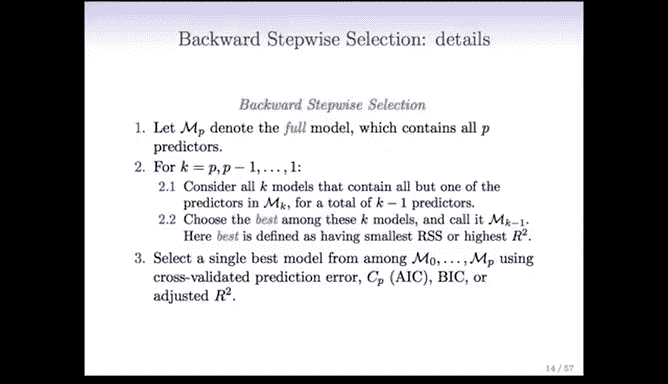

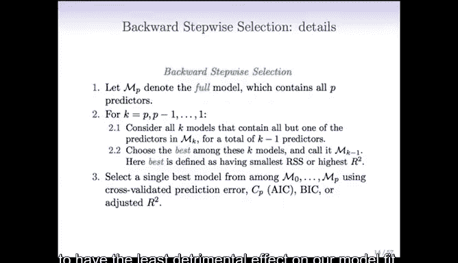

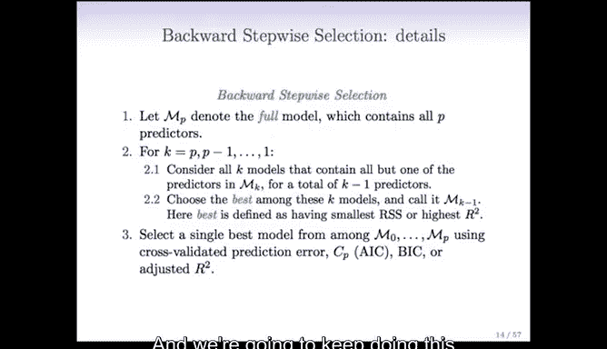

## 向后逐步选择法的详细步骤
以下是向后逐步选择法的具体操作流程：

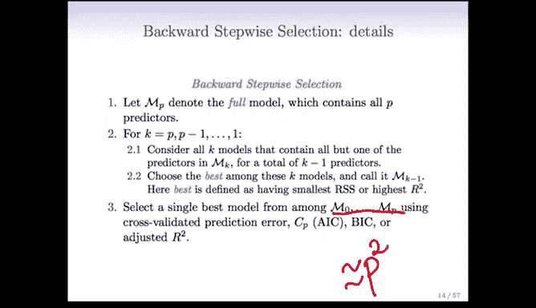

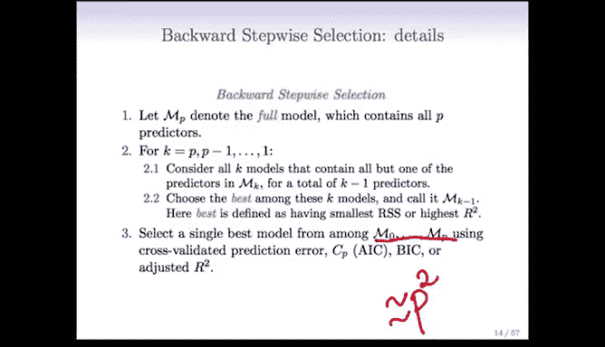

1.  我们首先拟合模型 **MP**，即包含所有预测变量的普通最小二乘模型。
2.  然后，我们考虑从 **MP** 中移除 **P** 个预测变量中的每一个，并评估移除哪个预测变量对模型拟合效果（如 **RSS** 或 **R²**）的影响最小。
3.  我们移除那个最不重要的预测变量，得到模型 **MP-1**。
4.  接着，我们对 **MP-1** 重复上述过程：再次评估移除哪个剩余预测变量的影响最小。
5.  我们持续这一过程，直到模型只剩下一个预测变量 **M1**，最终到达不包含任何预测变量的模型 **M0**。

通过这个过程，我们同样会得到一系列从 **M0** 到 **MP** 的模型。我们将再次使用交叉验证、**AIC**、**BIC** 或调整后 **R²** 等准则从这些模型中进行选择。

## 计算效率与模型质量
与向前逐步选择法一样，向后逐步选择法大约只需要考虑 **P²** 个模型（更精确地说是 **P²/2** 个），而不是最优子集选择法的 **2ᴾ** 个模型。因此，当 **P** 值中等或较大时，它是一种极佳的计算替代方案。

同样地，向后逐步选择法也不能保证找到包含特定数量预测变量的最优模型。就训练集的 **RSS** 或 **R²** 而言，它得到的模型可能不如最优子集选择法。但这通常是可以接受的，从长远来看，它在测试集上可能表现更好，更不用说其计算效率更高了。

## 向后与向前逐步选择法的主要区别
向后与向前逐步选择法的一个主要区别在于起点。向后逐步选择法从包含所有预测变量的模型开始。因此，要使用这种方法，我们必须满足观测数 **n** 大于变量数 **P** 的条件。因为只有当 **n > P** 时，我们才能拟合最小二乘回归模型。如果 **P > n**，最小二乘模型甚至无法定义。

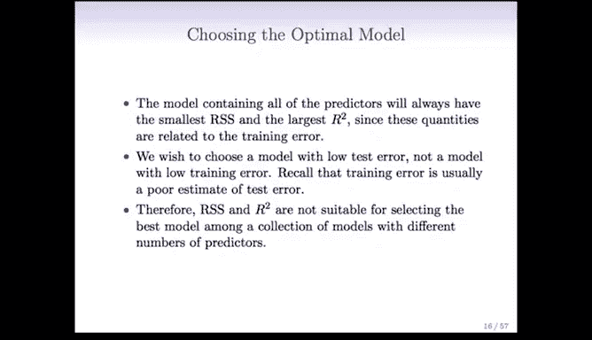

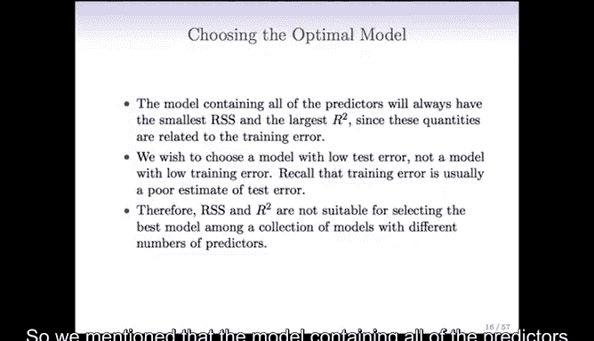

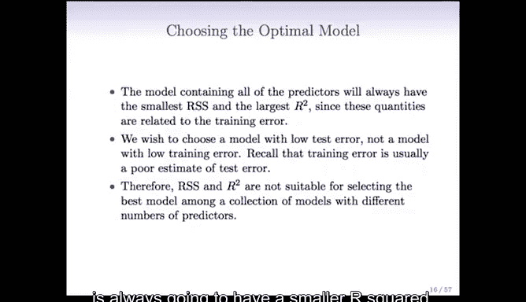

相比之下，向前逐步选择法无论 **n < P** 还是 **n > P** 都可以使用。

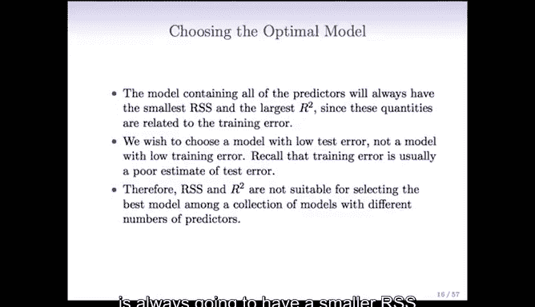

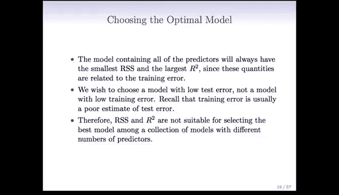

## 为何不能直接使用 RSS 或 R² 选择模型
我们提到，包含所有预测变量的模型总是具有最小的 **RSS** 和最大的 **R²**，因为这两个指标本质上衡量的是训练误差。

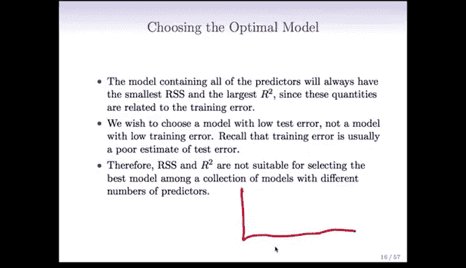

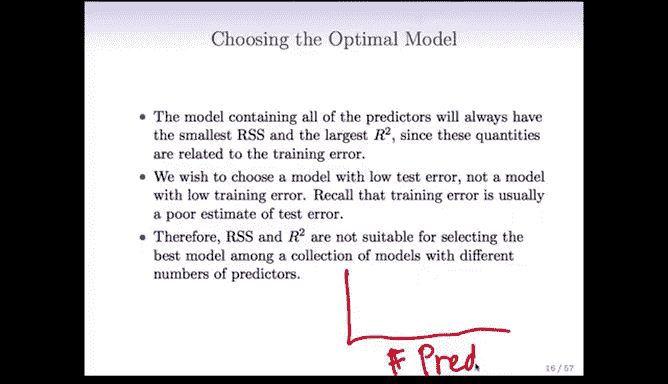

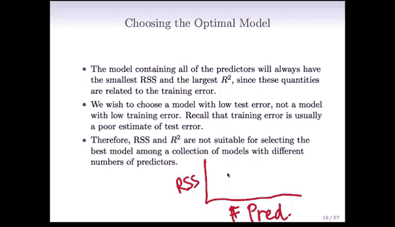

如果我们以预测变量数量为横轴，**RSS** 为纵轴绘图，曲线将是单调递减的。类似地，以预测变量数量为横轴，**R²** 为纵轴，曲线将是单调递增的。

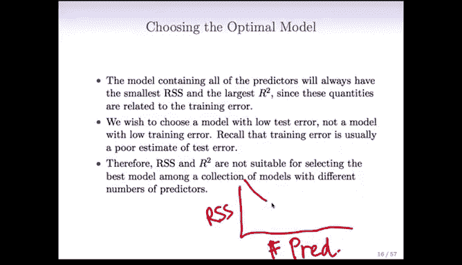

因此，当我们通过最优子集、向前或向后逐步选择法得到模型 **M0** 到 **MP** 后，我们不能仅仅依据 **RSS** 或 **R²** 来选择模型，否则我们总会选择最大的模型。这归根结底是因为这些指标仅基于训练误差。

然而，我们的目标是获得低测试误差的模型，以便对尚未见过的新观测数据进行良好预测。不幸的是，仅仅选择训练误差最小的模型通常无法保证得到测试误差低的模型，因为训练误差通常是测试误差的一个很差估计。因此，**RSS** 和 **R²** 并不适合用于在不同变量数量的模型之间进行选择。

## 总结
本节课中我们一起学习了向后逐步选择法。我们了解到它是从包含全部预测变量的模型开始，通过逐一移除最不重要的变量来构建一系列嵌套模型。虽然它不能保证找到理论上的最优子集，并且在数据维度 **P** 大于样本量 **n** 时无法使用，但其计算效率远高于最优子集选择法，是实践中一种非常实用的特征选择工具。