# R 版 37：估计测试误差 📊

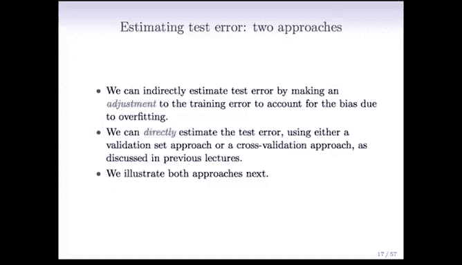

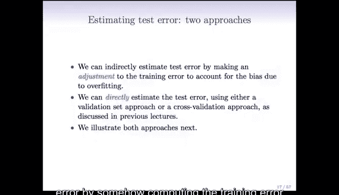

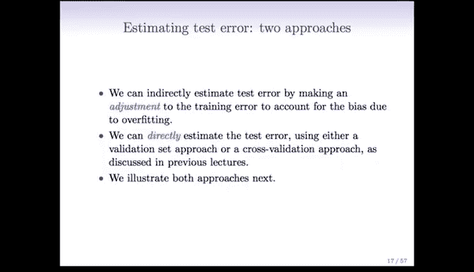

在本节课中，我们将学习如何估计模型的测试误差。这是模型选择过程中的关键一步，因为我们需要比较不同复杂度模型的性能，以选出最佳模型。

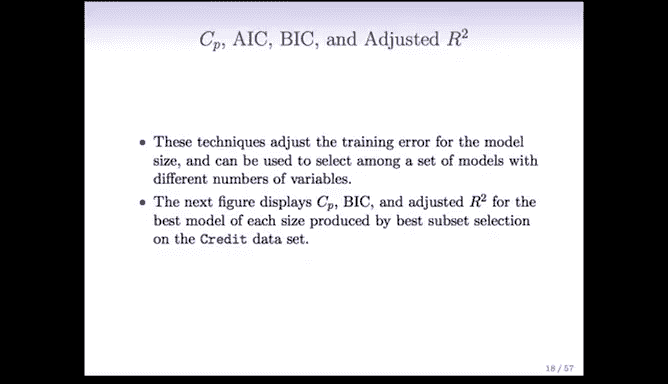

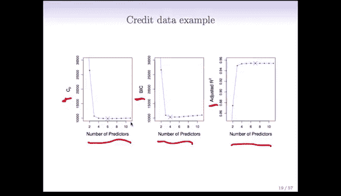

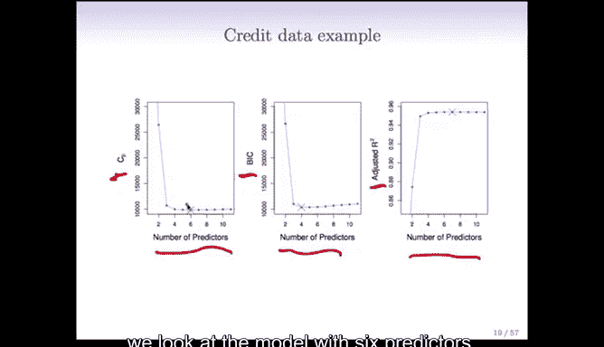

为了估计测试误差，主要有两种思路。第一种是间接方法，即通过计算训练误差并进行调整，来近似测试误差。第二种是直接方法，例如使用交叉验证或验证集方法，直接在部分数据上评估模型性能。

上一节我们介绍了模型选择的基本概念，本节中我们来看看具体的误差估计方法。

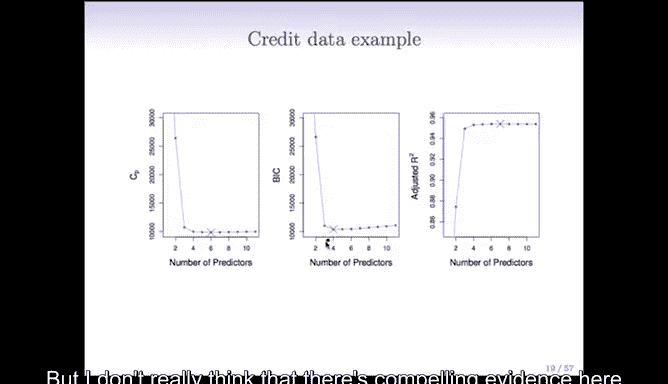

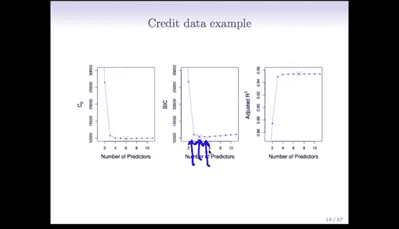

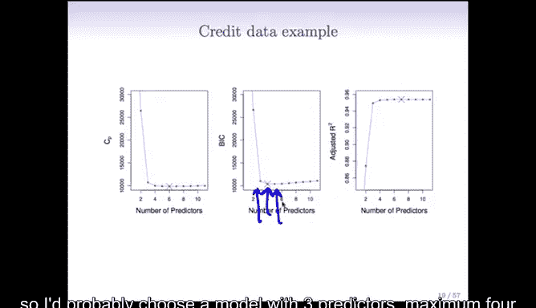

## 间接估计方法：调整训练误差

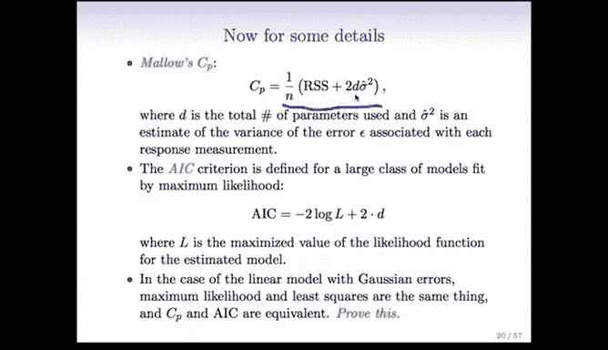

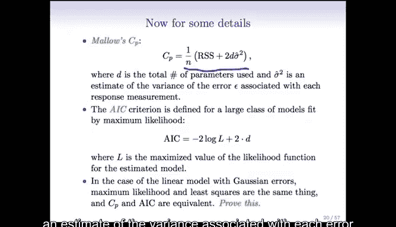

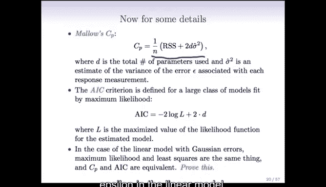

这类方法的核心思想是，训练误差通常会低估测试误差，尤其是在模型过拟合时。因此，我们需要对训练误差进行某种调整，使其更接近真实的测试误差。以下是几种常用的调整方法：

以下是几种基于调整训练误差的模型选择准则：

*   **Mallow's Cp**：其计算公式为 `Cp = RSS + 2 * d * σ̂²`。其中，`RSS` 是模型的残差平方和，`d` 是模型中的预测变量个数（包括截距项），`σ̂²` 是线性模型中误差项方差的估计值。我们选择 `Cp` 值最小的模型。
*   **赤池信息准则 (AIC)**：其计算公式为 `AIC = -2 log(L) + 2 * d`。其中，`L` 是模型的最大似然值。对于线性模型，`AIC` 与 `Cp` 是等价的。我们选择 `AIC` 值最小的模型。
*   **贝叶斯信息准则 (BIC)**：其计算公式为 `BIC = RSS + log(n) * d * σ̂²`。其中，`n` 是观测样本数。由于 `log(n)` 通常大于 2，BIC 对模型复杂度的惩罚比 AIC 更重，因此倾向于选择更简单的模型。我们选择 `BIC` 值最小的模型。
*   **调整后 R 方 (Adjusted R²)**：其计算公式为 `Adjusted R² = 1 - [RSS/(n-d-1)] / [TSS/(n-1)]`。其中，`TSS` 是总平方和。与普通 R 方不同，调整后 R 方在分母中引入了模型复杂度 `d`，使得不同变量数的模型可以公平比较。我们选择调整后 R 方值最大的模型。

## 直接估计方法：交叉验证与验证集

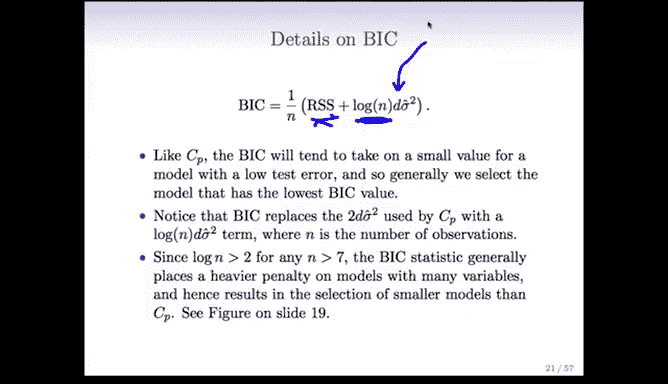

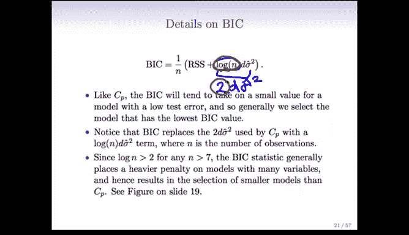

与上述间接调整方法不同，直接估计方法通过将数据分割来模拟测试环境。

以下是两种主要的直接估计方法：

*   **验证集方法**：将数据随机分为训练集和验证集（或称为测试集）。在训练集上拟合模型，然后在验证集上计算误差（如均方误差），此误差即为测试误差的直接估计。
*   **交叉验证**：特别是 **k 折交叉验证**，将数据分为 k 个大小相似的子集。每次使用 k-1 个子集的数据进行训练，用剩下的 1 个子集进行验证，重复 k 次。最终将 k 次验证误差的平均值作为测试误差的估计。这种方法比单一的验证集方法更稳定，能更有效地利用数据。

## 方法对比与选择

间接方法（如 Cp、AIC、BIC、调整 R 方）计算高效，但通常依赖于线性模型和误差方差 `σ̂²` 的估计，这在预测变量数 `p` 大于样本数 `n` 时可能存在问题。调整 R 方不需要估计 `σ̂²`，适用性稍广。

直接方法（交叉验证/验证集）更为通用和稳健。它们不依赖于特定的模型假设，可以应用于任何类型的模型（如即将学到的岭回归和 LASSO），即使在模型复杂度 `d` 不明确或 `p > n` 的情况下也能使用。因此，在实践中，尤其是对于复杂或非常规的模型，交叉验证通常是首选的误差估计方法。

本节课中我们一起学习了估计测试误差的两种主要途径：通过调整训练误差的间接准则（Cp、AIC、BIC、调整R方），以及通过数据分割的直接方法（验证集与交叉验证）。理解这些方法的原理和适用场景，对于在模型选择中做出明智决策至关重要。