# R 版 38：验证与交叉验证 📊

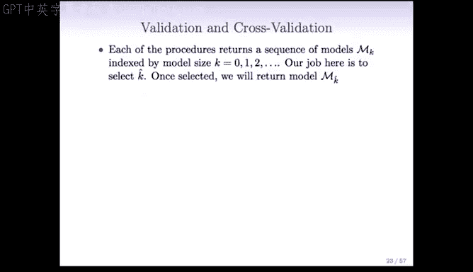

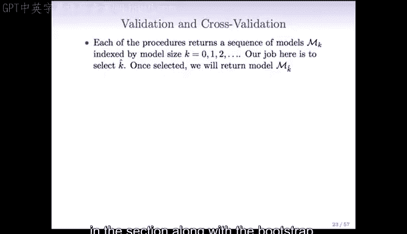

在本节课中，我们将学习模型选择中的两种重要方法：验证集方法和交叉验证方法。我们将了解它们的基本思想、操作步骤，以及相较于之前讨论的基于调整RSS、AIC和BIC等方法，它们所具有的优势。

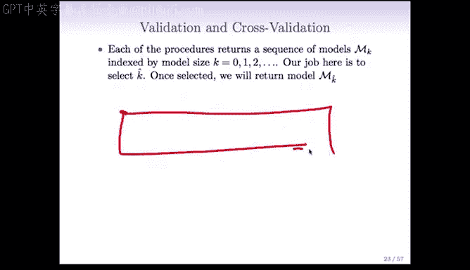

---

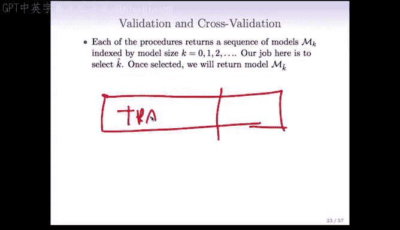

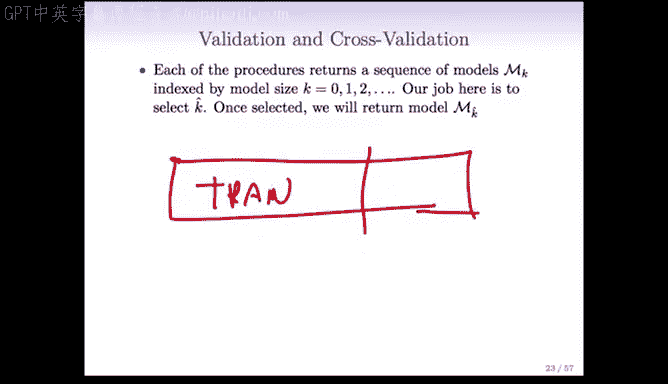

## 验证集方法

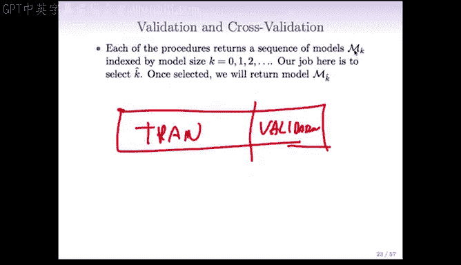

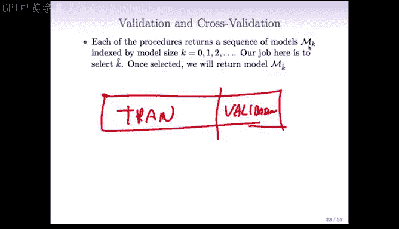

上一节我们介绍了基于调整RSS、AIC和BIC的模型选择方法。本节中，我们来看看一种更直接的方法——验证集方法。

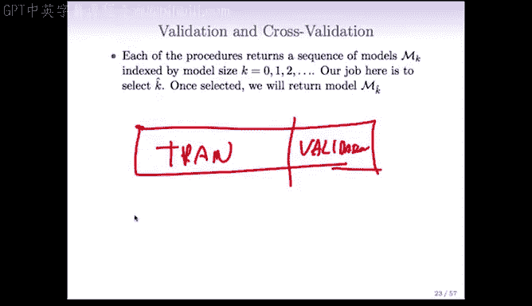

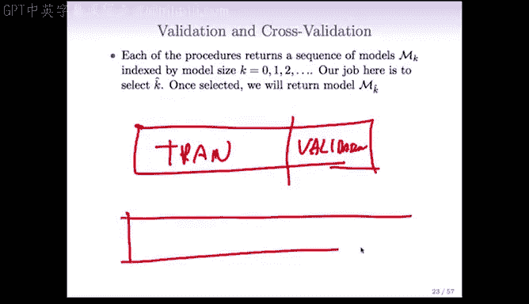

验证集方法的核心思想是将数据随机划分为两部分：训练集和验证集。

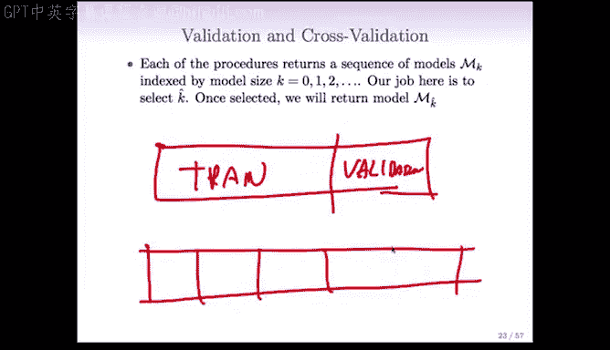

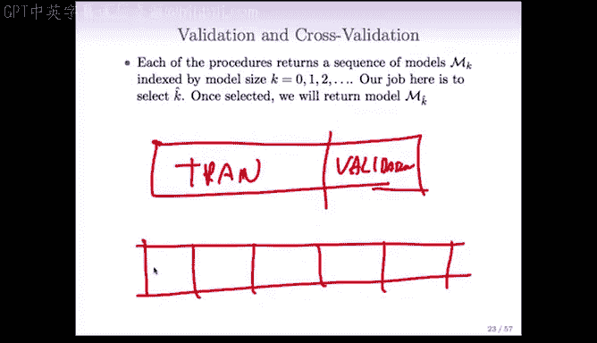

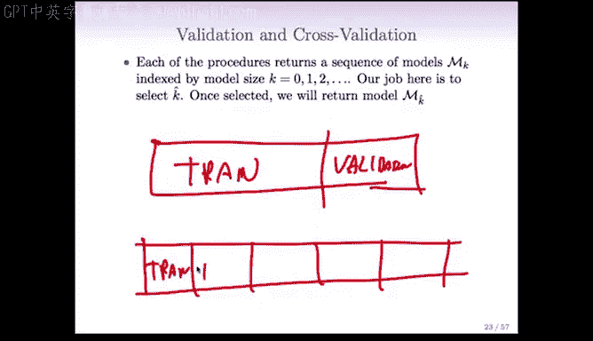

以下是验证集方法的基本步骤：
1.  将数据随机分割，例如，将四分之三的数据作为训练集，剩余四分之一作为验证集。
2.  在训练集上，使用不同模型（例如不同变量数量的子集回归模型）进行拟合。
3.  将训练好的模型应用于验证集，计算其预测误差。
4.  将验证集误差作为模型预测误差的估计，并选择使验证集误差最小的模型。

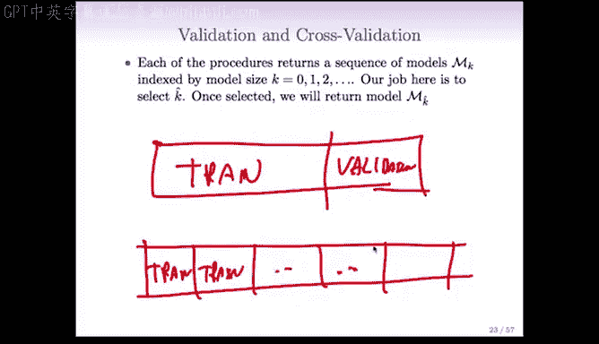

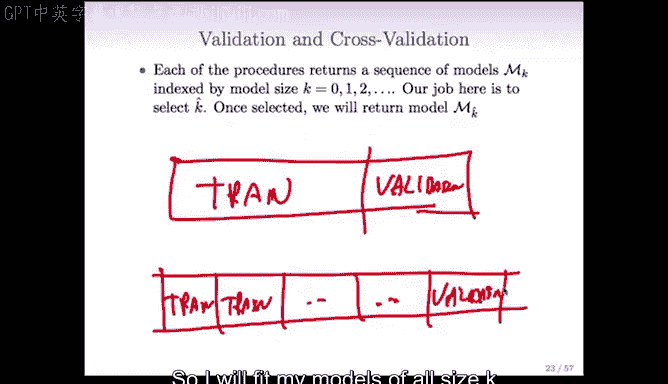

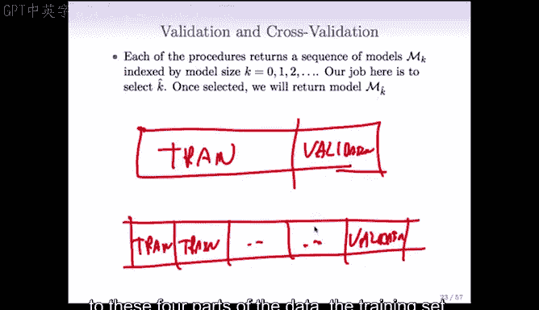

这种方法避免了直接对模型复杂度进行惩罚或调整，而是通过一个独立的数据集来直接评估模型性能。

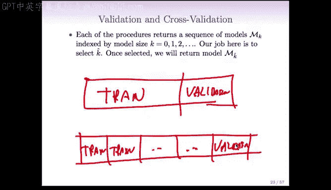

---

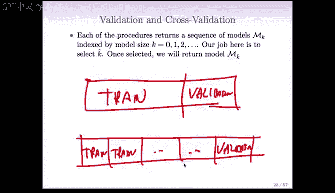

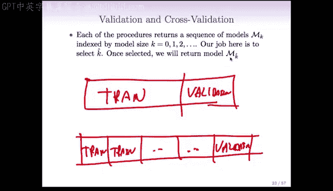

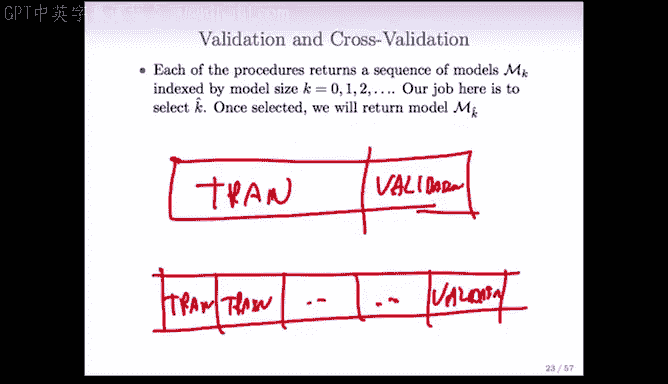

## 交叉验证方法

验证集方法的一个潜在问题是，它只使用了一部分数据来评估模型。为了更有效地利用数据，我们引入交叉验证方法。

交叉验证是验证集方法的一种扩展，它通过多次划分数据来获得更稳健的误差估计。最常用的是K折交叉验证。

以下是K折交叉验证（以5折为例）的基本步骤：
1.  将数据随机、大致平均地划分为5个部分。
2.  进行5轮迭代。在每一轮中，将其中4个部分作为训练集，剩余1个部分作为验证集。
3.  在每一轮的训练集上拟合不同复杂度的模型，并在该轮的验证集上计算误差。
4.  对每一模型复杂度K，将其在5轮验证集上的误差取平均，得到交叉验证误差估计。
5.  选择使交叉验证误差最小的模型复杂度K。

通过这种方式，我们几乎利用了所有数据来评估模型，得到的误差估计通常比单一验证集方法更稳定。

---

## 验证方法的优势

与基于调整RSS、AIC和BIC的方法相比，验证和交叉验证方法具有两个显著优势。

以下是这些优势的具体说明：
1.  **无需估计σ²**：在特征数量P大于样本数量N的高维数据场景下，准确估计误差方差σ²非常困难。验证方法完全避免了这个问题。
2.  **无需明确参数数量D**：对于像岭回归和Lasso这样的收缩方法，模型的有效参数数量D并不明确。验证方法同样绕过了定义D的难题。

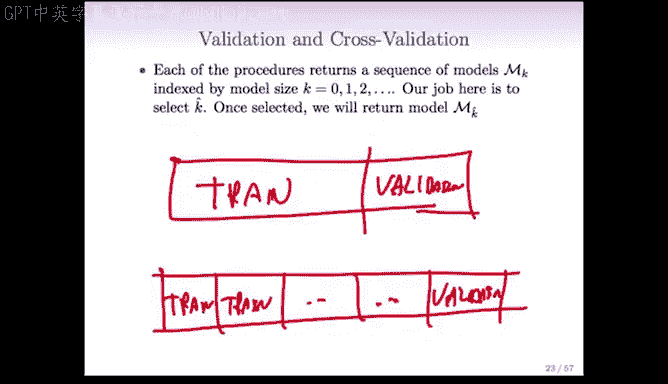

因此，验证和交叉验证方法在处理现代复杂数据时，提供了一种更通用、更稳健的模型选择途径。

---

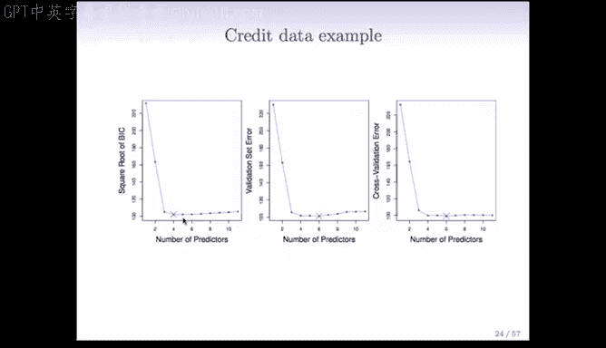

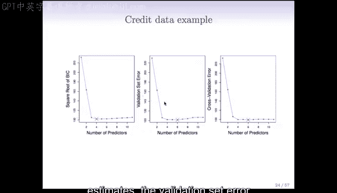

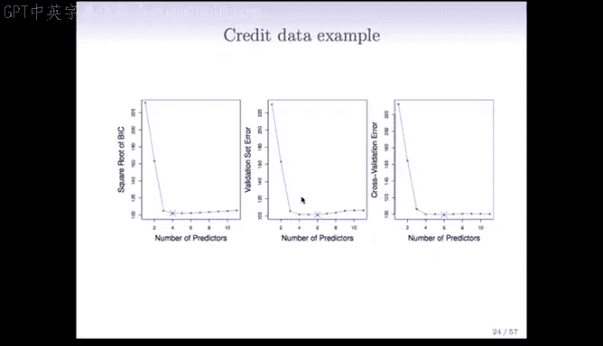

## 实例分析：信用卡数据

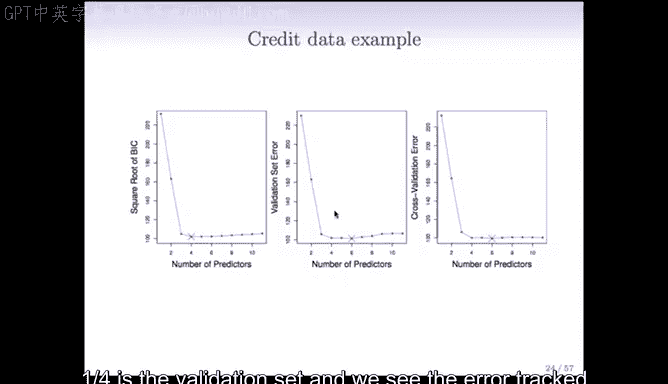

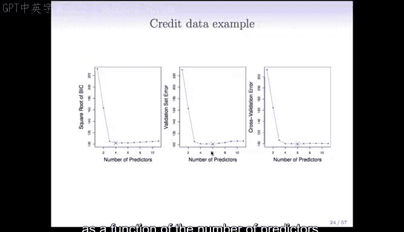

让我们在信用卡数据的例子中看看这些方法的表现。我们比较了BIC、验证集误差和交叉验证误差。

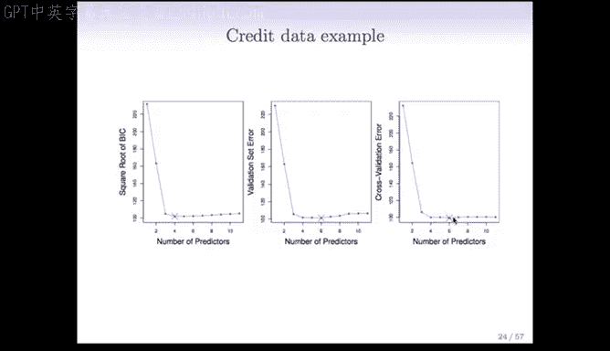

以下是结果分析：
*   **验证集方法**：将数据按3:1划分为训练集和验证集。结果显示，当预测变量数量约为6时，验证集误差达到最小。
*   **交叉验证方法**：使用10折交叉验证，得到的最小误差点同样在预测变量数量为6附近。
*   **BIC准则**：由于对模型复杂度施加了更强的惩罚，BIC倾向于选择更小的模型（本例中约为4个变量）。

值得注意的是，本例中误差曲线在3到11个预测变量之间都非常平坦，这意味着这些模型的预测性能差异不大。

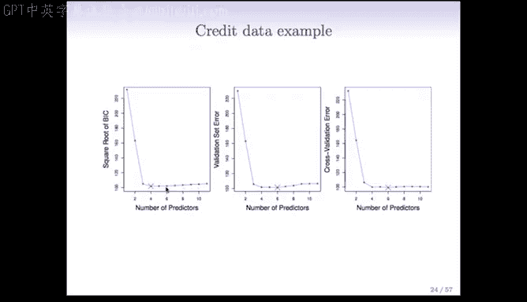

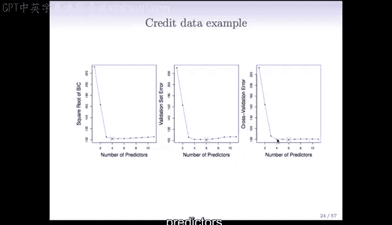

---

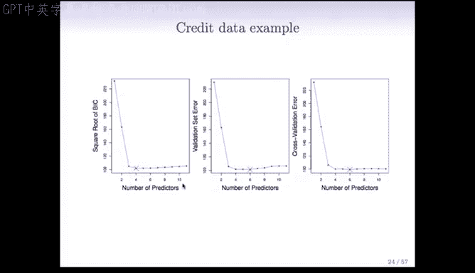

## 一倍标准误差规则

在交叉验证中，我们不仅关注误差的最小值，还应考虑误差估计的波动性。这就引出了一倍标准误差规则。

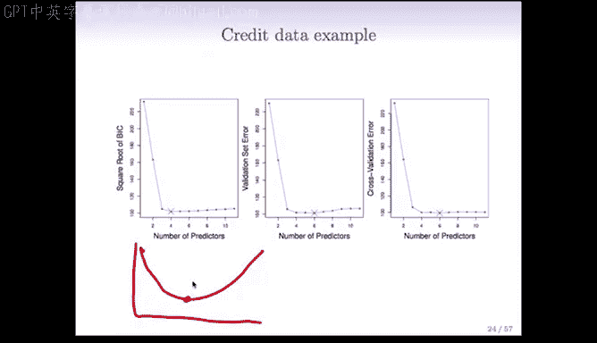

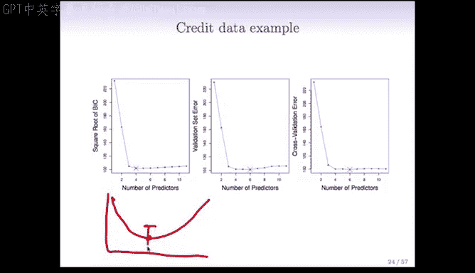

一倍标准误差规则的操作如下：
1.  计算得到最小交叉验证误差，以及该误差估计的标准误。
2.  从最小误差点向上画出一个标准误的区间。
3.  不选择绝对误差最小的模型，而是选择**所有误差落在此区间内，且复杂度最低（变量最少）** 的模型。

这样做的理由是：如果多个模型的误差估计在一个标准误的范围内，那么基于现有数据，我们无法有效区分它们的性能。此时，遵循“奥卡姆剃刀”原则，选择更简单、更易于解释的模型是更合理的选择。

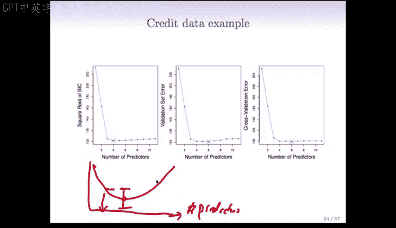

---

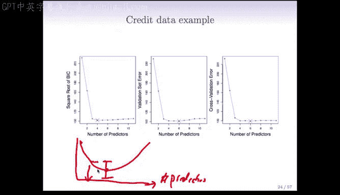

## 总结

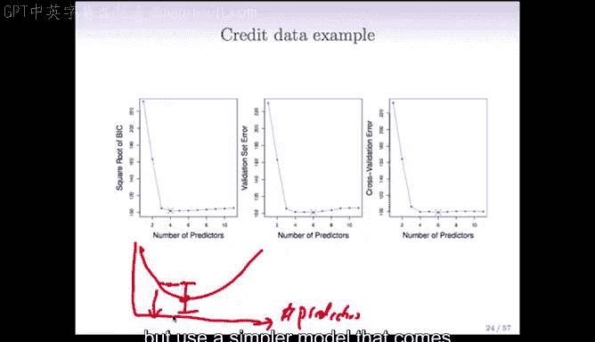

本节课中，我们一起学习了模型选择的两种实践性方法：验证集法和交叉验证法。我们了解了它们的操作流程，认识到它们通过直接评估模型在新数据上的表现来规避估计σ²和D的难题。最后，我们还介绍了一倍标准误差规则，它帮助我们在模型性能相近时，倾向于选择更简洁的模型。这些方法为我们在面对真实数据，特别是高维数据时，提供了强大而实用的工具。