# R 版 39：统计学习中的收缩方法与岭回归 📉

在本节课中，我们将学习两种重要的收缩方法：岭回归（Ridge Regression）和套索回归（Lasso）。这些方法通过向最小二乘准则添加惩罚项来缩小系数，尤其适用于变量数量庞大的数据集。我们将探讨它们的基本原理、应用场景以及如何通过交叉验证选择关键参数。

---

## 回顾最小二乘法

上一节我们介绍了前向选择、后向选择和全子集回归等模型选择技术。所有这些方法都基于最小二乘法进行拟合。现在，我们来看看一种不同的方法——收缩法。

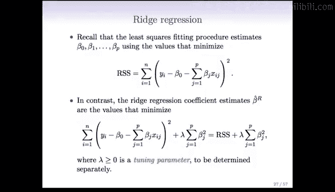

最小二乘法的训练误差，即残差平方和（RSS），定义如下：

**公式：**
`RSS = Σ(y_i - ŷ_i)²`

在进行最小二乘估计时，我们寻找能使上述RSS最小的系数。

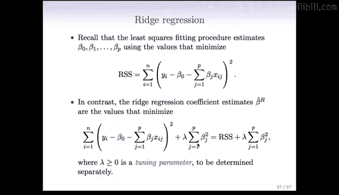

---

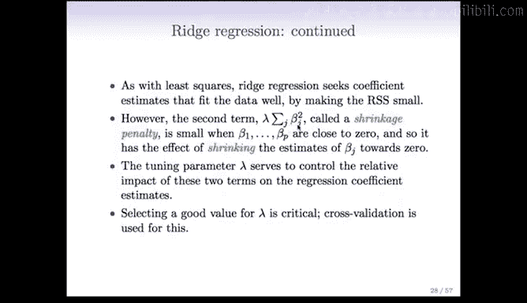

## 岭回归简介

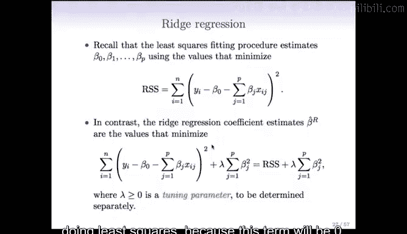

岭回归对最小二乘准则进行了修改，增加了一个惩罚项。其目标是使以下组合量最小化：

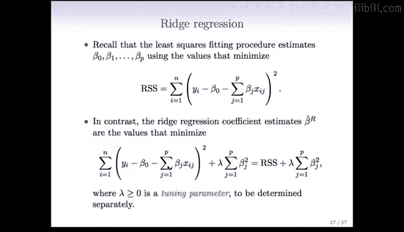

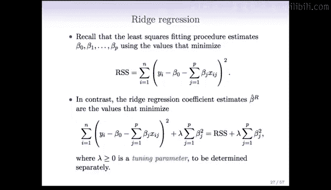

**公式：**
`RSS + λ * Σβ_j²`

其中：
*   `RSS` 是残差平方和，衡量模型拟合优度。
*   `λ` 是一个需要调整的参数（调谐参数）。
*   `Σβ_j²` 是所有回归系数平方和。

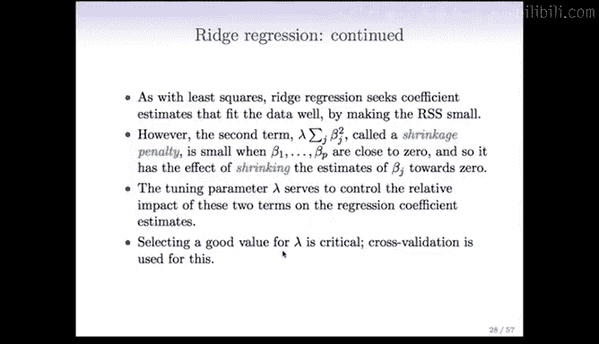

这个惩罚项被称为**收缩惩罚**，因为它会促使系数向零收缩。收缩的程度由参数 `λ` 控制。

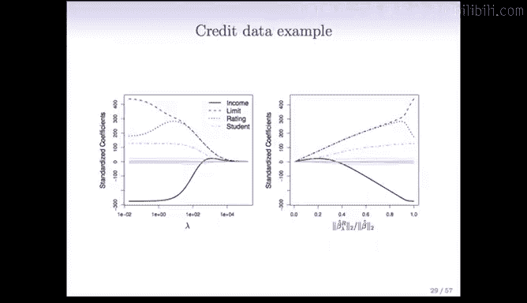

*   当 `λ = 0` 时，惩罚项消失，岭回归退化为普通最小二乘回归。
*   当 `λ` 增大时，对非零系数的惩罚加重，系数会被更大幅度地压缩向零。
*   当 `λ` 极大时，所有系数都将被压缩至接近零。

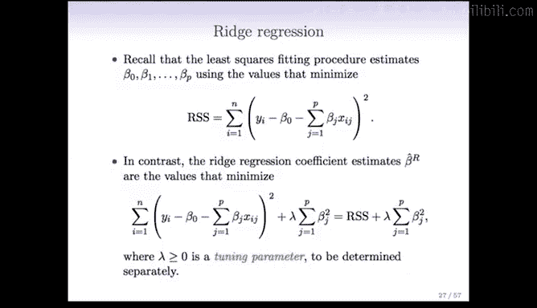

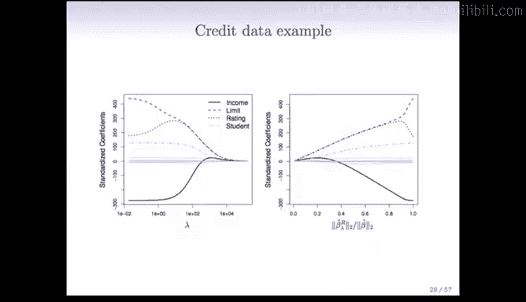

简而言之，参数 `λ` 在模型拟合优度与系数大小之间进行权衡。选择合适的 `λ` 值至关重要，我们通常使用交叉验证来完成这一任务。

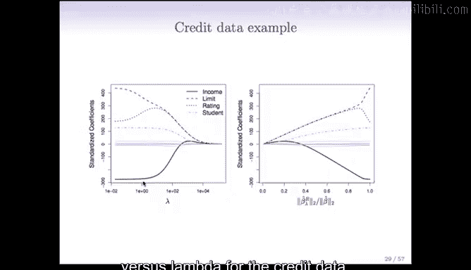

---

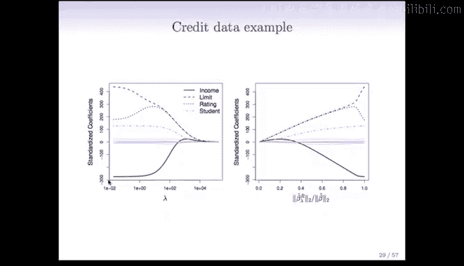

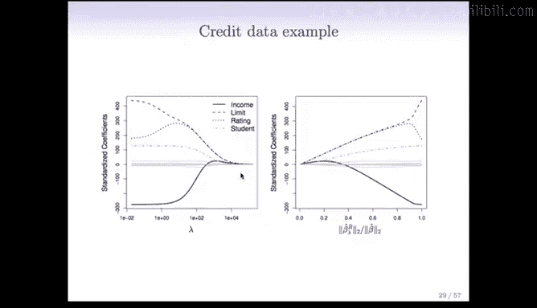

## 岭回归示例：信用卡数据

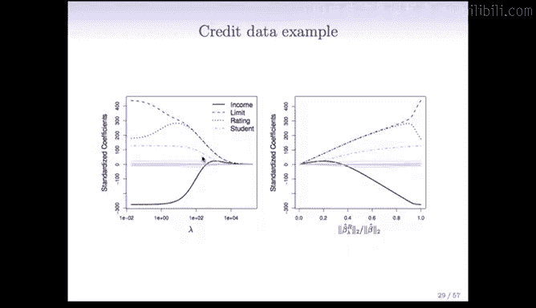

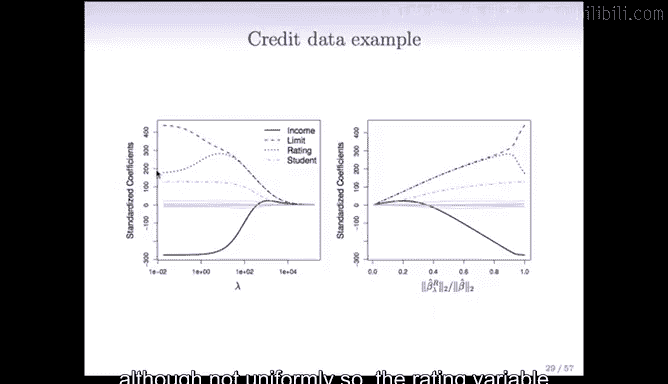

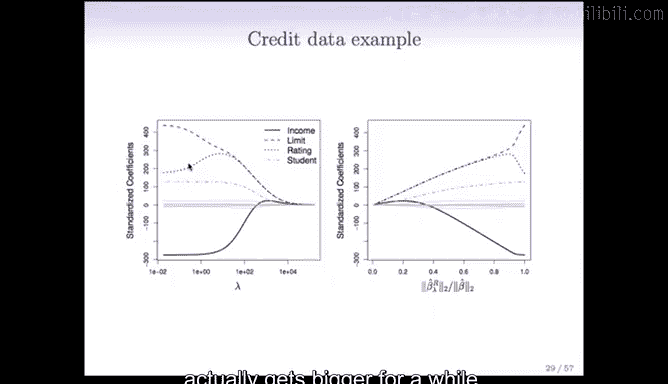

以下是岭回归应用于信用卡数据集时，标准化系数随 `λ` 值变化的路径图：

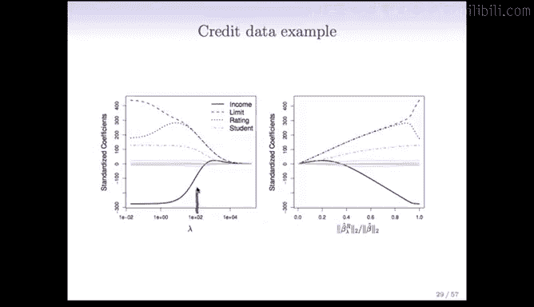

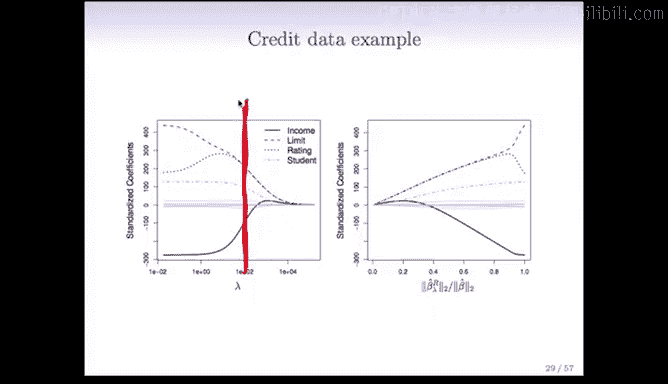

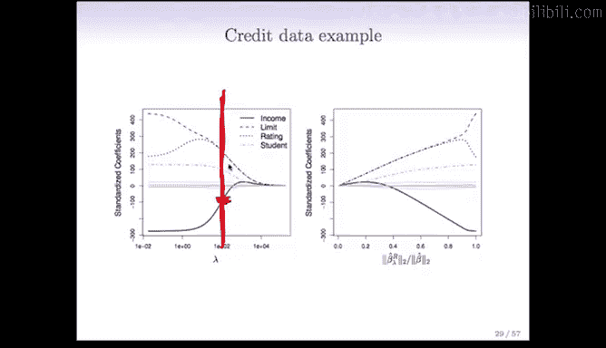

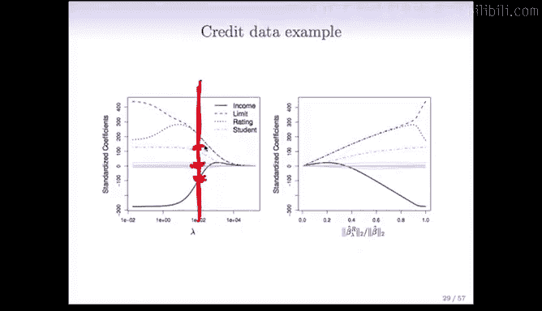

*   图左侧，`λ` 接近0，系数几乎不受约束，结果接近最小二乘估计。
*   随着 `λ` 增大（向右移动），惩罚加重，所有系数被逐渐压缩向零。
*   图右侧，`λ` 非常大（例如超过10,000），所有系数基本为零。

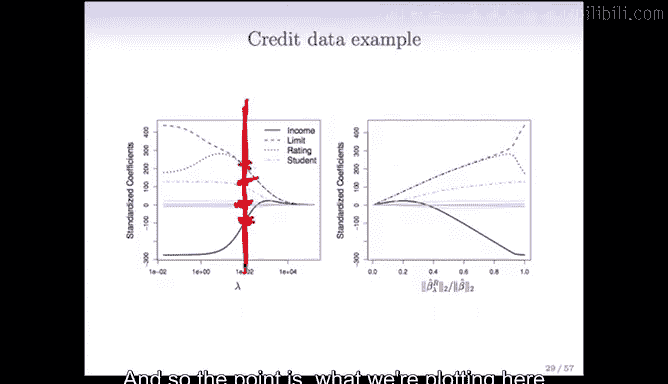

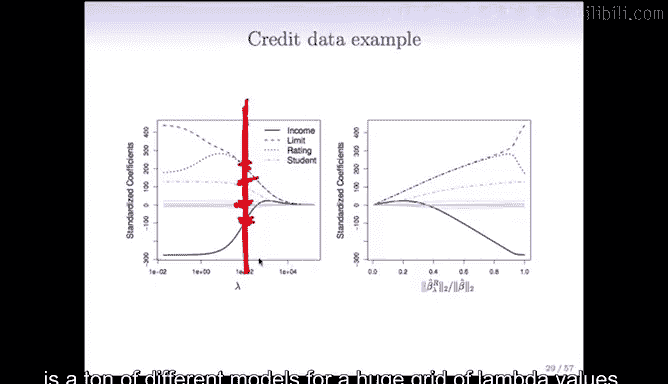

需要理解的是，这张图展示了在不同 `λ` 值下的一系列模型。我们需要选择一个 `λ` 值，然后查看该垂直切面对应的系数。例如，若选择 `λ ≈ 100`，则似乎只有少数几个系数显著非零。

有时，系数路径也会以系数的 **L2范数** 为横轴来展示。L2范数定义如下：

**公式：**
`||β||₂ = √(Σβ_j²)`

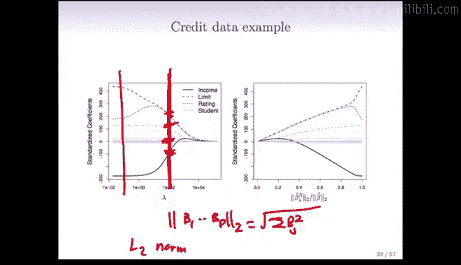

在这种图形中：
*   最右侧（L2范数最大）对应 `λ = 0`，即最小二乘解。
*   最左侧（L2范数接近0）对应 `λ` 极大，系数收缩至零。
*   两种图示本质相同，只是横坐标的参量化方式不同。

---

## 预测变量的标准化

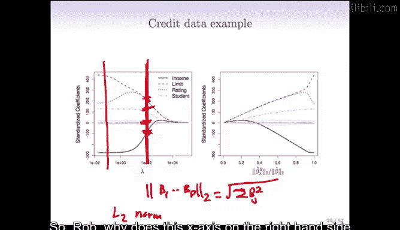

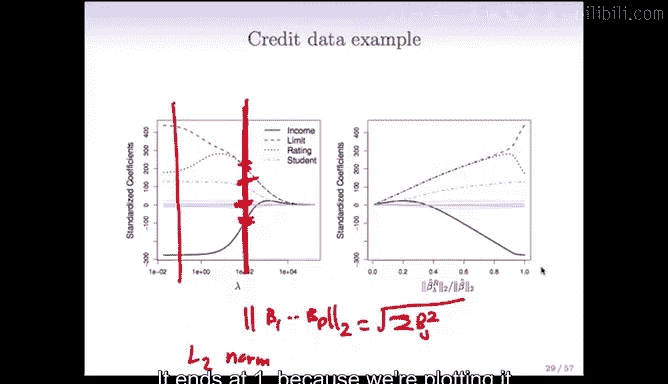

对于岭回归（以及其他惩罚方法），一个重要步骤是**在应用前标准化预测变量**。

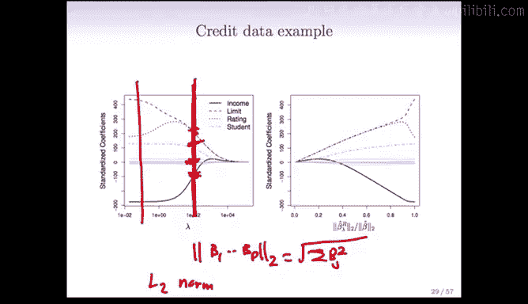

*   在普通最小二乘法中，变量的缩放（例如，用英尺还是英寸度量长度）不影响结果，因为系数可以相应调整以抵消单位变化。
*   但在岭回归中，所有系数被一起放入惩罚项 `Σβ_j²` 中。如果一个变量的单位改变，其系数尺度也会改变，并会与其他特征的系数在惩罚项中“竞争”。因此，特征的尺度会影响结果。

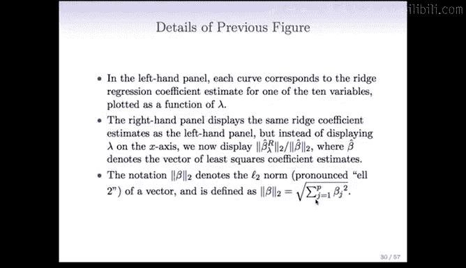

标准化确保所有特征具有可比性。通常的做法是，将每个预测变量除以其在所有观测中的标准差，使其标准差变为1。

---

## 岭回归 vs. 最小二乘法：模拟示例

考虑一个模拟示例：50个观测，45个预测变量，且所有预测变量都有非零的真实系数。

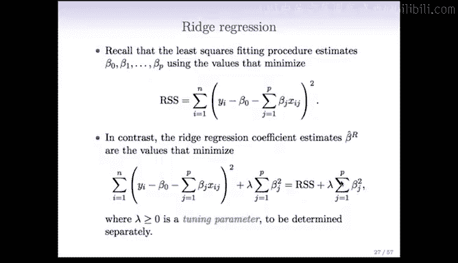

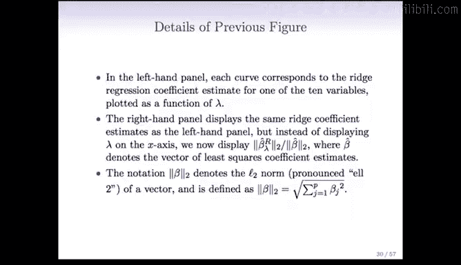

下图展示了岭回归的偏差（黑色）、方差（绿色）和测试误差（紫色）随 `λ` 变化的情况：

*   最左侧（`λ` 接近0）对应最小二乘法。
*   随着 `λ` 增大，偏差基本保持不变，但**方差显著下降**。这是因为岭回归通过将系数收缩向零，控制了系数的大小，从而降低了方差。
*   均方误差（MSE，偏差与方差之和）呈现U形曲线。存在一个“最佳点”（图中以“X”标记），此处的测试误差最小，优于最小二乘估计。

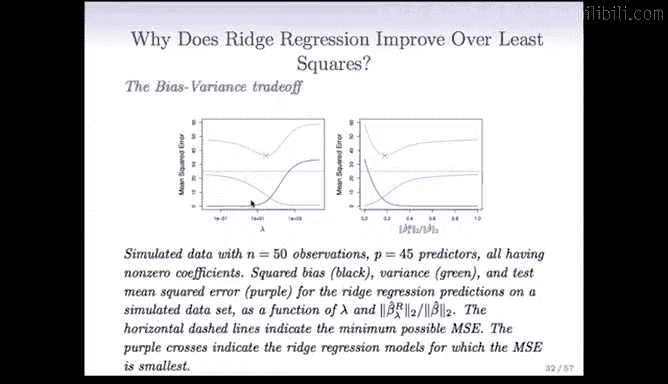

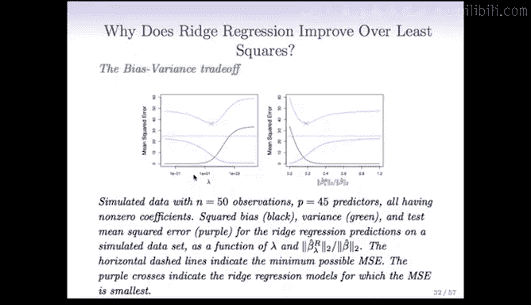

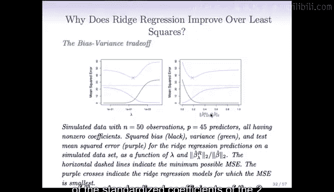

这种U形曲线在选择模型复杂度时经常出现，我们的目标就是通过交叉验证找到这个最佳平衡点。

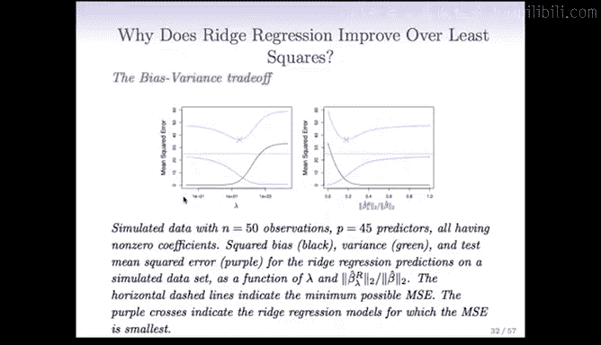

---

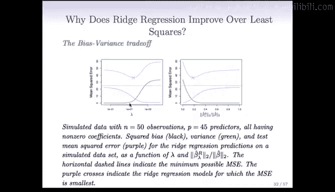

## 岭回归的局限性

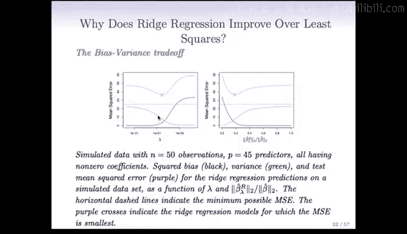

观察岭回归的系数路径图，我们会发现一个特点：系数会无限接近零，但**除了极特殊情况，永远不会精确等于零**。

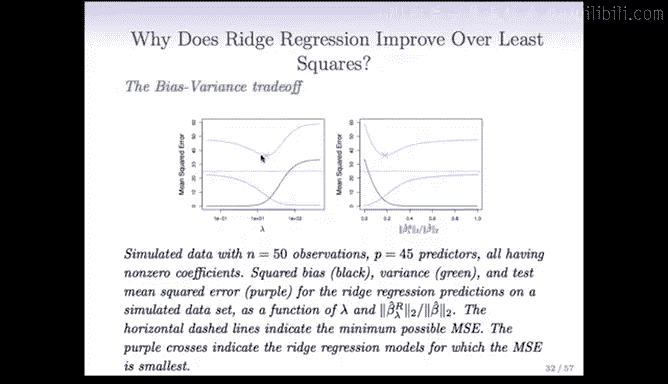

岭回归以一种连续的方式将系数收缩向零，但**并不进行真正的变量选择**（即不将某些系数精确设为0以剔除变量）。在某些情况下，如果许多系数都非常小，我们可能更希望它们直接为零，这样模型会更简洁、易于解释。

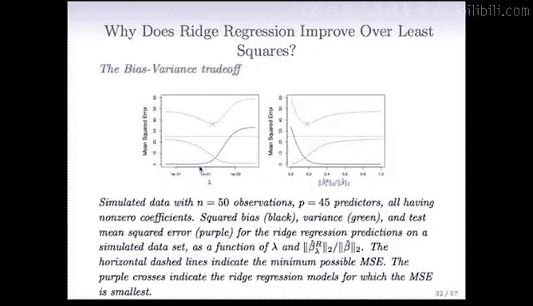

这便引出了我们下一个要介绍的方法——**套索回归（Lasso）**，它能够克服这一局限。

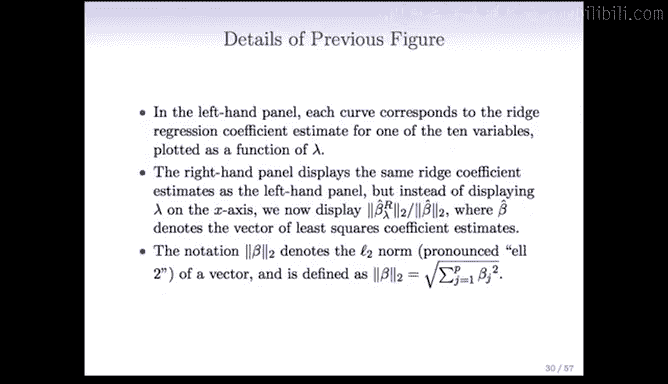

---

## 本节总结

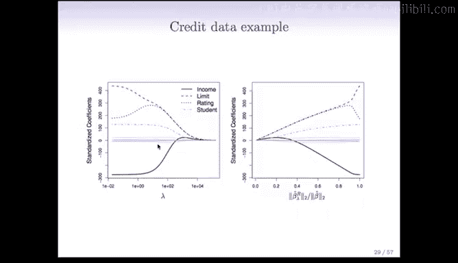

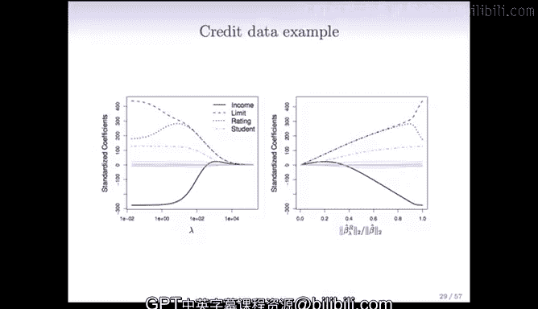

本节课我们一起学习了收缩方法，重点介绍了岭回归。
*   岭回归通过在最小二乘损失函数中添加系数平方和作为惩罚项（L2惩罚），使系数向零收缩。
*   参数 `λ` 控制收缩的强度，需通过交叉验证选择。
*   应用岭回归前，对预测变量进行标准化至关重要。
*   与最小二乘相比，岭回归通过牺牲少量偏差来大幅降低方差，从而可能获得更低的预测误差。
*   岭回归的局限性在于其收缩是连续的，不能进行变量选择。这为下一节要介绍的套索回归（Lasso）做好了铺垫。