# R 版 40：Lasso回归 📏

在本节课中，我们将学习一种名为**Lasso回归**的变量选择与系数收缩技术。我们将了解它与岭回归的区别，理解其产生稀疏模型（即系数精确为零）的几何原理，并探讨其在不同场景下的应用。

上一节我们介绍了岭回归，它通过L2惩罚项对系数进行收缩，但不会将任何系数精确地设为零。本节中我们来看看Lasso回归，它通过一个微小的改动——使用L1惩罚项——实现了变量选择的功能。

## Lasso回归的定义

Lasso回归的优化目标与岭回归非常相似，但惩罚项从系数的平方和改为了系数的绝对值之和。

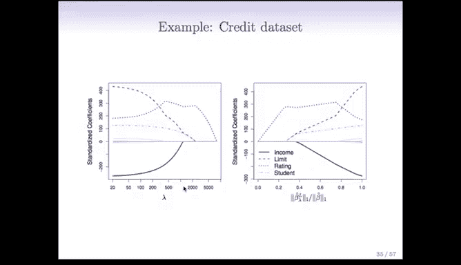

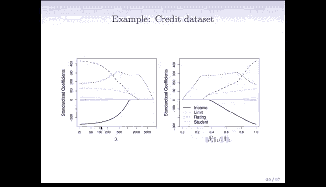

其目标函数公式如下：
```
最小化：RSS + λ * Σ|β_j|
```
其中：
*   `RSS` 是残差平方和。
*   `λ` 是调节参数，控制惩罚的强度。
*   `Σ|β_j|` 是所有回归系数绝对值的和，这被称为 **L1惩罚项** 或 **L1范数**。

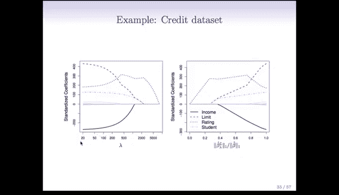

这个微小的改变带来了一个重要的特性：当λ足够大时，Lasso回归能够将某些不重要的变量的系数**精确地收缩至零**。这意味着它不仅进行系数收缩，还同时完成了**变量选择**，得到的模型只包含一个变量子集，我们称这种模型为**稀疏模型**。

## Lasso的几何解释

为了理解为什么L1惩罚能产生零系数，我们可以从约束优化的角度来审视Lasso问题。

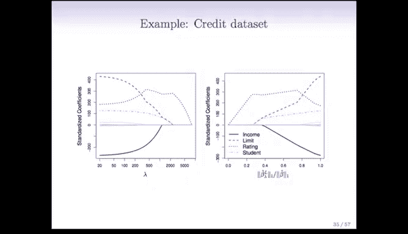


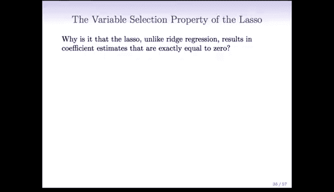

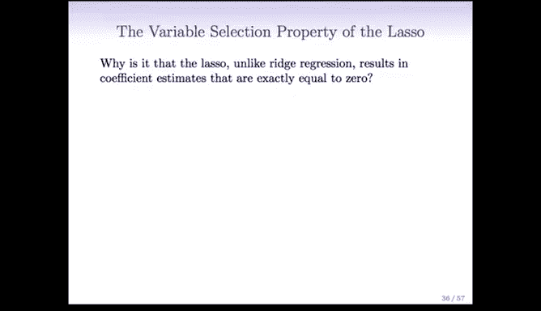

Lasso问题等价于以下约束优化问题：
```
最小化：RSS
约束条件：Σ|β_j| ≤ S
```
这里的 `S` 是一个“预算”，它限制了系数绝对值的总和。当预算 `S` 很小时，系数必须很小；如果 `S` 为零，所有系数必须为零；如果 `S` 足够大，则等价于普通最小二乘法。

以下是Lasso与岭回归几何直观对比的关键点：

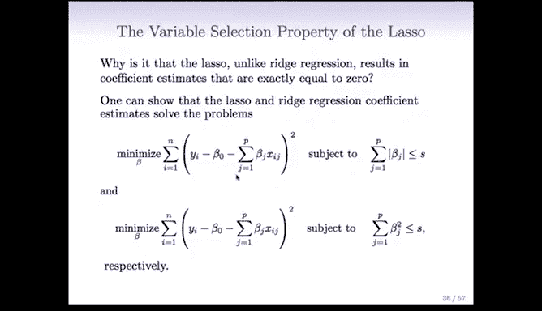


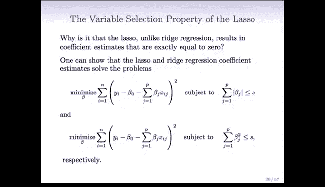

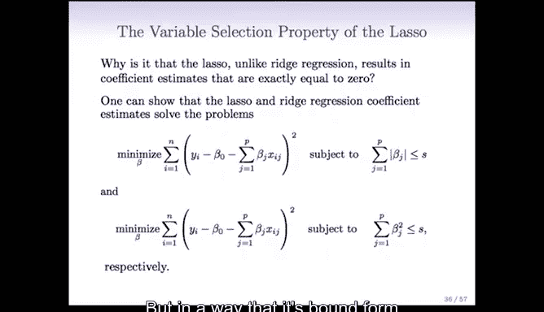

*   **岭回归 (L2约束)**：约束区域是一个**圆**（或高维球体）。最小化RSS时，等高线（RSS的等值面）首次碰到这个圆形的点就是解。这个接触点几乎不可能正好落在坐标轴上，因此所有系数通常都是非零的。
*   **Lasso回归 (L1约束)**：约束区域是一个**菱形**（或高维菱形多面体）。菱形有尖的**角和边**。当等高线首次碰到这个菱形区域时，接触点有很大概率正好落在角或边上。在角上，意味着某个坐标轴上的值为零，即对应的系数 `β_j = 0`。


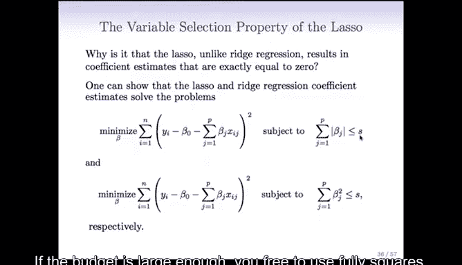

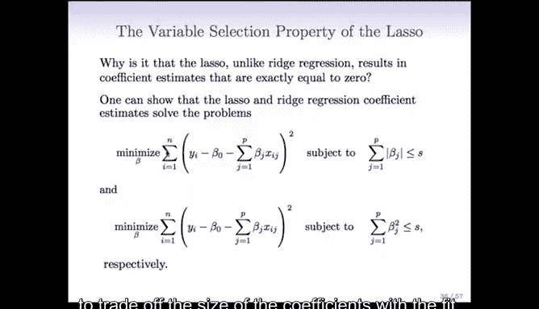

正是L1约束区域的这些“尖角”，使得Lasso的解能够产生精确的零系数，从而实现变量选择。

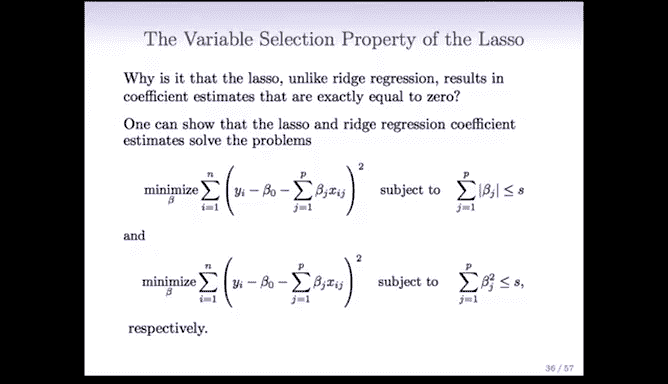

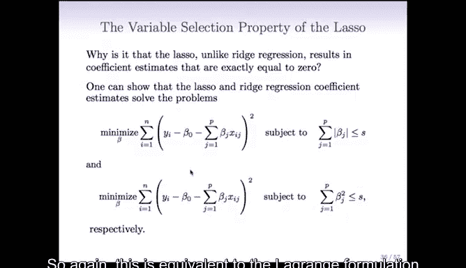


## Lasso与岭回归的对比


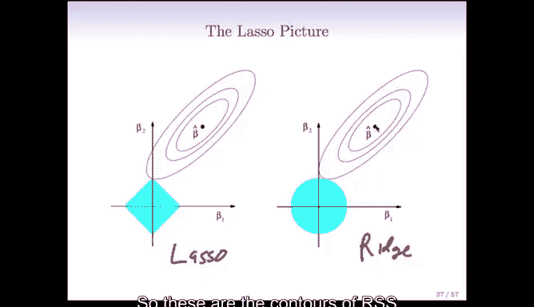

在实际应用中，Lasso和岭回归各有优劣，选择取决于数据的真实结构。

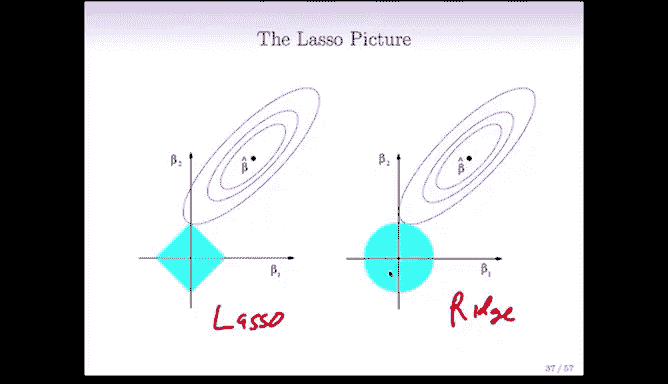

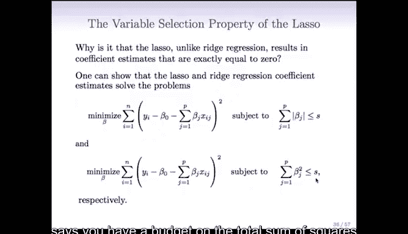


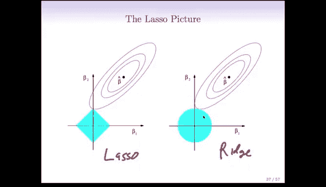


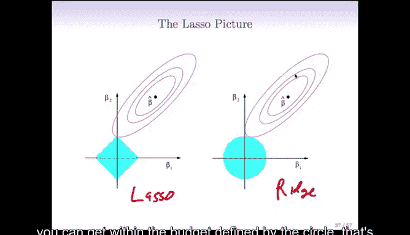


以下是两种方法的性能对比场景：


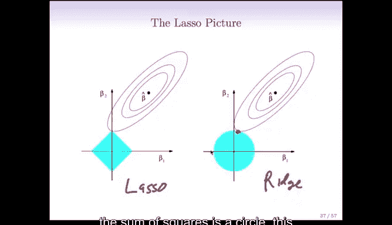


1.  **真实模型稠密**：如果真实情况中，大部分预测变量都与响应变量相关（即很多系数非零），岭回归的表现通常会略好于Lasso。
2.  **真实模型稀疏**：如果真实情况中，只有少数预测变量是重要的（即只有少数系数非零），Lasso的表现通常会明显优于岭回归，因为它能正确识别并剔除无关变量。

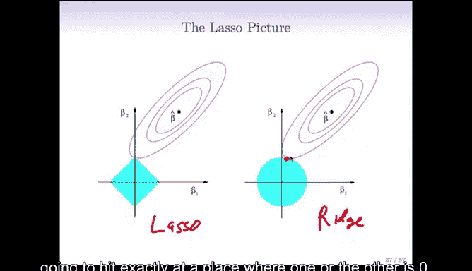

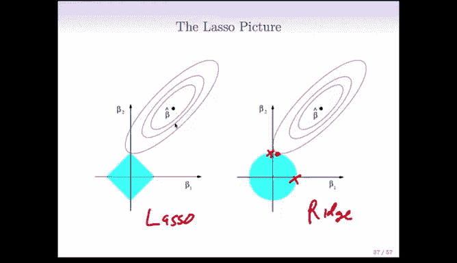


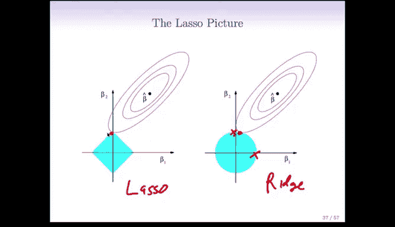

然而，在分析数据之前，我们通常并不知道真实模型是稠密还是稀疏的。因此，标准的做法是：


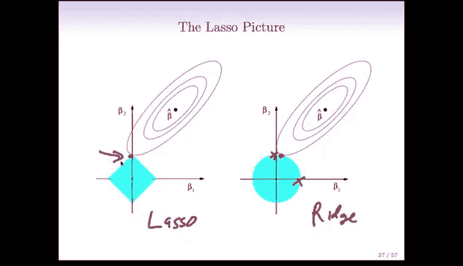

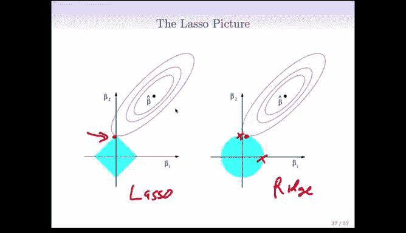


*   同时应用两种方法。
*   通过**交叉验证**为每种方法选择最优的调节参数 `λ`。
*   比较两种方法在交叉验证下的误差，选择表现更好的一个。

## Lasso的实际应用与计算

Lasso回归在诸多领域（如遗传学、医学）非常有用。例如，医生可能从3万个基因表达数据开始，希望找到一个诊断疾病的模型。一个包含所有3万个基因的测试成本过高且不实用。Lasso可以帮助找到一个仅包含几十个关键基因的高精度、可解释且成本低廉的模型。

在计算方面，Lasso优化问题是一个凸优化问题。随着近十年凸优化算法和计算能力的进步，现在即使变量数 `p` 非常大（如上万），也能在普通电脑上快速求解。在R语言中，我们可以使用 `glmnet` 包高效地拟合Lasso模型。

---

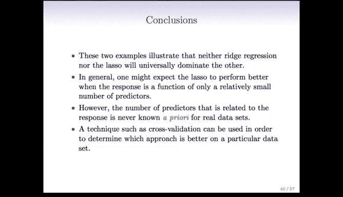

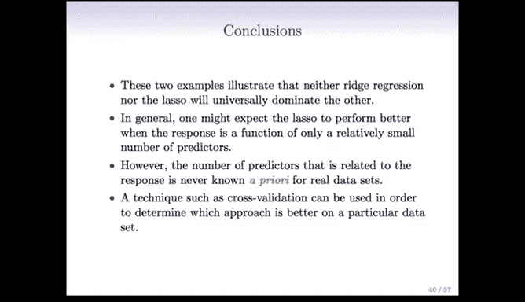

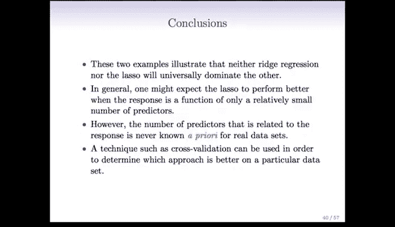

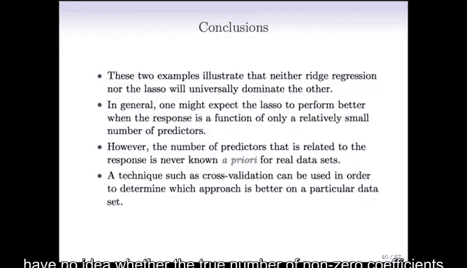

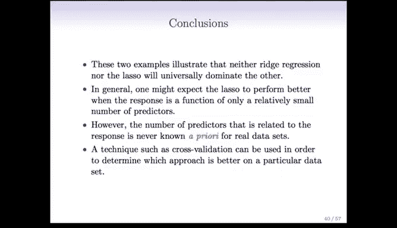


本节课中我们一起学习了Lasso回归。我们了解了其通过L1惩罚项实现系数收缩和变量选择的机制，从几何视角理解了其产生稀疏解的原因，并对比了其与岭回归在不同数据场景下的性能。最后，我们认识到在实际数据分析中，可以同时尝试两种方法并通过交叉验证来选择最佳模型。