# R 版 41：调优参数选择 🎯

在本节课中，我们将学习如何为岭回归和Lasso回归选择合适的调优参数λ。我们将重点讨论为什么交叉验证是完成此任务的关键技术，并通过示例展示其应用过程。

## 概述

上一节我们介绍了岭回归和Lasso回归的基本原理。本节中我们来看看如何为这两种方法选择关键的调优参数λ。λ的选择对模型性能有决定性影响，而交叉验证是解决此问题的有效工具。

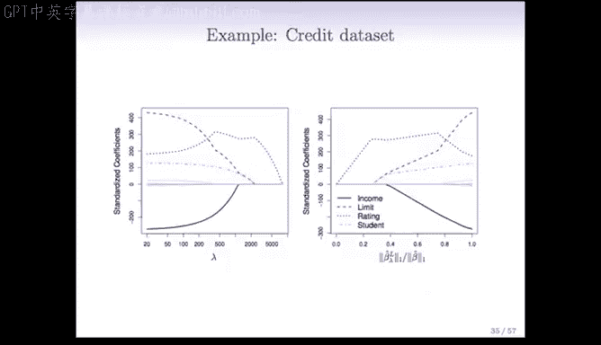

## 调优参数λ的重要性

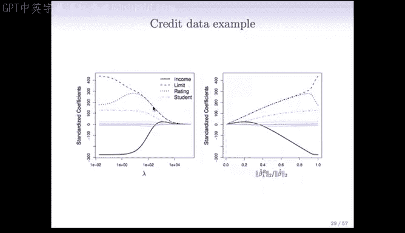

λ的值强烈地决定了模型解的性质，其影响范围很广。

当λ=0时，我们得到普通最小二乘解，此时没有正则化。
当λ→∞时，我们得到所有系数均为零的解。
因此，选择合适的λ极其重要。

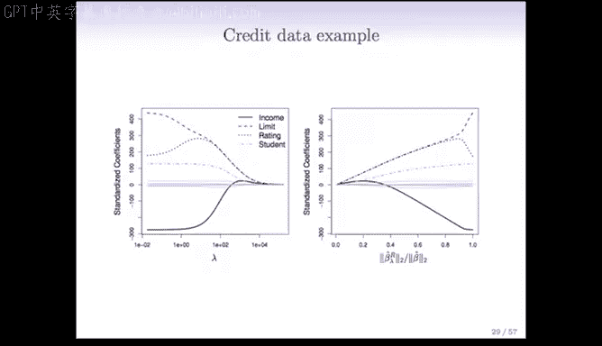

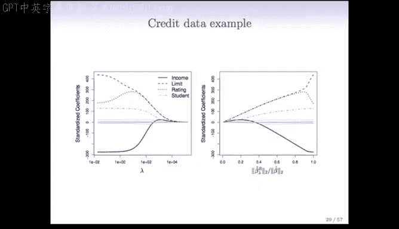

以下是选择λ的核心原因：
*   λ控制正则化的强度。
*   λ=0对应无约束模型。
*   λ→∞对应最简模型。

## 为何使用交叉验证

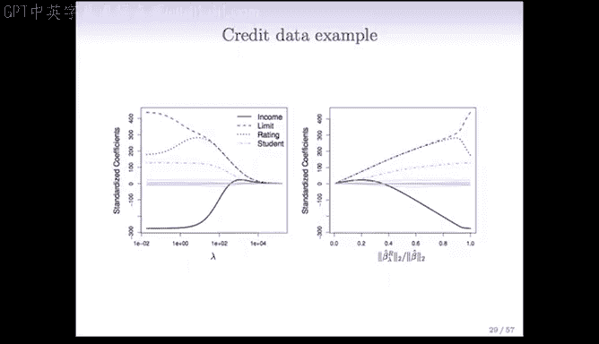

对于岭回归和Lasso，我们无法使用Cp、AIC或BIC等方法来选择λ，因为这些方法都需要已知模型的参数数量D。而在正则化模型中，D的含义变得模糊不清。

考虑一个例子：假设我们对包含45个变量的数据使用岭回归，并设定λ=100。此时，所有45个系数的估计值都不为零。如果按非零系数计数，参数数量D似乎是45。但由于系数被收缩，模型实际的“自由度”或有效参数数量并没有那么多。这表明，在正则化模型中，“参数数量”的概念变得复杂且难以确定。

因此，选择λ需要一个不依赖于明确D值的方法，而交叉验证完美地符合这一要求。

## 交叉验证的实施步骤

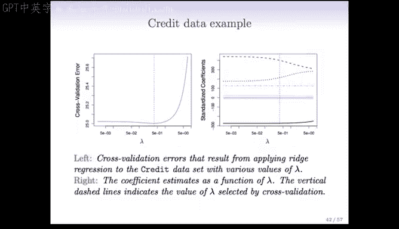

交叉验证的实施概念与我们之前应用于子集选择等其他方法时完全相同。

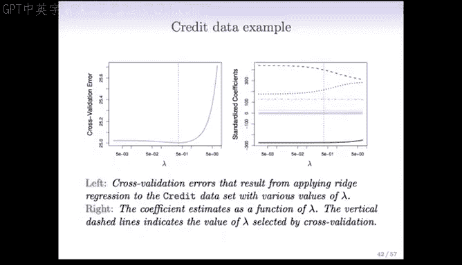

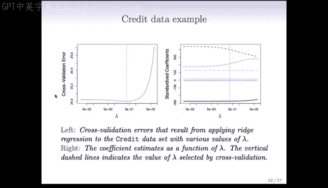

以下是实施K折交叉验证的步骤：
1.  将数据随机分为K个部分（例如K=10）。
2.  对于第k部分（作为验证集），在其余K-1部分上使用一系列不同的λ值拟合模型（岭回归或Lasso）。
3.  计算模型在第k部分（验证集）上的误差。
4.  对每一部分重复步骤2和3，使每个部分都轮流充当一次验证集。
5.  将所有K次验证误差相加，得到作为λ函数的交叉验证误差曲线。

## 岭回归示例分析

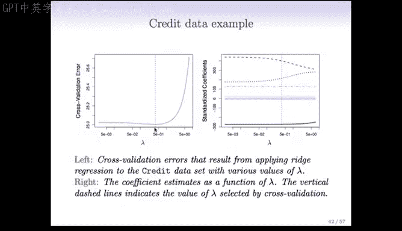

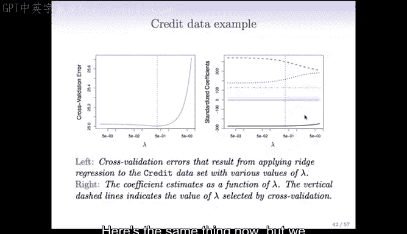

现在，我们通过一个岭回归的例子来看看交叉验证的结果。

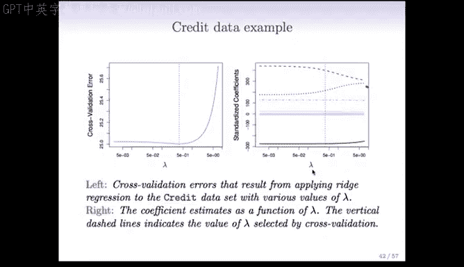

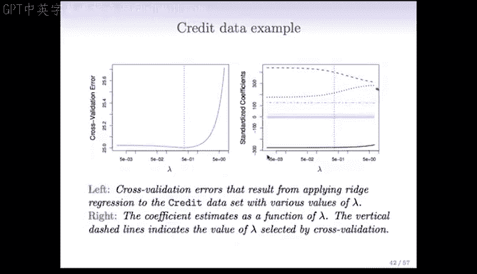

上图展示了交叉验证误差随λ变化的情况。λ值小（左侧）对应近似最小二乘模型，λ值大（右侧）对应系数趋近于零的模型。误差曲线的最小值出现在λ≈0.05附近。

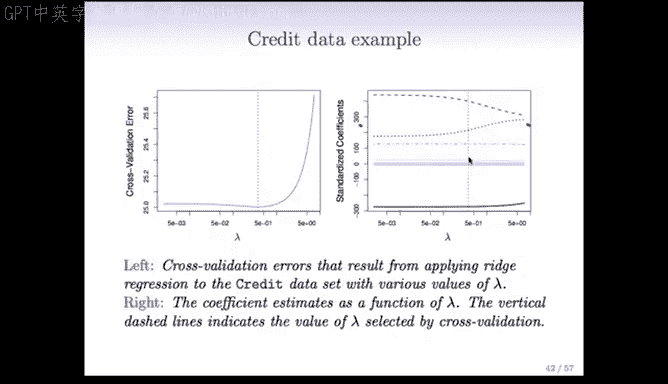

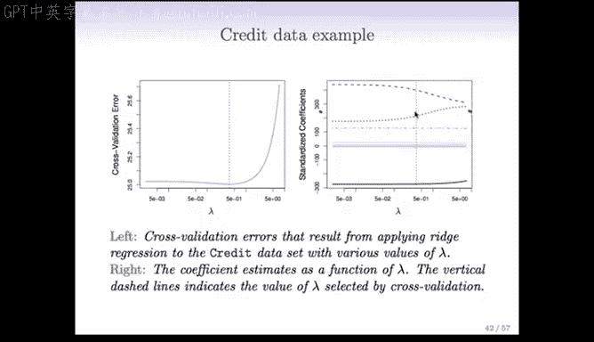

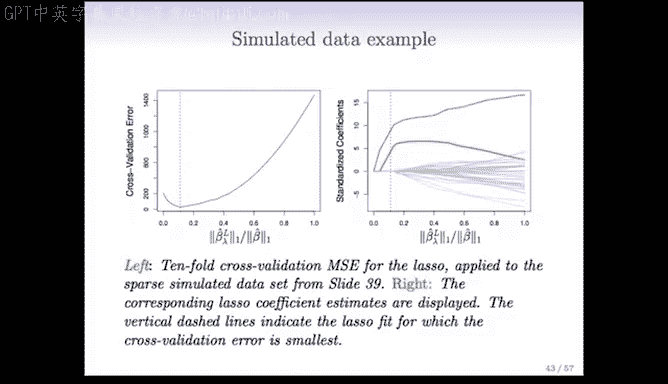

此图展示了各个预测变量的系数如何随λ变化。左侧是最小二乘解，随着λ增大（向右移动），系数不断收缩。在交叉验证选出的最优λ值处（虚线位置），部分系数已基本收缩至零。

## Lasso回归示例分析

接下来，我们分析一个Lasso回归的模拟数据示例。该数据集有n=50个观测，真实模型中仅有2-3个非零系数。

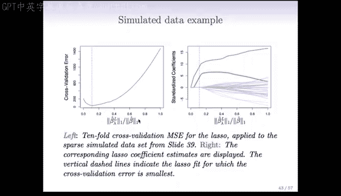

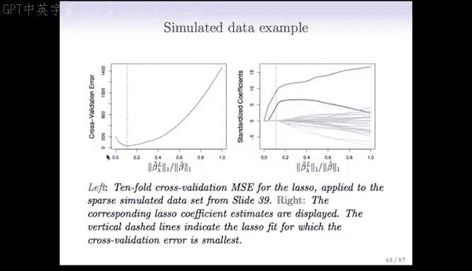

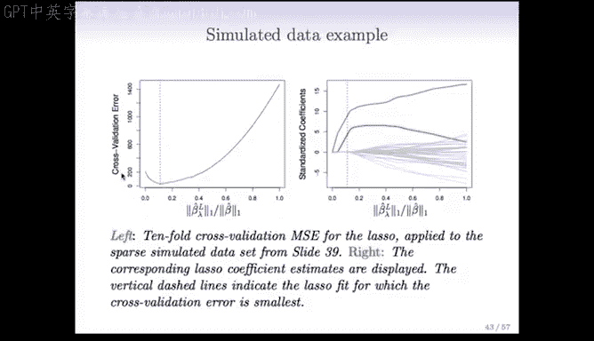

此图绘制了交叉验证误差与“Lasso解的L1范数 / 最小二乘解的L1范数”的关系。这种标准化使横轴范围在0到1之间：最小二乘解对应1，零解对应0，中间是不同程度的Lasso解。误差曲线呈U型，最小值大约在0.1处，这表明选择了较强的收缩。

在这个模拟例子中，Lasso配合交叉验证选出的λ，成功地只保留了两个非零系数（图中红色和绿色曲线），而将其余系数精确地设为0，这与真实模型结构完全一致，做出了正确的选择。

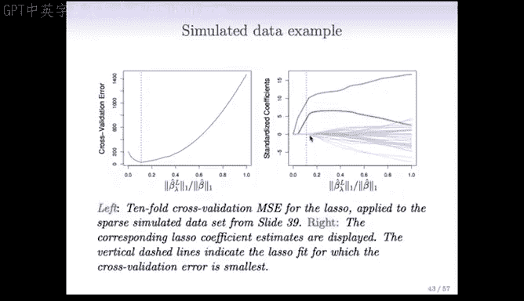

## 总结

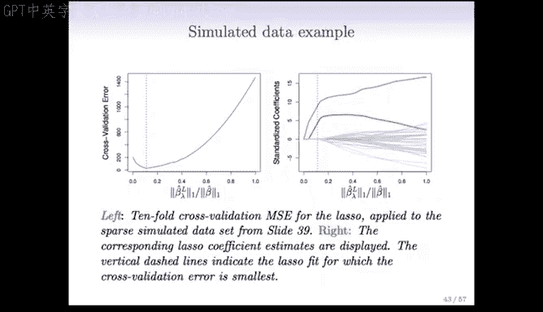

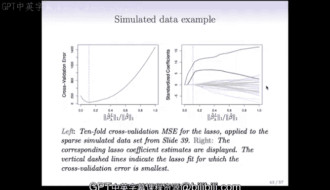

本节课中我们一起学习了为岭回归和Lasso回归选择调优参数λ的方法。我们认识到λ选择至关重要，但由于正则化模型的有效参数数量D难以界定，因此无法使用依赖D的准则（如Cp、AIC、BIC）。交叉验证是解决此问题的理想技术，它通过将数据分割、轮流验证来评估不同λ值下的模型性能，并选择使交叉验证误差最小的λ。通过示例，我们直观地看到了交叉验证曲线如何帮助我们找到最优的λ，从而得到泛化能力更好的模型。