# R 版 42：降维方法 📉

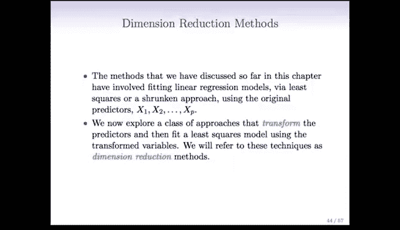

在本节课中，我们将要学习降维方法。降维是统计学习中一类重要的技术，它通过将原始预测变量转换为新的、数量更少的线性组合变量，来构建模型。这种方法旨在降低问题的维度，同时可能提升模型的预测性能。

---

## 从子集选择到降维

上一节我们讨论了子集选择方法、岭回归和套索回归。本节中，我们来看看最后一类方法——降维。

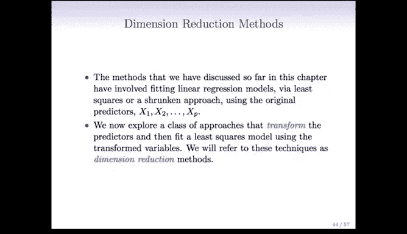

在子集选择方法中，我们直接选取预测变量的一个子集，并使用最小二乘法拟合模型。在岭回归和套索回归中，我们使用了所有预测变量，但采用了收缩方法而非普通最小二乘法。

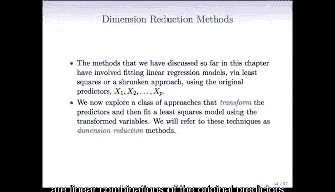

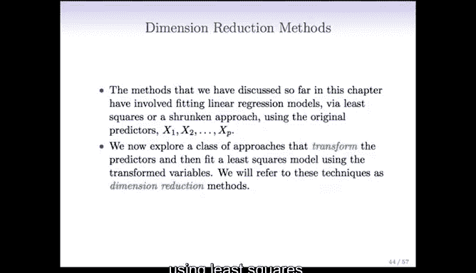

降维方法则有所不同。我们仍然使用最小二乘法，但并非直接对原始预测变量 **X₁** 到 **Xₚ** 进行拟合。相反，我们会创建一组新的预测变量，这些新变量是原始预测变量的线性组合。然后，我们使用这些新变量，通过最小二乘法来拟合线性模型。

这种方法被称为降维，是因为我们将使用 **P** 个原始预测变量，通过 **M** 个新预测变量来拟合模型，其中 **M < P**。这样，我们就将问题从 **P** 维降到了 **M** 维。

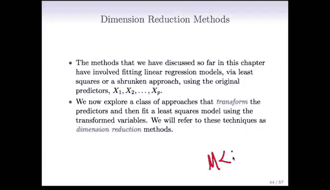

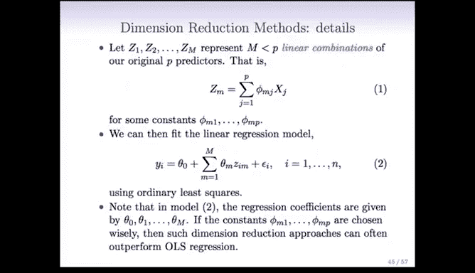

---

## 降维方法的核心思想

具体来说，我们将定义 **M** 个线性组合 **Z₁** 到 **Zₘ**，其中 **M < P**。每个 **Zₘ** 都是原始 **P** 个预测变量的线性组合。

例如，**Zₘ** 可以表示为：
**Zₘ = Σⱼ₌₁ᴾ (φₘⱼ * Xⱼ)**
其中，**φₘⱼ** 是常数系数。稍后我们将讨论如何确定这些系数。

一旦我们得到新的预测变量 **Z₁** 到 **Zₘ**，我们就可以拟合一个线性回归模型。我们使用最小二乘法，但预测变量是 **Z** 而非 **X**。在这个新模型中，系数是 **θ₁** 到 **θₘ**。

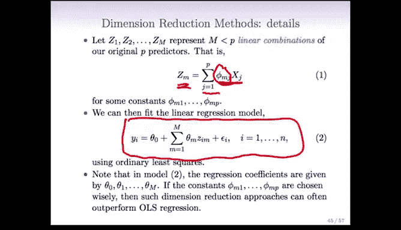

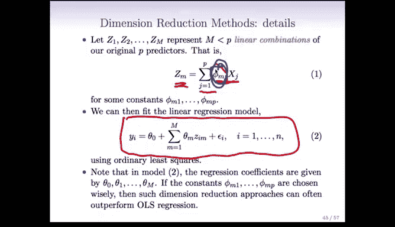

关键在于，如果我们能非常巧妙地选择这些线性组合（特别是 **φₘⱼ** 的值），那么最终模型的性能可能优于直接使用原始预测变量进行最小二乘拟合得到的结果。

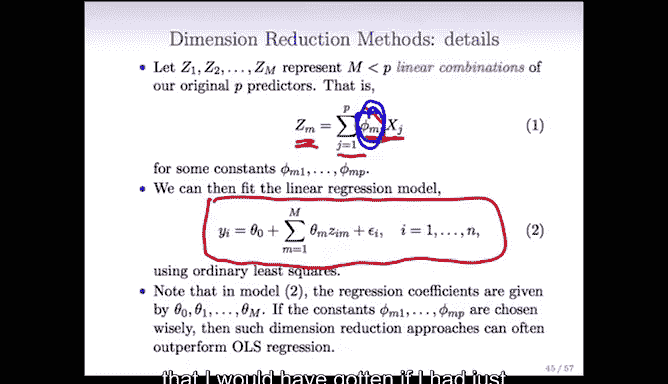

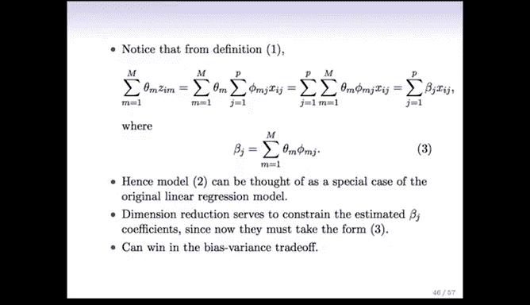

---

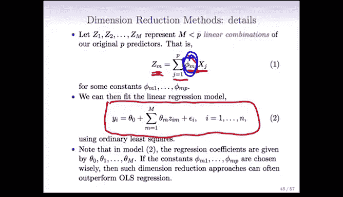

## 降维与原始模型的关系

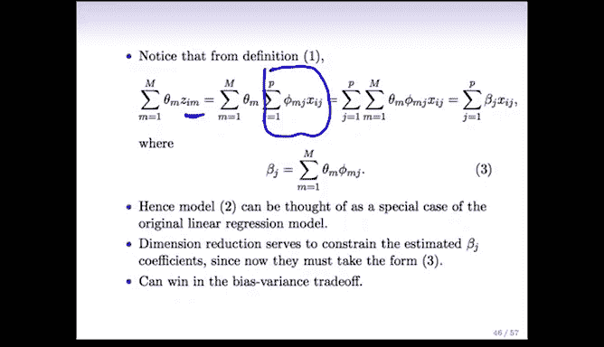

值得注意的是，如果我们仔细观察模型形式：
**Ŷ = Σₘ₌₁ᴹ (θₘ * Zₘ)**
并将 **Zₘ** 的定义代入，经过代数变换后，我们可以发现，这实际上等价于原始预测变量 **Xⱼ** 的一个线性组合：
**Ŷ = Σⱼ₌₁ᴾ (βⱼ * Xⱼ)**
其中，系数 **βⱼ** 被定义为：
**βⱼ = Σₘ₌₁ᴹ (θₘ * φₘⱼ)**

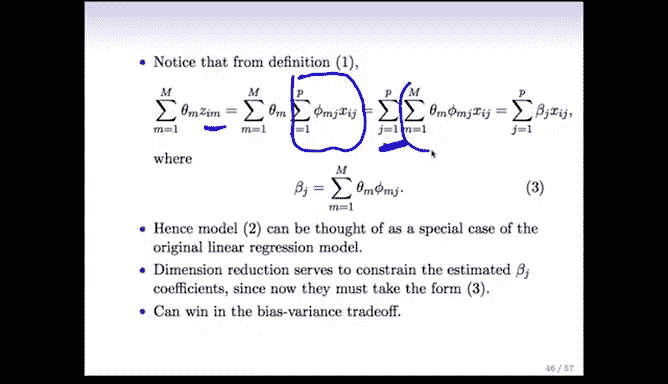

因此，降维方法最终拟合的模型，在形式上仍然是原始预测变量的线性模型。但模型的系数 **βⱼ** 必须遵循一个非常特定的结构，即它们是由 **θₘ** 和 **φₘⱼ** 共同决定的。

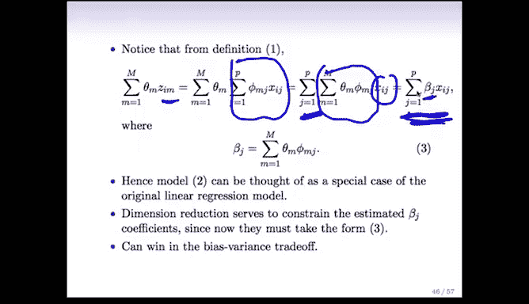

---

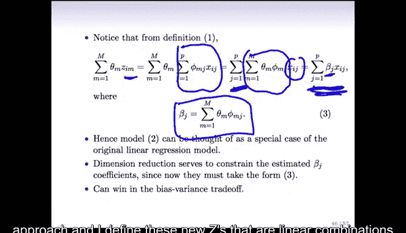

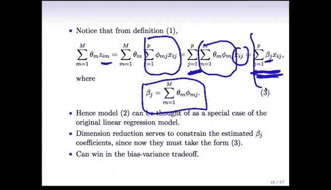

## 与岭回归和套索回归的对比

在某种程度上，这与岭回归和套索回归有相似之处：我们仍然在使用最小二乘法，模型在所有变量上仍然是线性的，但对系数施加了约束。

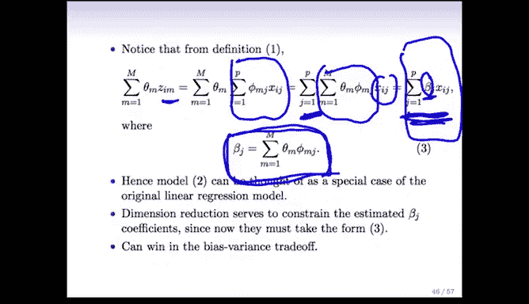

不同之处在于约束的方式：
*   在岭回归中，约束是系数的平方和要小。
*   在降维方法中，约束是系数 **βⱼ** 必须遵循 **βⱼ = Σₘ₌₁ᴹ (θₘ * φₘⱼ)** 这种特定形式。这种形式可以理解为在一组新特征上进行最小二乘拟合的简单结果。

这种对系数形式的约束，本质上是通过偏差-方差权衡来起作用的。通过强制系数遵循特定形式，我们有可能获得一个相对于直接在原始特征上使用普通最小二乘法而言，偏差和方差都更低的模型。

---

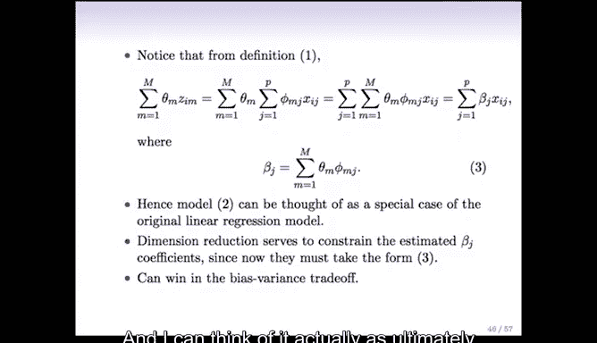

## 降维有效的条件

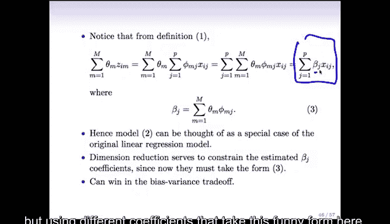

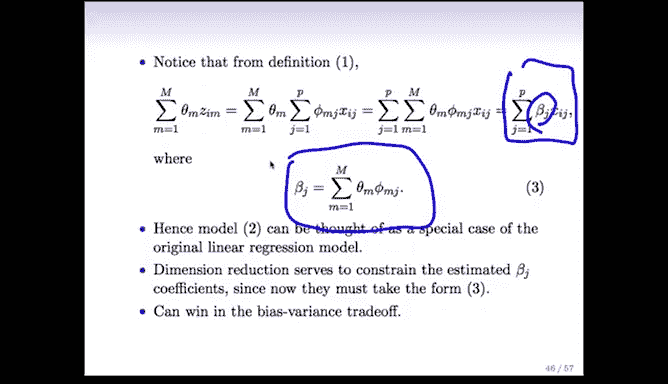

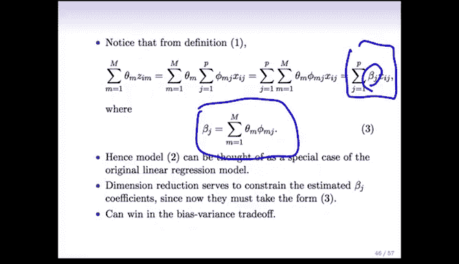

需要强调的是，降维方法要有效，必须满足 **M < P**。

如果 **M = P**，那么我们最终会得到与原始数据上普通最小二乘法完全相同的结果，降维过程也就失去了意义。

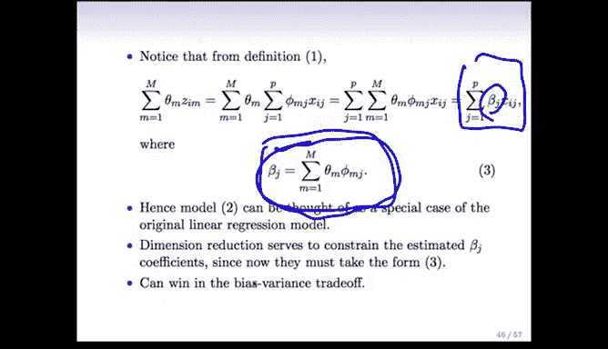

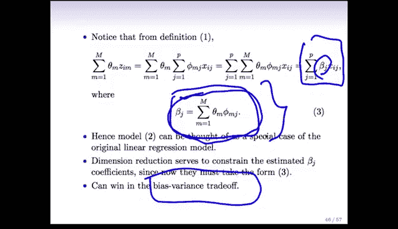

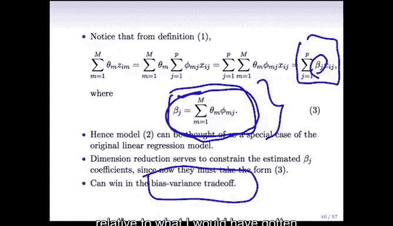

---

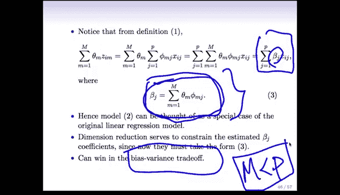

## 总结

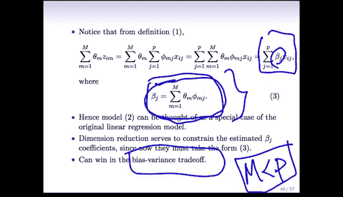

本节课中，我们一起学习了降维方法。我们了解到，降维通过将原始高维预测变量转换为低维的线性组合变量，并在此新变量空间中使用最小二乘法，来构建预测模型。这种方法对模型系数施加了特定形式的约束，其核心优势在于通过巧妙的特征变换，在偏差和方差之间取得更好的平衡，从而可能提升模型的泛化性能。理解降维与子集选择、收缩方法之间的异同，有助于我们根据实际问题选择合适的建模策略。