# R 版 44：RStudio中的Markdown与最优子集回归 📊

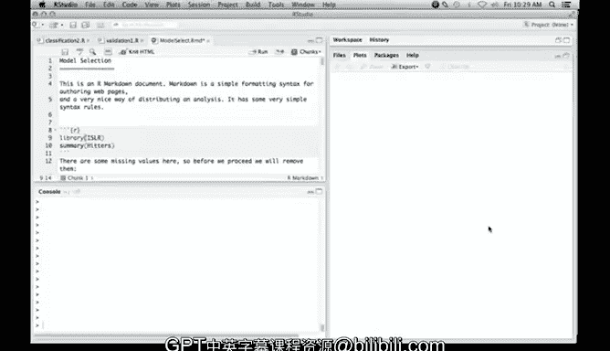

在本节课中，我们将学习模型选择的方法，并介绍如何在RStudio中使用Markdown模式来整合文本与代码，最终生成一份格式清晰的HTML文档。我们将从最优子集回归开始，使用验证集和交叉验证来选择模型。

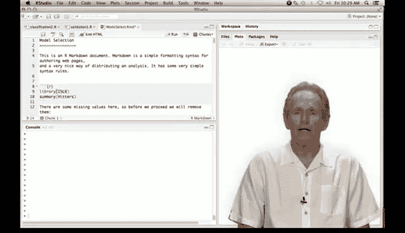

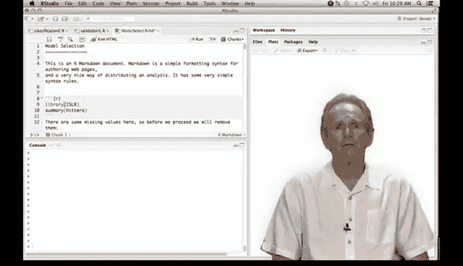

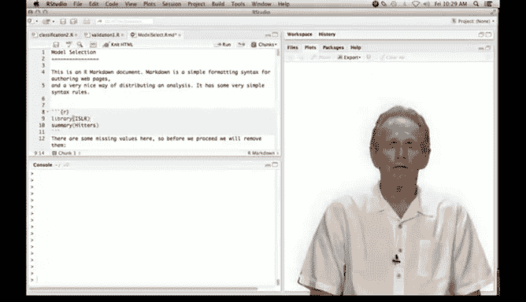

---

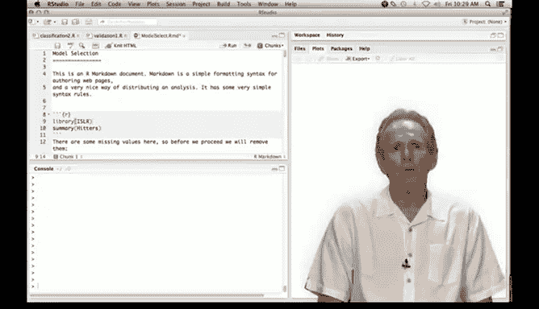

## 在RStudio中使用Markdown 📝

上一节我们介绍了模型选择的基本概念，本节中我们来看看如何在RStudio中使用Markdown来编写和展示分析过程。

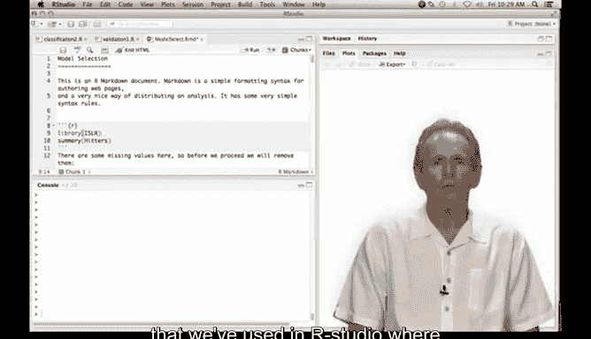

Markdown是一种将文本与R代码合并的格式。最终，你可以生成一个HTML文档或网页。使用Markdown与使用脚本文件一样简单，但对于制作演示文稿和报告尤其有用。

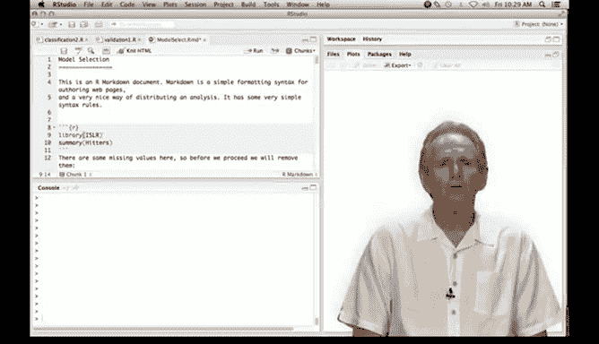

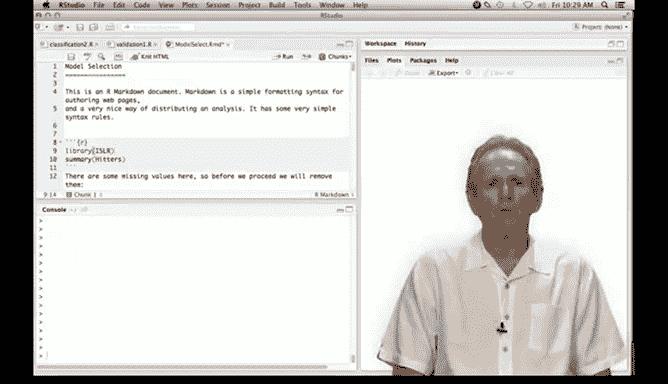

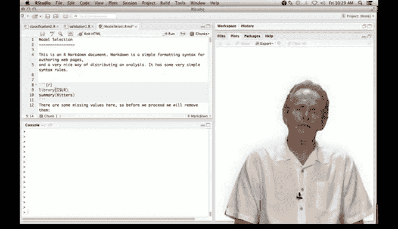


以下是Markdown的基本结构：


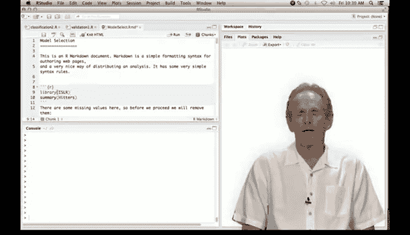

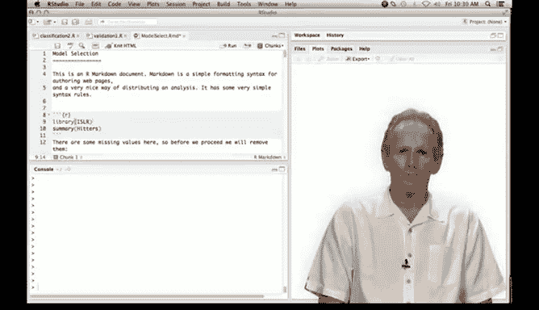

*   Markdown文档以纯文本开头，可以包含标题和描述。
*   R代码位于特定的“代码块”中。
*   代码块以三个反引号（```）和`{r}`开始，以三个反引号结束。
*   在代码块中，我们可以像在普通R脚本中一样执行命令。

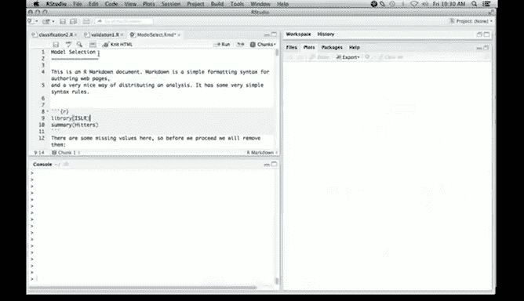

---

## 数据准备与探索 🔍

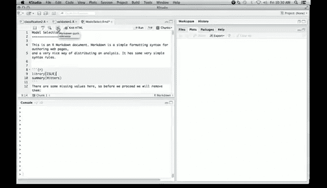

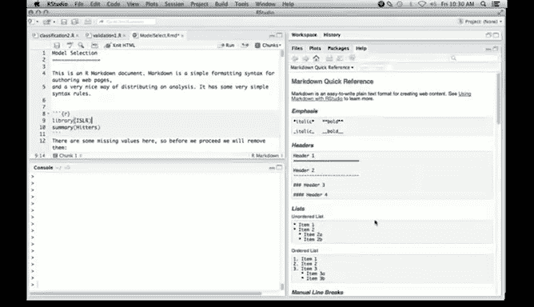

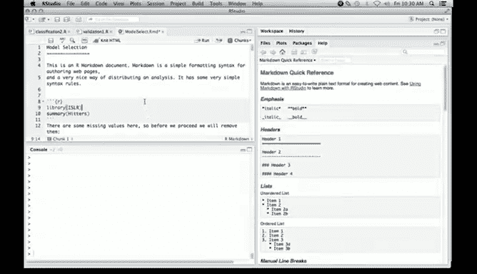

我们将使用`ISLR`包中的`Hitters`数据集，这是一个包含众多棒球运动员统计数据的数据集，我们的目标是用这些数据预测运动员的薪水。

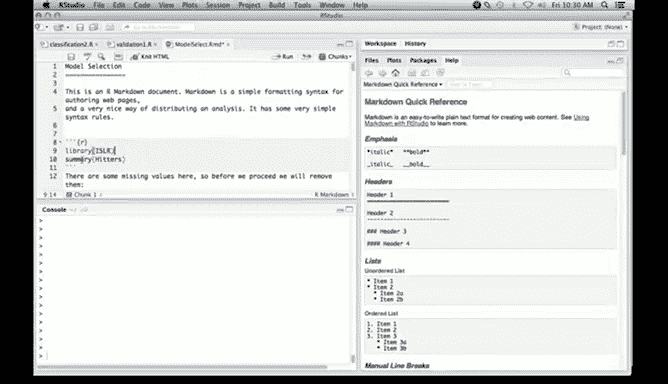

首先，我们加载数据并查看其结构。

```r
library(ISLR)
data(Hitters)
names(Hitters)
summary(Hitters)
```

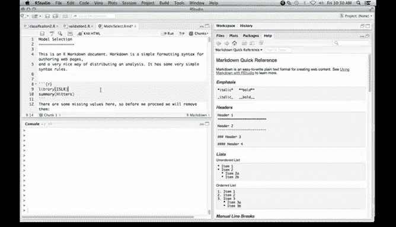

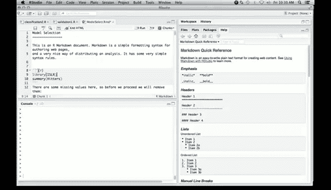

数据集中有一个响应变量`Salary`。我们注意到`Salary`变量存在59个缺失值。为了简化处理，我们将直接删除包含任何缺失值的行。

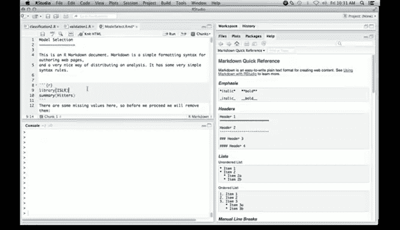

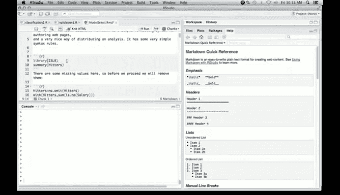

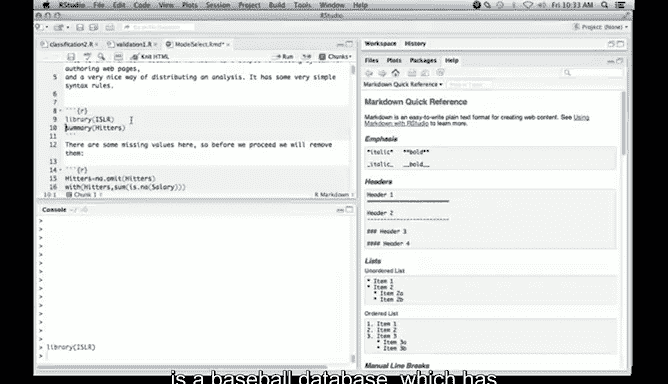

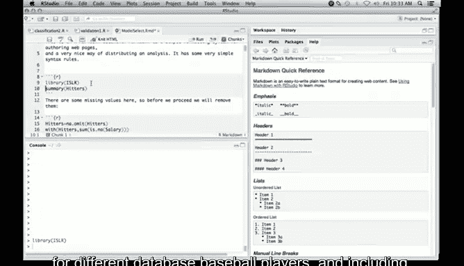

```r
Hitters <- na.omit(Hitters)
with(Hitters, sum(is.na(Salary)))
```

执行上述操作后，新的`Hitters`数据框将不再包含任何缺失值。

---

## 最优子集回归 🏆

最优子集回归会遍历所有可能的自变量组合（对于每种模型大小），并找出每种大小下的最佳模型。这听起来计算量很大，但我们可以使用`leaps`包中的`regsubsets`函数来高效完成。

以下是使用`regsubsets`函数进行最优子集回归的步骤：

1.  调用`regsubsets`函数，指定模型公式和数据。
2.  默认情况下，函数只计算到包含8个自变量的模型。由于我们有19个变量，我们需要指定计算所有大小的模型。
3.  使用`summary`函数查看结果摘要，其中包含了每个最佳子集模型的`R-squared`、`RSS`、`Adjusted R-squared`、`Cp`和`BIC`等统计量。

```r
library(leaps)
regfit.full <- regsubsets(Salary ~ ., data = Hitters)
summary(regfit.full)

regfit.full <- regsubsets(Salary ~ ., data = Hitters, nvmax = 19)
reg.summary <- summary(regfit.full)
names(reg.summary)
```

在结果摘要中，对于每种模型大小（例如，大小为1的模型），会用一个星号（*）标出该大小下的最佳变量。

---

## 使用Cp统计量选择模型 📈

`Cp`统计量是预测误差的一个估计。我们的目标是选择`Cp`值最小的模型。

我们可以绘制`Cp`统计量随模型变量数量变化的图形，并找出最小值点。

```r
plot(reg.summary$cp, xlab = "Number of Variables", ylab = "Cp")
which.min(reg.summary$cp)
points(which.min(reg.summary$cp), reg.summary$cp[which.min(reg.summary$cp)], col="red", pch=20)
```

从图中可以看出，包含10个变量的模型具有最小的`Cp`值。

`regsubsets`对象还有一个内置的绘图方法，可以生成一个更直观的“模型路径图”。

```r
plot(regfit.full, scale="Cp")
```

在此图中，纵轴是`Cp`统计量（越小越好），横轴是不同的变量。黑色方块表示该变量被包含在模型中，白色方块则表示被排除。这让我们可以直观地看到随着`Cp`值变化，最佳模型包含哪些变量。

---

## 提取最终模型系数 🔧

确定了最佳模型（例如，包含10个变量的模型）后，我们可以使用`coef`函数提取该模型的回归系数。

```r
coef(regfit.full, which.min(reg.summary$cp))
```

该命令将返回被选入模型的10个变量的系数估计值。

---

## 生成HTML报告 📄

使用Markdown的一个主要优势是可以轻松生成包含所有代码、输出、图形和文本说明的完整报告。

在RStudio的Markdown文档中，只需点击“Knit HTML”按钮，即可将当前文档编译成一个格式美观的HTML网页。该网页会包含所有标题、文本描述、R代码、代码运行结果以及我们绘制的图形。

---

## 总结 ✨

本节课中我们一起学习了：
1.  如何在RStudio中使用Markdown模式来创建整合代码与文本的分析文档。
2.  对`Hitters`数据集进行预处理，处理了缺失值。
3.  使用`leaps`包中的`regsubsets`函数执行最优子集回归。
4.  利用`Cp`统计量从一系列最佳子集模型中选择最终模型，并通过绘图进行可视化。
5.  提取并查看了最终选定模型的回归系数。
6.  了解了如何将Markdown文档编译成包含所有分析过程的HTML报告。

在接下来的课程中，我们将继续探讨其他模型选择方法，如逐步回归和基于交叉验证的调参方法。