# R 版 45：前向逐步回归 📈

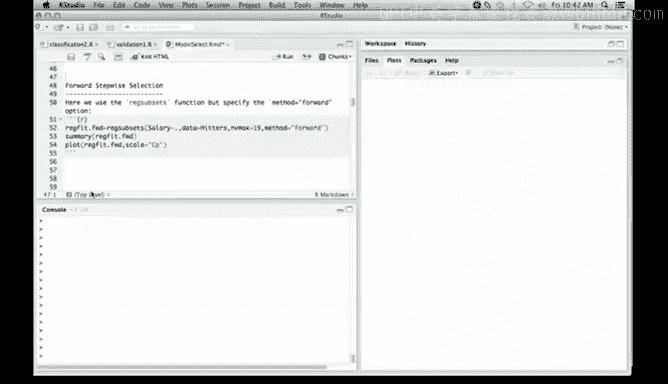

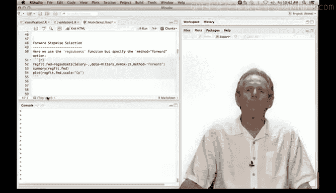

在本节课中，我们将学习前向逐步回归方法。这是一种模型选择技术，它通过逐步添加变量来构建模型。我们将使用R语言实现这一方法，并通过验证集评估模型性能。


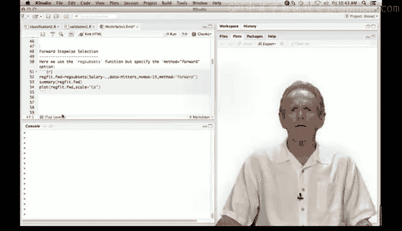


上一节我们介绍了最佳子集选择法，它是一种较为激进的搜索方法，会考察所有可能的子集模型。本节中我们来看看前向逐步回归，它是一种贪心算法，每次只添加一个对模型拟合改善最大的变量。

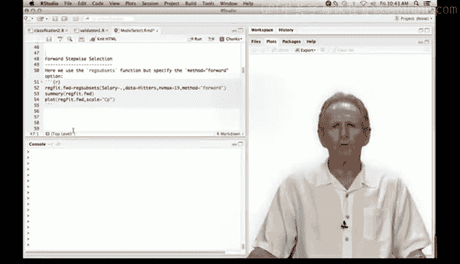


## 前向逐步回归原理

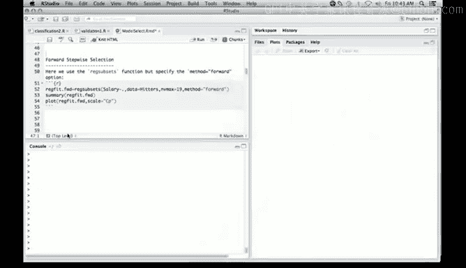

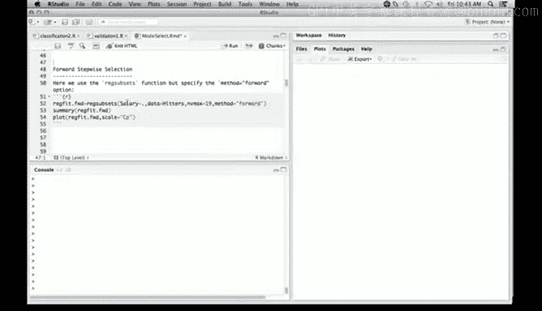

前向逐步回归会生成一个嵌套的模型序列。这意味着每次构建新模型时，都会包含前一个模型的所有变量，并在此基础上添加一个新变量。这种方法的搜索范围比最佳子集选择小得多。


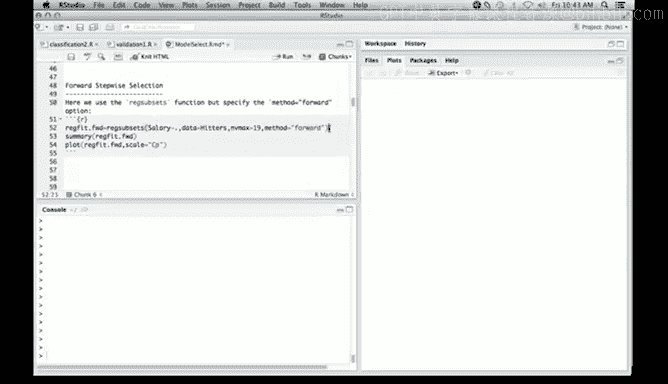

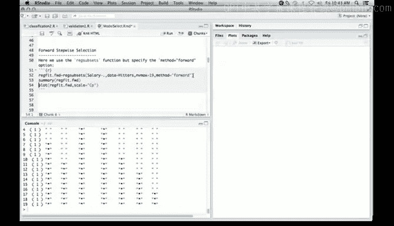

以下是前向逐步回归的核心步骤：

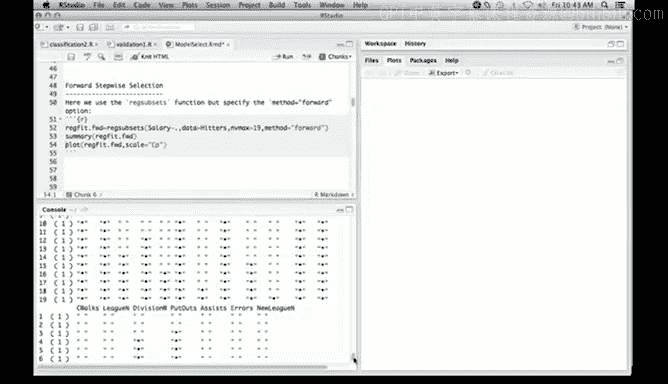

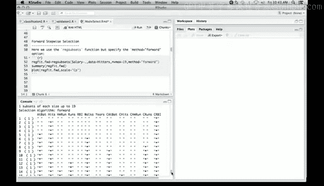

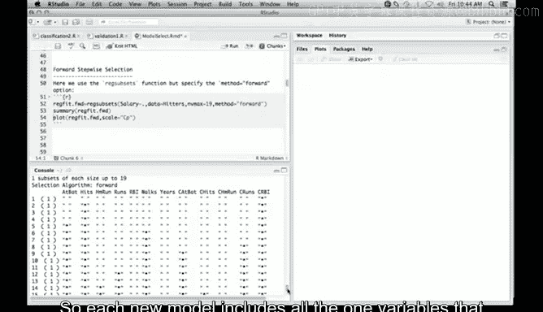

1.  从零模型（不包含任何预测变量）开始。
2.  在每一步，从所有未使用的预测变量中，选择一个能最大程度提升模型拟合效果的变量加入模型。
3.  重复步骤2，直到所有变量都被加入，或达到预设的停止标准。

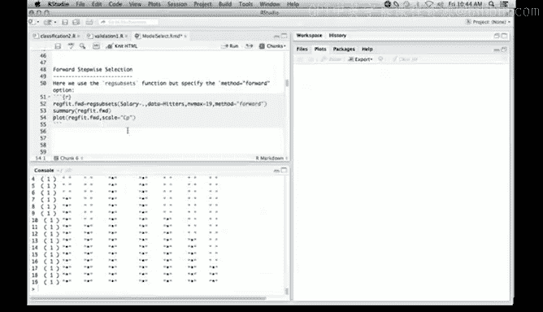

## 在R中实现前向逐步回归

我们将继续使用 `leaps` 包中的 `regsubsets()` 函数。与最佳子集选择不同，我们需要将 `method` 参数设置为 `"forward"`。

```r
library(leaps)
# 假设数据框名为 hitters，包含19个预测变量
forward_fit <- regsubsets(Salary ~ ., data = hitters, nvmax = 19, method = "forward")
summary(forward_fit)
```

运行上述代码会非常快。查看模型摘要，你会发现每个新模型都完全嵌套于前一个模型中。

我们可以像之前一样绘制Cp统计量图，其形态与最佳子集选择的结果相似，在Cp值较低的区域（即模型表现较好的区域），有一组变量被稳定地选中。

## 使用验证集评估模型

除了使用Cp、调整R方或BIC准则，我们还可以使用验证集来评估和选择模型。我们将数据分为训练集和验证集，在训练集上拟合模型，在验证集上计算均方误差。

以下是具体步骤：

1.  **划分数据集**：将约2/3的数据作为训练集，1/3作为验证集。
2.  **在训练集上拟合模型**：使用前向逐步回归。
3.  **在验证集上计算预测误差**：对每个大小的模型，计算其在验证集上的均方根误差。

```r
# R 版 1. 设置随机种子以保证结果可重现
set.seed(1)

# R 版 2. 创建训练集索引（假设数据有263行）
train <- sample(seq(263), 180, replace = FALSE)

# R 版 3. 在训练集上运行前向逐步回归
forward_fit_train <- regsubsets(Salary ~ ., data = hitters[train, ], nvmax = 19, method = "forward")

# R 版 4. 准备验证集的设计矩阵
test_mat <- model.matrix(Salary ~ ., data = hitters[-train, ])

# R 版 5. 初始化向量存储验证误差
val_errors <- rep(NA, 19)

# R 版 6. 循环计算每个大小模型的验证误差
for(i in 1:19) {
    coefi <- coef(forward_fit_train, id = i) # 获取第i个模型的系数
    pred <- test_mat[, names(coefi)] %*% coefi # 矩阵乘法得到预测值
    val_errors[i] <- mean((hitters$Salary[-train] - pred)^2) # 计算均方误差
}

# R 版 7. 绘制验证均方根误差图
plot(sqrt(val_errors), ylab = "Root MSE", xlab = "Number of Variables", type = "b")
```

验证误差图可能会有些波动，这是因为验证集样本量较小。通常，图中会有一个最小值点，指示最优的模型复杂度。我们之前根据Cp准则选择的10变量模型，其验证误差可能略高于最小值点。

作为对比，我们还可以在同一张图上添加训练集的残差平方和。需要注意的是，训练误差会随着模型变量增加而单调下降，这是前向逐步回归的必然结果。

## 创建预测函数

由于 `regsubsets()` 对象没有内置的 `predict()` 方法，我们需要自己编写一个函数来实现预测功能。这在我们未来需要重复进行预测时会非常方便。

以下是一个为 `regsubsets` 对象创建预测方法的函数：

```r
predict.regsubsets <- function(object, newdata, id, ...) {
    # 从对象中提取模型公式
    form <- as.formula(object$call[[2]])
    # 根据公式和新数据创建模型矩阵
    mat <- model.matrix(form, newdata)
    # 提取指定大小模型的系数
    coefi <- coef(object, id = id)
    # 返回预测值：模型矩阵的子集与系数向量的乘积
    mat[, names(coefi)] %*% coefi
}
```

定义此函数后，我们就可以在未来的分析中方便地使用 `predict()` 函数对 `regsubsets` 模型进行预测了。

## 总结

本节课中我们一起学习了前向逐步回归。我们了解到它是一种贪心的、产生嵌套模型序列的变量选择方法。通过R语言实践，我们掌握了如何使用 `regsubsets()` 函数进行前向选择，如何利用验证集来评估不同复杂度模型的预测性能，以及如何编写自定义函数来扩展R的功能，为模型对象添加预测方法。在下一节中，我们将使用交叉验证这一更稳健的方法来进行模型评估。