# R 版 47：Ridge回归与Lasso回归 🧮

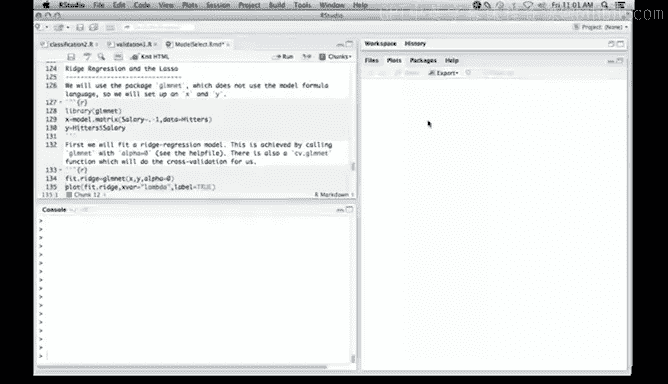

在本节课中，我们将学习如何使用R语言实现Ridge回归和Lasso回归这两种正则化方法。我们将使用`glmnet`包来拟合模型，并通过交叉验证和验证集来选择最优的模型参数。

---

## 概述

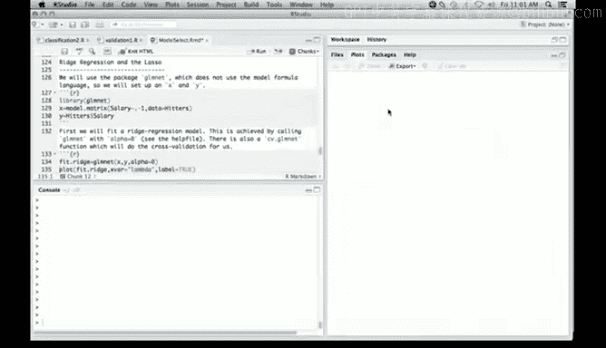


本节课是模型选择章节的最后一节。我们将重点学习Ridge回归和Lasso回归，并继续使用R Markdown来生成格式良好的最终文档。与纯脚本相比，R Markdown的优势在于它能生成带有清晰注释的报告。

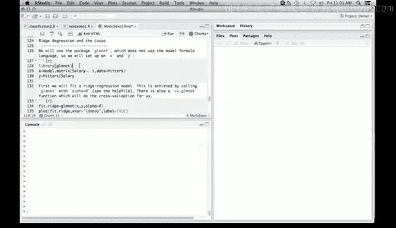


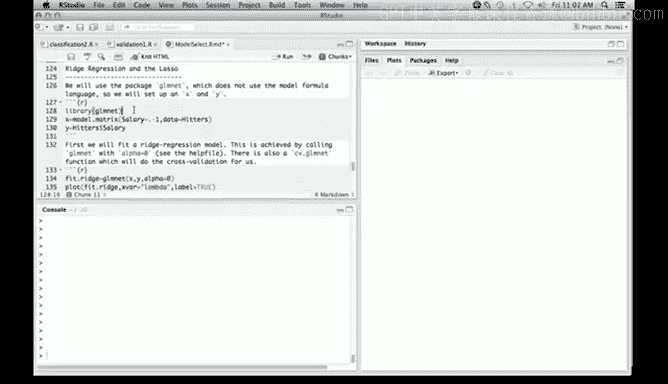

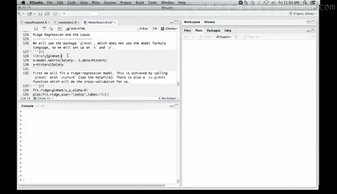

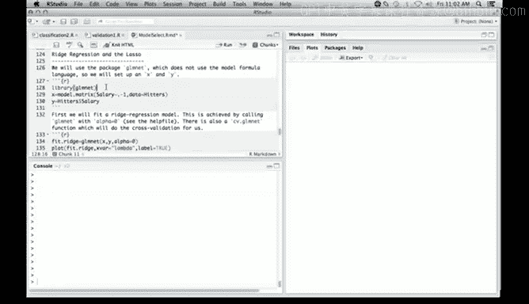

我们将使用`glmnet`包，该包由课程讲师、Jerome Friedman和Rob Tibshirani共同维护，用于拟合Lasso、Ridge以及介于两者之间的弹性网络模型。它支持多种损失函数，包括逻辑回归和普通线性回归，本节课我们将使用普通线性回归。

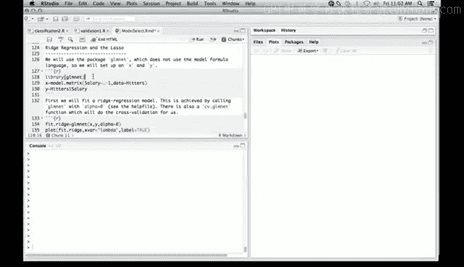

---

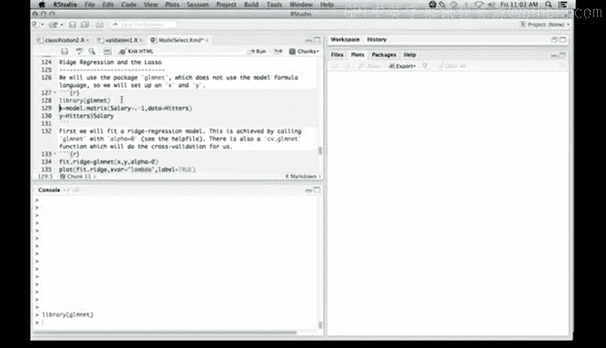

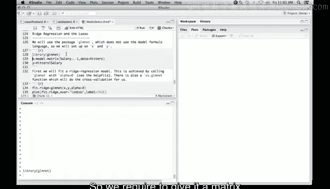

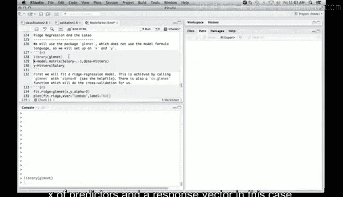

## 加载包与准备数据

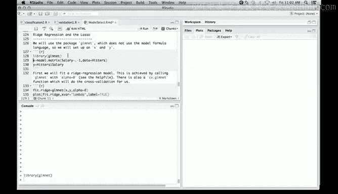


首先，我们需要加载`glmnet`包。`glmnet`不使用公式语言，因此我们需要为它提供一个预测变量矩阵`X`和一个响应变量向量`y`。

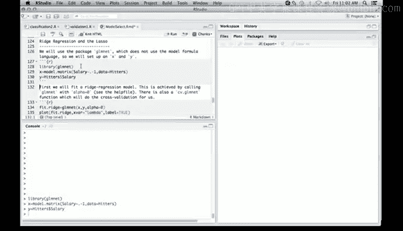


以下是创建这些数据的代码：

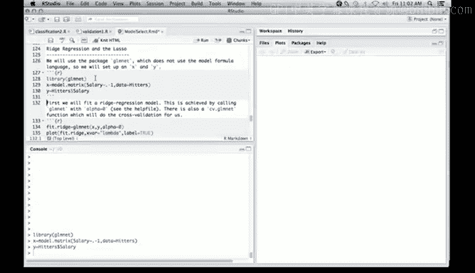

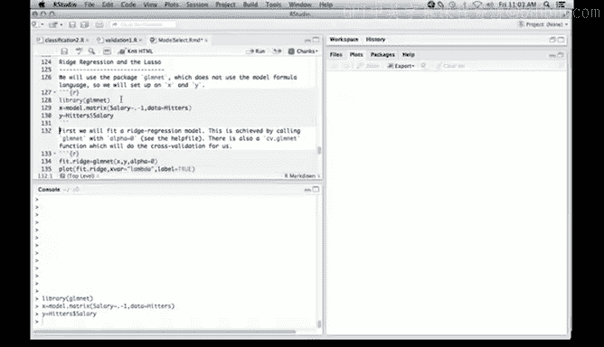

```r
library(glmnet)
# 假设数据已加载到名为‘data’的数据框中
x <- model.matrix(response ~ ., data)[, -1] # 创建预测变量矩阵，移除截距列
y <- data$response # 创建响应变量向量
```


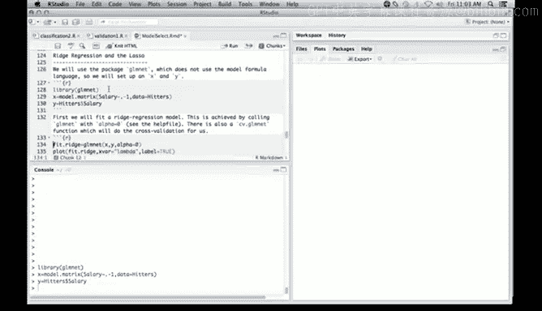

---

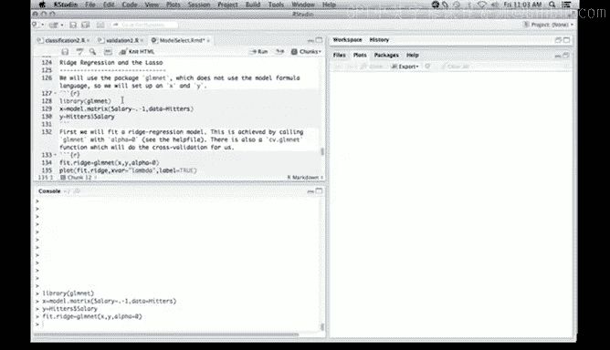

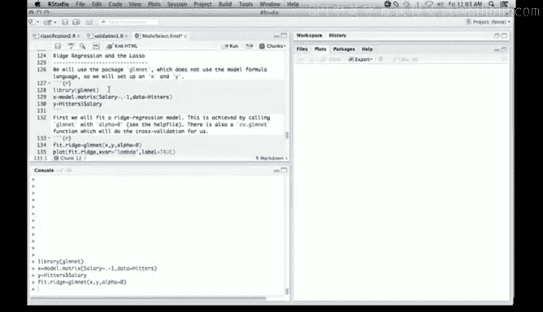

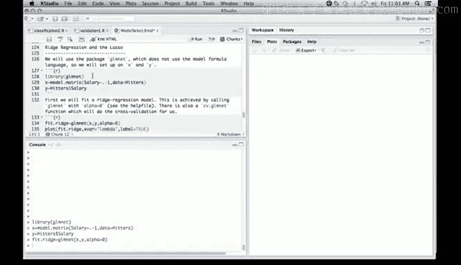

## 拟合Ridge回归模型

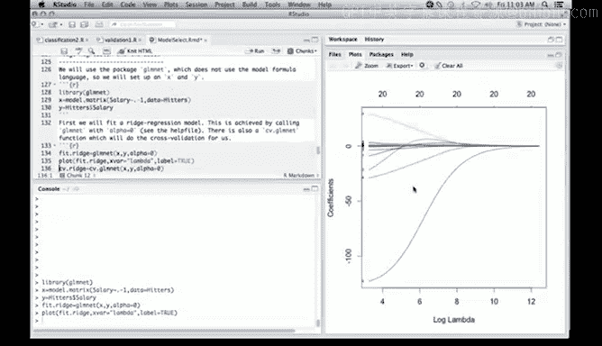

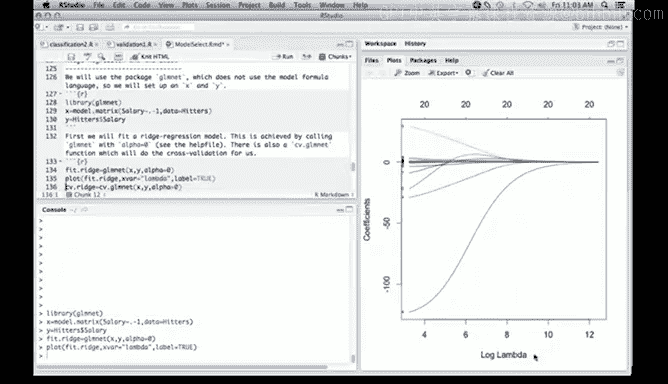

`glmnet`包中的`alpha`参数用于控制模型类型。`alpha = 0`对应Ridge回归，`alpha = 1`对应Lasso回归，`alpha`值在0到1之间则对应弹性网络。

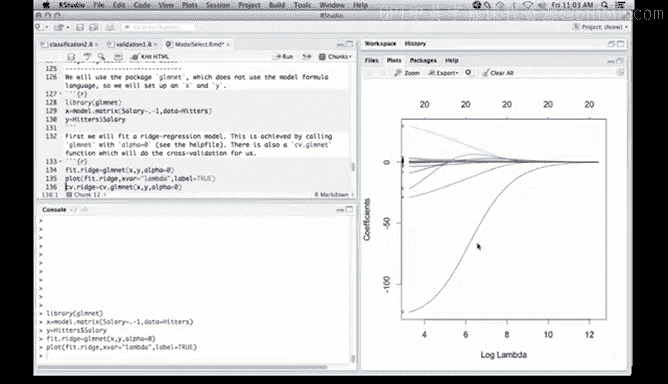

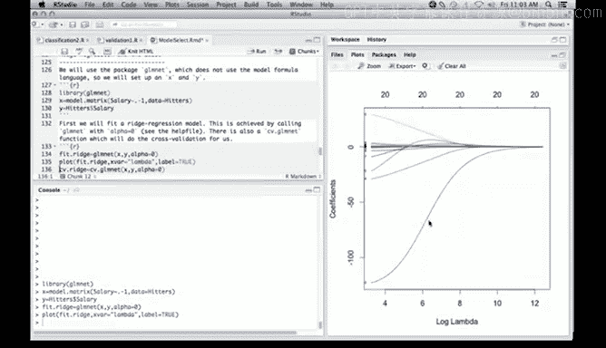

我们将首先拟合一个Ridge回归模型。

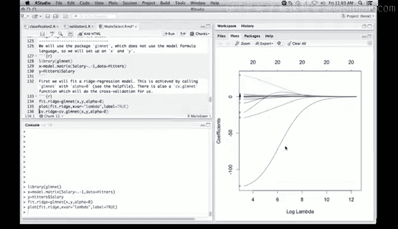

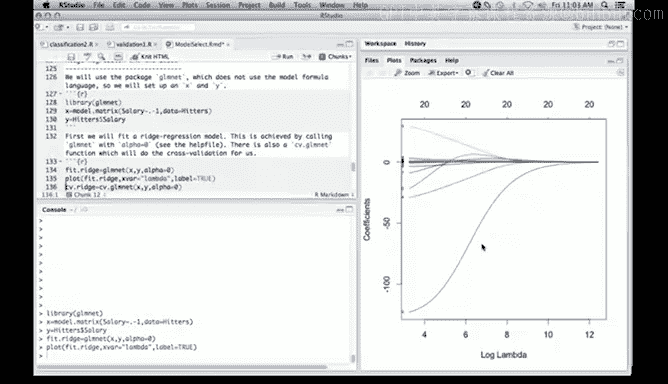

```r
ridge_model <- glmnet(x, y, alpha = 0)
```

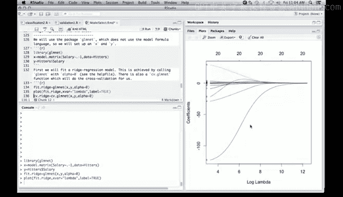

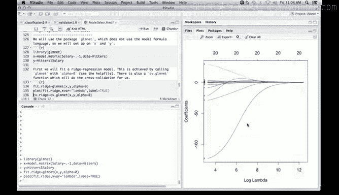

模型拟合速度非常快。我们可以绘制系数路径图来观察随着正则化强度`lambda`的变化，系数是如何收缩的。

```r
plot(ridge_model, xvar = "lambda", label = TRUE)
```

上一节我们介绍了如何拟合Ridge模型，本节中我们来看看它的系数路径。

在关于Ridge回归和Lasso的讲座中，我们了解到Ridge回归通过对系数的平方和施加惩罚来进行正则化。这个惩罚由一个参数`lambda`控制。

Ridge回归的优化目标是：
**最小化：残差平方和 + λ × Σ(βj²)**

当`lambda`很大时，系数的平方和需要很小，这会将所有系数向0收缩。当`lambda`非常大时，所有系数都趋近于0。`glmnet`会在一系列`lambda`值（大约100个）上计算整个系数路径。在绘制的图中，横坐标是`log(lambda)`。当`log(lambda)`很大时，所有系数基本为0。随着`lambda`减小，系数平滑地远离0。最终，当`lambda`接近0时，系数不再受正则化约束，等同于普通最小二乘法的估计结果。


与子集选择或逐步回归通过限制变量数量来控制模型复杂度不同，Ridge回归保留了所有变量，只是将它们的系数向零收缩。

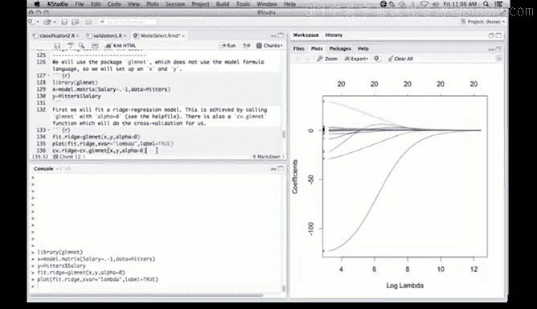

我们需要从路径中选择一个最优的`lambda`值。`glmnet`内置了`cv.glmnet`函数来进行K折交叉验证。

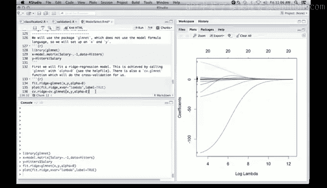

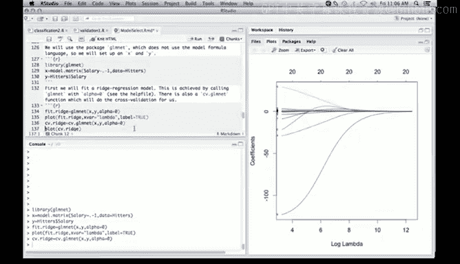

```r
cv_ridge <- cv.glmnet(x, y, alpha = 0)
plot(cv_ridge)
```

交叉验证均方误差图会显示一个最低点。图中有两条垂直线：一条位于误差最小值处，另一条位于“最小值一个标准误差”处。后者代表一个更简约（正则化更强）但性能与最优模型相差无几的模型，有时我们会选择这个模型。图顶部显示，在所有阶段，模型中始终包含全部20个变量（19个预测变量加截距）。

---

## 拟合Lasso回归模型

现在，让我们转向Lasso回归。回忆一下，Lasso与Ridge的优化目标非常相似，区别在于惩罚项。

Lasso回归的优化目标是：
**最小化：残差平方和 + λ × Σ|βj|**

Ridge惩罚系数的平方和，而Lasso惩罚系数的绝对值之和。这个细微的变化带来了一个关键特性：Lasso惩罚能够将某些系数**精确地收缩到零**，从而实现变量选择。

让我们在R中运行Lasso回归。在`glmnet`中，`alpha`参数的默认值是1，即对应Lasso模型。

```r
lasso_model <- glmnet(x, y, alpha = 1) # alpha=1 是默认值，可省略
plot(lasso_model, xvar = "lambda", label = TRUE)
```

在系数路径图中，我们可以看到，最初所有系数都为0。随着`lambda`减小，系数逐个“加入”模型（从0变为非零）。图顶部会显示每个`lambda`值下模型中非零系数的数量。这证实了Lasso同时进行**收缩和变量选择**。

我们还可以用另一种方式绘图，显示模型解释的偏差百分比（类似于R²）。

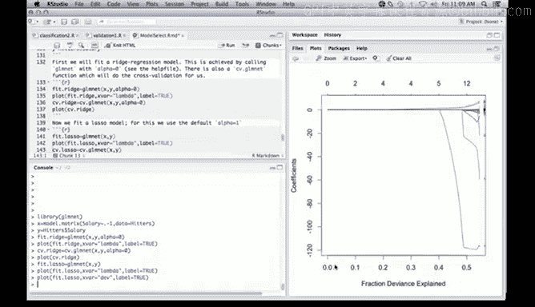

```r
plot(lasso_model, xvar = "dev", label = TRUE)
```

这种图改变了坐标方向，底部显示“解释的偏差比例”。我们可以发现，大部分R²在系数被较大程度收缩时就已经被解释。在路径末端，R²从0.4增长到0.5的微小提升伴随着系数急剧增大，这可能表明模型在路径末端过拟合了。

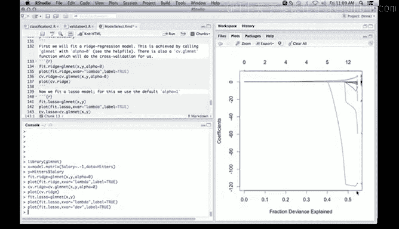

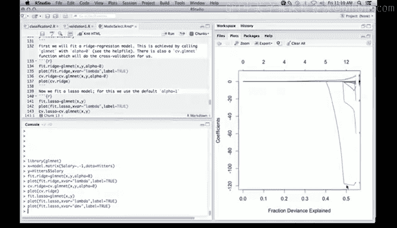

不同的绘图方式提供了关于系数和路径性质的不同信息。

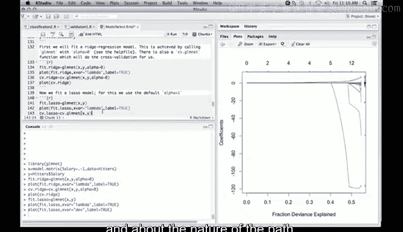

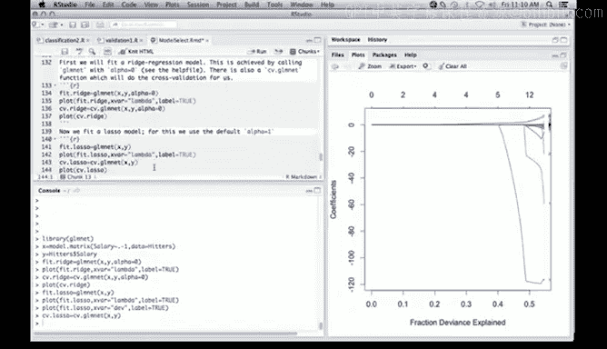

同样，我们可以使用交叉验证为Lasso选择最优的`lambda`。

```r
cv_lasso <- cv.glmnet(x, y, alpha = 1)
plot(cv_lasso)
```

交叉验证图会告诉我们最优模型（最小交叉验证误差）对应的变量数量（例如15个）。在“一个标准误差”规则下，我们可能会选择一个更简约的模型（例如约6个变量）。图中误差在这两者之间相对平坦。

我们可以使用`coef`函数提取交叉验证得到的最优模型的系数。

```r
best_lasso_coef <- coef(cv_lasso, s = "lambda.1se")
```

`s = "lambda.1se"`指定提取“一个标准误差”规则下的模型系数，这通常是一个更简洁的模型。交叉验证误差本身存在方差，因此选择这个更保守的模型是合理的。

---

## 使用验证集选择Lasso模型

最后，我们将使用之前划分的训练集和验证集，通过验证集来选择Lasso模型。

假设我们有一个索引变量`train`来标识训练集观测。

```r
# 假设 train 是一个逻辑向量或索引
x_train <- x[train, ]
y_train <- y[train]

# 在训练集上拟合Lasso路径
lasso_fit_train <- glmnet(x_train, y_train, alpha = 1)

# 在验证集上进行预测
x_val <- x[-train, ]
y_val <- y[-train]
predictions <- predict(lasso_fit_train, newx = x_val) # 得到一个预测矩阵

# 计算验证集均方根误差(RMSE)
# 利用R的循环规则：y_val是向量，predictions是矩阵，相减时y_val会被循环使用
squared_errors <- (y_val - predictions)^2
rmse_vals <- sqrt(apply(squared_errors, 2, mean))

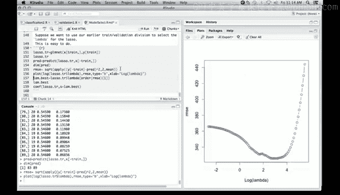

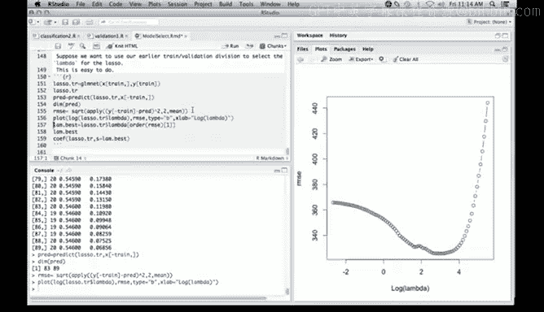

# 绘制RMSE随lambda变化的验证曲线
plot(log(lasso_fit_train$lambda), rmse_vals, type = "l", xlab = "log(lambda)", ylab = "Validation RMSE")
```


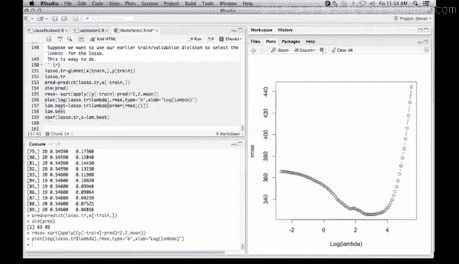

验证曲线通常会先下降后上升，分别对应欠拟合和过拟合区域，最低点即为“最佳点”。


我们可以找到使验证集RMSE最小的`lambda`值。

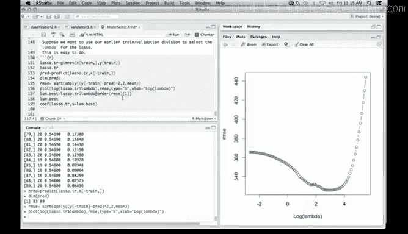

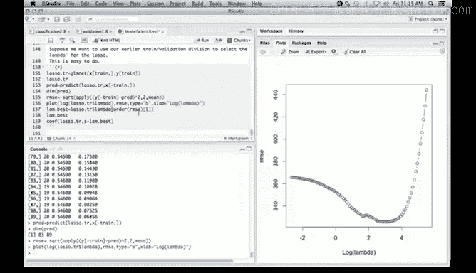

```r
best_lambda_index <- which.min(rmse_vals)
best_lambda <- lasso_fit_train$lambda[best_lambda_index]
best_lambda
```

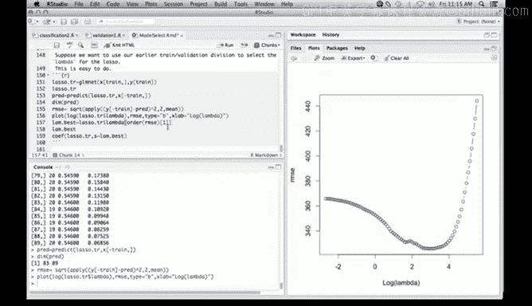


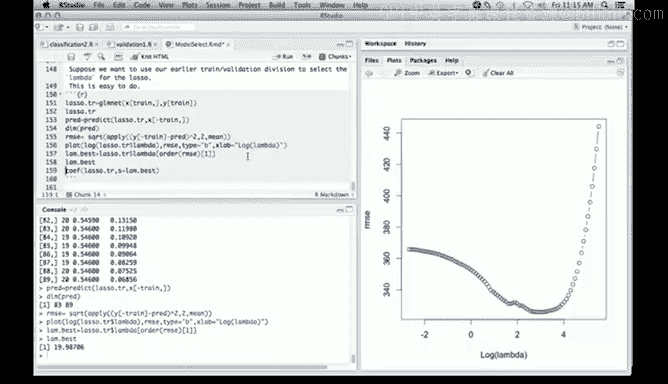

然后，提取对应于这个最优`lambda`的系数。

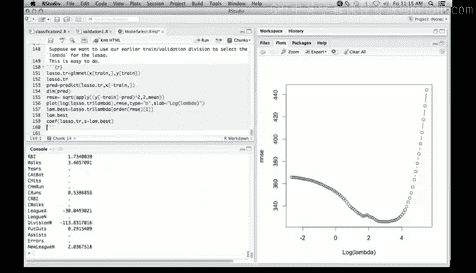

```r
best_coef <- coef(lasso_fit_train, s = best_lambda)
best_coef
```

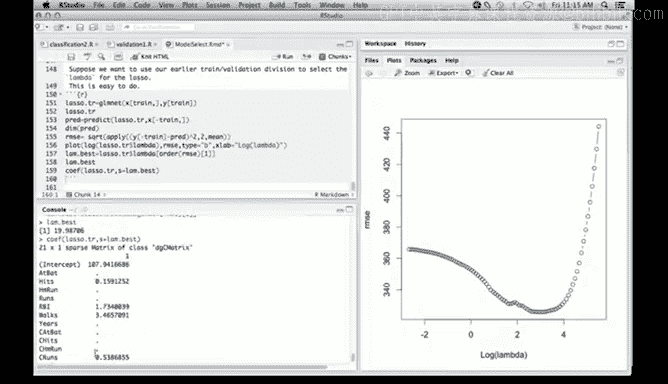

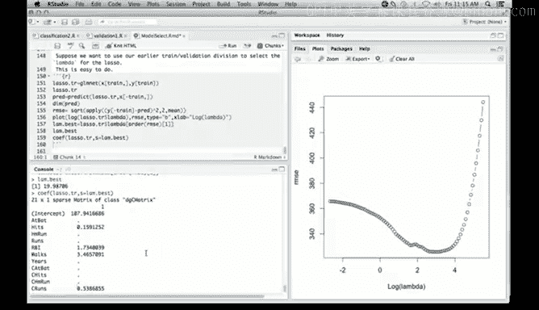

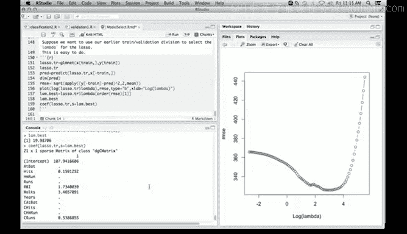

输出结果以稀疏矩阵格式显示，只列出非零系数，点号（`.`）代表零系数。这就是我们最终选定的模型系数向量。


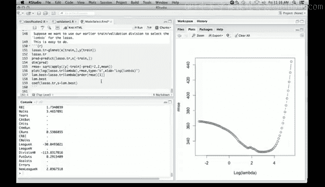

---

## 总结

在本节课中，我们一起学习了模型选择的多种方法。在最近的几节课中，我们涵盖了：
*   最佳子集选择
*   向前逐步回归
*   Ridge回归
*   Lasso回归

我们使用了多种技术来选择模型：
*   验证集
*   Cp统计量
*   K折交叉验证

我们还实践了如何使用R Markdown来生成一份记录所有分析过程、输出和图形的精美报告。这对于向客户展示数据分析结果非常有用，它清晰地展示了你的工作流程和成果。生成的HTML网页可以轻松分享或嵌入博客。

需要注意的是，本节课未涵盖主成分回归和偏最小二乘法，但大家现在已经掌握了足够的工具，可以独立完成教材中关于这些方法的实验部分。