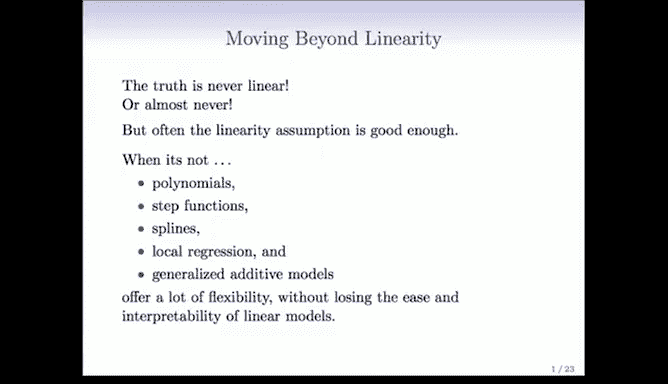
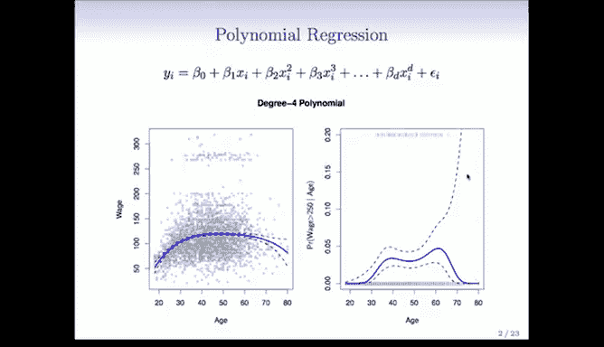
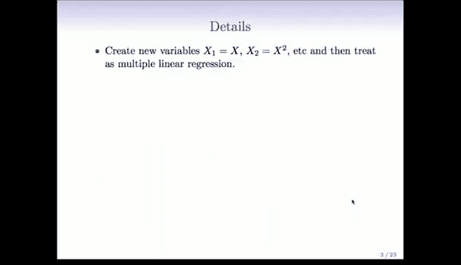
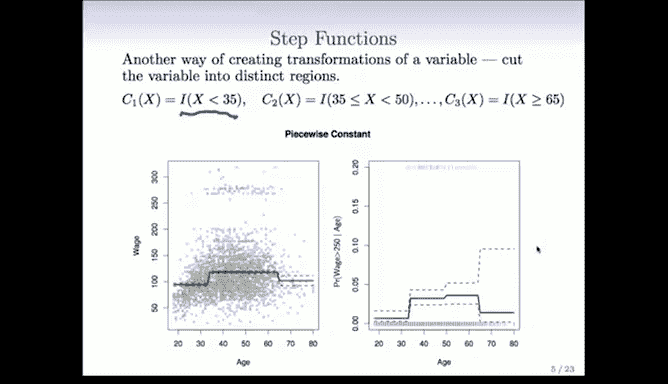
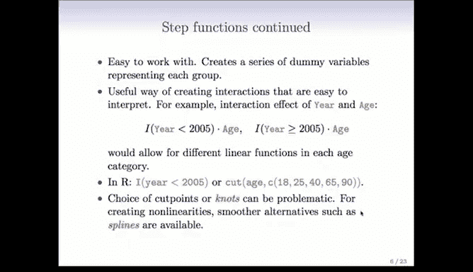

# R 版 48：多项式与阶梯函数 📈

在本节课中，我们将学习如何将非线性关系引入回归模型。到目前为止，我们主要关注线性模型。本节将介绍一系列方法，从完全直接的方法到略微复杂的方法，使模型能够捕捉数据中的非线性模式。

## 从线性到非线性 🔄

上一节我们介绍了线性模型。本节中我们来看看如何超越线性假设。事实是，真实世界的关系几乎从来都不是线性的。线性只是一种近似，虽然这种近似通常足够好，能为我们提供一个简洁的总结，但我们常常需要超越线性。幸运的是，我们有多种工具可以实现这一点。

以下是几种非线性建模方法，按复杂度递增排列：
*   多项式回归
*   阶梯函数
*   样条
*   局部回归
*   广义可加模型

你将看到，使用这些工具几乎和拟合线性模型一样简单。

## 多项式回归 📊

多项式回归我们之前已经有所涉及。在介绍这些非线性方法时，我们主要针对单变量进行说明，但你会发现将其扩展到多变量也同样简单。

多项式回归模型的公式如下：
`Y = β₀ + β₁X + β₂X² + β₃X³ + ... + β_dX^d + ε`
该模型在系数上是线性的，但它是变量 `X` 的非线性函数。

在左侧图表中，我们看到了用三次多项式拟合年龄与工资关系的函数曲线，以及点态标准误带。可以注意到，标准误带在两端更宽。这是因为数据在两端较为稀疏，用于拟合曲线末端的信息较少，因此标准误变大。此外，多项式函数在末端非常灵活，其“尾巴”容易摆动，标准误带也反映了这一点。

在右侧图表中，我们使用多项式来拟合逻辑回归。具体做法是将工资转换为二元变量（例如，工资是否大于250K），从而建模该事件的概率。请注意，末端的标准误带同样很宽。需要留意的是，纵坐标轴的范围只到0.2，如果范围是0到1，这些带子看起来会窄得多。图表底部是所谓的“地毯图”，显示了所有取值为0的点（下方的小短竖线），以及取值为1的点（上方的短竖线）。可以看到，在末端几乎没有取值为1的数据点，因此几乎没有数据来估计函数在末端的行为。

### 多项式回归的细节

具体实施多项式回归时，你需要创建新变量。例如，令 `X₁ = X`，`X₂ = X²`，依此类推。然后，将这些新生成的衍生变量视为一个多元线性回归模型的自变量。

我们通常对系数本身不太感兴趣，而更关注在任意特定值 `x₀` 处的拟合函数值。由于拟合函数是估计系数 `β̂` 的线性函数，我们可以很容易地得到点态方差的表达式。利用拟合参数的协方差矩阵，可以得到该拟合值方差的简单表达式。在图表中，我们绘制的是拟合函数加减2倍标准误（之前误说为1倍）。

“点态”意味着标准误带是针对每个点的，显示的是任意给定点处的标准误，这与全局置信带不同。另一个问题是多项式的阶数 `d` 如何选择。`d` 是一个参数，我们通常选择一个较小的数字，如2、3或4（本例中使用了4阶）。我们也可以将 `d` 视为一个调优参数，通过交叉验证来选择。

对于逻辑回归，细节基本相同。我们建模的是：
`logit[P(Y=1|X)] = β₀ + β₁X + β₂X² + ... + β_dX^d`
这里使用的是多项式而非线性函数。一个重要的细节是，为了得到概率的置信区间，我们通常先为拟合的对数几率（logit）计算置信区间，然后将置信区间的上下限通过逆logit函数转换回去，从而得到概率的置信区间。这是一个有用的技巧。

### 多项式回归的扩展与注意事项

对于多个变量，你可以对每个变量分别进行多项式变换，然后将所有衍生变量堆叠在一起，组成一个大的模型矩阵，拟合一个包含所有这些新变量的线性模型。之后，你需要解包各部分以组合成函数。稍后我们将看到，广义可加模型技术可以帮助你无缝地完成这一过程。

多项式回归有一些注意事项。如前所述，多项式具有 notorious 的尾部行为，外推效果很差。那些“尾巴”容易摆动，因此不应信任数据范围之外或太接近数据端点的预测。

在R语言中，拟合多项式非常简单。以下是拟合 `Y` 关于 `X` 的多项式的模型公式示例：
`lm(y ~ poly(x, 4), data=dataset)`
`poly` 函数会为你生成这些变换。我们将在实验课中获得相关经验。

## 阶梯函数 📉

阶梯函数是拟合非线性的另一种方法，在过去约20年里，在流行病学和生物统计学中特别流行。

具体做法是将连续变量切割成离散的子区间。例如，这里我们在年龄的35岁和65岁（以及50岁）处进行了切割。其思想是在每个区域内拟合一个常数模型，因此这是一个分段常数模型。从图表中可以看到，拟合后并绘制在一起，你会在第一个区间、第二个区间看到一个常数，第三个区间的差异几乎看不见，然后在第四个区间。当组合在一起时，它就形成了一个非线性函数，即分段常数函数。

如果存在一些有意义的自然分割点，这种方法通常很有用。例如，你可以直接从图表中读出35岁以下人群的平均收入。这使得它在报纸、报告等总结性场合中很受欢迎，从而增加了其流行度。

实施起来和多多项式一样简单。考虑这个函数，它本质上是一系列二元变量。例如，创建一个二元变量：如果 `X < 35` 则为1，否则为0。对每个分割点都这样做，你就创建了一堆虚拟变量（0/1变量），然后用线性模型拟合它们。

与多项式相比，阶梯函数有一个优势：它是局部的。对于多项式，它是一个适用于整个 `X` 变量范围的单一函数。因此，如果改变左侧的一个数据点，可能会显著影响右侧的拟合。而对于阶梯函数，一个数据点只影响其所在分区的拟合，而不影响其他分区。这是一个很大的区别。多项式的参数会影响整个函数，并可能产生 dramatic 的效果。

对于逻辑回归，我们也可以做同样的事情，但使用分段常数函数。其他一切都相同，只是拟合的函数是“块状”的，可能被认为不那么美观。

### 阶梯函数的应用与实现

如前所述，阶梯函数易于使用：创建一堆虚拟变量，然后拟合线性模型。

它也是创建易于解释的交互项的有用方法。例如，考虑线性模型中年份和年龄的交互效应。你可以这样做：例如，创建一个年份的虚拟变量（比如，年份是否小于2005），以及另一个年份是否大于等于2005的虚拟变量。然后将其与年龄相乘，你就创建了一个交互项。这将为2005年前和2005年后工作的人分别拟合一个关于年龄的不同线性模型。从视觉上看，这很好，你会看到两条不同的线性函数。这是一种观察交互效应的简单方法。

在R语言中，创建这些虚拟变量非常容易。创建指示函数的基本表达式如下：
`I(year < 2005)`
`I()` 函数本质上是一个指示器，将逻辑值转换为0/1变量。

如果你想在多个点进行切割，可以使用 `cut()` 函数：
`cut(age, c(18, 35, 50, 65, 90))`
你需要给 `cut` 函数提供边界点（这里是18和90，代表年龄的实际范围）以及内部切割点。它会为你创建一个因子，将变量切割到这些分箱中。

### 阶梯函数的局限性

选择切割点（或我们即将称之为“节点”）可能有点问题。对于创建非线性关系，有更平滑的替代方法，我们接下来会讨论。你可能不幸地选择了一个切割点，结果完全无法显示非线性。因此，这需要一些技巧。通常，分段常数函数在有自然分割点且你想使用它们时特别有效。

## 总结 📝

本节课中，我们一起学习了如何将非线性引入回归模型。我们首先介绍了多项式回归，它通过添加原始变量的高次项来拟合曲线，但需要注意其尾部行为和外推问题。接着，我们探讨了阶梯函数，它将连续变量分段并拟合常数，适用于存在自然分割点或需要局部解释的情况。这两种方法都可以通过创建新变量并纳入线性模型框架来实现，使得非线性建模变得相对简单直接。在接下来的课程中，我们将继续学习更灵活、更平滑的非线性建模工具。