# R 版 49：分段多项式与样条 📊

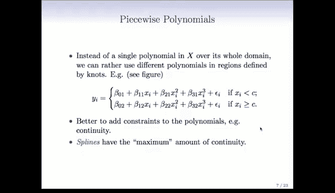

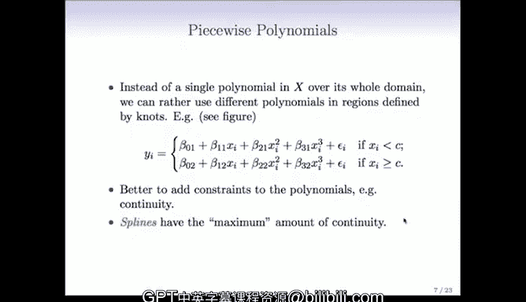

在本节课中，我们将学习两种更现代、更灵活的非线性建模方法：分段多项式和样条。我们将从基本概念入手，逐步理解它们如何通过结合局部拟合与平滑约束，来克服全局多项式回归的局限性。

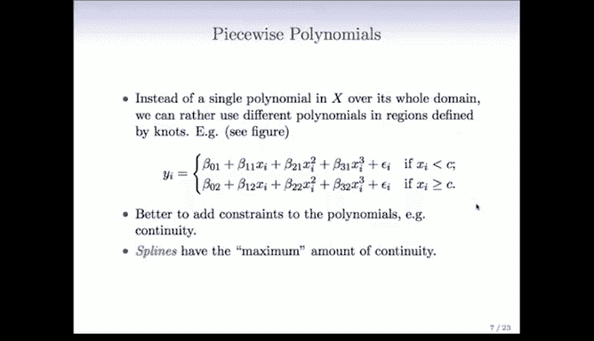

---

## 从分段常数到分段多项式

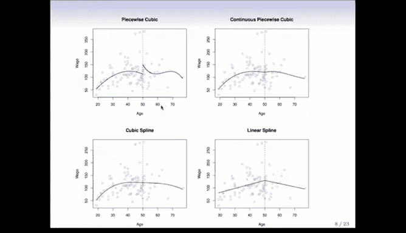

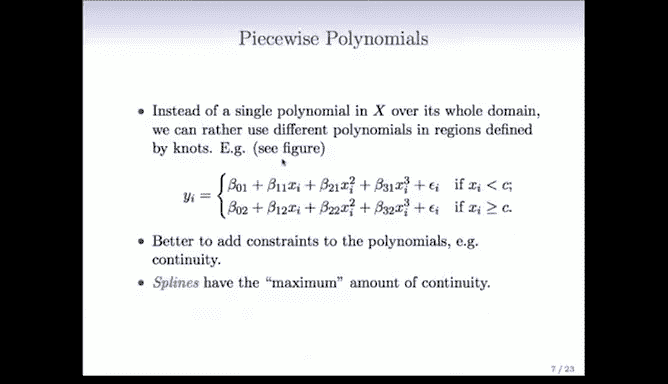

上一节我们介绍了分段常数回归，它是一种局部拟合方法。本节中我们来看看更一般的**分段多项式**。

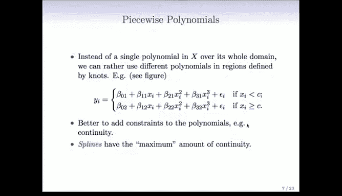

分段多项式推广了分段常数的思想。其核心在于，不在整个定义域上使用单个多项式，而是在不同的区域使用不同的多项式进行拟合。

例如，下图展示了一个在 `x=50` 处设置一个结点的分段三次多项式。它在结点左侧和右侧分别拟合了两个独立的三次多项式。


然而，这种方法存在一个明显问题：在结点处函数可能出现断裂或不连续，这通常不够美观，也不够平滑。

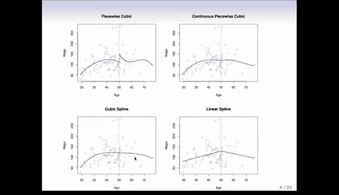

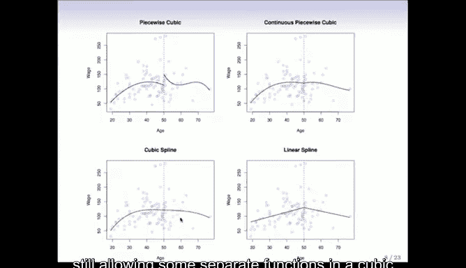

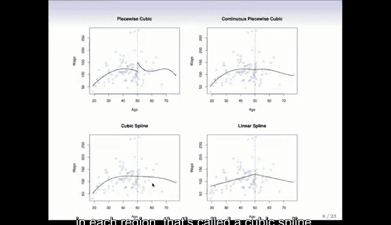

---

## 引入连续性约束：样条

为了解决分段多项式在结点处的断裂问题，我们可以为多项式添加约束，例如**连续性**。

下图右上方的面板展示了一个在结点处**强制连续**的分段三次多项式。这看起来已经好多了，开始接近全局多项式的平滑效果，但在结点处可能仍存在一个微小的“扭结”。


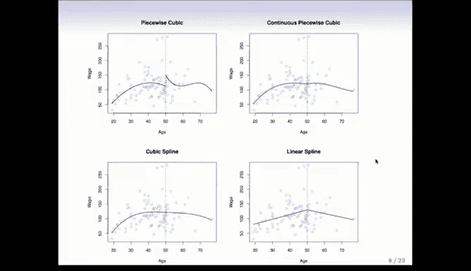

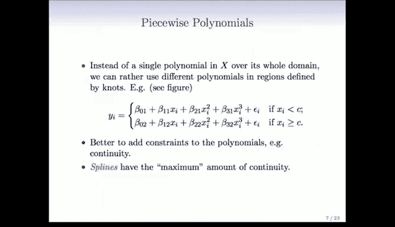

在某些情况下，仅保证函数值连续可能还不够。我们可以进一步要求**导数也连续**。

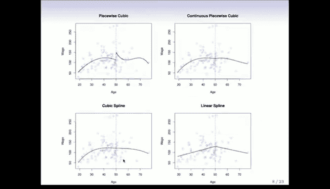

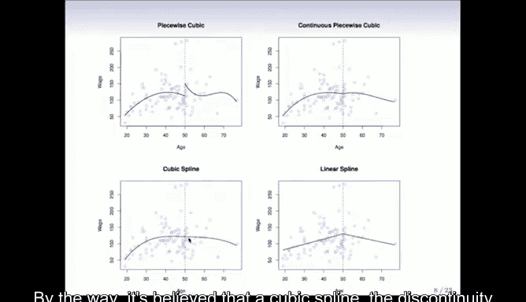

图中红色的函数被称为**三次样条**。它的定义是：在结点左右分别是三次多项式，并且在结点处满足**函数值、一阶导数和二阶导数均连续**。这总共是三个约束。

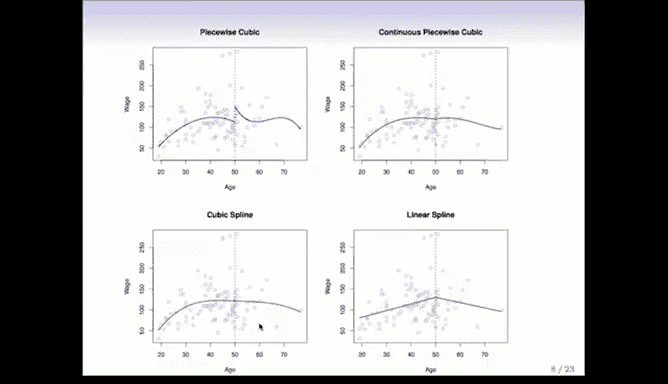

我们无法让三阶导数也连续，因为那样就会退化为一个全局的三次多项式。三次样条在保证最大程度平滑的同时，仍允许不同区域有不同的函数形式。


思路的演进过程如下：
1.  全局多项式：非局部，一端拟合受另一端数据影响。
2.  分段常数：局部，但不平滑。
3.  无约束分段多项式：局部，区域内平滑，但结点处不连续。
4.  样条：局部，并且在整个定义域内都保持平滑。

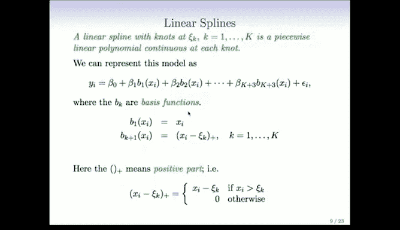

---

## 线性样条与基函数展开

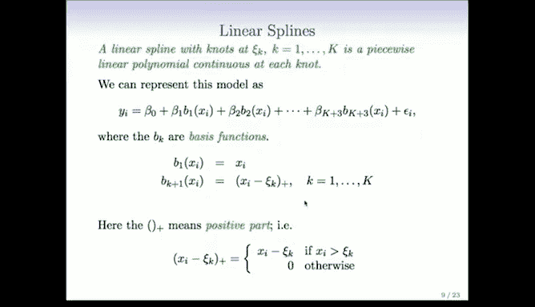

样条可以通过**基函数展开**的形式来表示，这让我们能像处理线性模型一样拟合它们。

一个在 `K` 个结点 `ξ_k` 处的**线性样条**，是一个在每个结点处连续的分段线性多项式。

它可以表示为以下基函数的线性组合：
*   全局线性项：`X`
*   `K` 个**截断幂函数**（阶数为1）：`(X - ξ_k)_+`

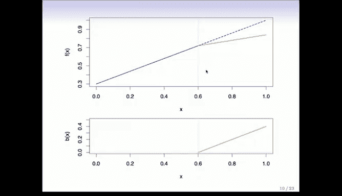

其中，截断幂函数的定义为：
```
(X - ξ_k)_+ = 
    X - ξ_k,  如果 X > ξ_k
    0,        其他情况
```

下图展示了其工作原理：蓝色线是全局线性函数，橙色线是一个截断幂基函数。当我们在线性模型中加入这个基函数及其系数时，得到的函数允许在结点处改变斜率，同时保证了连续性。

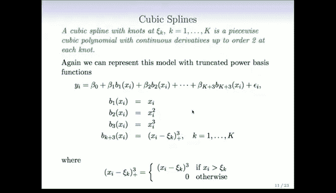


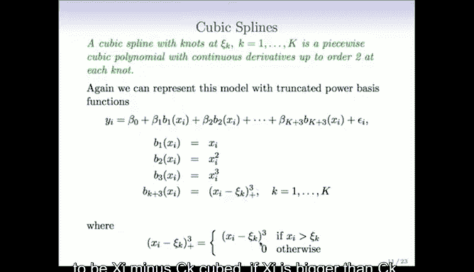

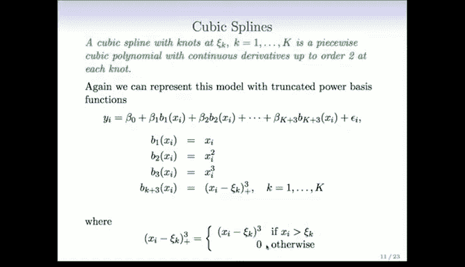

---

## 三次样条与自然三次样条

**三次样条**的定义与之类似：在 `K` 个结点处分段为三次多项式，且在结点处具有直到二阶导数的连续性。

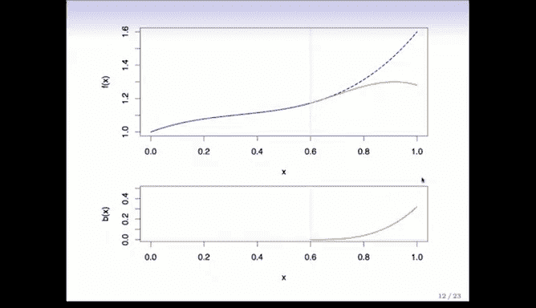

其基函数展开包括：
*   全局三次项：`X`, `X^2`, `X^3`
*   `K` 个三次截断幂函数：`(X - ξ_k)_+^3`

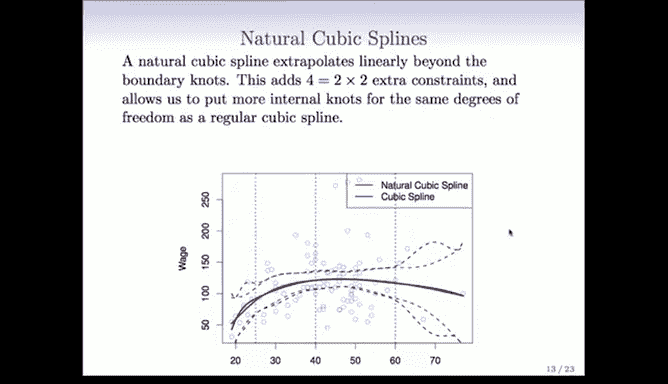

三次截断幂函数在结点处的函数值、一阶导和二阶导均为零，因此将其加入模型不会破坏所需的光滑性。

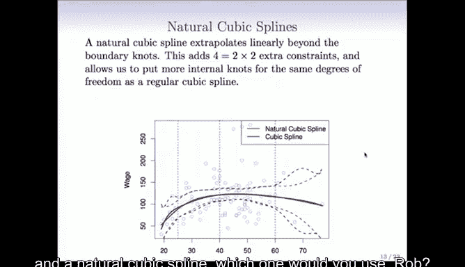


一种更常用的变体是**自然三次样条**。它在三次样条的基础上，在数据范围的**边界**额外增加了约束，强制函数在边界结点之外**线性地外推**。

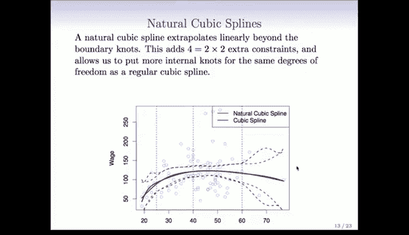

这样做的好处是：
*   防止函数在数据稀少的边界区域产生不可信的剧烈波动（避免“尾巴乱摆”）。
*   对于相同的自由度，自然样条允许在数据内部放置更多的结点，从而获得更高的灵活性。

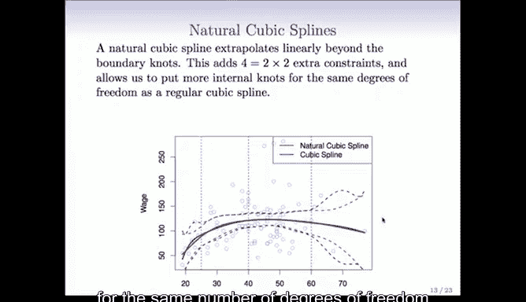

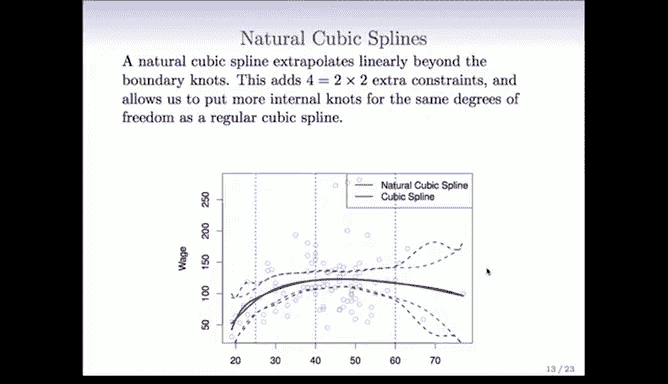

下图对比了普通三次样条和自然三次样条。在拟合函数上差异不大，但自然样条在边界处的标准误差更小，估计更稳定。

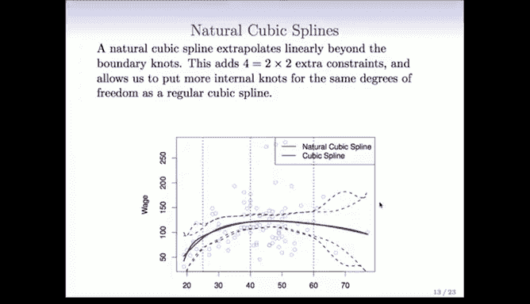

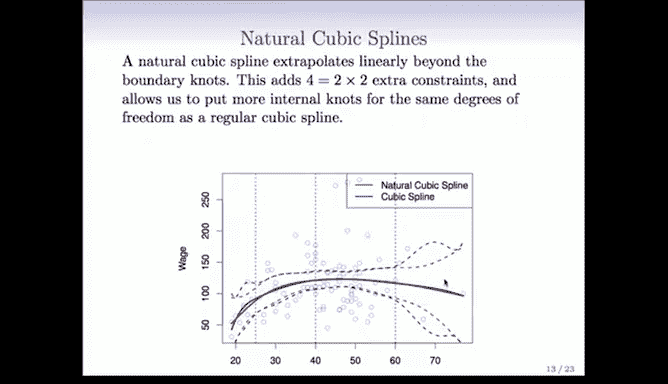


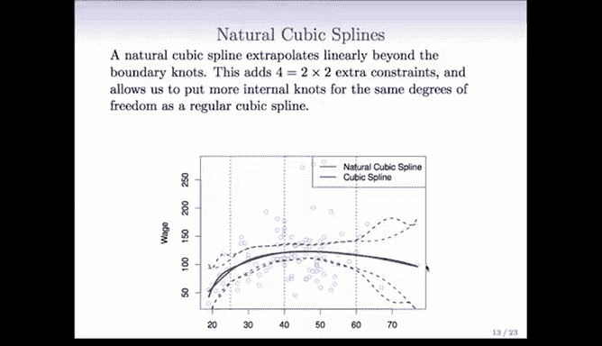

关于自由度：
*   一个有 `K` 个结点的三次样条，有 `K+4` 个自由度（或参数）。
*   一个有 `K` 个结点的自然三次样条，由于边界约束，只有 `K` 个自由度。

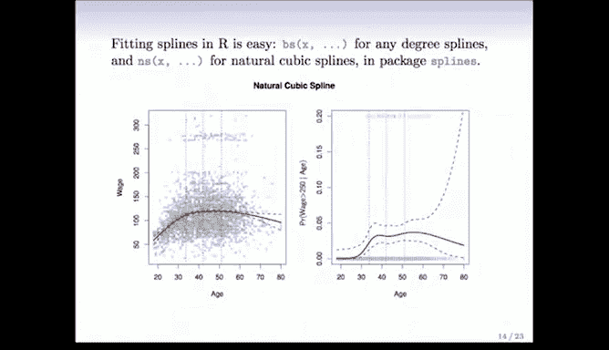

---

## 在R中实现与结点选择

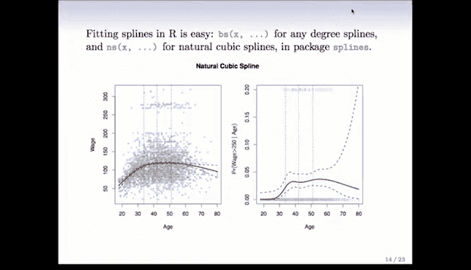

在R中拟合样条非常简单。

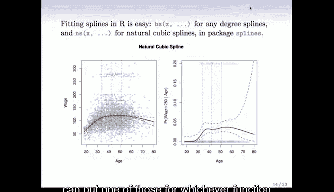

以下是使用 `splines` 包的关键函数：
*   拟合**三次样条**：使用 `bs()` 函数。
*   拟合**自然三次样条**：使用 `ns()` 函数。

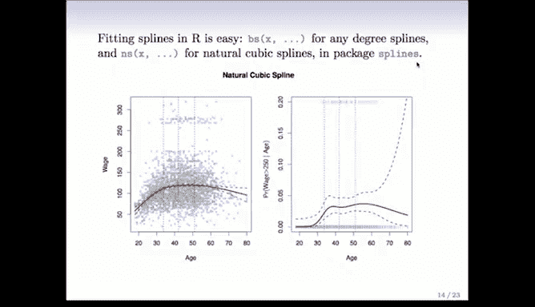

示例代码结构如下：
```r
library(splines)
# 假设使用自然三次样条拟合年龄(age)的影响
fit <- glm(y ~ ns(age, df=4), data=mydata, family=binomial)
# ns(age, df=4) 指定了自由度为4的自然样条，R会自动确定结点位置
```

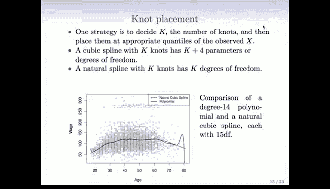


关于**结点放置**的一个常见策略是：
1.  先确定结点总数 `K`。
2.  然后将这些结点放置在预测变量 `X` 的样本分位数上（例如，均匀分布），使得每个区间包含大致相同数量的数据点。

下图对比了一个14阶的多项式和一个具有相似自由度的自然三次样条。样条曲线更加平滑，且没有多项式在边界处那种疯狂的摆动。


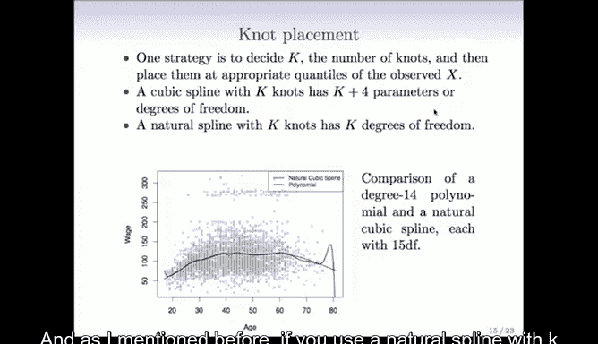

---


## 总结


本节课中我们一起学习了分段多项式和样条回归。
*   **分段多项式**通过在局部区域拟合不同多项式来增加灵活性。
*   **样条**通过施加连续性约束，解决了分段多项式在结点处不光滑的问题。
*   **线性样条**和**三次样条**是两种基本类型，可通过截断幂基函数展开，并像线性模型一样拟合。
*   **自然三次样条**通过约束边界行为，提高了外推的稳定性和内部拟合的灵活性。
*   在R中，利用 `splines` 包的 `bs()` 和 `ns()` 函数可以轻松实现样条拟合。

总体而言，虽然多项式易于理解，但样条因其良好的局部性质和光滑性，通常是更优、更实用的选择。