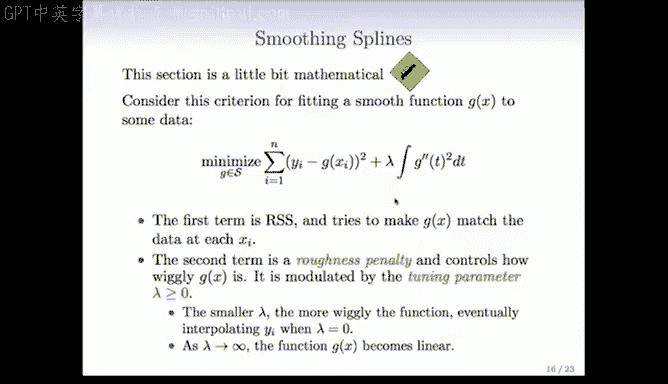
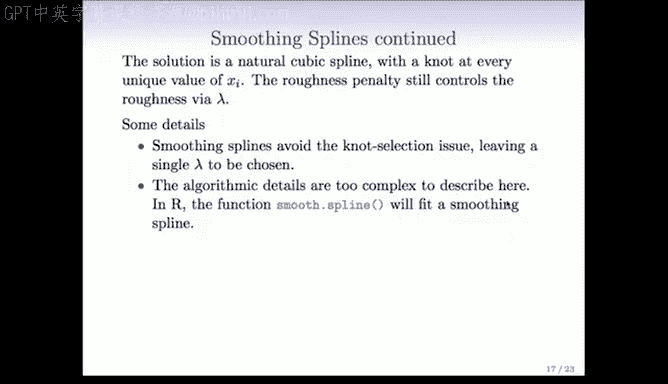
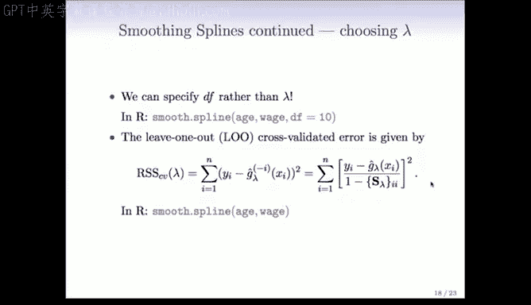
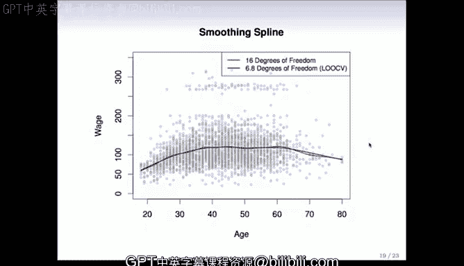

# R 版 50：平滑样条 📈

## 概述

在本节课中，我们将要学习一种称为“平滑样条”的非线性建模方法。与之前讨论的回归样条不同，平滑样条无需手动选择节点，而是通过一个称为“粗糙度惩罚”的数学准则来自动控制模型的平滑度。我们将从基本原理出发，理解其数学思想，并学习如何在R语言中应用它。

---

## 平滑样条的基本思想

上一节我们介绍了回归样条及其节点选择问题。本节中我们来看看平滑样条，它从一个完全不同的角度来解决拟合问题。

平滑样条的核心思想是：我们希望通过一个函数 `g(x)` 来拟合数据，但希望这个函数既能够很好地拟合数据点，又不会过于“摆动”或复杂。

我们通过最小化以下准则来实现这个目标：

```
RSS(g, λ) = Σ [yi - g(xi)]² + λ ∫ [g''(t)]² dt
```

这个准则由两部分组成：
1.  **第一部分**：残差平方和。它衡量函数 `g(x)` 在每个观测点 `xi` 处与观测值 `yi` 的接近程度。我们的目标是让这个值尽可能小。
2.  **第二部分**：粗糙度惩罚项。它衡量函数 `g(x)` 整体的“摆动”程度。`g''(t)` 是函数的二阶导数，它捕捉函数的曲率或非线性程度。对这个二阶导数的平方进行积分，就得到了函数在整个定义域上“不平滑”的总量。

参数 `λ` 在这里扮演着关键角色，它被称为**平滑参数**或**调谐参数**。

以下是关于参数 `λ` 如何影响模型行为的说明：
*   当 `λ = 0` 时，惩罚项不起作用。优化过程会找到一个恰好穿过所有数据点的函数（即插值函数），这个函数可能会非常“摆动”。
*   当 `λ → ∞` 时，惩罚项变得极其重要。为了最小化整个准则，函数必须让惩罚项为零，即 `g''(t) = 0` 处处成立。这意味着 `g(x)` 必须是一个线性函数。
*   当 `λ` 取中间值时，我们就在“完美拟合数据”和“保持函数平滑”之间取得了一个平衡。`λ` 越大，最终得到的函数就越平滑。

我们将这个优化问题的解称为**平滑样条**。



---

## 平滑样条的性质

一个令人惊讶且优美的事实是，上述复杂优化问题的解具有一个非常具体的数学形式。


平滑样条的解是一个**样条函数**。具体来说，它是一个具有以下性质的**三次样条**：
*   它在每一个**唯一的 `x` 观测值**处都有一个节点。
*   它在边界区域（最小和最大的 `x` 值之外）是线性的，这被称为“自然”边界条件。

初听起来，在每个数据点都设置节点似乎会导致一个极其复杂、过度拟合的模型。然而，**粗糙度惩罚项 `λ ∫ [g''(t)]² dt` 有效地控制了函数的复杂度**，防止其过度摆动。即使节点很多，惩罚项也会迫使函数保持整体平滑。

---

## 在R语言中实现平滑样条

幸运的是，我们无需手动实现复杂的数学计算。R语言提供了一个非常便捷的函数来拟合平滑样条。

以下是使用 `smooth.spline()` 函数的基本方法：

```r
# 使用默认设置（通常会自动进行交叉验证选择λ）
fit <- smooth.spline(x, y)

# 指定有效自由度（df）来间接控制平滑度
# 有效自由度类似于多项式回归中的项数，但这里用于样条
fit_df10 <- smooth.spline(x, y, df = 10)

# 直接指定平滑参数λ（较少使用）
# fit_lambda <- smooth.spline(x, y, lambda = 0.01)
```

这个函数隐藏了所有复杂的计算细节，让我们能够轻松应用这一强大的方法。



---

## 线性平滑器与有效自由度

平滑样条有一个非常重要的性质：拟合值可以写成观测响应值 `y` 的一个线性变换。

如果我们用向量 `ŷ_λ` 表示在观测点 `x` 处的拟合值，那么存在一个**平滑矩阵 `S_λ`**，使得：
```
ŷ_λ = S_λ * y
```
其中 `y` 是观测响应向量。所有我们目前学过的线性回归、多项式回归和回归样条方法，其拟合值都可以写成这种形式，它们都属于**线性平滑器**。

这个性质带来了一个好处：我们可以定义一个叫做**有效自由度**的概念。对于平滑样条，其有效自由度 `df_λ` 可以通过平滑矩阵的迹（对角线元素之和）来估计：
```
df_λ = trace(S_λ)
```

有效自由度是一个非常有用的概念：
*   它量化了模型的复杂度。
*   它类似于线性回归中预测变量的个数。
*   在 `smooth.spline()` 函数中，我们可以直接指定 `df` 参数（例如 `df=10`），函数会自动反算出对应的 `λ` 值。这比直接猜测 `λ` 的值更直观。

---

## 通过交叉验证选择平滑参数

我们如何为 `λ`（或等价的有效自由度 `df`）选择一个最优值呢？一个标准的方法是使用**交叉验证**。

对于平滑样条，**留一法交叉验证**的计算尤其高效。我们无需真正重复拟合模型 `n` 次。

留一法交叉验证误差（CV）可以通过以下公式便捷计算：
```
CV(λ) = Σ [ (yi - ŷ_i) / (1 - [S_λ]_{ii}) ]²
```
其中：
*   `ŷ_i` 是使用全部数据拟合的模型在 `xi` 处的预测值。
*   `[S_λ]_{ii}` 是平滑矩阵 `S_λ` 的第 `i` 个对角线元素。

我们只需用全部数据拟合一次模型，计算上述公式，就可以得到不同 `λ` 对应的CV误差。然后，我们选择使 `CV(λ)` 最小的那个 `λ` 值。

在R语言中，`smooth.spline()` 函数的默认行为就是使用广义交叉验证（GCV，与留一法CV非常相似）来自动选择最优的 `λ`。这使得平滑样条成为一个几乎“开箱即用”的强大工具。

---

## 示例与应用

在实际应用中，我们可以比较不同设定下的拟合结果。

例如，我们可以拟合两个平滑样条模型：
1.  一个指定了 `df=16` 的模型，它相对更灵活，可能捕捉更多细节。
2.  一个让函数通过交叉验证自动选择 `λ` 的模型，它最终可能选择了相当于 `df≈6.8` 的平滑度。

需要注意的是，有效自由度不一定必须是整数（如例子中的6.8）。这反映了平滑样条灵活分配“复杂度预算”的能力，与固定基函数（如多项式项）的模型不同。

通过绘制这两个模型的拟合曲线，我们可以直观地看到交叉验证如何帮助我们找到一个在偏差和方差之间取得更好平衡的、更平滑的模型，从而可能获得更佳的预测性能。



---

## 总结

本节课中我们一起学习了平滑样条这一重要的非参数回归技术。我们了解到：
1.  平滑样条通过最小化一个结合了**拟合优度**（残差平方和）和**平滑度**（二阶导数积分惩罚）的准则来拟合数据。
2.  其解是一个在**每个独特数据点处都有节点**的**自然三次样条**，但粗糙度惩罚有效控制了模型的复杂度。
3.  平滑参数 `λ` 控制着平滑程度，其值可以通过**交叉验证**自动选择。
4.  平滑样条是一个**线性平滑器**，具有**有效自由度**的概念，这有助于我们理解模型复杂度。
5.  在R语言中，可以方便地使用 `smooth.spline()` 函数来拟合平滑样条，并利用其默认的交叉验证功能获得稳健的结果。



平滑样条因其数学上的优雅和实际应用的便捷性，成为了统计学家和数据科学家工具箱中一件处理非线性关系的利器。