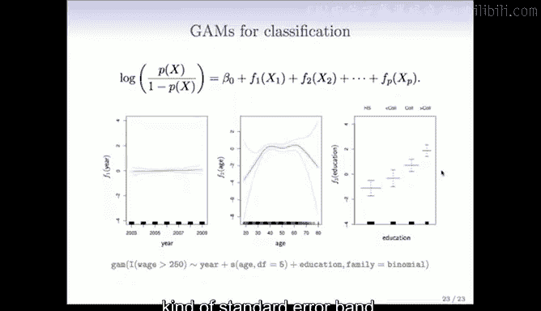

# R 版 51：广义可加模型与局部回归 📊

在本节课中，我们将学习两种用于拟合非线性关系的强大方法：局部回归和广义可加模型。我们将了解它们的基本思想、如何实现以及各自的优势。

## 局部回归

上一节我们介绍了多种拟合非线性函数的方法。本节中我们来看看另一种方法家族：局部回归。局部回归的核心思想是，在数据的每个目标点附近，仅使用该邻域内的数据点拟合一个简单的模型（如线性函数），然后通过滑动目标点来构建出整体的非线性拟合曲线。

以下是局部回归的工作原理：
1.  选择一个目标点（例如，上图中的橙色点）。
2.  定义一个围绕该目标点的“邻域”（窗口），邻域内的点（橙色点）将用于拟合。
3.  使用加权最小二乘法在该邻域内拟合一个线性函数。权重由核函数决定，距离目标点越近的点权重越高。
4.  计算该目标点处的拟合值。
5.  将目标点沿X轴滑动，重复上述过程。随着目标点移动，整个邻域和拟合的线性函数也随之移动。
6.  将所有目标点处的拟合值连接起来，就形成了最终的拟合曲线（上图中的橙色曲线）。

局部回归（尤其是局部线性回归）相比局部常数拟合（如移动平均）的优势在于，它在数据边界处的表现更好，能提供更合理的推断。

在R语言中，可以使用 `lowess()` 函数或 `loess()` 函数来执行局部回归。局部回归和三次平滑样条是两种最优秀的平滑方法，当设置相同的自由度时，它们的结果通常非常相似。

## 广义可加模型

局部回归专注于单变量的非线性拟合。现在，我们将视野扩展到多变量，介绍广义可加模型。GAMs 的核心思想是，对多个预测变量分别拟合非线性函数，同时保持模型的**可加性**。这意味着模型的输出是各个变量非线性函数的和，这使得模型结果像线性模型一样易于解释。

一个典型的GAM模型形式如下：
`Y = β0 + f1(X1) + f2(X2) + ... + fp(Xp) + ε`
其中，`f1()`, `f2()`, ..., `fp()` 是各个预测变量的平滑函数。

拟合GAM模型后，我们可以分别绘制每个变量的函数贡献图，从而直观地理解每个变量如何影响响应变量。例如，在一个预测工资的模型中，我们可以分别看到年份、年龄和教育水平的独立影响。

### 如何拟合GAM

你可以轻松地使用之前学过的工具（如自然样条）来拟合GAM。以下是一个使用 `lm()` 函数拟合加性模型的例子：
```r
lm(wage ~ ns(year, df=5) + ns(age, df=5) + education, data=Wage)
```
这里，`ns(year, df=5)` 为 `year` 变量生成一个具有5个自由度的自然三次样条基矩阵。`education` 是因子变量，会自动拟合为分段常数函数。

**注意**：使用 `plot()` 函数绘制此模型会得到线性模型的诊断图。要绘制每个变量的函数贡献图，需要使用 `plot.gam()` 函数。

### 使用 `gam` 包进行更灵活的拟合

`gam` 包提供了更直接的接口和更多的平滑器选择。例如：
```r
gam(wage ~ s(year, df=5) + lo(age, span=0.5) + education, data=Wage)
```
这里，`s(year, df=5)` 指定对 `year` 使用平滑样条（5个自由度），`lo(age, span=0.5)` 指定对 `age` 使用局部回归（窗口宽度为数据范围的50%）。

### 在GAM中加入交互作用

标准的GAM是加性的，不包含交互项。但你可以通过多种方式引入交互作用，例如使用二元平滑器。一种方法是使用自然样条的张量积来创建二元函数：
```r
lm(wage ~ ns(age, df=5) * ns(year, df=5) + education, data=Wage)
```
这会生成一个关于 `age` 和 `year` 的交互曲面。

### 用于分类的GAM



GAM同样可以应用于分类问题（如逻辑回归）。此时，我们是对概率的对数几率（logit）拟合一个加性模型。在绘制结果时，图形显示的是各个变量对对数几率的贡献。
```r
gam(I(wage>250) ~ year + s(age, df=5) + education, family=binomial, data=Wage)
```
这里，`family=binomial` 指定了这是一个逻辑回归模型。

## 总结


本节课中我们一起学习了两种强大的非线性建模工具。**局部回归**通过在数据的局部邻域内拟合简单模型来构建整体曲线，特别擅长处理边界。**广义可加模型**则将这种非线性拟合扩展到多个变量，同时保持模型的可加性和可解释性，允许我们分别审视每个变量的影响。在R中，我们可以使用 `lm()` 结合样条基、专门的 `gam` 包或 `mgcv` 包来拟合这些模型。这些工具为我们处理复杂的现实数据关系提供了极大的灵活性。在接下来的章节中，我们将探讨基于树的方法，它们擅长捕捉变量之间的交互作用和非线性组合。