# R 版 54：基于树的方法 🌳

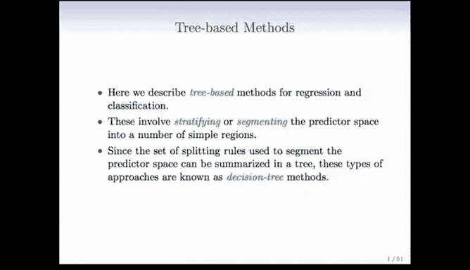

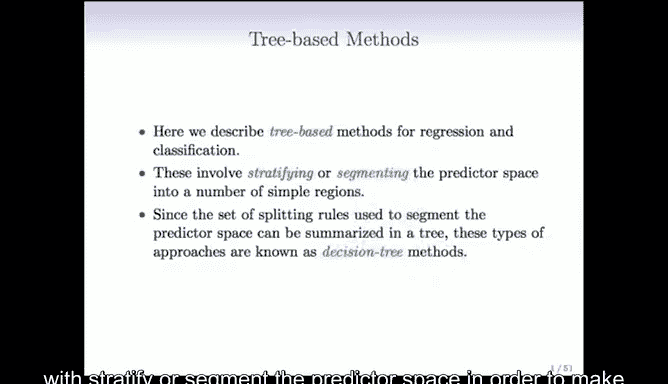

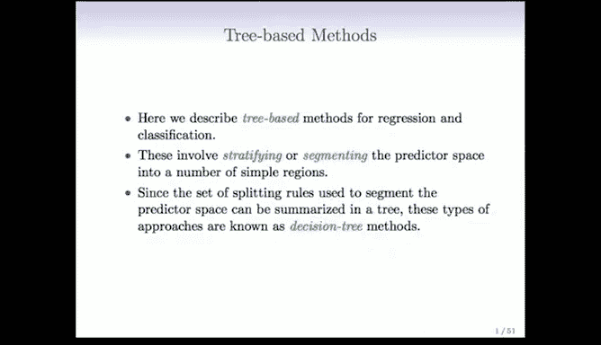

在本节课中，我们将学习《统计学习导论》第八章的内容：基于树的回归与分类方法。我们将看到，这些监督学习方法通过对预测变量空间进行分层或分割来进行预测，形成所谓的决策树。我们将首先介绍决策树的基本概念，然后探讨如何通过集成方法（如装袋法、随机森林和提升法）来提升其预测性能。

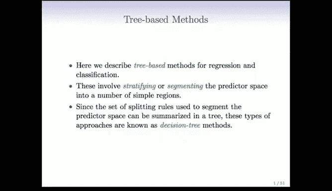

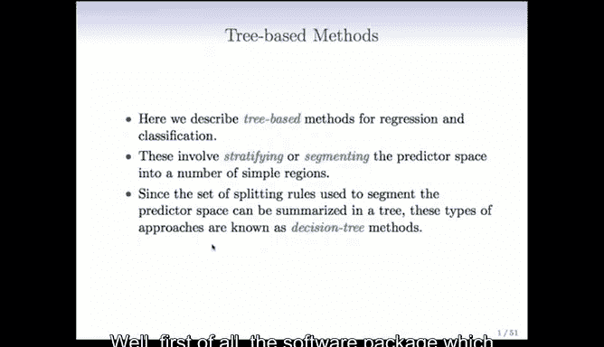

---

## 决策树的基本思想

上一节我们概述了课程内容，本节中我们来看看决策树的核心思想。这种方法既适用于回归问题，也适用于分类问题。我们将从回归问题开始。

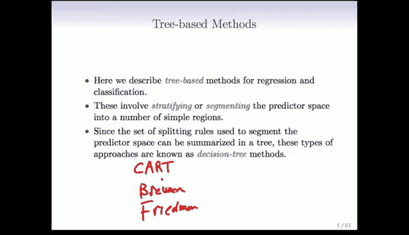

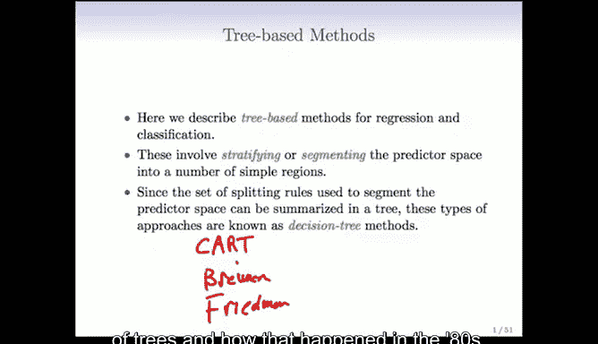

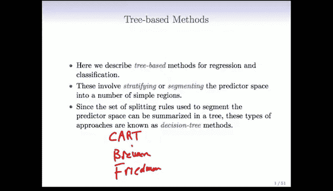

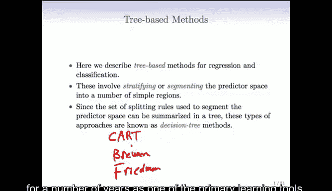

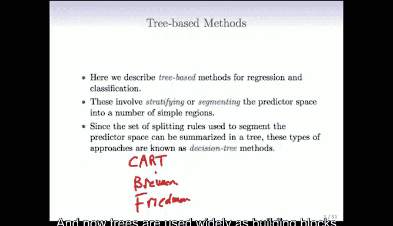

在看到一个具体的树之前，让我们思考如何对数据进行分层。以棒球数据为例，响应变量是薪资，我们用颜色编码表示，蓝色和绿色代表低薪资，黄色和红色代表高薪资。每个球员有两个预测变量：在联盟中的年限和每个赛季的安打数。我们的目标是根据这两个预测变量来预测薪资。

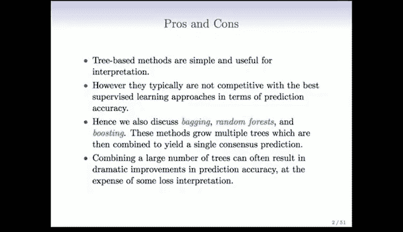

如果我们想将高薪资和低薪资球员分开，可以怎么做？观察数据，高薪资球员似乎集中在图的右上方。一个直观的做法是在某个点进行分割。例如，首先根据“年限”进行分割，将预测空间分为两个区域。左边的区域主要是低薪资球员，右边的区域则混合了高、低薪资球员。为了进一步区分，可以在右边区域再根据“安打数”进行一次分割。这样，我们就得到了三个区域，分别对应高、中、低三种薪资水平。

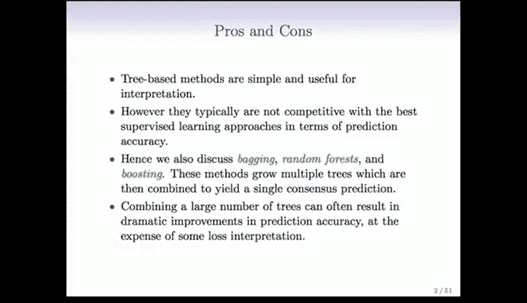

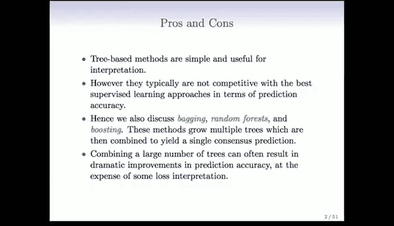

这正是决策树算法的思想。接下来，我们将看到算法自动生成的决策树。

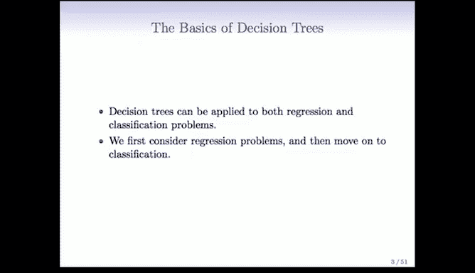

---

## 一个决策树的例子

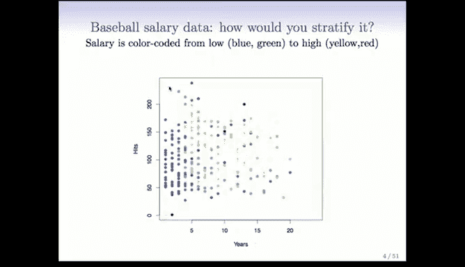

以下是应用决策树算法后得到的结果，它与我们手动分割的思路非常相似。

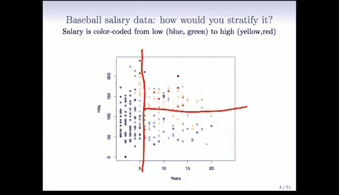

这棵树是一系列的分割。在顶部，我们拥有所有数据。第一个分割条件是“年限是否小于4.5年”。这个条件将数据分为左右两支：
*   左支：联盟经验少于4.5年的球员。
*   右支：联盟经验多于4.5年的球员。

这大致对应了我们之前手动画出的第一条分割线。

在右支，算法进行了第二次分割，条件是“安打数是否小于117.5”。这样，右支又被分为两支：
*   右下支：经验丰富（>4.5年）但安打数较少（<117.5）的球员。
*   右上支：经验丰富且安打数也多的球员。

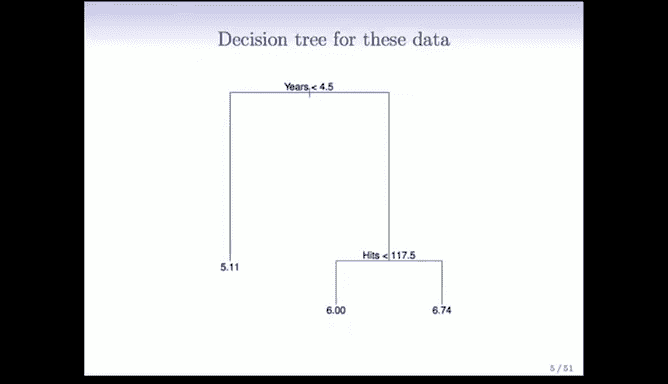

最终，我们得到了三个“终端节点”（树叶），分别对应三个区域，并计算了每个区域内球员的平均对数薪资作为预测值。这三个区域与我们手动划分的结果几乎一致。

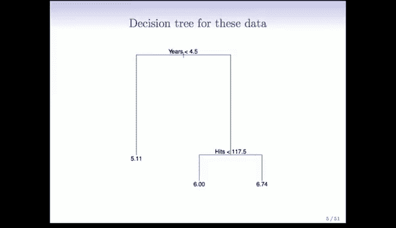

---

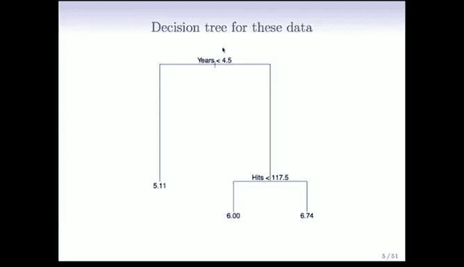

## 决策树的术语与解释

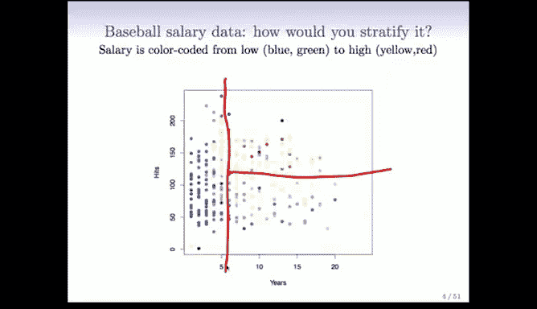

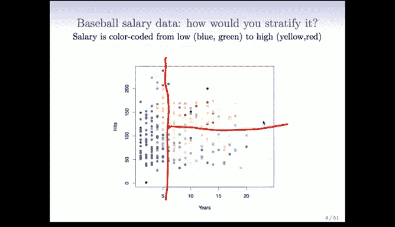

现在我们已经看到了一个具体的树，让我们来了解一些术语并学习如何解释它。

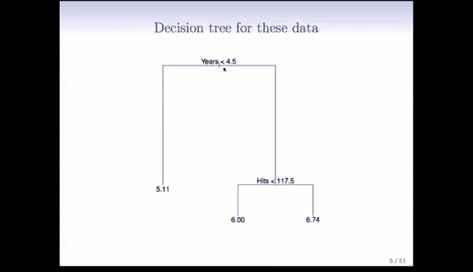

*   **终端节点/叶节点**：位于树底部的节点，不再进行进一步分割。每个叶节点代表预测空间的一个区域，其预测值是落入该区域所有观测值的响应变量平均值。在我们的例子中，有三个叶节点。
*   **内部节点**：非终端节点，表示一个分割点。我们的树有两个内部节点。

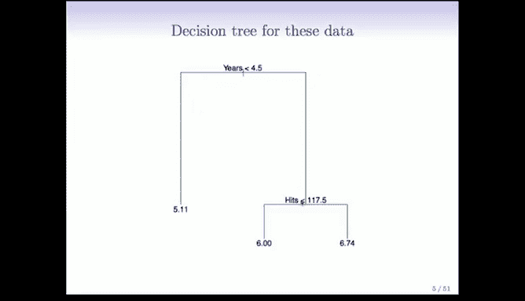

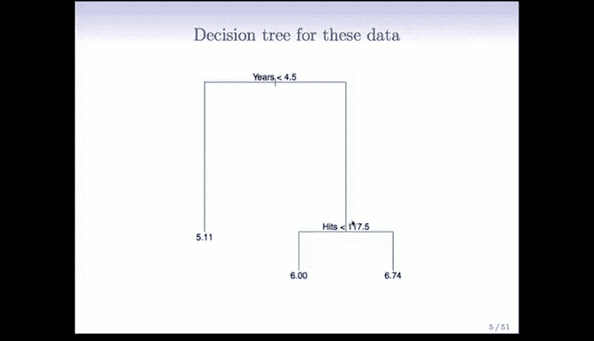

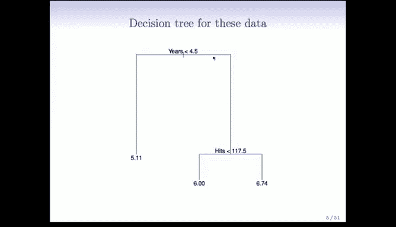

如何解释这棵树？
1.  首先根据“年限”分割，这表明“年限”是决定薪资的最重要因素。经验较少的球员薪资较低。
2.  在左支（经验少），我们没有进一步分割，这意味着对于经验少的球员，“安打数”对薪资的影响不大。
3.  在右支（经验多），我们根据“安打数”进行了二次分割。这表明对于经验丰富的球员，“安打数”变得重要，可以进一步区分他们的薪资水平。

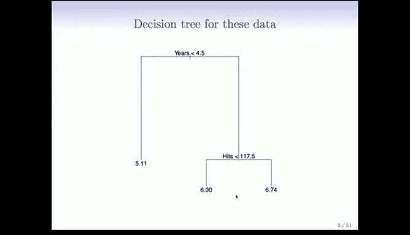

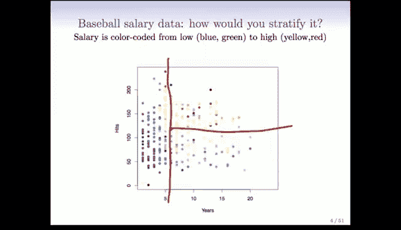

决策树的优点在于其**简单直观**，易于展示和解释，即使对于不熟悉数学的协作者也是如此。模型本身就是这棵树，不需要复杂的方程式来总结。

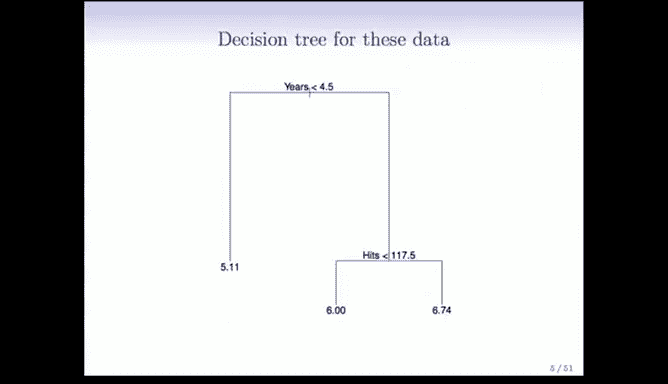

然而，这种简单性也是一把双刃剑。单个决策树作为预测模型，其性能通常不如其他更复杂的方法（如线性回归或支持向量机）。但正如我们将在后续课程中看到的，通过组合多棵树（集成方法），可以显著提升预测性能。

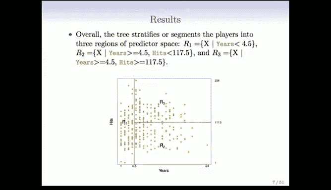

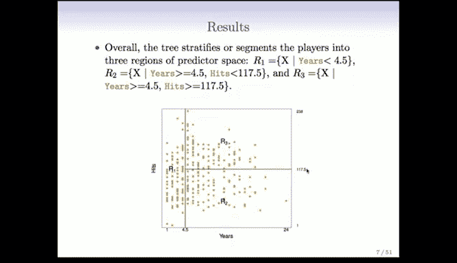

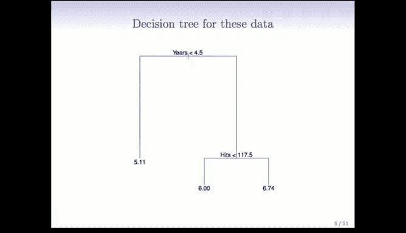

---

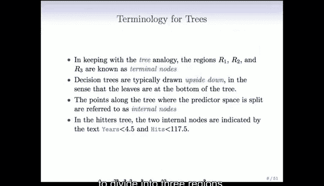

## 树是如何构建的？

我们直观地理解了决策树，那么算法是如何自动构建它的呢？本节我们来探讨其背后的原理。

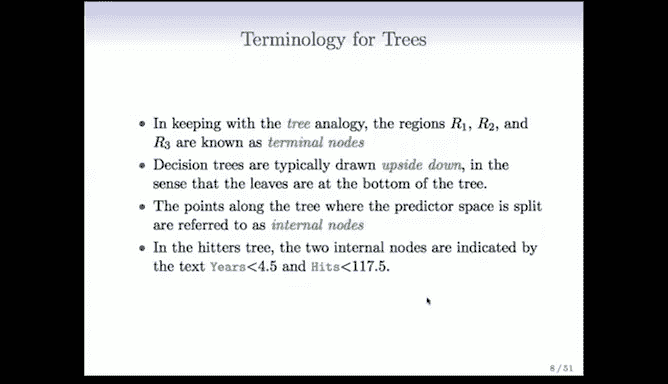

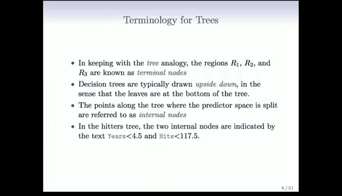

从概念上讲，我们希望将预测变量空间划分为 **J** 个不重叠的区域（或“盒子”）。对于回归树，落入第 **j** 个区域 **R_j** 的观测值，其预测值就是该区域内所有观测响应值的平均值，记作 **ŷ_{R_j}**。

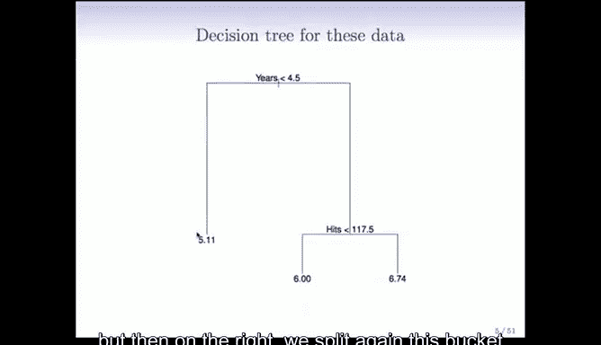

一个理想的目标是找到这些区域，使得所有区域内观测值与其区域均值的差异总和最小。用公式表示，即最小化：
**∑_{j=1}^J ∑_{i ∈ R_j} (y_i - ŷ_{R_j})^2**

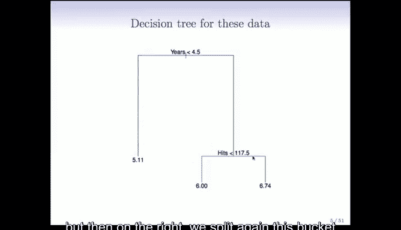

这很合理，因为我们希望每个区域内的观测值尽可能相似（同质），而不同区域间的观测值差异较大。

然而，**穷举所有可能的区域划分在计算上是不可行的**。可能的划分方式数量会随着变量和样本数的增加而爆炸式增长。

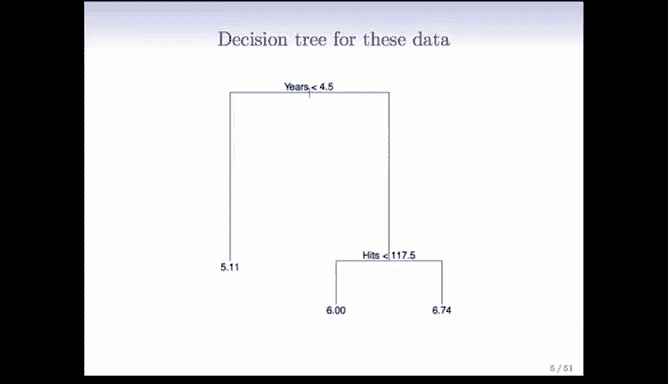

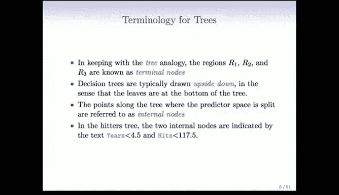

因此，决策树采用了一种**自上而下、贪心**的近似算法：
*   **自上而下**：从包含所有数据的根节点开始，逐层进行分割。
*   **贪心**：在每一步，算法只寻找当前节点上的“最佳”分割，而不是全局最优分割。它不会回溯去修改之前的分割决定。

以下是构建回归树的具体步骤：

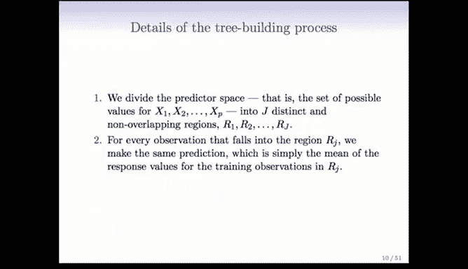

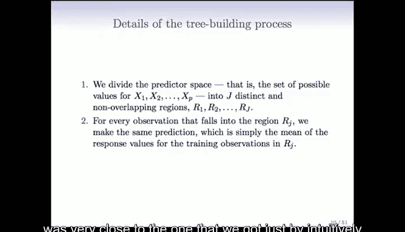

1.  **选择最佳分割**：从根节点（所有数据）开始。对于每一个预测变量 **X_j** 和每一个可能的切分点 **s**，将数据分成两个区域：**R1(j, s) = {X | X_j < s}** 和 **R2(j, s) = {X | X_j ≥ s}**。我们寻找能够使下式最小的 **j** 和 **s**：
    **∑_{i: x_i ∈ R1} (y_i - ŷ_{R1})^2 + ∑_{i: x_i ∈ R2} (y_i - ŷ_{R2})^2**
    其中 **ŷ_{R1}** 和 **ŷ_{R2}** 分别是两个区域内的响应均值。
2.  **递归分割**：对第一步产生的两个新区域，重复步骤1的过程。
3.  **停止条件**：持续分割，直到满足某个停止条件（例如，节点中的样本数少于某个最小值，或分割带来的改进小于某个阈值）。这样会生成一棵可能很大的树。

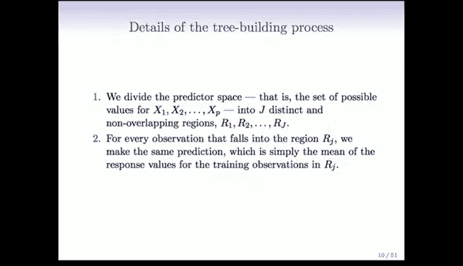

在我们的棒球例子中，算法首先找到了“年限=4.5”这个最佳分割点。然后在右子节点中，又找到了“安打数=117.5”这个最佳分割点。

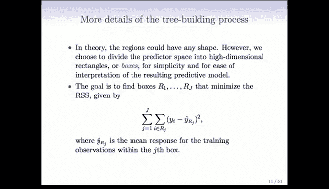

---

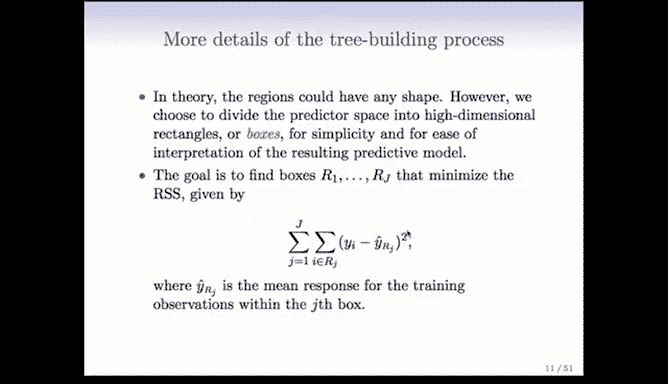

## 树的大小与剪枝

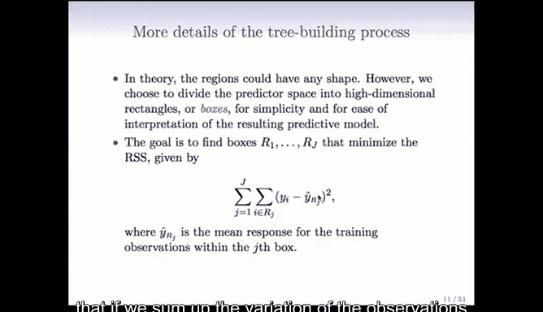

通过上述贪心算法，我们可能会得到一棵非常大的树。大树虽然对训练数据拟合得很好，但容易导致**过拟合**，即在未知数据上表现不佳。因此，我们需要控制树的大小。

直接在上一步设定严格的停止规则（预剪枝）可能效果不佳，因为一个当前看似无用的分割，可能会为后续非常有价值的分裂奠定基础。

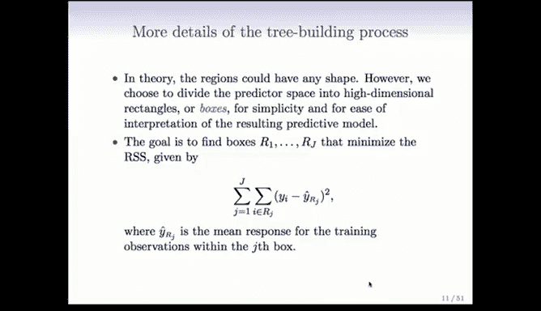

更好的策略是：
1.  **先长成一棵很大的树**，直到每个终端节点包含的观测值数量很少（例如5个）。
2.  **然后对树进行剪枝**，得到一个最优大小的子树。

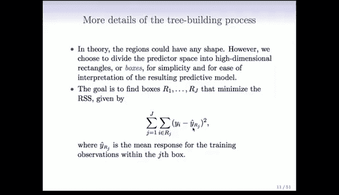

剪枝通常使用**成本复杂度剪枝**（也称最弱联系剪枝）。其思想是，我们不仅希望终端节点的残差平方和小，还希望树本身不要太复杂。因此，我们最小化一个考虑了树复杂度惩罚项的目标函数：
**∑_{m=1}^{|T|} ∑_{i: x_i ∈ R_m} (y_i - ŷ_{R_m})^2 + α|T|**
其中：
*   **|T|** 表示树 **T** 的终端节点数量，衡量树的复杂度。
*   **α** 是一个调节参数，控制拟合优度与复杂度之间的权衡。**α=0** 对应那棵最大的树；**α** 越大，树就越小。

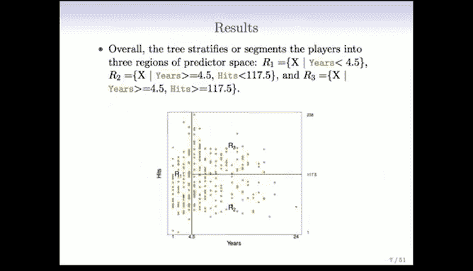

通过交叉验证可以为 **α** 选择一个合适的值，从而确定最终最优的树。我们之前看到的棒球薪资树（3个终端节点），很可能就是经过剪枝后的结果。

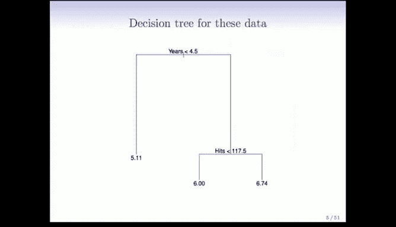

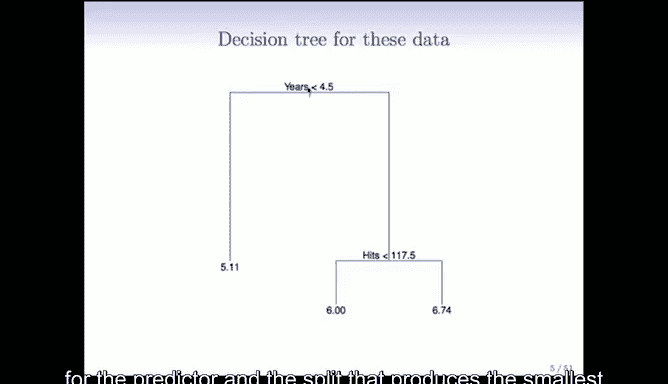

---

## 总结

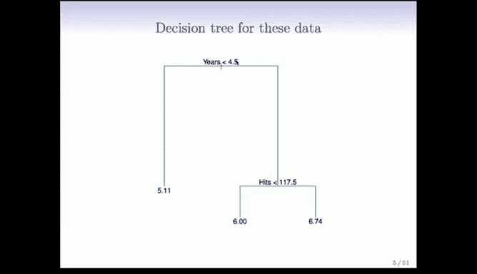

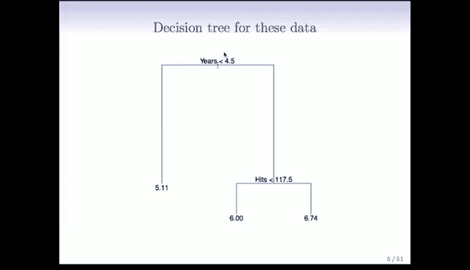

本节课中，我们一起学习了基于树的方法的基础知识。

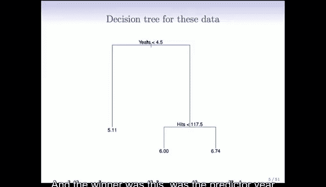

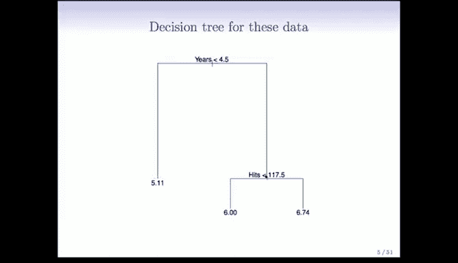

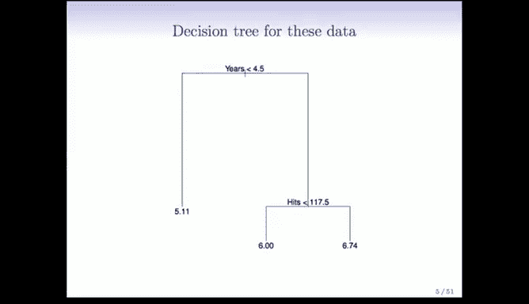

*   我们首先了解了**决策树**的核心思想：通过一系列**if-then**规则对预测空间进行矩形分割，从而进行预测。
*   我们通过一个**棒球薪资预测**的例子，直观地看到了决策树的分割过程以及如何解释生成的树结构。
*   我们学习了决策树的**术语**，如根节点、内部节点、终端节点（叶节点）。
*   我们探讨了回归树的**构建算法**，它是一种**自上而下、贪心**的递归二分法，旨在每一步最小化区域内的残差平方和。
*   最后，我们讨论了控制树复杂度的重要性，并介绍了**成本复杂度剪枝**方法，以防止模型过拟合。

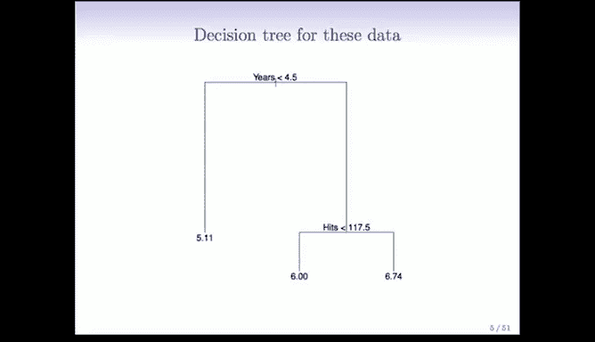

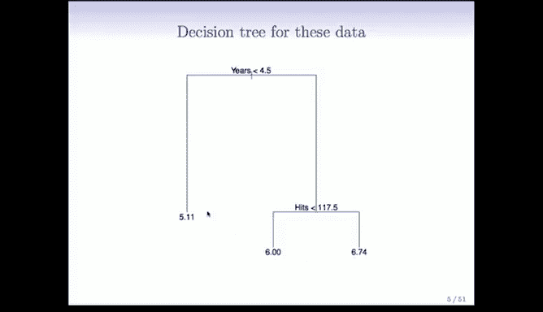

决策树模型简单、易于解释，但作为独立的预测模型往往不够精确。在接下来的课程中，我们将看到如何通过组合多棵决策树（集成学习）来构建更强大、更精确的模型，例如装袋法、随机森林和提升法。