# R 版 55：决策树算法详解 🌳

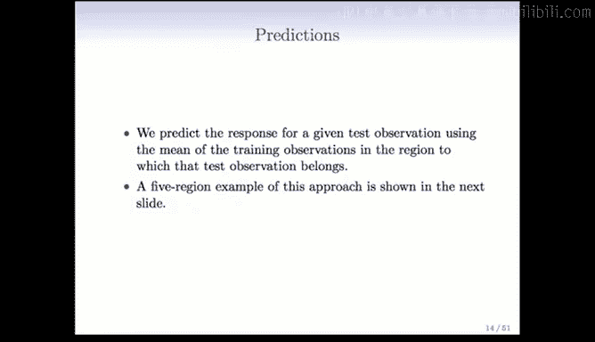

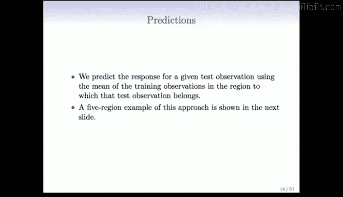

在本节课中，我们将深入学习决策树算法的更多细节，包括如何构建树、如何预测、如何确定树的大小以及如何通过剪枝来优化模型性能。

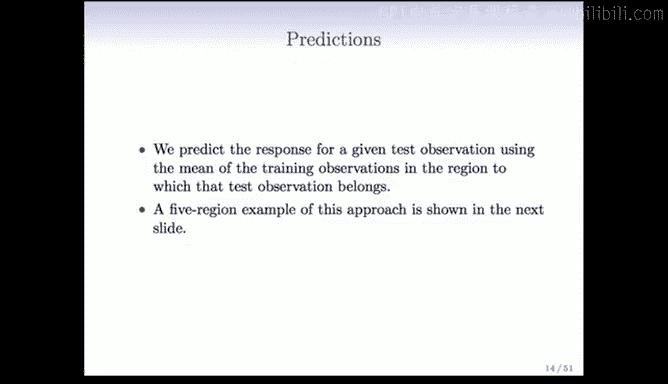

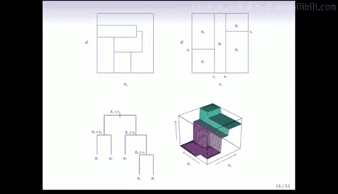

---

## 预测过程

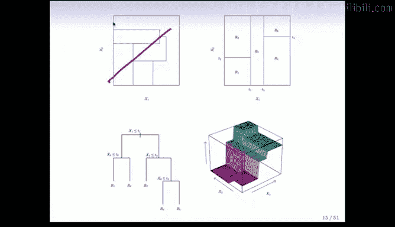

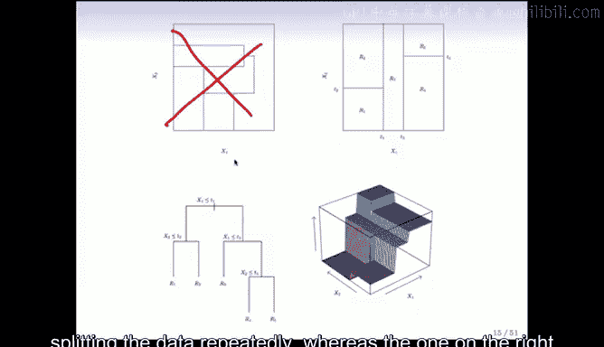

上一节我们介绍了决策树的基本概念，本节中我们来看看如何使用构建好的树进行预测。

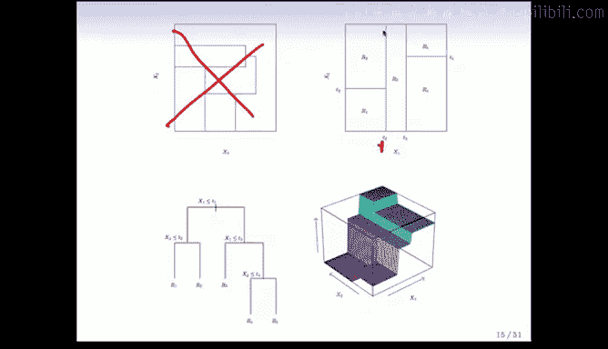

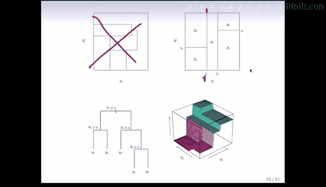

在任何时候，一旦树被构建完成，你可以通过将测试观测值沿着树向下传递来进行预测。这个过程需要遵守每一个分裂规则。

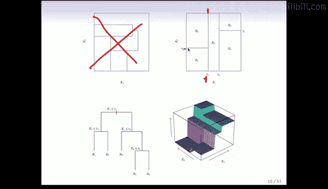

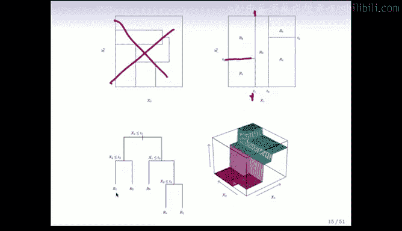

观测值最终会到达一个终端节点（叶节点），然后你将使用该区域内训练观测值的**均值**来进行预测。

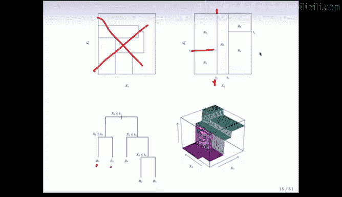

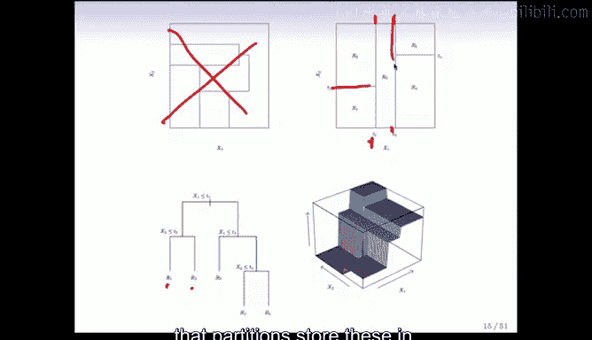

---

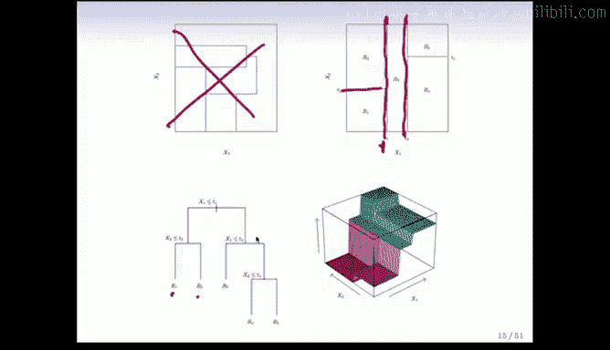

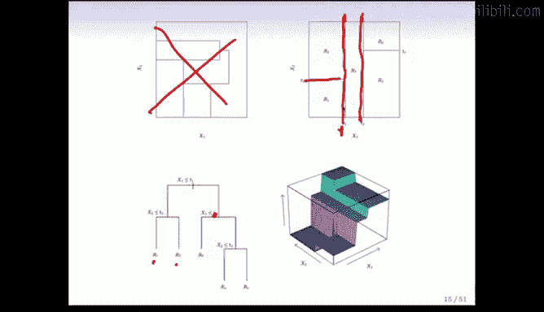

## 一个更详细的例子

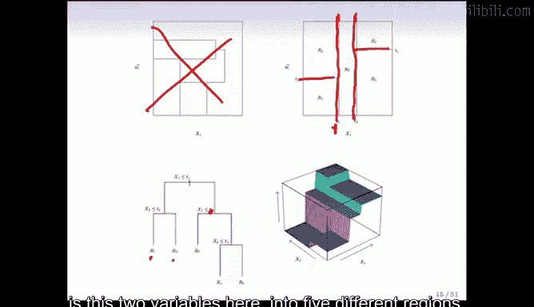

为了更好地理解这个过程，让我们看一个稍大一些的示意图例子。

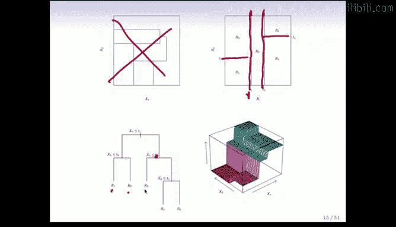

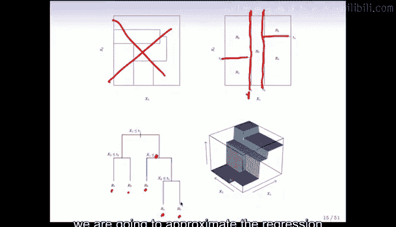

在下一张幻灯片中，我们展示了一个二维特征空间（X1, X2）的例子。左侧面板展示了一个无法通过决策树分裂过程实现的区域划分。这个划分之所以无法实现，是因为这些区域不是通过反复、顺序地分割数据得到的“盒子”。

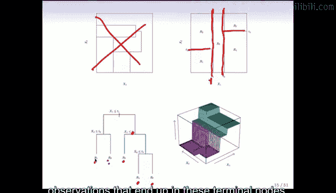

而右侧的划分则是可以实现的。如果你将右侧的划分与左下角的树结构结合起来看，你会发现第一个分裂发生在 **T1** 处。这是一个在 X1 上的垂直分裂。

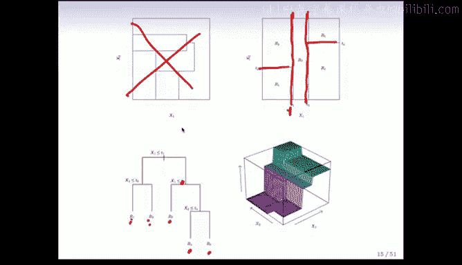

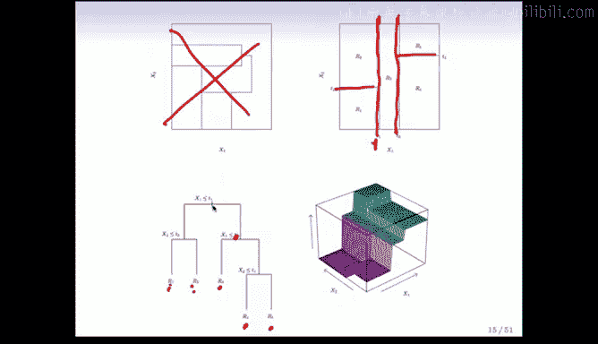

这个分裂将整个区域（包含变量 X1 和 X2）分成了左右两个部分。

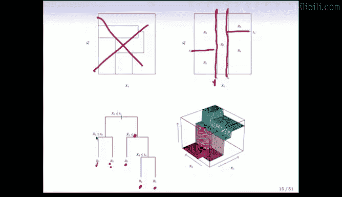

接着，我们在 **T2** 处对 X2 进行分裂，将左边的盒子进一步分成两个区域。这样就得到了区域 1 和区域 2。

然后，在由 T1 分裂产生的右侧分区中，我们再次在 **T3** 处对 X1 进行分裂，进行另一个垂直分割。

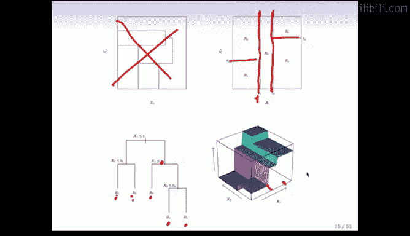

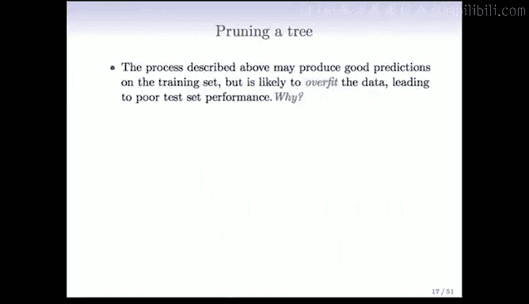

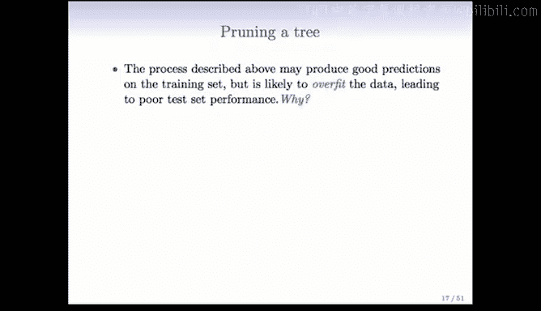

最后，在右侧我们再进行一次分裂，即在 **T4** 处对 X2 进行分裂，将其分成两部分。

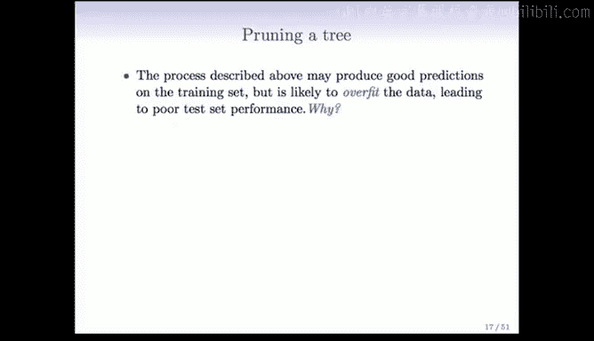

通过这种顺序的、贪婪的方式，我们将这个二维空间细分为五个不同的区域。

---

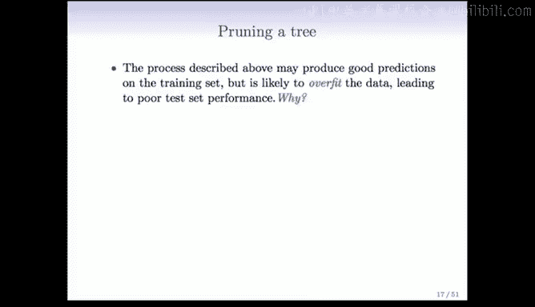

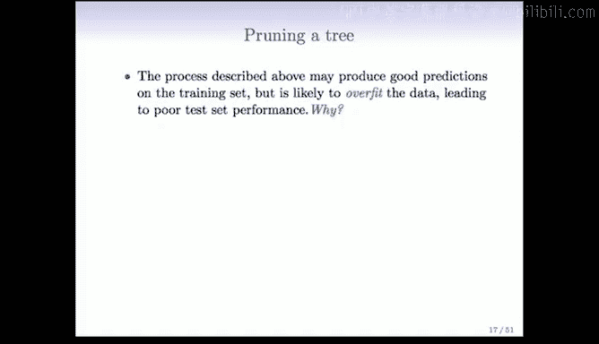

## 函数表示与预测

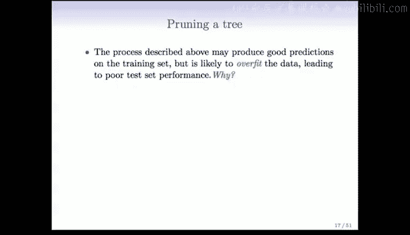

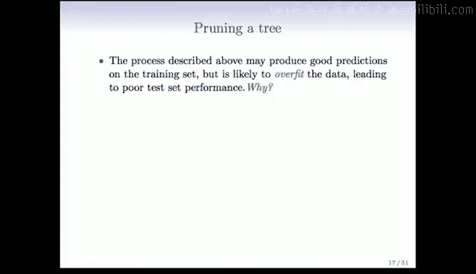

在每个终端节点，我们将用落入该节点的训练观测值的**均值**来近似回归函数。

这意味着，如果你有一个测试观测值并想预测它，你需要从树的顶部开始。首先查询它的 X1 值：如果小于 T1，则向左走；否则向右走。

同样地，你在每个内部节点回答相应的问题，最终会落入其中一个区域。你的预测值将是该区域内训练观测值的均值。

作为一个函数，我们可以很好地表示它，因为它只是一个二维函数，如我们右侧的图所示。它是一个**分段常数函数**。你可以看到，函数在每个区域内是恒定的，这就是我们最终表示函数的方式。

---

## 如何确定树的大小？

我们已经看到了如何生长一棵树。随之而来的一个问题是：树应该有多大？

一种可能性是尽可能大地生长树。极端情况下，我们可以让每个终端节点（叶节点）只包含一个观测值。

但这很可能会导致**过拟合**，从而在测试集上表现不佳。原因很明显：如果一棵树大到每个观测值都有自己的节点，那么它的训练误差将为 0。它过于适应训练数据，当面对新的测试数据时，可能会产生很高的误差。因此，尽可能大地建树并不是一个好主意。

另一种可能性是**提前停止**。换句话说，持续分裂，直到看起来没有任何分裂能有效减少残差平方和（这是我们之前看到的准则）。

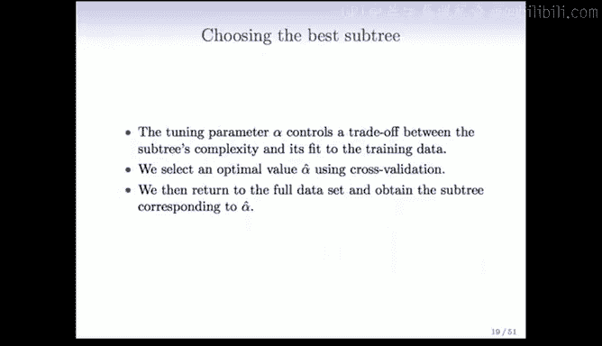

但事实证明，这种策略可能过于短视，经常会过早停止。因为有时看起来没有好的分裂可用，但如果我们继续分裂，可能会在树的更深处发现更好的分裂。

因此，一个更好的策略实际上是先生长一棵大树（例如，使用一个简单的停止规则，如终端节点必须包含不少于 5 个观测值），然后对这棵可能过大的树进行**剪枝**，以产生一棵中等大小的树。这试图在偏差和方差之间取得平衡，从而获得比单节点树或极端大树更低的预测误差。

---

## 成本复杂度剪枝

在 CART 软件或 R 语言的 `tree` 包中，采用的就是这种“先建大树，后剪枝”的思想。其框架称为**成本复杂度剪枝**或**最弱连接剪枝**。

为此，我们构建一个类似于 LASSO 回归的目标函数。我们希望模型拟合得好（用各终端节点内观测值响应值围绕其均值的平方和来衡量），但同时也要控制树的复杂度（用树的终端节点数量来衡量）。

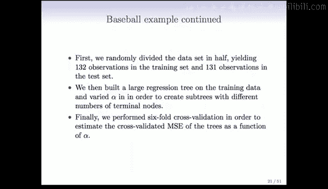

我们定义目标函数如下：

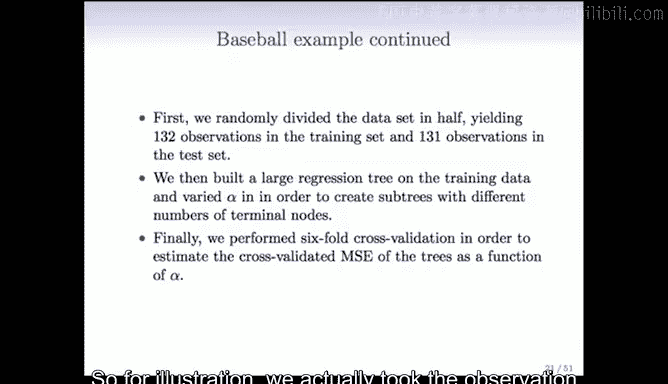

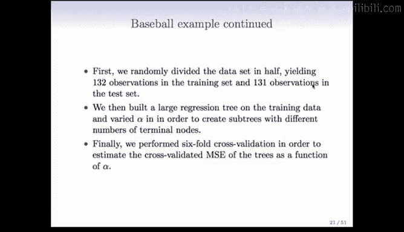

`RSS + α * |T|`

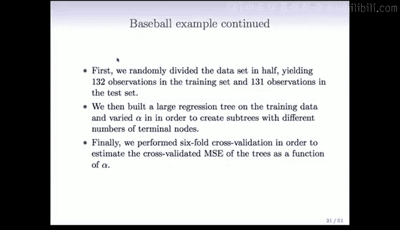

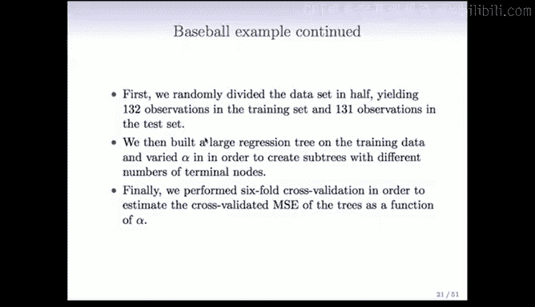

其中：
*   `RSS` 是残差平方和，衡量拟合优度。
*   `|T|` 是树 T 中终端节点的数量，衡量模型复杂度。
*   `α` 是一个调节参数，用于权衡拟合优度与树的大小。`α` 越大，对复杂树的惩罚越重。

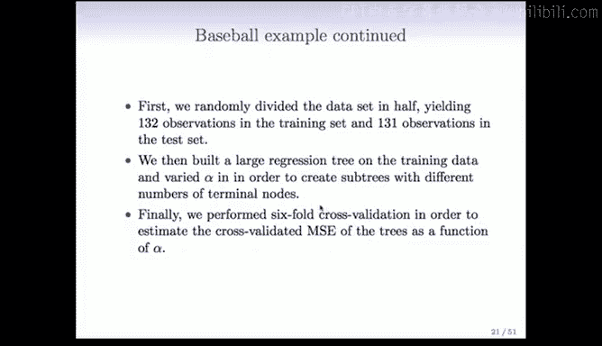

这与 LASSO 回归的思想非常相似：在 LASSO 中，我们惩罚回归系数的绝对值之和；在这里，我们惩罚树的大小以避免过拟合。

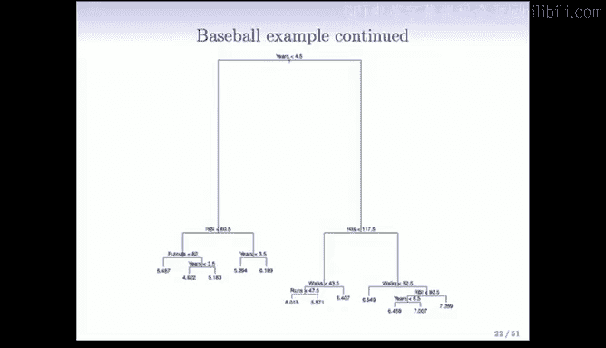

成本复杂度剪枝的核心是通过交叉验证找到最佳的 `α` 值，然后选择在完整训练数据上，使上述准则值最小的子树。

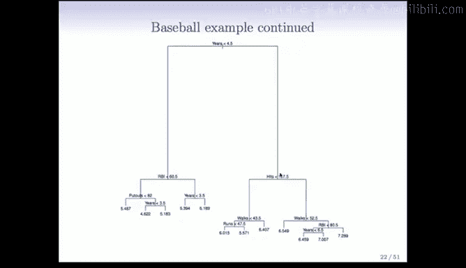

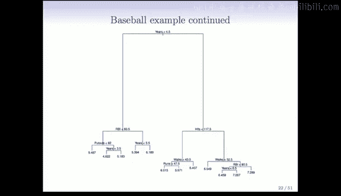

---

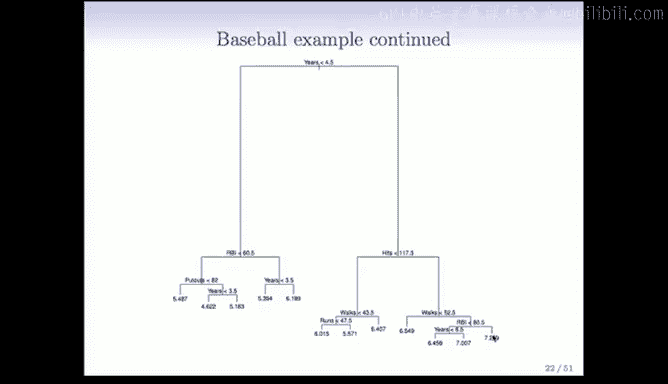

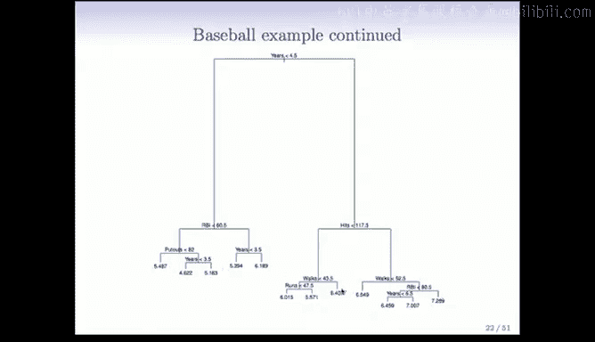

## 树生长算法总结

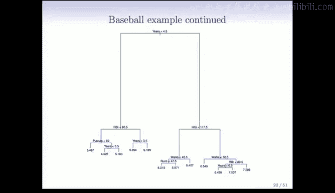

以下是决策树生长算法的总结。通常你不需要自己编程实现，因为现有软件（如 CART 或 R 中的 `tree` 包）会为你完成整个交叉验证过程，但了解其原理是有益的。

1.  **生长大树**：使用一个简单的停止规则（例如，当节点内观测数少于 5 时停止）生长一棵大树。
2.  **成本复杂度剪枝**：为了找到拟合优度与树大小之间的最佳权衡，我们需要确定成本复杂度参数 `α`。这通过交叉验证完成：
    *   将数据分为 K 折（例如 5 或 10）。
    *   对于不同的 `α` 值（对应不同的树大小），在 K-1 折数据上拟合树，并在留出的那一折数据上评估预测误差。
    *   选择使交叉验证误差最小的 `α` 值。
3.  **选择最终子树**：确定最佳 `α` 后，回到用全部训练数据生长的大树，找出使 `RSS + α * |T|` 最小的子树作为最终模型。

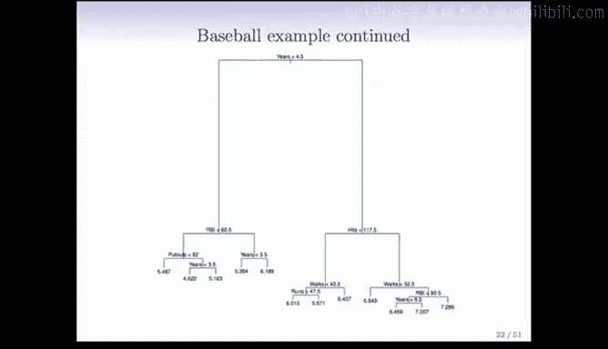

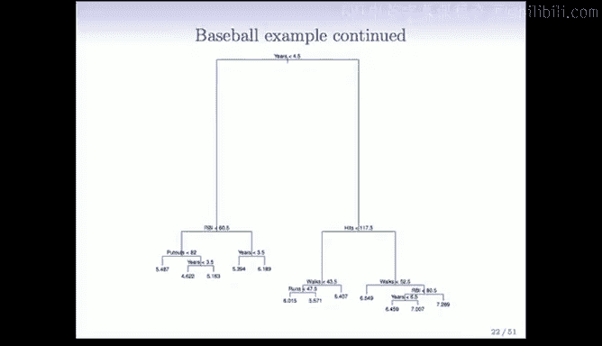

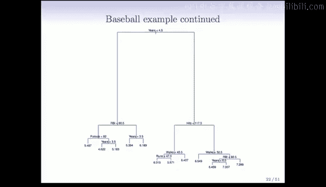

---

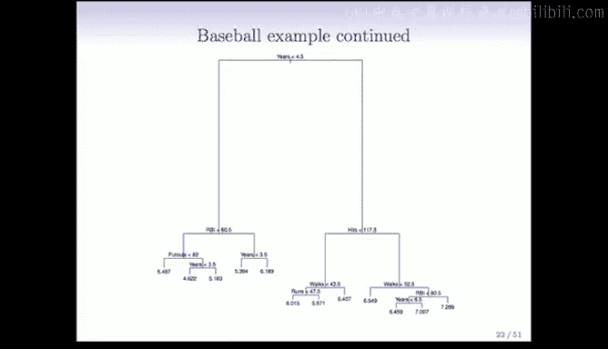

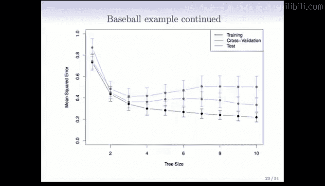

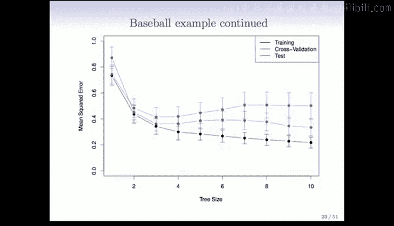

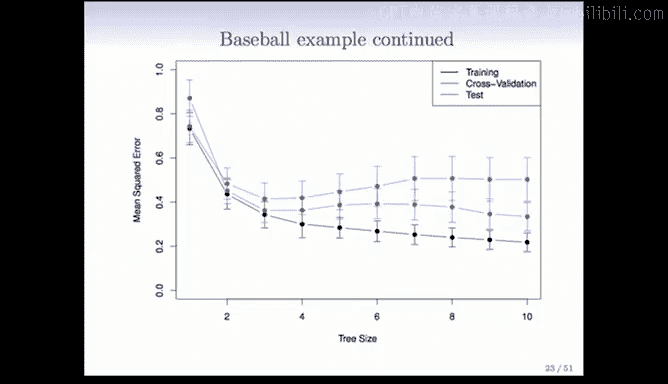

## 棒球数据实例

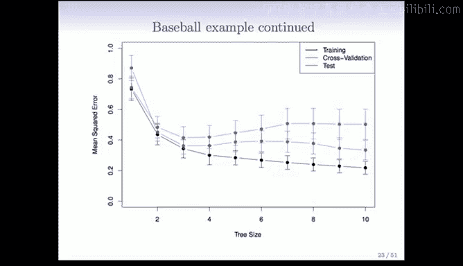

为了说明，我们以棒球数据为例。我们将观测值分为 132 个的训练集和 131 个的测试集。我们想在训练集上使用交叉验证构建回归树，并了解最佳的成本复杂度参数 `α`，同时与独立测试集上的误差进行比较。

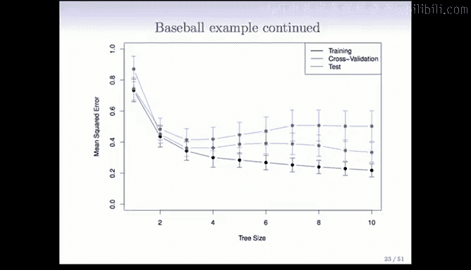

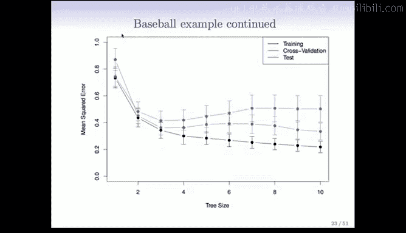

我们使用 6 折交叉验证（选择 6 是因为它能被 132 整除）。下图展示了剪枝前的完整大树（我们之前见过这棵树顶部的分裂）。这棵树的生长只遵循一个规则：不分裂包含少于 5 个观测值的终端节点。这给了我们一棵有大约 12 个终端节点的树。

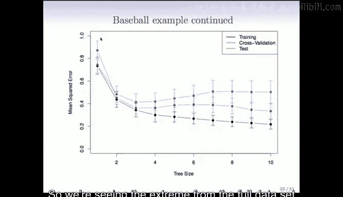

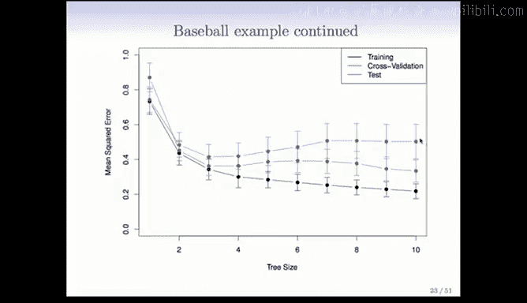

图中展示了交叉验证的结果：
*   **横轴**是树的大小（与 `α` 参数一一对应）。`α=0` 时对树大小没有惩罚，我们得到最大的树（约 12 个节点）。随着 `α` 增大，对树大小的惩罚加重，直到最终树被剪枝到只有一个节点（无任何分裂）。
*   **训练误差**（红色曲线）：正如预期，拟合越多，训练误差越低，因此不能用它来选择模型。
*   **交叉验证误差**（绿色曲线）：它先下降后上升，在**大约 3 个终端节点**处最小。这表明在一定程度后继续分裂会增加方差，无助于改善预测误差。
*   **测试误差**（蓝色曲线，来自独立的测试集）：其趋势大致与交叉验证曲线一致，也在大约 3 个节点处最小化。

因此，看起来大约 3 个终端节点的树是最好的，这也正是我们之前展示的那棵三节点树。

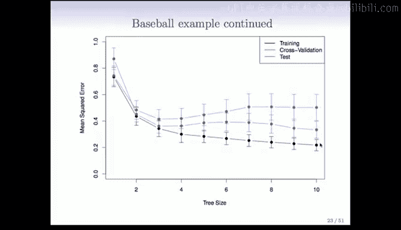

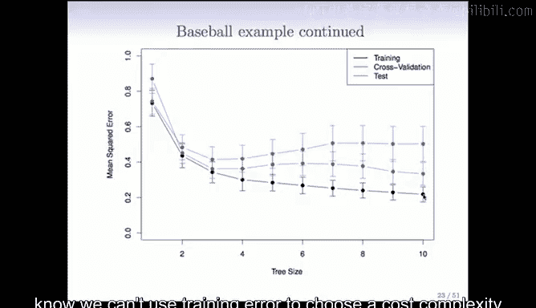

---

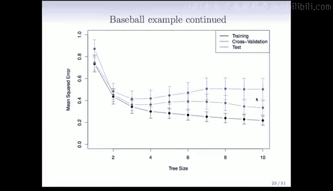

## 总结

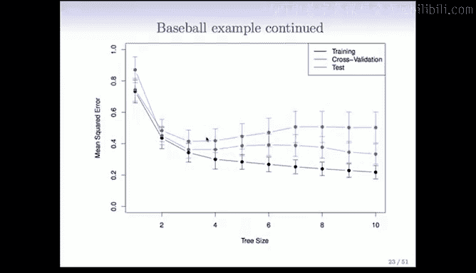

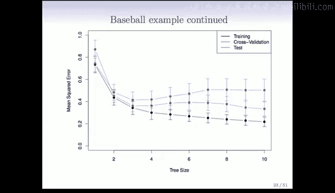

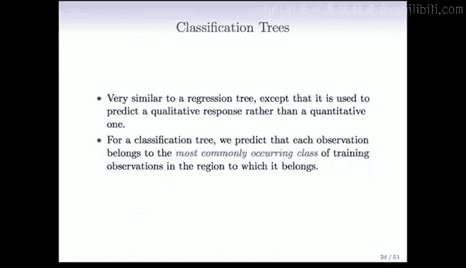

本节课中我们一起学习了决策树算法的更多细节。我们了解了如何使用决策树进行预测，即通过遵循分裂规则将观测值引导至终端节点，并用该节点内训练数据的均值进行预测。我们探讨了确定树大小的重要性，并指出直接生长极大树会导致过拟合，而提前停止可能又过于短视。因此，最佳的实践是采用**成本复杂度剪枝**策略：先生长一棵大树，然后通过交叉验证选择一个惩罚参数 `α`，以在拟合优度与模型复杂度之间取得平衡，从而得到泛化能力更强的子树。最后，我们通过棒球数据的实例，直观地看到了交叉验证如何帮助我们选择最优的树规模。