# R 版 56：分类树 🌳

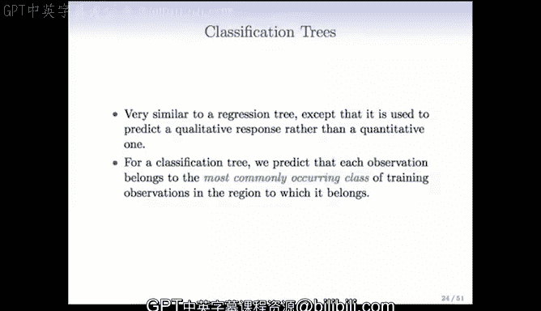

在本节课中，我们将要学习分类树。之前我们讨论了响应变量为定量变量（如棒球运动员的薪水）时的回归树。当响应变量是分类变量时，我们使用的树被称为分类树。两者的技术非常相似，主要区别在于损失函数和衡量性能好坏的标准需要改变。

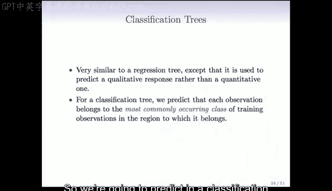

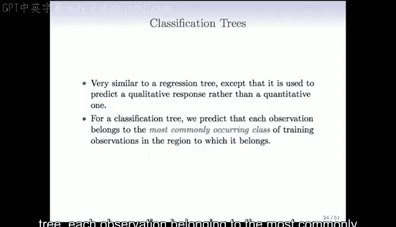

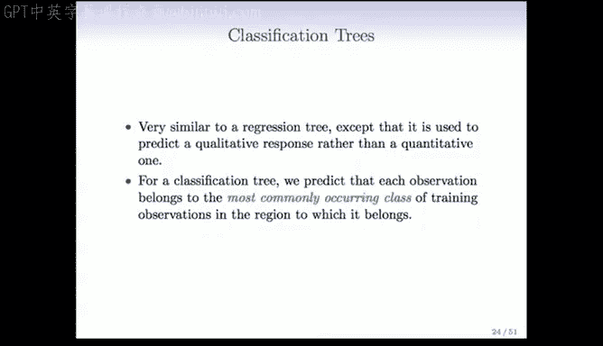

## 从回归树到分类树 🔄

上一节我们介绍了回归树，本节中我们来看看当响应变量是分类变量时，树模型如何工作。

在分类树中，每个观测值被预测为属于其所在终端节点中最常出现的类别。这意味着，在树的终端节点中，预测值不再是该节点内观测值的均值，而是该节点内最普遍的类别。

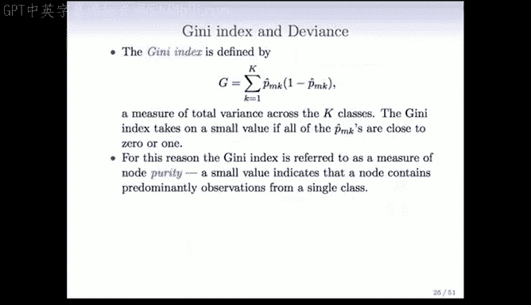

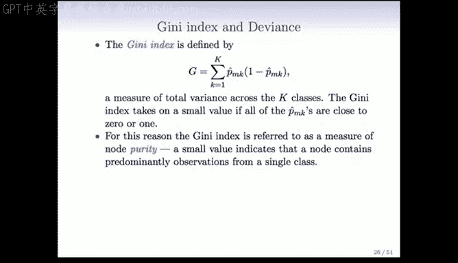

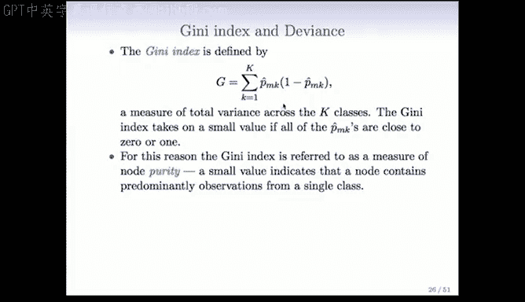

## 分类树的生长与分裂标准 📊

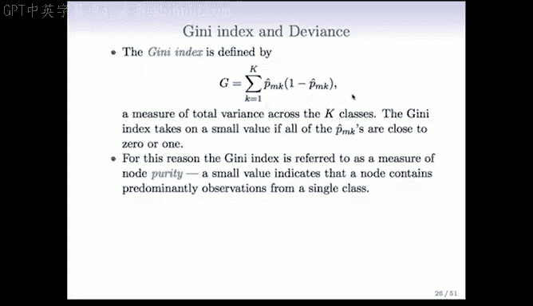

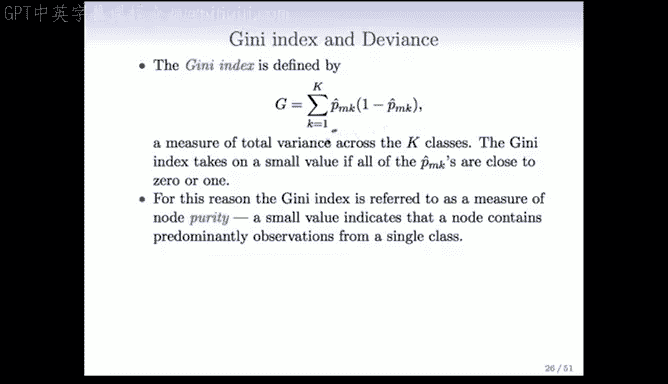

分类树的生长方式与回归树非常相似，但我们不能使用残差平方和作为分裂标准。我们需要一个更适用于分类问题的标准。

以下是几种常用的分裂标准：

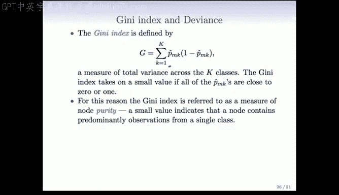

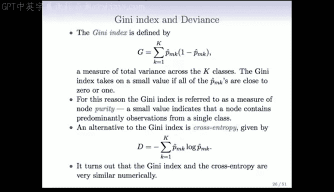

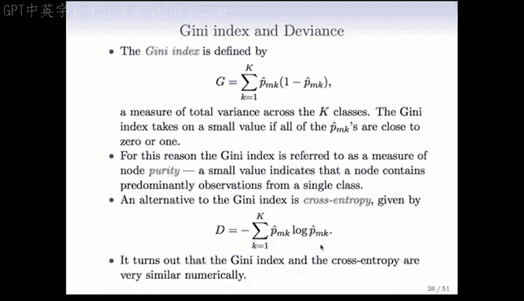

**1. 分类错误率**
这是最容易计算的标准。假设有 K 个类别，在终端节点中计算每个类别的比例。预测类别将是比例最大的那个类别，而分类错误率将是 `1 - 最大比例`。所有不属于最大类别的观测都会被计为错误。虽然简单，但这个标准在树生长过程中可能不够平滑和稳定。

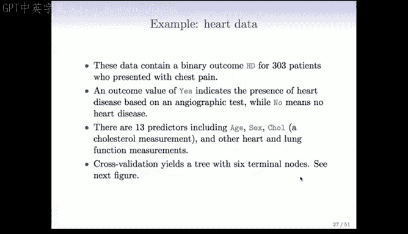

**2. 基尼指数**
这是一个衡量类别“纯度”的指标，类似于方差。对于 K 个类别，其公式为：
`G = Σ (p_k * (1 - p_k))`，其中 `p_k` 是第 k 个类别的比例。
如果基尼指数很小，意味着该节点几乎只包含一个类别（纯度很高）。如果所有类别的比例相等，基尼指数达到最大。基尼指数的变化是平滑的，因此是更受欢迎的标准之一。

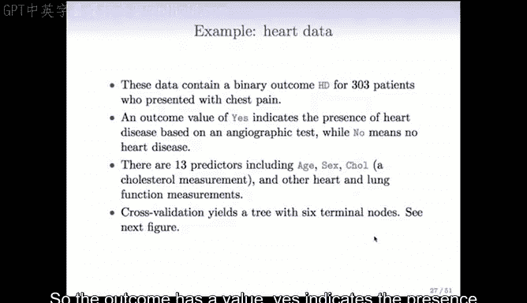

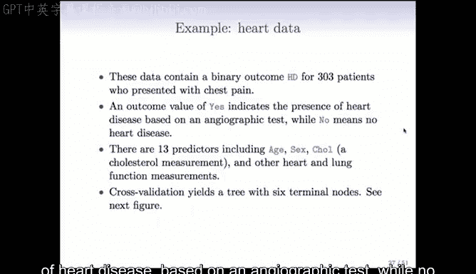

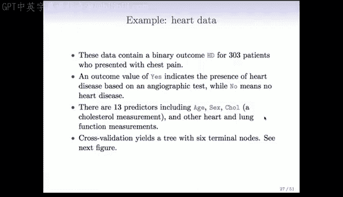

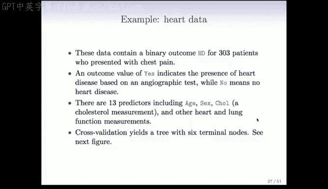

**3. 偏差或交叉熵**
这个标准基于二项式或多项式的对数似然，其公式为：
`D = -2 * Σ (p_k * log(p_k))`
它的行为与基尼指数非常相似。这两种标准通常会产生非常相似的结果。

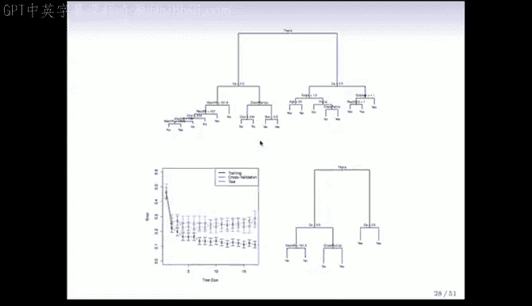

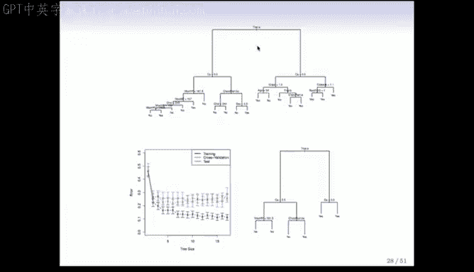

## 实例分析：心脏病数据 ❤️

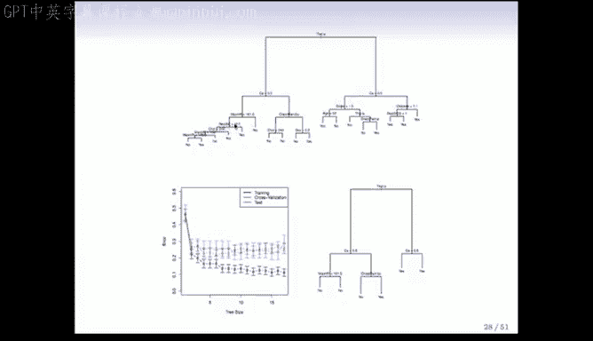

让我们通过一个心脏病数据的例子来具体看看分类树的应用。该数据集包含303名有胸痛症状的患者，响应变量`HD`是一个二元变量（是/否），表示基于血管造影测试是否患有心脏病。

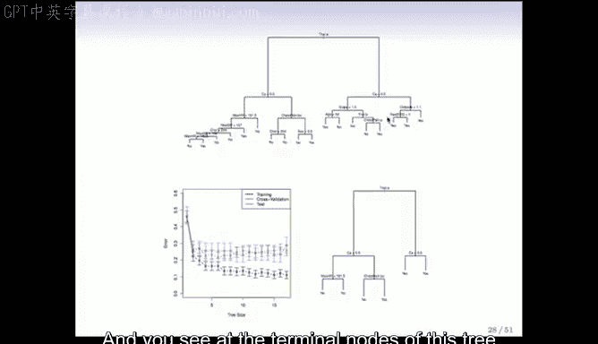

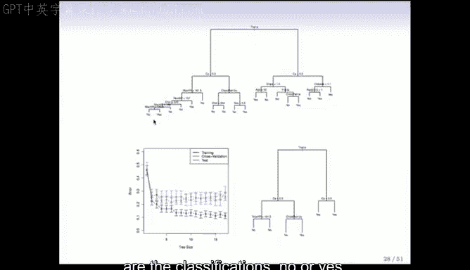

数据集中有13个预测变量，包括年龄、性别、胆固醇水平以及其他心肺功能测量指标。

我们使用交叉验证运行了树生长过程。生成的完整树相当茂密，第一个分裂基于铊压力测试结果。随后的分裂涉及钙水平等变量。在终端节点，模型会给出“是”或“否”的分类预测。

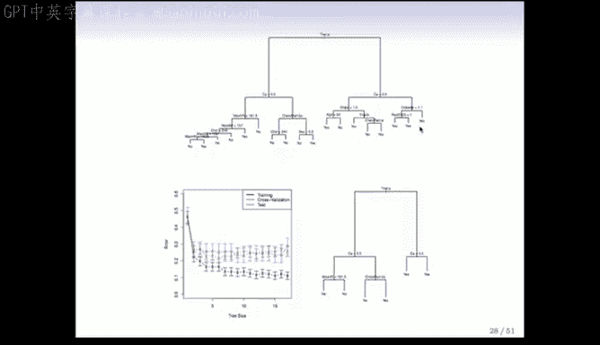

## 树的剪枝与性能评估 ✂️

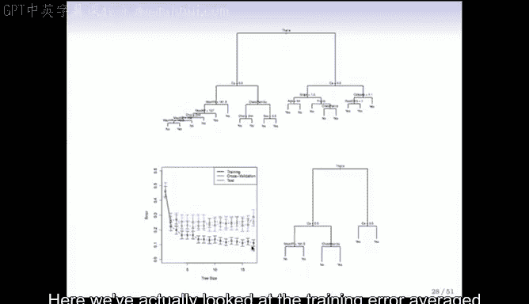

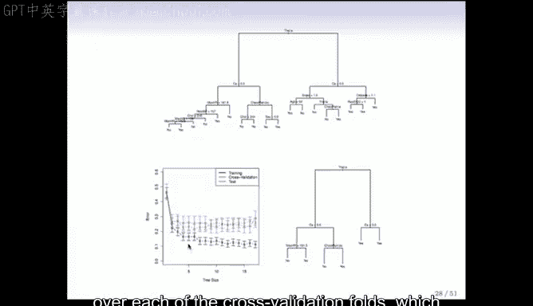

与回归树一样，生成的完整树可能过于复杂（过拟合）。因此，我们再次使用交叉验证来评估不同复杂度树的表现，并选择最优的树。

交叉验证结果显示，树大小约为6时表现最佳。根据这个结果，我们将大树剪枝到大小为6的子树，这估计能带来约25%的分类错误率。

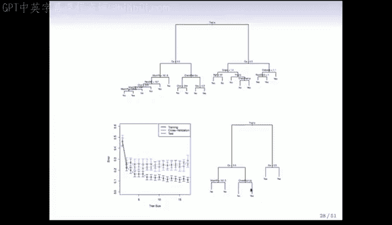

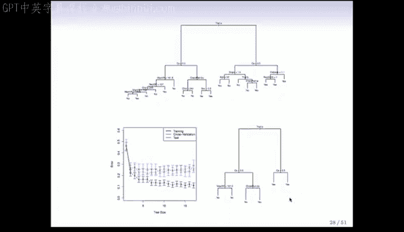

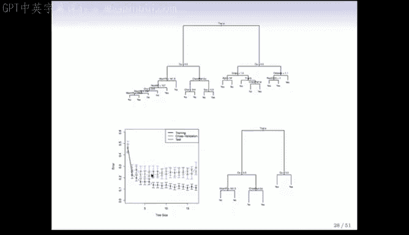

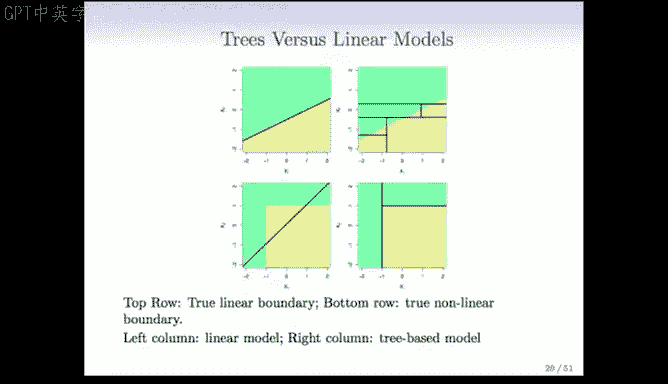

## 树模型与线性模型的比较 ⚖️

树模型并不总是最佳选择。为了对比，我们考虑两种不同的模拟场景：

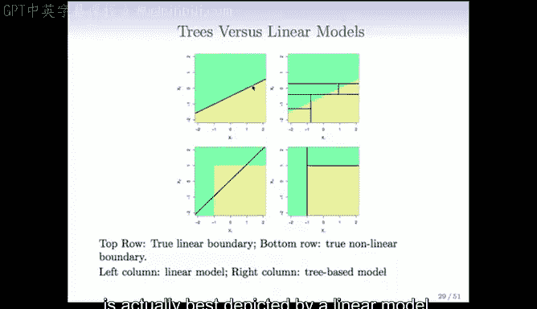

**场景一：线性边界最优**
当两类之间的真实决策边界是一条直线时，线性模型（如逻辑回归）会表现得很好。而分类树试图用一系列矩形框来近似这条直线边界，效果往往不佳。

**场景二：矩形边界最优**
当真实的决策边界是矩形或不规则形状时，线性模型用一个直线边界去近似会犯很多错误。而分类树只需几次分裂就能完美地捕捉到这种矩形边界。

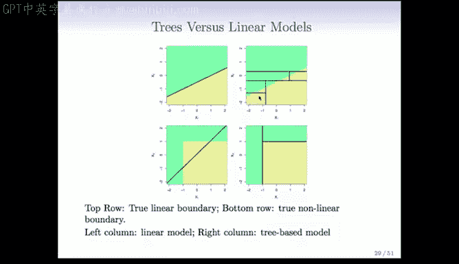

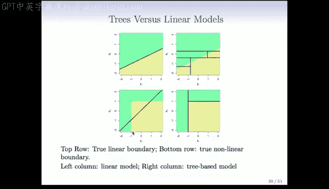

因此，有些问题天然适合用树模型解决，有些则不然。树模型是我们工具箱中的一个工具，应在合适的场景下使用，同时也要考虑更简单的线性模型。

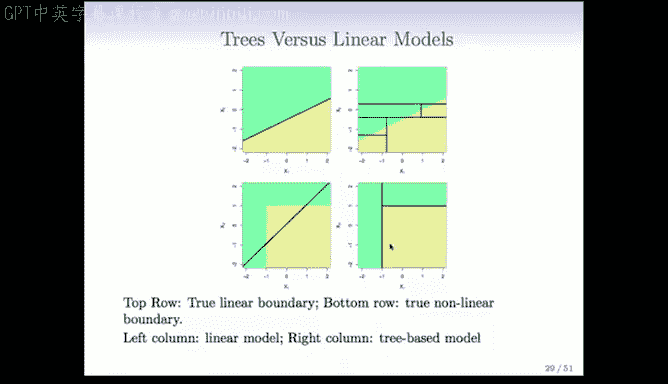

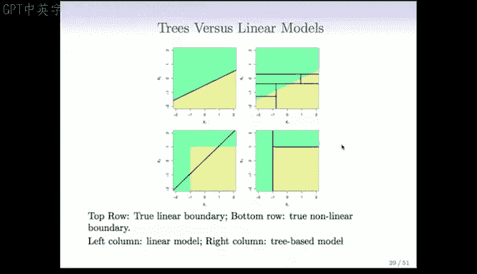

## 分类树的优势与劣势 📈📉

最后，我们来总结一下分类树的优缺点。

**优势：**
*   **简单易懂：** 如果树不大，终端节点不多，它们易于展示和理解，即使对非专业人士也是如此。
*   **符合决策流程：** 树模型模仿了人类的分层决策过程（例如，医生通过一系列测试来诊断疾病），这使得它们在某些领域（如医学）很受欢迎。
*   **处理定性预测变量：** 可以直接处理分类预测变量，无需创建虚拟变量。对于多水平的分类变量，可以直接将其分裂成两个子集。
*   **直观展示：** 结果以树形图展示，无需理解复杂的方程。

**劣势：**
*   **预测精度：** 与一些更先进的方法相比，单棵树的预测精度通常不高。
*   **稳定性：** 对训练数据的小变化可能敏感，导致生成的树结构差异较大。

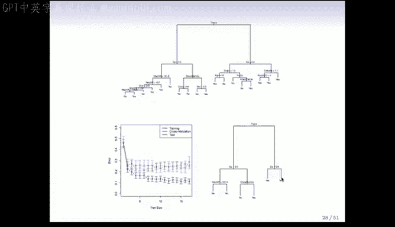

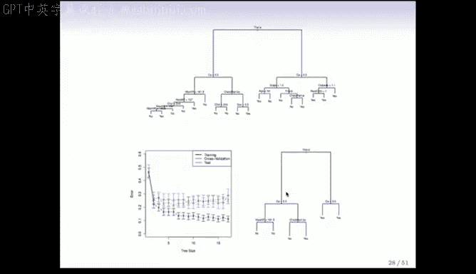

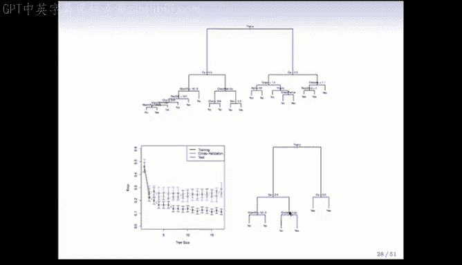

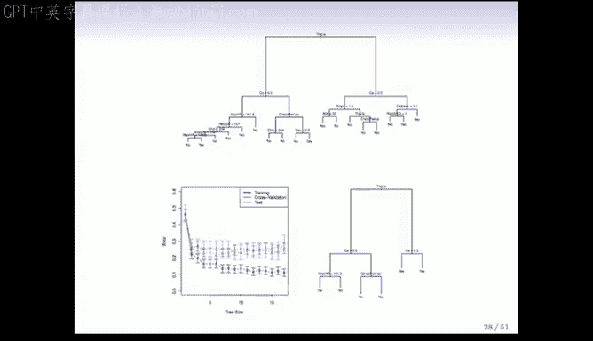

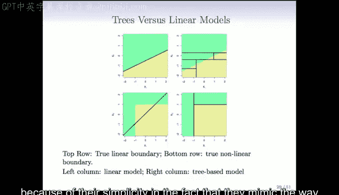

为了克服单棵树的缺点，后续我们将学习集成方法，例如随机森林和提升法。这些方法通过构建多棵树并组合它们的预测，可以显著提高预测性能。

---

**本节课总结：**
本节课我们一起学习了分类树。我们了解了分类树与回归树的区别，学习了用于分类树分裂的基尼指数和交叉熵等标准。通过心脏病数据的实例，我们看到了分类树的构建、剪枝和评估过程。最后，我们比较了树模型与线性模型的适用场景，并总结了分类树的主要优缺点。树模型以其简单性和可解释性成为一个有价值的工具，但我们也认识到其预测精度的局限性，这为学习更强大的集成方法做好了铺垫。