# R 版 57：Bagging（自助聚合）🌳➡️🌲🌲🌲

在本节课中，我们将学习一种名为 **Bagging（自助聚合）** 的集成学习方法。Bagging 通过结合多个决策树的预测来提升模型的预测性能。我们将探讨其核心思想、工作原理，并了解其进阶版本——随机森林。

---

## 概述

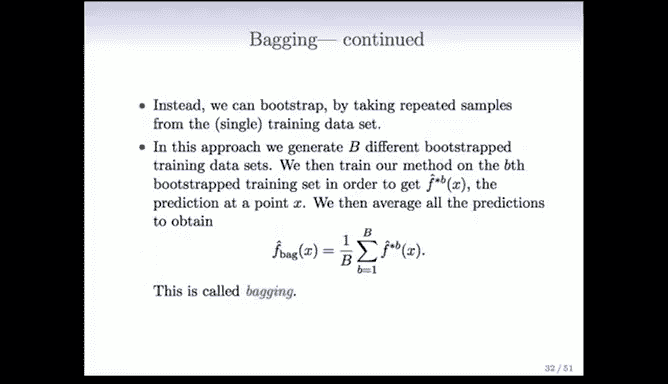

Bagging 的核心思想源于一个简单的统计学原理：对多个独立观测值取平均可以降低方差。在监督学习中，如果我们有多个训练集，就可以在每个训练集上训练一个模型（如决策树），然后取这些模型预测的平均值。然而，我们通常只有一个训练集。Bagging 巧妙地利用 **自助采样法** 从原始训练集中生成多个“伪训练集”，从而实现了这一想法。

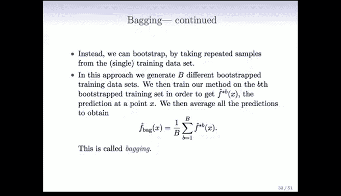

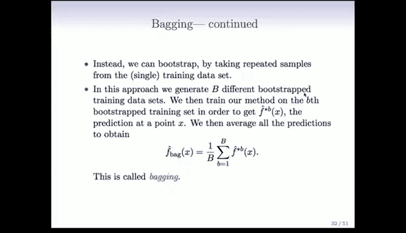

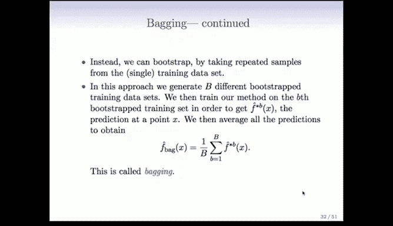

上一节我们介绍了决策树及其剪枝。本节中我们来看看如何通过集成多个树来避免剪枝并提升性能。

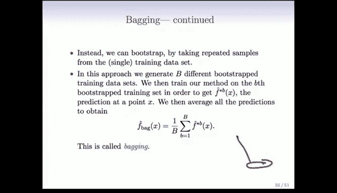

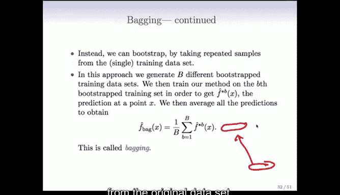

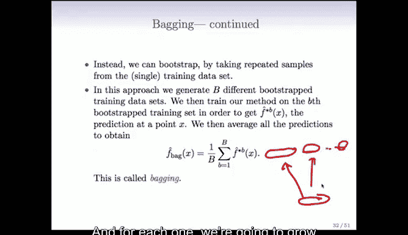

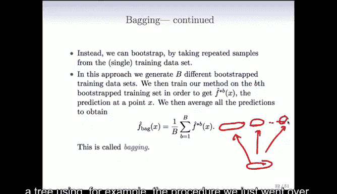

---

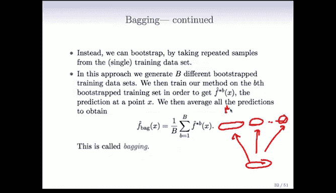

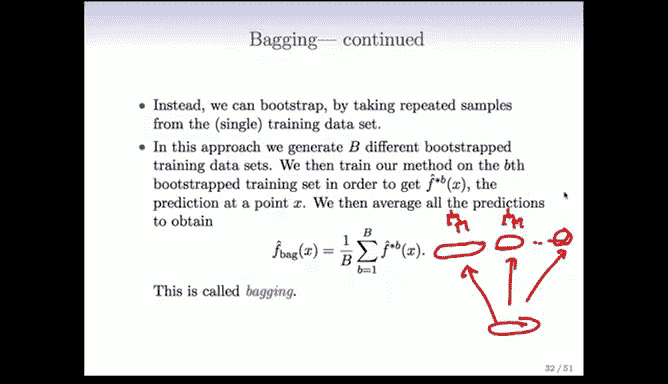

## Bagging 的基本原理

假设我们有一组独立观测值 \( Z_1, Z_2, ..., Z_N \)，每个观测值的方差为 \( \sigma^2 \)。那么，这些观测值的平均值 \( \bar{Z} \) 的方差为 \( \sigma^2 / N \)。这意味着，通过对独立事物取平均，我们可以将方差降低 N 倍。

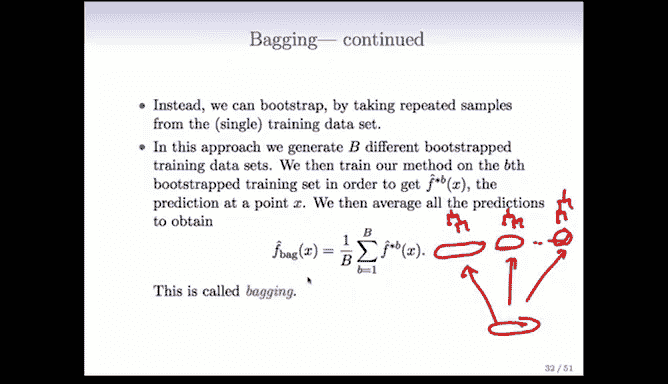

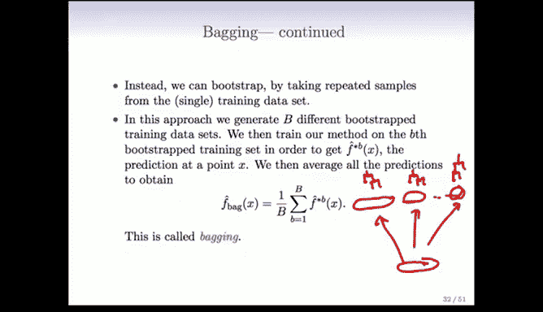

在监督学习的背景下，这启示我们：如果我们有多个训练集，我们可以在每个训练集上训练一个模型（例如决策树），然后对这些模型的预测取平均。然而，我们通常只有一个训练集。

Bagging 通过以下步骤解决这个问题：
1.  从原始训练集中进行 **自助采样**，生成多个与原始训练集大小相同的“伪训练集”。
2.  在每个自助采样生成的训练集上训练一个决策树。
3.  对所有树的预测结果取平均（回归问题）或进行多数投票（分类问题）。

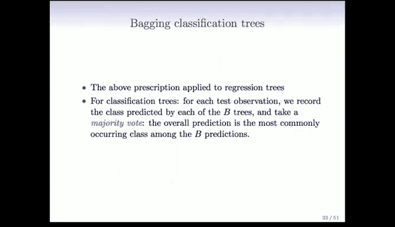

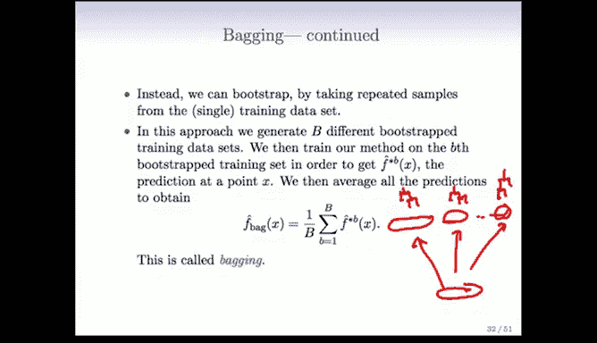

以下是该过程的公式化描述：
*   设 \( \hat{f}^{*b}(x) \) 表示在第 \( b \) 个自助采样集上训练的树对特征 \( x \) 的预测。
*   那么，Bagging 的总体预测 \( \hat{f}_{bag}(x) \) 就是所有 \( B \) 棵树预测的平均值：
    \[
    \hat{f}_{bag}(x) = \frac{1}{B} \sum_{b=1}^{B} \hat{f}^{*b}(x)
    \]

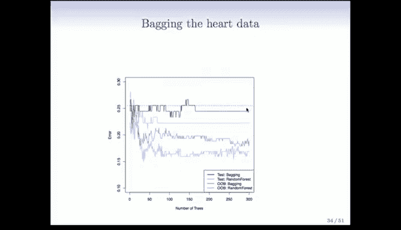

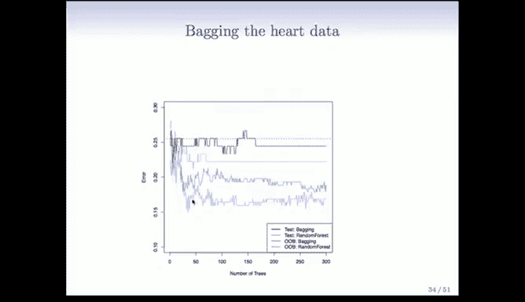

这是一个非常巧妙的想法。传统的剪枝是为了降低单棵树的方差，但会引入偏差。而 Bagging 的思路是：不进行剪枝，让每棵树都长得非常茂盛（低偏差），然后通过平均大量这样的树来消除高方差。

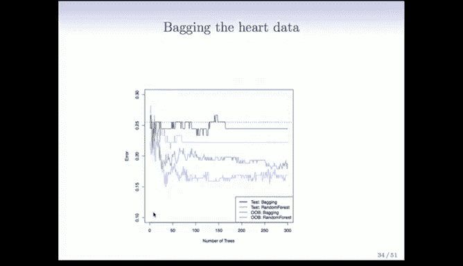

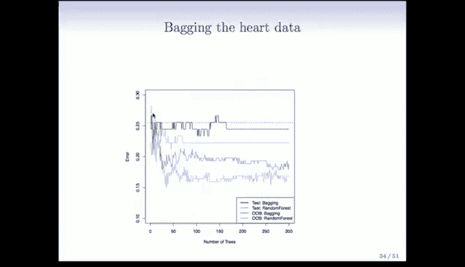

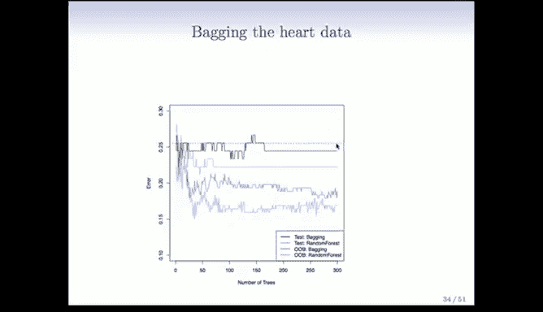

---

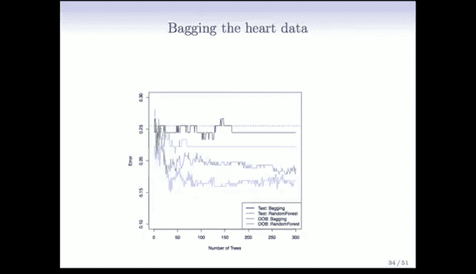

## 袋外误差估计

Bagging 和随机森林有一个非常重要的副产品，称为 **袋外误差估计**。这是一种近乎免费的交叉验证方法。

其工作原理如下：
*   每个自助采样集平均包含约 **三分之二** 的原始观测值，剩下的 **三分之一** 未被选中，称为“袋外”观测。
*   对于任何一个特定的观测点，我们可以找出所有 **没有包含该观测点** 的自助采样集（即训练出的树）。
*   用这些树对该观测点进行预测并取平均，这个预测值对于该观测点来说就是一个“留出”的预测。
*   对所有观测点重复此过程，计算出的总体误差就是袋外误差。

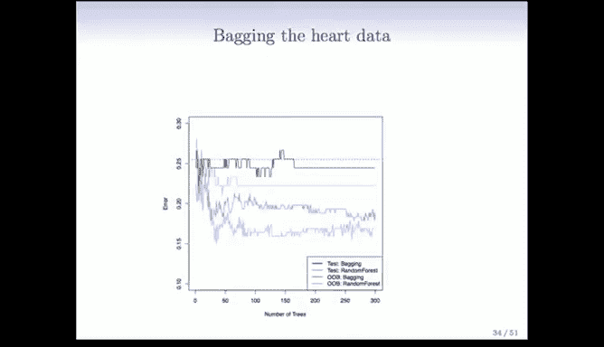

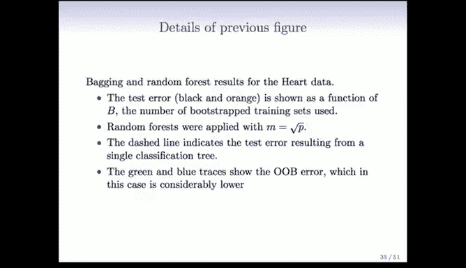

当树的数量 \( B \) 很大时，袋外误差估计在效果上近似于留一法交叉验证，且计算成本极低。

---

## 从 Bagging 到随机森林 🌲🎲

在 Bagging 提出几年后，Leo Breiman 进一步提出了 **随机森林**。其核心洞见是：对多个模型取平均时，如果这些模型之间的相关性更低，那么平均后的方差会降得更低。

随机森林在 Bagging 的基础上增加了一个关键步骤：
*   在构建每棵树的每个分裂节点时，**不是从所有 \( p \) 个预测变量中挑选最佳分裂变量**。
*   而是**先随机选取一个包含 \( m \) 个预测变量的子集**（通常 \( m \approx \sqrt{p} \)），然后只在这个子集中寻找最佳分裂变量。
*   这个随机选择过程在**每个分裂节点**都会重新进行。

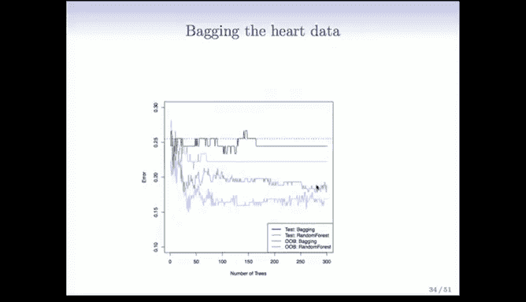

这听起来似乎有些疯狂——在每次做重要决定时都故意忽略大部分信息。但其效果是迫使不同的树使用不同的变量进行分裂，从而显著降低了树与树之间的相关性。由于我们会构建大量树并取平均，即使某个强预测变量在某个节点的分裂中被暂时忽略，它在其他树或其他节点仍有大量机会发挥作用。因此，这种方法在实践中效果非常好。

---

## 实例分析

以下是使用心脏病数据和基因表达数据应用 Bagging 与随机森林的实例结果。

**心脏病数据示例：**
*   单棵决策树的测试误差较高（图中虚线）。
*   Bagging（黑色曲线）能够将误差降低约 1%。
*   随机森林（通过降低树间相关性）在 Bagging 的基础上进一步将误差降低了 1-2%。
*   袋外误差估计（绿色曲线）与测试误差趋势一致，且是一种高效的误差评估方式。

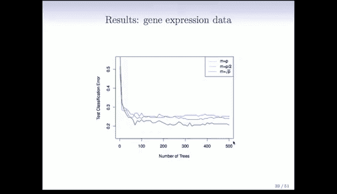

**高维基因表达数据示例：**
*   任务：使用 4718 个基因的表达数据，将 349 名患者分类到 15 个类别（1 个正常类 + 14 种癌症）。
*   首先进行了无监督预筛选，选取方差最大的 500 个基因，这不会引入偏差。
*   **结果对比：**
    *   单棵决策树预测效果很差，错误率高达 60-70%。
    *   Bagging（`m = p`，即每次考虑所有变量）显著降低了错误率。
    *   随机森林（`m = √p`）在 Bagging 的基础上又将错误率降低了 3-4%。
*   一个关键优势：增加树的数量 **不会导致过拟合**。当树的数量足够大后，误差会趋于稳定，增加更多树只会减少计算方差，而不会损害性能。通过观察袋外误差曲线，可以方便地确定需要多少棵树。

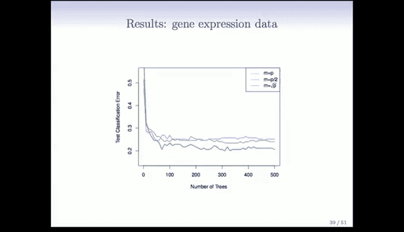

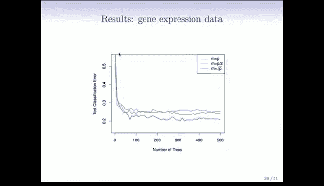

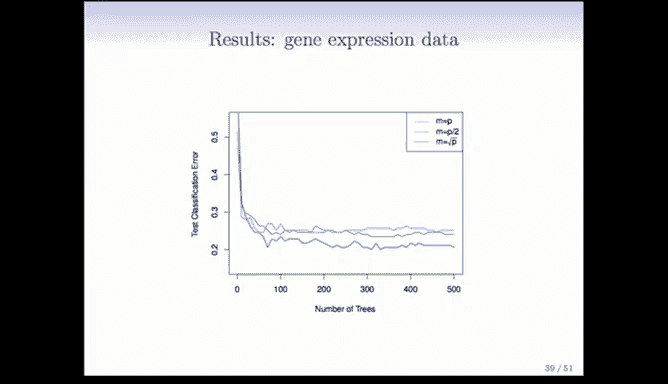

---

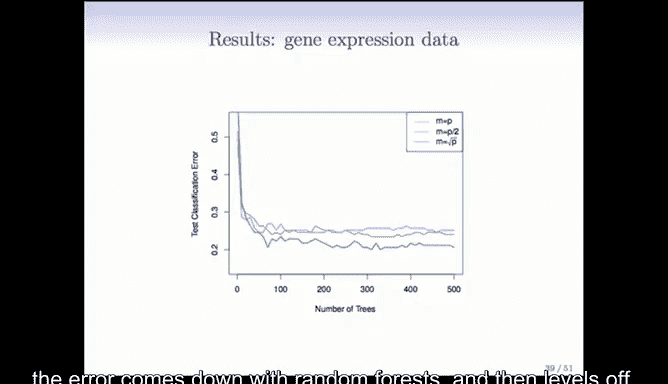

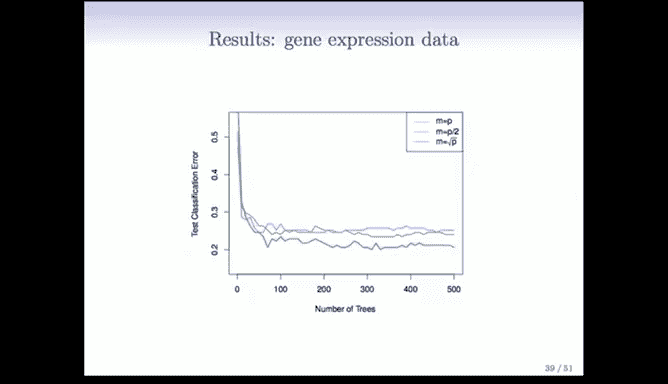

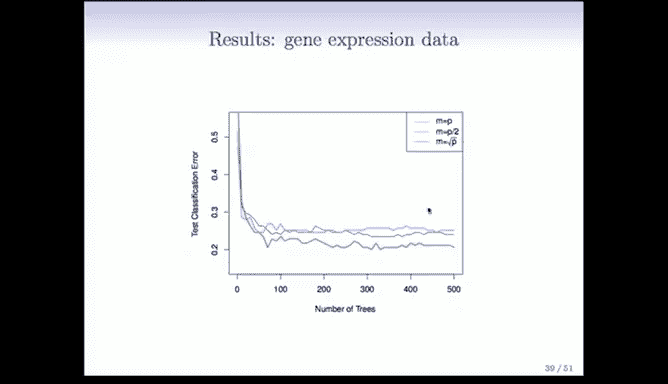

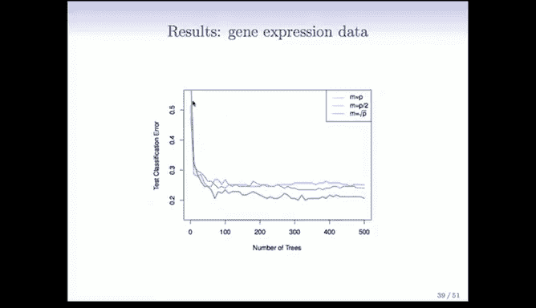

## 总结

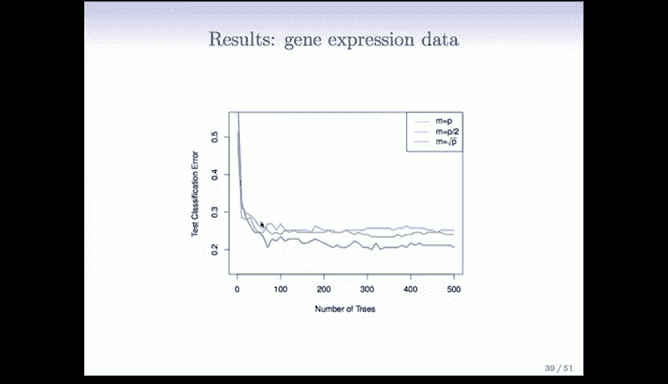

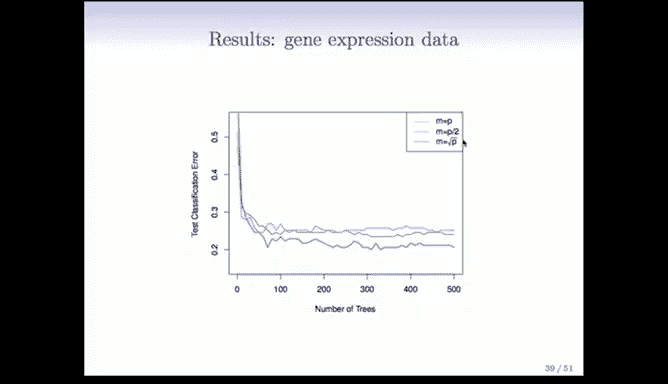

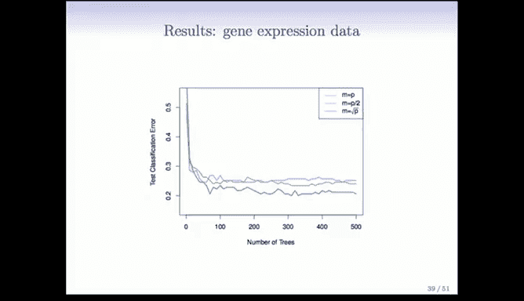

本节课中我们一起学习了：
1.  **Bagging 的原理**：通过自助采样生成多个训练集，训练多个模型后聚合其预测，利用平均降低方差。
2.  **袋外误差估计**：利用自助采样中自然产生的“未使用”数据，进行近乎免费的模型性能评估。
3.  **随机森林的改进**：通过在构建树时随机限制每个节点可用的特征，进一步降低模型间的相关性，从而获得比 Bagging 更好的性能。
4.  **方法优势**：这两种方法都能有效提升单棵决策树的预测能力，尤其在高维数据中表现显著，且不易过拟合。

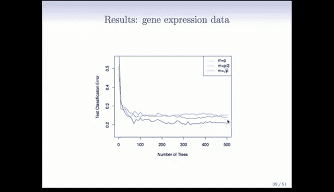

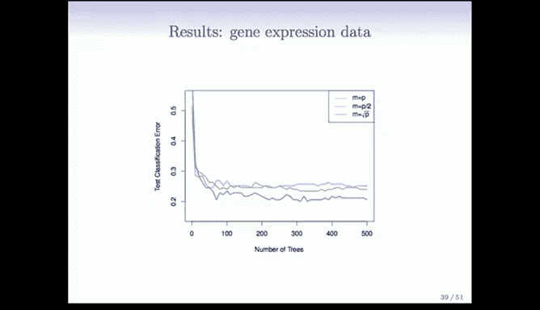

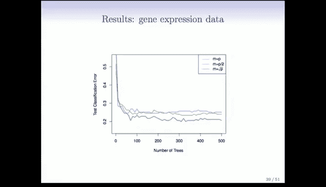

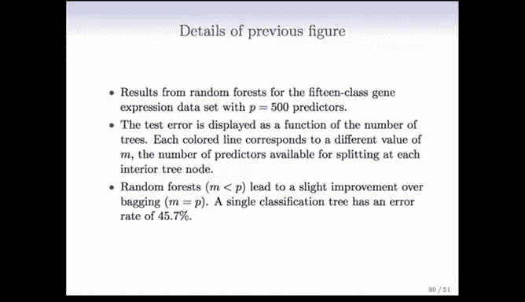

Bagging 和随机森林以其强大的预测能力和相对简单的实现，已成为机器学习中广泛应用的核心工具。