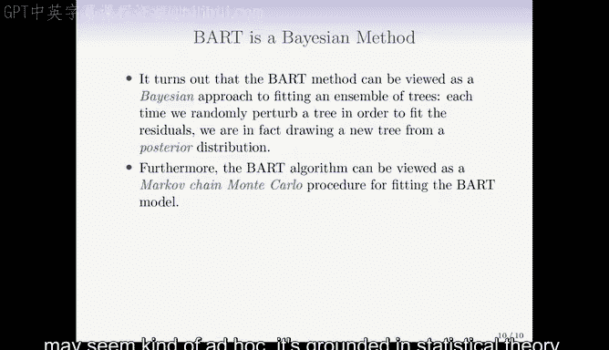

# R 版 59：贝叶斯可加回归树 🌳

在本节课中，我们将学习一种名为**贝叶斯可加回归树**的集成学习方法。该方法以决策树为构建模块，结合了随机森林和提升法的思想，并通过一种新颖的贝叶斯框架来生成和组合树模型。

---

## 方法概述

上一节我们介绍了基于决策树的集成学习方法，如装袋法和提升法。本节中，我们来看看**贝叶斯可加回归树**有何不同。

贝叶斯可加回归树与随机森林和提升法都有联系。它像随机森林一样，通过随机抽样特征来构建树；同时，它又像提升法一样，利用当前模型未捕捉到的残差信息来改进后续的树。其主要新颖之处在于生成新树的方式。

---

## 算法流程

以下是贝叶斯可加回归树的核心步骤：

1.  **初始化**：设定树的数量 `K`（例如200）和迭代次数 `B`（例如10000）。每棵树初始化为仅包含根节点的树，其预测值为所有观测值的平均值。
2.  **迭代更新**：在每次迭代 `b` 中，对于第 `k` 棵树：
    *   计算**偏残差**，即从目标值中减去除第 `k` 棵树外所有其他树的当前预测之和。
    *   对第 `k` 棵树的当前状态进行**随机扰动**，以尝试更好地拟合该偏残差。
3.  **扰动类型**：扰动操作主要有三种：
    *   **改变树结构**：添加一个新的分支。
    *   **改变树结构**：剪除一个现有的分支。
    *   **不改变结构**：仅调整终端节点内的预测值。
4.  **生成预测**：经过一个初始的“燃烧期”（例如前100次迭代）后，最终的预测是燃烧期后所有迭代中、所有 `K` 棵树的预测值的平均值。

**核心公式**：在查询点 `x` 处的最终预测 `f̂(x)` 可表示为：
`f̂(x) = (1 / (B - L)) * Σ_{b=L+1}^{B} Σ_{k=1}^{K} f̂_{k}^{b}(x)`
其中，`L` 是燃烧期的长度。

---

## 关键特性

了解了基本流程后，我们来看看该方法的一些重要特点。

*   **减缓过拟合**：与提升法相比，贝叶斯可加回归树通过随机扰动而非贪婪地拟合残差来更新树，学习过程更“平缓”，因此通常更不容易过拟合。
*   **提供不确定性估计**：由于算法会生成大量不同的预测（来自不同迭代和不同树），我们可以利用这些预测的分布（例如计算分位数）来评估预测的不确定性。
*   **基于贝叶斯框架**：扰动过程并非随意设定，其背后有坚实的统计理论支撑。它对应于在树结构和节点值上设定的特定**先验分布**，而整个算法可以看作是从该贝叶斯模型的**后验分布**中抽样的马尔可夫链蒙特卡洛方法。
*   **超参数设置**：通常，树的数量 `K` 和迭代次数 `B` 需要设置得较大（如 `K=200`, `B=1000-10000`），而燃烧期相对较短（如 `L=100`）。该方法通常“开箱即用”，无需像提升法那样进行精细调参。

---

## 示例演示

为了直观理解其表现，我们来看一个在心脏病数据集上的应用示例。

在该示例中，设置 `K=200`， `B=10000`，燃烧期 `L=100`。下图对比了提升法和贝叶斯可加回归树的训练误差与测试误差：

*   **提升法**：训练误差持续快速下降，但测试误差在达到最低点后开始上升，显示出过拟合迹象。
*   **贝叶斯可加回归树**：训练误差下降更缓慢，但测试误差与提升法的最佳结果相当，且达到稳定后不再上升，表现出更好的抗过拟合能力。

---

## 总结

本节课中，我们一起学习了**贝叶斯可加回归树**。它是一种强大的集成学习算法，核心思想是并行维护多棵决策树，并通过贝叶斯框架下的随机扰动序列来迭代更新它们。其优势在于能有效控制过拟合、提供预测的不确定性估计，并且通常具有较好的默认性能。它巧妙地将决策树的灵活性、集成学习的力量以及贝叶斯统计的理论基础结合在了一起。